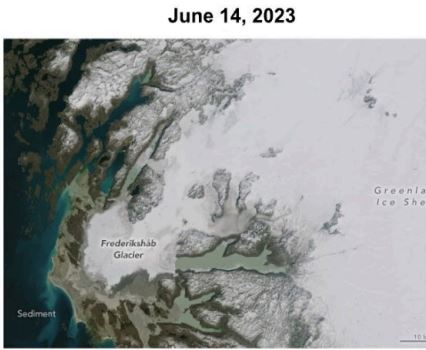
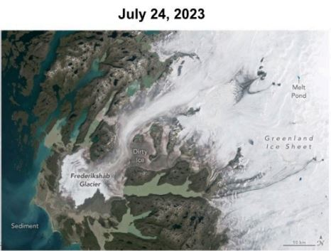

```{=html}
<style>
.engage-box { background: linear-gradient(135deg, #1565C0 0%, #0D47A1 100%); color: white; border-left: 5px solid #2196F3; padding: 20px; margin: 15px 0; border-radius: 0 10px 10px 0; }
.explore-box { background: linear-gradient(135deg, #E65100 0%, #BF360C 100%); color: white; border-left: 5px solid #ff9800; padding: 20px; margin: 15px 0; border-radius: 0 10px 10px 0; }
.explain-box { background: linear-gradient(135deg, #2E7D32 0%, #1B5E20 100%); color: white; border-left: 5px solid #4caf50; padding: 20px; margin: 15px 0; border-radius: 0 10px 10px 0; }
.elaborate-box { background: linear-gradient(135deg, #6A1B9A 0%, #4A148C 100%); color: white; border-left: 5px solid #9c27b0; padding: 20px; margin: 15px 0; border-radius: 0 10px 10px 0; }
.evaluate-box { background: linear-gradient(135deg, #C62828 0%, #B71C1C 100%); color: white; border-left: 5px solid #f44336; padding: 20px; margin: 15px 0; border-radius: 0 10px 10px 0; }
.check-understanding { background: linear-gradient(135deg, #00838F 0%, #006064 100%); color: white; border-left: 5px solid #17a2b8; padding: 15px; margin: 15px 0; }
.key-idea { background: linear-gradient(135deg, #2E7D32 0%, #1B5E20 100%); color: white; border-left: 5px solid #28a745; padding: 15px; margin: 15px 0; }
.lab-activity { background: linear-gradient(135deg, #424242 0%, #212121 100%); color: white; border: 2px solid #666; padding: 20px; margin: 20px 0; border-radius: 10px; }
.quiz-section { background: linear-gradient(135deg, #C62828 0%, #B71C1C 100%); color: white; border-left: 5px solid #dc3545; padding: 20px; margin: 20px 0; border-radius: 10px; }
.feedback-loop { background: linear-gradient(135deg, #667eea 0%, #764ba2 100%); color: white; padding: 20px; border-radius: 15px; margin: 20px 0; }
.pe-badge { display: inline-block; background: #673ab7; color: white; padding: 5px 10px; border-radius: 5px; font-size: 12px; margin: 5px; }
/* Interactive Quiz Styles */
.pf-quiz { font-family: 'Inter', sans-serif; max-width: 720px; margin: 0 auto; }
.pf-quiz-header { text-align: center; margin-bottom: 28px; }
.pf-quiz-header h2 { font-family: 'Space Grotesk', sans-serif; font-weight: 800; font-size: 1.8em; background: linear-gradient(135deg, #fa709a 0%, #fee140 100%); -webkit-background-clip: text; -webkit-text-fill-color: transparent; margin-bottom: 6px; }
.pf-quiz-header p { color: #718096; font-size: 0.95em; }
.pf-question-card { background: white; border-radius: 14px; padding: 22px 26px; margin-bottom: 22px; border: 2px solid #e2e8f0; box-shadow: 0 3px 12px rgba(0,0,0,0.07); transition: box-shadow 0.2s; }
.pf-question-card:hover { box-shadow: 0 6px 20px rgba(0,0,0,0.11); }
.pf-q-meta { font-size: 11px; font-weight: 700; color: #a0aec0; text-transform: uppercase; letter-spacing: 1px; margin-bottom: 10px; }
.pf-q-text { font-size: 16.5px; font-weight: 700; color: #2d3748; margin-bottom: 14px; line-height: 1.5; }
.pf-option { display: block; padding: 12px 18px; margin: 7px 0; border-radius: 9px; border: 2px solid #e2e8f0; cursor: pointer; font-size: 14.5px; color: #4a5568; transition: border-color 0.18s, background 0.18s, transform 0.1s; background: #f7fafc; user-select: none; }
.pf-option:hover:not(.pf-locked) { border-color: #667eea; background: #eef2ff; transform: translateX(3px); }
.pf-option.pf-selected-correct { border-color: #38a169 !important; background: #f0fff4 !important; color: #22543d !important; font-weight: 700; }
.pf-option.pf-selected-wrong { border-color: #e53e3e !important; background: #fff5f5 !important; color: #9b2c2c !important; }
.pf-option.pf-reveal-correct { border-color: #38a169 !important; background: #f0fff4 !important; color: #22543d !important; font-weight: 700; }
.pf-option.pf-locked { cursor: not-allowed; opacity: 0.65; }
.pf-option.pf-locked:not(.pf-selected-correct):not(.pf-selected-wrong):not(.pf-reveal-correct) { opacity: 0.5; }
.pf-feedback-box { margin-top: 14px; padding: 13px 17px; border-radius: 9px; font-size: 14px; line-height: 1.65; display: none; }
.pf-feedback-box.pf-fb-correct { display: block; background: #f0fff4; border: 1.5px solid #38a169; color: #276749; }
.pf-feedback-box.pf-fb-wrong { display: block; background: #fff5f5; border: 1.5px solid #e53e3e; color: #742a2a; }
.pf-score-banner { text-align: center; background: linear-gradient(135deg, #fa709a 0%, #fee140 100%); border-radius: 14px; padding: 22px 30px; margin-top: 10px; margin-bottom: 10px; }
.pf-score-banner .pf-score-emoji { font-size: 2.5em; margin-bottom: 6px; }
.pf-score-banner .pf-score-text { font-size: 1.35em; font-weight: 800; color: #1a1a1a; }
.pf-score-banner .pf-score-sub { font-size: 0.9em; color: #333; margin-top: 4px; }
.pf-restart-btn { margin-top: 14px; padding: 10px 28px; background: #2d3748; color: white; border: none; border-radius: 25px; font-weight: 700; font-size: 0.95em; cursor: pointer; transition: background 0.2s; }
.pf-restart-btn:hover { background: #1a202c; }
/* Fix Observable Plot tooltip visibility — prevent currentColor:white from bleeding in */
svg [aria-label="tip"] text { fill: #1a1a1a !important; }
svg [aria-label="tip"] rect { fill: rgba(255, 255, 255, 0.97) !important; stroke: #d4d4d4 !important; }
</style>
```

::: {.card}
## 🌍 Current CO₂ Levels
The most recent daily average atmospheric CO₂ concentration at Mauna Loa is **${current_mlo_co2.value} ppm**.
:::

```{ojs}
//| echo: false
//| output: false

// Fetch real-time CO2 data with proxy and fallback
current_mlo_co2 = {
  const fallback = {
    value: "426.85",
    date: "February 2026 (approximate)",
    success: false
  };
  
  try {
    const response = await fetch("https://corsproxy.io/?https://gml.noaa.gov/webdata/ccgg/trends/co2/co2_daily_mlo.txt");
    if (!response.ok) return fallback;
    const rawText = await response.text();
    const lines = rawText.trim().split("\n").filter(l => !l.startsWith("#"));
    if (lines.length === 0) return fallback;
    
    const lastLine = lines[lines.length - 1].trim().split(/\s+/);
    const value = parseFloat(lastLine[4]);
    
    if (isNaN(value) || value <= 0) return fallback;
    
    return {
      value: value.toFixed(2),
      date: new Date(parseInt(lastLine[0]), parseInt(lastLine[1])-1, parseInt(lastLine[2]))
                 .toLocaleDateString('en-US', { year: 'numeric', month: 'long', day: 'numeric' }),
      success: true
    };
  } catch (e) {
    console.error("CO2 Fetch Error:", e);
    return fallback;
  }
}
```


::: {.callout-important}
## 🌍 Current Atmospheric CO₂

**The most recent daily average concentration of CO₂ at Mauna Loa Observatory (${current_mlo_co2.date}) is:**

::: {style="text-align: center; font-size: 2.5em; font-weight: bold; color: #dc3545; margin: 20px 0;"}
${current_mlo_co2.value} ppm
:::

*Data sourced from [NOAA Global Monitoring Laboratory](https://gml.noaa.gov/ccgg/trends/).${current_mlo_co2.success ? "" : " (Live data unavailable - showing recent approximate value)"}*

:::


<span class="pe-badge">HS-ESS2-2</span> <span class="pe-badge">HS-ESS2-4</span> <span class="pe-badge">HS-ESS2-6</span> <span class="pe-badge">Time: 7-9 Days</span> <a class="quiz-jump-btn" href="#evaluate">🧠 Quiz &amp; Evaluate ↓</a>

# Investigative Phenomenon

::: {.engage-box}
## 🌡️ Arctic Amplification

**The globe is warming, and the average temperature of the Arctic is increasing at almost 4 times the rate as the rest of the globe.**

### Driving Questions:
- What is causing global temperatures to rise today?
- Why is the Arctic warming almost 4x faster than the rest of the globe?
- How do feedbacks (like greenhouse gases and ice) amplify or reduce change?
- How do greenhouse gas increases connect to glacial cycles and current warming?
:::


# Engage: Arctic vs Global Warming

What is happening to temperatures and Arctic ice today? Use the graph below to compare warming in the Arctic to the global average and surface student questions about the current climate change that orbital factors did not explain in the previous lesson.

**Before looking at the data, make a prediction:**

```{ojs}
//| echo: false
viewof prediction = Inputs.radio(
  [
    "The Arctic is warming much faster",
    "The Arctic is warming at the same rate as the global average",
    "The Arctic is warming more slowly than the global average",
    "The Arctic is actually cooling"
  ],
  {label: "How do you think the Arctic is warming compared to the global average?", value: "The Arctic is warming much faster"}
)
```

```{ojs}
//| echo: false
md`${prediction === "The Arctic is warming much faster" 
  ? "✅ **Good hypothesis.** Let's look at the data below to confirm." 
  : "🤔 **Interesting idea.** Look closely at the blue line in the graph below. Does it match your prediction?"}`
```

```{ojs}
//| echo: false
function buildQuiz(id, questions) {
  const outer = html`<div style="font-family:'Inter',sans-serif; max-width:720px; margin:18px auto;"></div>`;
  const toggle = html`<button style="display:inline-flex;align-items:center;gap:8px;padding:10px 22px;border:2px solid #c7d2fe;border-radius:30px;background:linear-gradient(135deg,#eef2ff 0%,#e8f4fd 100%);color:#4338ca;font-weight:700;font-size:0.95em;cursor:pointer;transition:all 0.25s ease;box-shadow:0 2px 8px rgba(67,56,202,0.12);"><span style="font-size:1.15em;">✅</span><span>Check Your Understanding</span><span class="quiz-chevron" style="display:inline-block;transition:transform 0.3s ease;font-size:0.8em;">▶</span></button>`;
  toggle.onmouseenter = () => { toggle.style.background='linear-gradient(135deg,#dbeafe 0%,#c7d2fe 100%)'; toggle.style.boxShadow='0 4px 14px rgba(67,56,202,0.22)'; };
  toggle.onmouseleave = () => { toggle.style.background='linear-gradient(135deg,#eef2ff 0%,#e8f4fd 100%)'; toggle.style.boxShadow='0 2px 8px rgba(67,56,202,0.12)'; };
  outer.appendChild(toggle);
  const body = html`<div style="max-height:0;overflow:hidden;opacity:0;transition:max-height 0.5s cubic-bezier(0.4,0,0.2,1),opacity 0.4s ease,margin-top 0.4s ease,padding 0.4s ease;padding:0 20px;margin-top:0;background:linear-gradient(135deg,#eef2ff 0%,#e8f4fd 100%);border-radius:14px;border:2px solid #c7d2fe;"></div>`;
  const closeBtn = html`<div style="text-align:right;padding-top:14px;"><button style="padding:6px 16px;border:1.5px solid #c7d2fe;border-radius:20px;background:white;color:#4338ca;font-weight:700;font-size:0.82em;cursor:pointer;transition:all 0.2s;">▲ Hide Quiz</button></div>`;
  closeBtn.querySelector('button').onmouseenter = function(){ this.style.background='#eef2ff'; };
  closeBtn.querySelector('button').onmouseleave = function(){ this.style.background='white'; };
  body.appendChild(closeBtn);
  body.appendChild(html`<div style="text-align:center;margin-bottom:14px;"><span style="font-size:1.3em;font-weight:800;color:#4338ca;">✅ Check Your Understanding</span></div>`);
  let expanded = false;
  function collapseQuiz(){ expanded=false; body.style.maxHeight='0'; body.style.opacity='0'; body.style.marginTop='0'; body.style.padding='0 20px'; toggle.querySelector('.quiz-chevron').style.transform='rotate(0deg)'; }
  function expandQuiz(){ expanded=true; body.style.padding='0 20px 20px 20px'; body.style.marginTop='12px'; body.style.opacity='1'; body.style.maxHeight=body.scrollHeight+5000+'px'; toggle.querySelector('.quiz-chevron').style.transform='rotate(90deg)'; }
  toggle.onclick = () => { expanded ? collapseQuiz() : expandQuiz(); };
  closeBtn.querySelector('button').onclick = collapseQuiz;
  questions.forEach((q, qi) => {
    const emoji = q.emoji || '❓';
    const card = html`<div style="background:white;border-radius:10px;padding:16px 20px;margin-bottom:14px;border:2px solid #e2e8f0;box-shadow:0 2px 8px rgba(0,0,0,0.06);max-height:2000px;overflow:hidden;"><div style="font-size:11px;font-weight:700;color:#a0aec0;text-transform:uppercase;letter-spacing:1px;margin-bottom:6px;">${emoji} Question ${qi+1}</div><div style="font-size:15px;font-weight:700;color:#2d3748;margin-bottom:12px;line-height:1.5;">${q.q}</div></div>`;
    const fb = html`<div style="display:none;margin-top:10px;padding:12px 15px;border-radius:8px;font-size:13.5px;line-height:1.6;"></div>`;
    q.options.forEach((opt, oi) => {
      const btn = html`<div style="display:block;padding:10px 16px;margin:6px 0;border-radius:8px;border:2px solid #e2e8f0;cursor:pointer;font-size:14px;color:#4a5568;background:#f7fafc;transition:all 0.18s;user-select:none;">${opt}</div>`;
      btn.onmouseenter = () => { if(!card.dataset.done){ btn.style.borderColor='#667eea'; btn.style.background='#eef2ff'; btn.style.transform='translateX(3px)'; } };
      btn.onmouseleave = () => { if(!card.dataset.done){ btn.style.borderColor='#e2e8f0'; btn.style.background='#f7fafc'; btn.style.transform='none'; } };
      btn.onclick = () => {
        if(card.dataset.done) return;
        card.dataset.done='1';
        const correct = oi===q.correct;
        btn.style.borderColor = correct ? '#38a169' : '#e53e3e';
        btn.style.background = correct ? '#f0fff4' : '#fff5f5';
        btn.style.fontWeight = '700';
        btn.style.color = correct ? '#22543d' : '#9b2c2c';
        if(!correct){ const corEl=card.querySelectorAll('div')[q.correct+2]; corEl.style.borderColor='#38a169'; corEl.style.background='#f0fff4'; corEl.style.fontWeight='700'; corEl.style.color='#22543d'; }
        card.querySelectorAll('div').forEach((el,i)=>{ if(i>1){ el.style.cursor='not-allowed'; el.style.opacity=(i-2===oi||i-2===q.correct)?'1':'0.5'; } });
        fb.style.display='block';
        fb.style.background = correct ? '#f0fff4' : '#fff5f5';
        fb.style.border = correct ? '1.5px solid #38a169' : '1.5px solid #e53e3e';
        fb.innerHTML = `<strong style="color:${correct?'#276749':'#c53030'}">${correct?'✅ Correct!':'❌ Not quite.'}</strong><br>${q.explanation}`;
        body.style.maxHeight = body.scrollHeight+2000+'px';
      };
      card.appendChild(btn);
    });
    card.appendChild(fb);
    body.appendChild(card);
  });
  outer.appendChild(body);
  return outer;
}
```

```{ojs}
//| echo: false
// Ensure we are grabbing a version of Plot that supports tooltips
Plot = require("@observablehq/plot@0.6.13")

arcticData = [
  {year: 1980, global: 0.26, arctic: 0.4},
  {year: 1985, global: 0.12, arctic: 0.3},
  {year: 1990, global: 0.45, arctic: 0.8},
  {year: 1995, global: 0.45, arctic: 0.9},
  {year: 2000, global: 0.42, arctic: 1.0},
  {year: 2005, global: 0.69, arctic: 1.5},
  {year: 2010, global: 0.72, arctic: 1.8},
  {year: 2015, global: 0.90, arctic: 2.5},
  {year: 2020, global: 1.02, arctic: 3.2},
  {year: 2024, global: 1.29, arctic: 4.1}
]

Plot.plot({
  title: "Temperature Change: Arctic vs Global Average",
  subtitle: "Anomaly relative to 1951-1980 baseline (°C)",
  width: 700,
  height: 400,
  y: {label: "Temperature Anomaly (°C)", domain: [0, 4.5]},
  x: {label: "Year", tickFormat: "d"}, // Format year to avoid commas (e.g. 2,020)
  color: {legend: true},
  marks: [
    // 1. Add a vertical scanning line that follows the mouse (pointerX)
    Plot.ruleX(arcticData, Plot.pointerX({x: "year", stroke: "gray", strokeOpacity: 0.5})),

    // ARCTIC LINE & DOTS
    Plot.line(arcticData, {x: "year", y: "arctic", stroke: "#3498db", strokeWidth: 3,
        tip: true}),
    Plot.dot(arcticData, {
      x: "year", 
      y: "arctic", 
      fill: "#3498db", 
      r: 6,
      // 2. Enable Tooltip
      tip: true,
      // 3. Rename tooltip labels (so it doesn't say 'y: 4.1')
      channels: {Temp: "arctic", Year: "year"}
    }),

    // GLOBAL LINE & DOTS
    Plot.line(arcticData, {x: "year", y: "global", stroke: "#e74c3c", strokeWidth: 3,
        tip: true}),
    Plot.dot(arcticData, {
      x: "year", 
      y: "global", 
      fill: "#e74c3c", 
      r: 6,
      tip: true,
      channels: {Temp: "global", Year: "year"}
    }),

    // Text labels (Static)
    Plot.text([{x: 2010, y: 2.3}], {x: "x", y: "y", text: d => "Arctic", fill: "#3498db", fontSize: 14, fontWeight: "bold"}),
    Plot.text([{x: 2010, y: 0.5}], {x: "x", y: "y", text: d => "Global", fill: "#e74c3c", fontSize: 14, fontWeight: "bold"})
  ]
})
```

```{ojs}
//| echo: false
buildQuiz("arctic-vs-global", [
  {
    q: "According to the graph, approximately how many times faster is the Arctic warming compared to the global average?",
    options: ["About the same rate", "About 2x faster", "About 3-4x faster", "About 10x faster"],
    correct: 2,
    emoji: "🌡️",
    explanation: "The Arctic temperature anomaly in 2024 is about 4.1°C while the global average is about 1.29°C. That's roughly 3-4 times faster! This phenomenon is called Arctic amplification and is primarily driven by the ice-albedo feedback loop."
  },
  {
    q: "What trend do both the Arctic and Global lines share?",
    options: ["Both are decreasing over time", "Both show accelerating warming, especially after 2000", "Both are flat with no clear trend", "They move in opposite directions"],
    correct: 1,
    emoji: "📈",
    explanation: "Both lines show a clear upward trend that accelerates after 2000. However, the Arctic line rises much more steeply, with the gap between Arctic and Global widening over time — evidence that feedback mechanisms are amplifying Arctic warming."
  }
])
```

::: {.check-understanding}
### 🤔 Initial Questions
1. How much faster is the Arctic warming compared to the global average?
2. What evidence from the graph suggests the Arctic is changing more rapidly?
3. What changes in the Arctic might amplify or reduce this warming trend?
:::

## 

```{=html}
<iframe src="https://ourworldindata.org/grapher/co2-long-term-concentration?tab=chart" loading="lazy" style="width: 100%; height: 600px; border: 0px none;" allow="web-share; clipboard-write"></iframe>
```

```{ojs}
//| echo: false
buildQuiz("co2-long-term", [
  {
    q: "What was the approximate range of CO₂ levels over the past 800,000 years (before industrialization)?",
    options: ["100–200 ppm", "180–280 ppm", "280–400 ppm", "400–600 ppm"],
    correct: 1,
    emoji: "📊",
    explanation: "Over the past 800,000 years, CO₂ naturally cycled between about 180 ppm (during ice ages) and 280 ppm (during interglacial warm periods). This ~100 ppm range was driven by Milankovitch cycles and natural carbon cycle feedbacks."
  },
  {
    q: "How does today's CO₂ level (~420 ppm) compare to the natural range shown in the chart?",
    options: ["It's within the normal natural range", "It's slightly above the natural maximum", "It's about 50% higher than the natural maximum of 280 ppm", "It's about the same as ice age levels"],
    correct: 2,
    emoji: "🚨",
    explanation: "Today's CO₂ at ~420 ppm is about 50% higher than the natural maximum of ~280 ppm — a level not seen in at least 800,000 years. The rate of increase is also unprecedented: natural changes took thousands of years, while the current rise happened in about 150 years."
  }
])
```

## Greenhouse Feedback Interactive Plot

:::: {.columns}

::: {.column width="25%"}

<span style="font-family: sans-serif; font-size: 0.9em; font-style: italic; color: #555;">
Turn on/off graph layers:
</span>

```{ojs}
//| echo: false
viewof showAnt = Inputs.toggle({label: html`<b style="color:white; background-color:#e63946; padding:4px 8px; border-radius:4px; display:inline-block; width:130px; text-align:center;">ANTARCTIC TEMP</b>`, value: true})
```

```{ojs}
//| echo: false
viewof showCo2 = Inputs.toggle({label: html`<b style="color:white; background-color:#219ebc; padding:4px 8px; border-radius:4px; display:inline-block; width:130px; text-align:center; margin-top:5px;">CO2</b>`, value: true})
```

```{ojs}
//| echo: false
viewof showGlob = Inputs.toggle({label: html`<b style="color:white; background-color:#7209b7; padding:4px 8px; border-radius:4px; display:inline-block; width:130px; text-align:center; margin-top:5px;">GLOBAL TEMP</b>`, value: true})
```

:::

::: {.column width="75%"}

```{ojs}
//| echo: false
Plotly = require("https://cdn.plot.ly/plotly-2.24.1.min.js")
```

```{ojs}
//| echo: false
ghData = {
  const time_arr = Array.from({length: 161}, (_, i) => 22 - i * 0.1);
  return time_arr.map(t => {
    let ant, co2, glob;

    if (t > 18.5) ant = -59.5 + (Math.random()-0.5)*1.2;
    else if (t > 14) ant = -59.5 + ((18.5-t)/(18.5-14)) * 5.5 + (Math.random()-0.5)*1.5;
    else if (t > 12) ant = -54 + ((14-t)/(14-12)) * 4 + (Math.random()-0.5)*1.5;
    else ant = -50.5 + (Math.random()-0.5)*1.2;

    if (t > 17.5) co2 = 188 + (Math.random()-0.5)*4;
    else if (t > 14) co2 = 188 + ((17.5-t)/(17.5-14)) * 42 + (Math.random()-0.5)*5;
    else if (t > 13) co2 = 230 - ((14-t)/(14-13)) * 5 + (Math.random()-0.5)*5;
    else if (t > 11) co2 = 225 + ((13-t)/(13-11)) * 40 + (Math.random()-0.5)*5;
    else co2 = 262 + (Math.random()-0.5)*4;

    if (t > 16.5) glob = 11.2 + (Math.random()-0.5)*0.2;
    else if (t > 10) glob = 11.2 + ((16.5-t)/(16.5-10)) * 3.8 + (Math.random()-0.5)*0.2;
    else glob = 15 + (Math.random()-0.5)*0.2;

    return { t, ant, co2, glob };
  });
}
```

```{ojs}
//| echo: false
{
  const div = DOM.element("div");

  const trace1 = {
    x: ghData.map(d => d.t), y: ghData.map(d => d.ant),
    name: 'Antarctic Temp', mode: 'lines',
    line: {color: '#e63946', width: 2},
    yaxis: 'y1',
    visible: showAnt
  };

  const trace2 = {
    x: ghData.map(d => d.t), y: ghData.map(d => d.co2),
    name: 'CO2', mode: 'lines',
    line: {color: '#219ebc', width: 2},
    yaxis: 'y2',
    visible: showCo2
  };

  const trace3 = {
    x: ghData.map(d => d.t), y: ghData.map(d => d.glob),
    name: 'Global Temp', mode: 'lines',
    line: {color: '#7209b7', width: 2.5},
    yaxis: 'y3',
    visible: showGlob
  };

  const layout = {
    xaxis: {
      title: '<b>Time (thousands of years ago)</b>',
      range: [22, 6],
      domain: [0, 0.82],
      gridcolor: '#f0f0f0'
    },
    yaxis: {
      title: '<b>Temperature in Antarctica (°C)</b>',
      titlefont: {color: '#e63946'}, tickfont: {color: '#e63946'},
      range: [-62, -49], gridcolor: '#f0f0f0'
    },
    yaxis2: {
      title: '<b>CO₂ in the Atmosphere (parts per million)</b>',
      titlefont: {color: '#219ebc'}, tickfont: {color: '#219ebc'},
      anchor: 'x', overlaying: 'y', side: 'right',
      range: [165, 275]
    },
    yaxis3: {
      title: '<b>Global Temperature (°C)</b>',
      titlefont: {color: '#7209b7'}, tickfont: {color: '#7209b7'},
      anchor: 'free', overlaying: 'y', side: 'right',
      position: 1.0,
      range: [10.5, 15.5]
    },
    annotations: [
      {
        x: 18.2, y: -58.5, xref: 'x', yref: 'y1',
        text: 'The antarctic<br>temperature<br>rises first',
        showarrow: true, arrowhead: 2, ax: -50, ay: -50,
        font: {color: '#e63946'}, arrowcolor: '#e63946',
        visible: showAnt
      },
      {
        x: 17, y: 198, xref: 'x', yref: 'y2',
        text: 'CO₂ rises<br>second',
        showarrow: true, arrowhead: 2, ax: 0, ay: -60,
        font: {color: '#219ebc'}, arrowcolor: '#219ebc',
        visible: showCo2
      },
      {
        x: 15.5, y: 11.5, xref: 'x', yref: 'y3',
        text: 'Global<br>temperature<br>rises third',
        showarrow: true, arrowhead: 2, ax: 50, ay: 40,
        font: {color: '#7209b7'}, arrowcolor: '#7209b7',
        visible: showGlob
      }
    ],
    showlegend: false,
    plot_bgcolor: 'white',
    paper_bgcolor: 'white',
    margin: { l: 60, r: 80, t: 40, b: 60 },
    height: 550
  };

  Plotly.newPlot(div, [trace1, trace2, trace3], layout, {responsive: true});
  return div;
}
```

```{ojs}
//| echo: false
buildQuiz("greenhouse-feedback", [
  {
    q: "In the Greenhouse Feedback chart, which factor rises FIRST during deglaciation?",
    options: ["Global temperature", "CO₂ concentration", "Antarctic temperature (driven by orbital changes)", "Sea level"],
    correct: 2,
    emoji: "🔬",
    explanation: "Antarctic temperature rises first, triggered by orbital (Milankovitch) changes. This initial warming then causes CO₂ to rise (from warming oceans releasing dissolved CO₂), which amplifies the warming globally. It's a feedback sequence: orbital change → Antarctic warming → CO₂ release → global warming."
  },
  {
    q: "What does this sequence of events tell us about the relationship between CO₂ and temperature?",
    options: ["CO₂ has nothing to do with temperature", "CO₂ always causes temperature to change first", "CO₂ acts as both a response to AND an amplifier of temperature change", "Temperature and CO₂ are completely independent"],
    correct: 2,
    emoji: "🔄",
    explanation: "CO₂ plays a dual role: it rises in response to initial warming (oceans release CO₂ when warmed), AND it amplifies that warming through the greenhouse effect. This feedback loop explains why small orbital changes can trigger large global temperature swings. Today, humans are adding CO₂ directly — skipping the orbital trigger entirely."
  }
])
```

:::

::::

# Explore Part 1: The Greenhouse Effect

How do carbon dioxide levels in the air both impact and change as a result of Earth’s systems? Use the simulation to gather evidence about the causal mechanism behind the correlation between atmospheric CO₂ levels and climate factors like temperature.

### Carbon Cycle Model: Pre vs. Post Industrial

Use the sliders below to simulate the flow of carbon. 
1. Keep **Fossil Fuel Burning** at **0** to see the Pre-Industrial equilibrium.
2. Increase the burning rate to see how the **Atmosphere** reservoir changes over time.

```{ojs}
//| echo: false

// --- 1. INTERACTIVE INPUTS ---
viewof years = Inputs.range([0, 100], {label: "Years Elapsed", step: 1, value: 0});
viewof human_emissions = Inputs.range([0, 15], {label: "Fossil Fuel Burning (Gt/year)", step: 0.5, value: 0});

// --- 2. THE MATH MODEL ---
// Initial Stocks (Table 1)
init_atmos = 560;
init_ocean = 38000;
init_bio = 2160;
init_fossil = 10000;

// Flows (Table 2) - Constant Linear Rates
// Note: In reality, flows change with concentration, but for this high school model we use the fixed rates provided.
flow_ocean_to_atmos = 62;
flow_atmos_to_ocean = 60;
flow_bio_to_atmos = 107;
flow_atmos_to_bio = 109;

// Calculate Current State
current_fossil = init_fossil - (human_emissions * years);

// Net Flux to Atmosphere = (In from Ocean + In from Bio + Human) - (Out to Ocean + Out to Bio)
yearly_atmos_change = (flow_ocean_to_atmos + flow_bio_to_atmos + human_emissions) - (flow_atmos_to_ocean + flow_atmos_to_bio);
current_atmos = init_atmos + (yearly_atmos_change * years);

// Net Flux to Ocean (In - Out)
current_ocean = init_ocean + ((flow_atmos_to_ocean - flow_ocean_to_atmos) * years);

// Net Flux to Bio (In - Out)
current_bio = init_bio + ((flow_atmos_to_bio - flow_bio_to_atmos) * years);

// --- 3. THE VISUALIZATION (SVG) ---
htl.html`<svg width="600" height="450" viewBox="0 0 600 450" style="font-family: sans-serif;">
  
  <defs>
    <marker id="arrowhead" markerWidth="10" markerHeight="7" refX="0" refY="3.5" orient="auto">
      <polygon points="0 0, 10 3.5, 0 7" fill="#666" />
    </marker>
  </defs>

  <text x="300" y="30" text-anchor="middle" font-size="18" font-weight="bold" fill="#333">
    ${human_emissions == 0 ? "Pre-Industrial Equilibrium" : "Post-Industrial Disruption"}
  </text>

  <g transform="translate(200, 50)">
    <rect x="0" y="0" width="200" height="80" rx="10" fill="#E3F2FD" stroke="#2196F3" stroke-width="2"/>
    <text x="100" y="30" text-anchor="middle" font-weight="bold">ATMOSPHERE</text>
    <text x="100" y="55" text-anchor="middle" font-size="20" fill="#D32F2F" font-weight="bold">
      ${current_atmos.toFixed(0)} Gt
    </text>
  </g>

  <g transform="translate(380, 250)">
    <rect x="0" y="0" width="180" height="80" rx="10" fill="#E0F7FA" stroke="#00BCD4" stroke-width="2"/>
    <text x="90" y="30" text-anchor="middle" font-weight="bold">OCEAN</text>
    <text x="90" y="55" text-anchor="middle" font-size="16">
      ${current_ocean.toFixed(0)} Gt
    </text>
  </g>

  <g transform="translate(40, 250)">
    <rect x="0" y="0" width="180" height="80" rx="10" fill="#E8F5E9" stroke="#4CAF50" stroke-width="2"/>
    <text x="90" y="30" text-anchor="middle" font-weight="bold">BIOSPHERE</text>
    <text x="90" y="55" text-anchor="middle" font-size="16">
      ${current_bio.toFixed(0)} Gt
    </text>
  </g>

  <g transform="translate(200, 370)">
    <rect x="0" y="0" width="200" height="60" rx="10" fill="#424242" stroke="#000" stroke-width="2"/>
    <text x="100" y="25" text-anchor="middle" fill="white" font-weight="bold">FOSSIL FUELS</text>
    <text x="100" y="45" text-anchor="middle" fill="white" font-size="14">
      ${current_fossil.toFixed(1)} Gt
    </text>
  </g>

  <line x1="140" y1="250" x2="220" y2="130" stroke="#666" stroke-width="2" marker-end="url(#arrowhead)"/>
  <text x="150" y="190" font-size="10" fill="#666">107</text>
  
  <line x1="240" y1="130" x2="160" y2="250" stroke="#666" stroke-width="2" marker-end="url(#arrowhead)"/>
  <text x="210" y="200" font-size="10" fill="#666">109</text>

  <line x1="440" y1="250" x2="360" y2="130" stroke="#666" stroke-width="2" marker-end="url(#arrowhead)"/>
  <text x="410" y="200" font-size="10" fill="#666">62</text>

  <line x1="380" y1="130" x2="460" y2="250" stroke="#666" stroke-width="2" marker-end="url(#arrowhead)"/>
  <text x="430" y="190" font-size="10" fill="#666">60</text>

  ${human_emissions > 0 ? htl.html`
    <line x1="300" y1="370" x2="300" y2="140" stroke="#D32F2F" stroke-width="4" marker-end="url(#arrowhead)" stroke-dasharray="5,5"/>
    <text x="310" y="300" font-size="12" fill="#D32F2F" font-weight="bold">+ ${human_emissions} Gt/yr</text>
  ` : ""}

</svg>`
```

```{ojs}
//| echo: false
buildQuiz("carbon-cycle-model", [
  {
    q: "In the carbon cycle model, what happens to the Atmosphere reservoir when you increase the Fossil Fuel Burning rate?",
    options: ["It stays the same because oceans absorb all the extra CO₂", "It increases because more carbon is being added than removed", "It decreases because burning removes carbon from the atmosphere", "It fluctuates randomly"],
    correct: 1,
    emoji: "🏭",
    explanation: "When fossil fuel burning increases, carbon is transferred from the Fossil Fuel reservoir to the Atmosphere faster than natural processes (ocean absorption, photosynthesis) can remove it. This is exactly what's happening in the real world — we're adding ~10 Gt of carbon per year, but natural sinks only absorb about half."
  },
  {
    q: "What does the Pre-Industrial equilibrium (Fossil Fuel Burning = 0) tell us about the natural carbon cycle?",
    options: ["Carbon doesn't move between reservoirs naturally", "Carbon flows were approximately balanced — inputs ≈ outputs for each reservoir", "The atmosphere had no CO₂ before humans", "Oceans contained no carbon"],
    correct: 1,
    emoji: "⚖️",
    explanation: "Before industrialization, the carbon cycle was roughly in equilibrium. Carbon flowed between atmosphere, oceans, biosphere, and land at similar rates in and out, keeping atmospheric CO₂ stable at ~280 ppm. Human fossil fuel burning disrupted this balance by adding a large new source with no corresponding new sink."
  }
])
```

## Modeling the Effect of the Carbon Cycle on Temperature

Explore how greenhouse gases trap heat in Earth's atmosphere:

```{=html}
<style>
  .phet-launch {
    max-width: 920px;
    margin: 20px auto;
  }
  .phet-card {
    display: block;
    border-radius: 14px;
    border: 1px solid rgba(0,0,0,.12);
    background: #fff;
    overflow: hidden;
    text-decoration: none;
    box-shadow: 0 10px 30px rgba(0,0,0,.10);
    transition: transform .15s ease, box-shadow .15s ease;
  }
  .phet-card:hover {
    transform: translateY(-2px);
    box-shadow: 0 16px 44px rgba(0,0,0,.14);
  }
  .phet-card svg {
    width: 100%;
    height: auto;
    display: block;
  }
  .phet-actions {
    display: flex;
    gap: 10px;
    align-items: center;
    justify-content: center;
    margin-top: 12px;
    flex-wrap: wrap;
  }
  .phet-btn {
    display: inline-block;
    background: #2563eb;
    color: #fff;
    padding: 10px 14px;
    border-radius: 999px;
    font-weight: 700;
    text-decoration: none;
  }
  .phet-btn:hover { filter: brightness(0.95); }
  .phet-note {
    margin-top: 10px;
    font-size: 12px;
    color: #666;
    line-height: 1.4;
    text-align: center;
  }
</style>

<div class="phet-launch">
  <a class="phet-card" href="https://phet.colorado.edu/sims/html/greenhouse-effect/latest/greenhouse-effect_en.html" target="_blank" rel="noopener">
    <svg viewBox="0 0 1200 675" role="img" aria-label="Launch PhET Greenhouse Effect simulation">
      <defs>
        <linearGradient id="bg" x1="0" x2="1" y1="0" y2="1">
          <stop offset="0" stop-color="#0ea5e9"/>
          <stop offset="1" stop-color="#7c3aed"/>
        </linearGradient>
        <linearGradient id="glow" x1="0" x2="0" y1="0" y2="1">
          <stop offset="0" stop-color="#ffffff" stop-opacity=".95"/>
          <stop offset="1" stop-color="#ffffff" stop-opacity=".75"/>
        </linearGradient>
        <filter id="shadow" x="-20%" y="-20%" width="140%" height="140%">
          <feDropShadow dx="0" dy="12" stdDeviation="18" flood-color="#000" flood-opacity=".28"/>
        </filter>
      </defs>

      <rect width="1200" height="675" fill="url(#bg)"/>
      <circle cx="220" cy="160" r="110" fill="#fde047" opacity=".95"/>
      <circle cx="220" cy="160" r="170" fill="#fde047" opacity=".22"/>
      <circle cx="220" cy="160" r="240" fill="#fde047" opacity=".10"/>

      <path d="M0 520 C180 420, 280 640, 520 540 C760 440, 920 660, 1200 520 L1200 675 L0 675 Z" fill="#0b1220" opacity=".35"/>
      <path d="M0 560 C220 470, 300 650, 560 570 C820 490, 940 650, 1200 580 L1200 675 L0 675 Z" fill="#0b1220" opacity=".25"/>

      <g filter="url(#shadow)">
        <rect x="90" y="180" width="1020" height="340" rx="24" fill="url(#glow)"/>
      </g>

      <text x="140" y="260" font-family="system-ui, -apple-system, Segoe UI, Roboto, Arial, sans-serif" font-size="44" font-weight="800" fill="#0b1220">
        PhET Simulation: Greenhouse Effect
      </text>
      <text x="140" y="312" font-family="system-ui, -apple-system, Segoe UI, Roboto, Arial, sans-serif" font-size="26" font-weight="600" fill="#0b1220" opacity=".82">
        Click to open in a new tab (works even if embeds are blocked)
      </text>

      <g transform="translate(140 360)">
        <rect x="0" y="0" width="360" height="86" rx="43" fill="#2563eb"/>
        <polygon points="64,22 64,64 102,43" fill="#fff"/>
        <text x="130" y="55" font-family="system-ui, -apple-system, Segoe UI, Roboto, Arial, sans-serif" font-size="28" font-weight="800" fill="#fff">
          Launch Sim
        </text>
      </g>

      <text x="90" y="610" font-family="system-ui, -apple-system, Segoe UI, Roboto, Arial, sans-serif" font-size="18" fill="#fff" opacity=".88">
        Tip: if your school network blocks the site, use the link below.
      </text>
    </svg>
  </a>

  <div class="phet-actions">
    <a class="phet-btn" href="https://phet.colorado.edu/sims/html/greenhouse-effect/latest/greenhouse-effect_en.html" target="_blank" rel="noopener">Open the simulation</a>
    <a class="phet-btn" style="background:#0f172a" href="https://phet.colorado.edu/en/simulations/greenhouse-effect" target="_blank" rel="noopener">PhET sim page</a>
  </div>

  <p class="phet-note">
    Some previews (and some LMS pages) block external iframes, so this lesson uses a click-to-open launch card instead of an embed.
  </p>
</div>
```

::: {.explore-box}
### 🔬 Simulation Investigation Tasks

**Task 1: Explore the Greenhouse Effect**
1. Start with "Waves" mode to see how infrared radiation interacts with greenhouse gases
2. Compare Earth's temperature with NO greenhouse gases vs. with greenhouse gases
3. Record the equilibrium temperature for each scenario

**Task 2: Compare Different Atmospheres**
1. Try the Ice Age atmosphere setting
2. Try the 1750 (pre-industrial) setting
3. Try the "Today" setting
4. Record how temperature changes with different CO₂ levels

**Task 3: Photon Absorption**
1. Switch to "Photons" mode
2. Observe what happens when infrared photons encounter CO₂ molecules
3. Explain why more CO₂ = more warming
:::

## CO₂ and Temperature: The Evidence

### Ice Core Data: 800,000 Years of CO₂ and Temperature

```{ojs}
//| label: fig-climate-correlation-fixed

// 1. DATA
co2_historical_data = [
  {year: 1750, co2: 278, emissions: 0.01},
  {year: 1800, co2: 282, emissions: 0.03},
  {year: 1850, co2: 285, emissions: 0.2},
  {year: 1900, co2: 296, emissions: 1.95},
  {year: 1950, co2: 311, emissions: 6.0},
  {year: 1970, co2: 325, emissions: 15.0},
  {year: 1990, co2: 354, emissions: 22.7},
  {year: 2000, co2: 369, emissions: 25.4},
  {year: 2010, co2: 389, emissions: 33.1},
  {year: 2022, co2: 418, emissions: 37.5}
]

// 2. THE CHART
vl.layer(
  // First Layer: Blue Line (CO2)
  vl.markLine({color: "#0ea5e9", strokeWidth: 3})
    .encode(
      vl.x().fieldQ("year").title("Year").axis({format: "d"}),
      vl.y().fieldQ("co2").scale({domain: [260, 420]}).title("Atmospheric CO2 (ppm)")
    ),

  // Second Layer: Grey Line (Emissions)
  vl.markLine({color: "#9ca3af", strokeWidth: 3})
    .encode(
      vl.x().fieldQ("year"),
      vl.y().fieldQ("emissions").axis({orient: "right"}).title("Emissions (Gt)")
    )
)
.data(co2_historical_data) // Data is attached to the *entire layer*
.resolve({scale: {y: "independent"}}) // This splits the Y axes
.width(600)
.height(400)
.render()
```

```{=html}
<iframe src="https://ourworldindata.org/grapher/co2-by-source?tab=chart" loading="lazy" style="width: 100%; height: 600px; border: 0px none;" allow="web-share; clipboard-write"></iframe>
```

```{ojs}
//| echo: false
buildQuiz("co2-emissions", [
  {
    q: "Looking at the CO₂ & Emissions chart, what happened to both CO₂ concentration and emissions after ~1950?",
    options: ["Both leveled off", "Both decreased", "Both increased sharply — an exponential acceleration", "CO₂ rose but emissions fell"],
    correct: 2,
    emoji: "📈",
    explanation: "After ~1950, both CO₂ concentration and carbon emissions show a dramatic exponential increase. This 'Great Acceleration' corresponds to rapid industrialization, population growth, and increased fossil fuel use worldwide. CO₂ has risen from ~311 ppm in 1950 to over 420 ppm today."
  },
  {
    q: "According to the CO₂ by Source chart, which sector is the largest source of CO₂ emissions?",
    options: ["Transportation", "Agriculture", "Electricity and heat production", "Buildings"],
    correct: 2,
    emoji: "⚡",
    explanation: "Electricity and heat production is the largest single source of CO₂, accounting for roughly 25% of global emissions. This is primarily from burning coal and natural gas in power plants. This is also why transitioning to renewable energy is considered one of the most impactful climate solutions."
  }
])
```

::: {.check-understanding}
### ✅ Data Analysis
1. What is the highest CO₂ level in the past 800,000 years (before humans)?
2. What is today's CO₂ level?
3. How does today's CO₂ compare to the natural range?
4. What pattern do you notice between CO₂ and temperature in the ice core record?
5. Based on these data, make a claim about how CO₂ levels and temperature are related.
:::

::: {.explain-box}
# Explain Part 1: CO₂–Temperature Connection

How are atmospheric carbon dioxide levels and temperatures related? Construct an explanation using evidence from the simulation, ice core data, and text, describing how human activities have increased greenhouse gas levels and how that drives warming.
:::

# Explore Part 2: The Albedo Effect

How is the icy surface of the poles changing, and what does that do to Earth's temperature? Analyze albedo models and datasets to figure out how different surfaces change the surrounding system and impact temperature.

## What is Albedo?

**Albedo** is the measure of how much light a surface reflects. It ranges from 0 (absorbs all light) to 1 (reflects all light).

``` {python}
#| label: fig-glacier-comparison
#| fig-cap: "Interactive comparison of Frederiksdal Glacier, Greenland between June 14 and July 24, 2023, showing dramatic ice loss over 40 days."
#| echo: false
#| warning: false

from IPython.display import HTML, display

html_code = """
<style>
    .comparison-container {
        position: relative;
        width: 100%;
        max-width: 800px;
        margin: 20px auto;
        overflow: hidden;
        border-radius: 8px;
        box-shadow: 0 2px 8px rgba(0, 0, 0, 0.15);
    }
    
    .comparison-container img {
        display: block;
        width: 100%;
        height: auto;
    }
    
    .base-image {
      position: relative;
      width: 100%;
      display: block;
    }

    .overlay-image {
      position: absolute;
      top: 0;
      left: 0;
      width: 100%;
      height: 100%;
      object-fit: cover;
    }
    
    .overlay {
        position: absolute;
        top: 0;
        left: 0;
        width: 50%;
        height: 100%;
        overflow: hidden;
    }
    
    .slider {
        position: absolute;
        top: 0;
        left: 50%;
        width: 4px;
        height: 100%;
        background: white;
        cursor: ew-resize;
        transform: translateX(-50%);
        z-index: 10;
        box-shadow: 0 0 10px rgba(0, 0, 0, 0.5);
    }
    
    .slider-button {
        position: absolute;
        top: 50%;
        left: 50%;
        transform: translate(-50%, -50%);
        width: 50px;
        height: 50px;
        background: white;
        border-radius: 50%;
        box-shadow: 0 2px 10px rgba(0, 0, 0, 0.3);
        display: flex;
        align-items: center;
        justify-content: center;
        cursor: ew-resize;
    }
    
    .slider-button::before,
    .slider-button::after {
        content: '';
        position: absolute;
        width: 0;
        height: 0;
        border-style: solid;
    }
    
    .slider-button::before {
        left: 12px;
        border-width: 8px 12px 8px 0;
        border-color: transparent #2c3e50 transparent transparent;
    }
    
    .slider-button::after {
        right: 12px;
        border-width: 8px 0 8px 12px;
        border-color: transparent transparent transparent #2c3e50;
    }
    
    .labels {
        position: absolute;
        top: 20px;
        width: 100%;
        display: flex;
        justify-content: space-between;
        padding: 0 20px;
        pointer-events: none;
        z-index: 5;
    }
    
    .label {
        background: rgba(255, 255, 255, 0.9);
        padding: 8px 16px;
        border-radius: 6px;
        font-weight: 600;
        color: #2c3e50;
        font-size: 14px;
        box-shadow: 0 2px 4px rgba(0, 0, 0, 0.2);
    }
    
    .instructions {
        text-align: center;
        margin-top: 15px;
        color: #7f8c8d;
        font-size: 14px;
        font-style: italic;
    }
</style>

<div class="comparison-container" id="comparison">
  
  <div class="overlay" id="overlay">
    
  </div>
    <div class="slider" id="slider">
        <div class="slider-button"></div>
    </div>
    <div class="labels">
        <div class="label">June 14, 2023</div>
        <div class="label">July 24, 2023</div>
    </div>
</div>

<p class="instructions">
    Drag the slider left and right to compare the images
</p>

<script>
    const slider = document.getElementById('slider');
    const overlay = document.getElementById('overlay');
    const container = document.getElementById('comparison');
    
    let isDragging = false;
    
    function updateSliderPosition(x) {
        const containerRect = container.getBoundingClientRect();
        const containerWidth = containerRect.width;
        const position = Math.max(0, Math.min(x - containerRect.left, containerWidth));
        const percentage = (position / containerWidth) * 100;
        
        overlay.style.width = percentage + '%';
        slider.style.left = percentage + '%';
    }
    
    slider.addEventListener('mousedown', () => {
        isDragging = true;
    });
    
    document.addEventListener('mouseup', () => {
        isDragging = false;
    });
    
    document.addEventListener('mousemove', (e) => {
        if (isDragging) {
            updateSliderPosition(e.clientX);
        }
    });
    
    slider.addEventListener('touchstart', (e) => {
        isDragging = true;
        e.preventDefault();
    });
    
    document.addEventListener('touchend', () => {
        isDragging = false;
    });
    
    document.addEventListener('touchmove', (e) => {
        if (isDragging) {
            updateSliderPosition(e.touches[0].clientX);
        }
    });
    
    container.addEventListener('click', (e) => {
        updateSliderPosition(e.clientX);
    });
</script>
"""

display(HTML(html_code))
```

```{ojs}
//| echo: false
albedoData = [
  {surface: "Fresh Snow", albedo: 0.85, color: "#ffffff"},
  {surface: "Sea Ice", albedo: 0.60, color: "#b3e5fc"},
  {surface: "Old Snow", albedo: 0.45, color: "#e0e0e0"},
  {surface: "Desert Sand", albedo: 0.40, color: "#fdd835"},
  {surface: "Grassland", albedo: 0.25, color: "#81c784"},
  {surface: "Forest", albedo: 0.15, color: "#2e7d32"},
  {surface: "Ocean Water", albedo: 0.06, color: "#1565c0"},
  {surface: "Asphalt", albedo: 0.04, color: "#37474f"}
]

Plot.plot({
  title: "Albedo of Different Surfaces",
  subtitle: "Higher albedo = more reflection = less heating",
  width: 700,
  height: 400,
  marginLeft: 120,
  marginRight: 50,
  x: {label: "Albedo (reflection coefficient)", domain: [0, 1]},
  y: {label: null, domain: albedoData.map(d => d.surface)},
  marks: [
    Plot.barX(albedoData, {x: "albedo", y: "surface", fill: "color", sort: {y: "-x"},
        tip: true}),
    Plot.text(albedoData, {x: "albedo", y: "surface", text: d => (d.albedo * 100).toFixed(0) + "%", dx: 6, fontSize: 12, textAnchor: "start"})
  ]
})
```

```{ojs}
//| echo: false
buildQuiz("albedo-surfaces", [
  {
    q: "The Frederiksdal Glacier images show dramatic ice loss over just 40 days (June–July 2023). What feedback mechanism does this illustrate?",
    options: ["Negative feedback — ice loss slows warming", "Positive feedback — ice loss exposes darker surfaces, accelerating warming", "No feedback — ice melt has no climate effect", "Negative feedback — meltwater cools the ocean"],
    correct: 1,
    emoji: "🏔️",
    explanation: "This is a powerful example of ice-albedo positive feedback. As bright ice melts away, it exposes darker rock and water underneath. These darker surfaces absorb more solar radiation, causing more warming, which melts more ice — a self-reinforcing cycle."
  },
  {
    q: "Based on the albedo chart, how much more solar energy does ocean water absorb compared to fresh snow?",
    options: ["About 2x more", "About 5x more", "About 14x more", "About the same amount"],
    correct: 2,
    emoji: "☀️",
    explanation: "Fresh snow reflects 85% (absorbs 15%) while ocean water reflects only 6% (absorbs 94%). That means ocean water absorbs 94/15 ≈ 6.3x more energy. When you consider that ice (60% albedo) is replaced by ocean (6% albedo), the absorbed energy goes from 40% to 94% — more than doubling! This enormous energy difference drives the ice-albedo feedback."
  }
])
```

## Interactive: Ice-Albedo Feedback Simulation

```{ojs}
//| echo: false
viewof iceExtent = Inputs.range([0, 100], {
  step: 5,
  value: 50,
  label: "Arctic Ice Coverage (%):"
})
```

```{ojs}
//| echo: false
// Calculate absorbed energy based on ice extent
avgAlbedo = (iceExtent / 100 * 0.6) + ((100 - iceExtent) / 100 * 0.06)
absorbedEnergy = ((1 - avgAlbedo) * 100).toFixed(1)
reflectedEnergy = (avgAlbedo * 100).toFixed(1)

html`
<div style="display: flex; gap: 20px; flex-wrap: wrap; margin: 20px 0;">
  <div style="flex: 1; min-width: 300px;">
    <svg width="350" height="250" style="background: linear-gradient(180deg, #87CEEB 0%, #1565c0 100%); border-radius: 10px;">
      <!-- Ice -->
      <rect x="0" y="150" width="${iceExtent * 3.5}" height="100" fill="#e3f2fd" opacity="0.9"/>
      <!-- Ocean -->
      <rect x="${iceExtent * 3.5}" y="150" width="${(100 - iceExtent) * 3.5}" height="100" fill="#0d47a1"/>
      <!-- Sun rays -->
      <line x1="175" y1="20" x2="100" y2="140" stroke="yellow" stroke-width="3" marker-end="url(#arrow)"/>
      <line x1="175" y1="20" x2="250" y2="140" stroke="yellow" stroke-width="3"/>
      <!-- Reflected rays from ice -->
      <line x1="100" y1="140" x2="50" y2="60" stroke="yellow" stroke-width="2" stroke-dasharray="5,5" opacity="${iceExtent/100}"/>
      <!-- Labels -->
      <text x="50" y="200" fill="white" font-size="12">Ice: ${iceExtent}%</text>
      <text x="250" y="200" fill="white" font-size="12">Ocean: ${100-iceExtent}%</text>
    </svg>
  </div>
  <div style="flex: 1; min-width: 250px; padding: 20px; background: #f5f5f5; border-radius: 10px;">
    <h4 style="margin-top: 0;">Energy Balance</h4>
    <p><strong>Average Albedo:</strong> ${(avgAlbedo * 100).toFixed(1)}%</p>
    <p><strong>Energy Reflected:</strong> ${reflectedEnergy}%</p>
    <p><strong>Energy Absorbed:</strong> ${absorbedEnergy}%</p>
    <div style="margin-top: 15px; padding: 10px; background: ${iceExtent < 30 ? '#ffcdd2' : iceExtent > 70 ? '#c8e6c9' : '#fff9c4'}; border-radius: 5px;">
      <strong>Effect:</strong> ${iceExtent < 30 ? '🔥 High absorption → More warming → More ice melts' : iceExtent > 70 ? '❄️ High reflection → Less warming → Ice preserved' : '⚖️ Moderate balance'}
    </div>
  </div>
</div>
`
```

```{ojs}
//| echo: false
buildQuiz("ice-albedo-sim", [
  {
    q: "In the ice-albedo simulation, what happens to the energy absorbed as you slide ice coverage from 100% down to 0%?",
    options: ["Energy absorbed stays constant", "Energy absorbed decreases", "Energy absorbed increases dramatically", "Energy absorbed fluctuates randomly"],
    correct: 2,
    emoji: "🔥",
    explanation: "As ice coverage decreases from 100% to 0%, the average albedo drops from ~0.6 (mostly reflective) to ~0.06 (mostly absorptive). This means the surface goes from reflecting most solar energy to absorbing most of it — a massive increase in energy absorption that drives further warming."
  },
  {
    q: "At what approximate ice coverage does the simulation transition from '❄️ Ice preserved' to '🔥 More warming'?",
    options: ["Below 90%", "Below 70%", "Below 30%", "Below 10%"],
    correct: 2,
    emoji: "⚠️",
    explanation: "The simulation shows that below ~30% ice coverage, the system enters a 'high absorption' state where most energy is absorbed rather than reflected. This suggests there may be a tipping point: once enough ice is lost, the feedback becomes very difficult to reverse because the system strongly absorbs energy and keeps warming."
  }
])
```

::: {.lab-activity}
## 🔬 Lab Activity: Albedo Investigation

**Analysis Questions:**
   - Which container heated up faster? Why?
   - How does this relate to ice-covered vs. ice-free Arctic?
   - Predict what happens as Arctic ice melts.
:::

```{ojs}
// Define the data points extracted from the image
data = [
  // Black Paper
  { time: 0, temperature: 20, paperColor: "Black Paper" },
  { time: 5, temperature: 31, paperColor: "Black Paper" },
  { time: 10, temperature: 36, paperColor: "Black Paper" },
  { time: 15, temperature: 42, paperColor: "Black Paper" },
  { time: 20, temperature: 48, paperColor: "Black Paper" },
  { time: 25, temperature: 54, paperColor: "Black Paper" },
  { time: 30, temperature: 58, paperColor: "Black Paper" },

  // Blue Paper
  { time: 0, temperature: 20, paperColor: "Blue Paper" },
  { time: 5, temperature: 24, paperColor: "Blue Paper" },
  { time: 10, temperature: 32, paperColor: "Blue Paper" },
  { time: 15, temperature: 37, paperColor: "Blue Paper" },
  { time: 20, temperature: 46, paperColor: "Blue Paper" },
  { time: 25, temperature: 49, paperColor: "Blue Paper" },
  { time: 30, temperature: 53, paperColor: "Blue Paper" },

  // Green Paper
  { time: 0, temperature: 20, paperColor: "Green Paper" },
  { time: 5, temperature: 21, paperColor: "Green Paper" },
  { time: 10, temperature: 27, paperColor: "Green Paper" },
  { time: 15, temperature: 32, paperColor: "Green Paper" },
  { time: 20, temperature: 37, paperColor: "Green Paper" },
  { time: 25, temperature: 42, paperColor: "Green Paper" },
  { time: 30, temperature: 45, paperColor: "Green Paper" },

  // White Paper
  { time: 0, temperature: 20, paperColor: "White Paper" },
  { time: 5, temperature: 20.5, paperColor: "White Paper" },
  { time: 10, temperature: 21, paperColor: "White Paper" },
  { time: 15, temperature: 22, paperColor: "White Paper" },
  { time: 20, temperature: 24, paperColor: "White Paper" },
  { time: 25, temperature: 25, paperColor: "White Paper" },
  { time: 30, temperature: 26, paperColor: "White Paper" },
]

// Create the plot
Plot.plot({
  title: "Effect of Paper Color on Temperature Over Time",
  subtitle: "Data from Earth and Space Science Unit 4 - Climate Change",
  y: {
    label: "Temperature (°C)",
    domain: [0, 60],
    grid: true
  },
  x: {
    label: "Time (Minutes)",
    domain: [0, 30],
    grid: true,
    ticks: 5 // Ensure ticks are every 5 minutes
  },
  color: {
    legend: true,
    //Map the paper color names to actual colors.
    //Using a light grey for "White Paper" for visibility.
    domain: ["Black Paper", "Blue Paper", "Green Paper", "White Paper"],
    range: ["black", "blue", "green", "#aaa"] 
  },
  marks: [
    // Draw the lines
    Plot.lineY(data, { x: "time", y: "temperature", stroke: "paperColor", strokeWidth: 2 }),
    // Add dots at each data point
    Plot.dot(data, { x: "time", y: "temperature", fill: "paperColor", r: 4 })
  ]
})
```

```{ojs}
//| echo: false
buildQuiz("paper-albedo", [
  {
    q: "Which paper color heated up the fastest, and why?",
    options: ["White paper — it traps heat inside", "Black paper — it has the lowest albedo and absorbs the most light energy", "Green paper — plants absorb the most energy", "Blue paper — it matches the sky and absorbs sky radiation"],
    correct: 1,
    emoji: "📊",
    explanation: "Black paper heated fastest because it has the lowest albedo (reflects the least light). Darker colors absorb more electromagnetic radiation and convert it to heat. This is the same principle behind the ice-albedo feedback: dark surfaces (ocean, rock) absorb more energy than light surfaces (ice, snow)."
  },
  {
    q: "How does this lab result connect to the Urban Heat Island Effect?",
    options: ["It doesn't — cities and paper are unrelated", "Dark asphalt and concrete in cities absorb more heat, just like dark paper, making cities hotter than surrounding areas", "Cities are cooler because buildings create shade", "White roofs make cities warmer"],
    correct: 1,
    emoji: "🏙️",
    explanation: "Cities have lots of dark, low-albedo surfaces (asphalt at 0.04, concrete at 0.10–0.35) that absorb solar radiation — just like the black paper in the experiment. This is why cities can be 1–3°C hotter during the day and up to 12°C hotter at night than rural areas. White/reflective roofs and more vegetation can help mitigate this."
  }
])
```

::: {.elaborate-box}
## 🏙️ Local Connection: The Urban Heat Island Effect

Why is the city often hotter than the countryside in the summer?

* **Asphalt & Concrete:** Roads and buildings have low albedo (0.04–0.12), absorbing most sunlight.
* **Lack of Vegetation:** Trees (albedo ~0.15–0.25) cool the air through evaporation, but cities have fewer of them.
* **The Result:** Cities can be **1–3°C (2–5°F) hotter** than rural neighbors during the day and up to **12°C (22°F) hotter** at night!

**Think about it:** Why are many school buses and roofs painted white?
:::

# Glacial Retreat and Sea Level Rise

``` {python}
#| label: fig-pbs-glacier-comparison
#| fig-cap: "Interactive glacier photo comparison showing dramatic glacial retreat over time. Drag the slider to compare images. (Source: PBS LearningMedia)"
#| echo: false
#| warning: false

from IPython.display import HTML, display

html_code = """
<style>
  .pbs-launch-card {
    max-width: 920px;
    margin: 20px auto;
  }
  .pbs-card {
    display: block;
    border-radius: 14px;
    border: 1px solid rgba(0,0,0,.12);
    background: #fff;
    overflow: hidden;
    text-decoration: none;
    box-shadow: 0 10px 30px rgba(0,0,0,.10);
    transition: transform .15s ease, box-shadow .15s ease;
  }
  .pbs-card:hover {
    transform: translateY(-2px);
    box-shadow: 0 16px 44px rgba(0,0,0,.14);
  }
  .pbs-card svg {
    width: 100%;
    height: auto;
    display: block;
  }
  .pbs-actions {
    display: flex;
    gap: 10px;
    align-items: center;
    justify-content: center;
    margin-top: 12px;
    flex-wrap: wrap;
  }
  .pbs-btn {
    display: inline-block;
    background: #0277bd;
    color: #fff;
    padding: 10px 14px;
    border-radius: 999px;
    font-weight: 700;
    text-decoration: none;
    font-size: 14px;
  }
  .pbs-btn:hover { filter: brightness(0.95); }
  .pbs-note {
    margin-top: 10px;
    font-size: 12px;
    color: #666;
    line-height: 1.4;
    text-align: center;
  }
</style>

<div class="pbs-launch-card">
  <a class="pbs-card" href="https://ny.pbslearningmedia.org/resource/ipy07.sci.ess.earthsys.glacierphoto/documenting-glacial-change/" target="_blank" rel="noopener">
    <svg viewBox="0 0 1200 675" role="img" aria-label="Launch PBS LearningMedia glacier comparison interactive">
      <defs>
        <linearGradient id="pbsbg" x1="0" x2="1" y1="0" y2="1">
          <stop offset="0" stop-color="#0288d1"/>
          <stop offset="1" stop-color="#0d47a1"/>
        </linearGradient>
        <linearGradient id="pbsglow" x1="0" x2="0" y1="0" y2="1">
          <stop offset="0" stop-color="#ffffff" stop-opacity=".95"/>
          <stop offset="1" stop-color="#ffffff" stop-opacity=".75"/>
        </linearGradient>
        <filter id="pbsshadow" x="-20%" y="-20%" width="140%" height="140%">
          <feDropShadow dx="0" dy="12" stdDeviation="18" flood-color="#000" flood-opacity=".28"/>
        </filter>
      </defs>

      <rect width="1200" height="675" fill="url(#pbsbg)"/>
      
      <!-- Mountain/glacier shapes -->
      <path d="M0 300 L200 150 L350 250 L500 120 L700 200 L900 100 L1200 250 L1200 675 L0 675 Z" fill="#e1f5fe" opacity=".85"/>
      <path d="M0 400 L150 280 L400 350 L600 250 L850 320 L1200 280 L1200 675 L0 675 Z" fill="#b3e5fc" opacity=".75"/>

      <!-- Ice/snow highlights -->
      <circle cx="500" cy="120" r="60" fill="#ffffff" opacity=".6"/>
      <circle cx="900" cy="100" r="70" fill="#ffffff" opacity=".5"/>

      <g filter="url(#pbsshadow)">
        <rect x="90" y="180" width="1020" height="340" rx="24" fill="url(#pbsglow)"/>
      </g>

      <text x="140" y="260" font-family="system-ui, -apple-system, Segoe UI, Roboto, Arial, sans-serif" font-size="44" font-weight="800" fill="#0b1220">
        PBS LearningMedia: Glacier Photos
      </text>
      <text x="140" y="312" font-family="system-ui, -apple-system, Segoe UI, Roboto, Arial, sans-serif" font-size="26" font-weight="600" fill="#0b1220" opacity=".82">
        Interactive slider comparing glacier retreat over time
      </text>

      <g transform="translate(140 360)">
        <rect x="0" y="0" width="420" height="86" rx="43" fill="#0277bd"/>
        <polygon points="64,22 64,64 102,43" fill="#fff"/>
        <text x="130" y="55" font-family="system-ui, -apple-system, Segoe UI, Roboto, Arial, sans-serif" font-size="28" font-weight="800" fill="#fff">
          Open Interactive
        </text>
      </g>

      <text x="90" y="610" font-family="system-ui, -apple-system, Segoe UI, Roboto, Arial, sans-serif" font-size="18" fill="#fff" opacity=".88">
        Click to launch PBS resource (opens in new tab)
      </text>
    </svg>
  </a>

  <div class="pbs-actions">
    <a class="pbs-btn" href="https://ny.pbslearningmedia.org/resource/ipy07.sci.ess.earthsys.glacierphoto/documenting-glacial-change/" target="_blank" rel="noopener">Launch PBS Glacier Interactive</a>
  </div>

  <p class="pbs-note">
    PBS LearningMedia resources work best when opened in a new browser tab. If blocked, check your school network settings.
  </p>
</div>
"""

display(HTML(html_code))
```


# Explain Part 2: Feedback Loops in the Climate System

::: {.explain-box}
## 🔄 Understanding Climate Feedbacks

A **feedback loop** occurs when the output of a system affects its input, creating a cycle.

### Positive Feedback (Amplifying)
Makes changes BIGGER - the system amplifies itself

### Negative Feedback (Stabilizing)  
Makes changes SMALLER - the system stabilizes itself
:::

## Interactive Feedback Loop Diagram

```{ojs}
//| echo: false
viewof feedbackTypeSimple = Inputs.radio(["Ice-Albedo Feedback", "Water Vapor Feedback", "Permafrost Feedback"], {
  label: "Select feedback loop:",
  value: "Ice-Albedo Feedback"
})
```

```{ojs}
//| echo: false
feedbackInfo = {
  if (feedbackTypeSimple === "Ice-Albedo Feedback") {
    return {
      steps: [
        "1. Temperature increases",
        "2. Ice and snow melt",
        "3. Darker ocean/land exposed",
        "4. More solar radiation absorbed",
        "5. Temperature increases MORE"
      ],
      color: "#3498db",
      icon: "🧊"
    }
  } else if (feedbackTypeSimple === "Water Vapor Feedback") {
    return {
      steps: [
        "1. Temperature increases",
        "2. More water evaporates",
        "3. Water vapor is a greenhouse gas",
        "4. More heat trapped in atmosphere",
        "5. Temperature increases MORE"
      ],
      color: "#9b59b6",
      icon: "💨"
    }
  } else {
    return {
      steps: [
        "1. Temperature increases",
        "2. Permafrost thaws",
        "3. Trapped methane/CO₂ released",
        "4. More greenhouse gases in atmosphere",
        "5. Temperature increases MORE"
      ],
      color: "#e67e22",
      icon: "🏔️"
    }
  }
}

html`
<div style="background: linear-gradient(135deg, ${feedbackInfo.color}22, ${feedbackInfo.color}44); padding: 25px; border-radius: 15px; border-left: 5px solid ${feedbackInfo.color};">
  <h3 style="margin-top: 0;">${feedbackInfo.icon} ${feedbackType}</h3>
  <div style="display: flex; flex-direction: column; gap: 10px;">
    ${feedbackInfo.steps.map((step, i) => `
      <div style="display: flex; align-items: center; gap: 10px;">
        <div style="width: 30px; height: 30px; background: ${feedbackInfo.color}; color: white; border-radius: 50%; display: flex; align-items: center; justify-content: center; font-weight: bold;">${i+1}</div>
        <div style="flex: 1; padding: 10px; background: white; border-radius: 5px;">${step.substring(3)}</div>
        ${i < feedbackInfo.steps.length - 1 ? '<div style="font-size: 20px;">↓</div>' : '<div style="font-size: 20px;">🔄</div>'}
      </div>
    `).join('')}
  </div>
  <p style="margin-top: 15px; font-style: italic;"><strong>Type:</strong> Positive (amplifying) feedback - makes warming worse!</p>
</div>
`
```


::: {.feedback-loop}
## 🌍 Why the Arctic Warms ~4x Faster

The **Ice-Albedo Feedback** explains Arctic amplification:

1. **Arctic starts bright**: thick ice/snow with high albedo (~60%)
2. **Warming melts ice**: exposes darker ocean/land (albedo ~6%)
3. **Energy jump**: darker surfaces absorb ~10x more solar energy
4. **Faster local warming**: extra absorbed heat accelerates melt
5. **Runaway loop**: more melt → lower albedo → more absorption

This positive feedback is why the Arctic is the "canary in the coal mine." It also explains why Arctic warming is much higher than the global average.
:::

## Arctic Sea Ice Decline

```{ojs}
//| echo: false
seaIceData = [
  {year: 1980, extent: 7.8},
  {year: 1985, extent: 7.5},
  {year: 1990, extent: 7.4},
  {year: 1995, extent: 7.1},
  {year: 2000, extent: 6.8},
  {year: 2005, extent: 6.2},
  {year: 2007, extent: 4.3},
  {year: 2010, extent: 5.0},
  {year: 2012, extent: 3.6},
  {year: 2015, extent: 4.6},
  {year: 2020, extent: 3.9},
  {year: 2024, extent: 4.2}
]

Plot.plot({
  title: "September Arctic Sea Ice Extent",
  subtitle: "Million square kilometers",
  width: 700,
  height: 400,
  x: {label: "Year"},
  y: {label: "Sea Ice Extent (million km²)", domain: [0, 9]},
  marks: [
    Plot.areaY(seaIceData, {x: "year", y: "extent", fill: "#81d4fa", fillOpacity: 0.5,
        tip: true}),
    Plot.line(seaIceData, {x: "year", y: "extent", stroke: "#0277bd", strokeWidth: 3,
        tip: true}),
    Plot.dot(seaIceData, {x: "year", y: "extent", fill: "#01579b", r: 5,
        tip: true}),
    Plot.dot(seaIceData.filter(d => d.year === 2012), {x: "year", y: "extent", fill: "#e74c3c", r: 8,
        tip: true}),
    Plot.text(seaIceData.filter(d => d.year === 2012), {x: "year", y: "extent", text: d => "Record Low: 2012", dy: -15, fill: "#e74c3c", fontSize: 11}),
    Plot.linearRegressionY(seaIceData, {x: "year", y: "extent", stroke: "#e74c3c", strokeDasharray: "5,5"})
  ]
})
```

```{ojs}
//| echo: false
buildQuiz("sea-ice-decline", [
  {
    q: "Based on the Arctic Sea Ice Extent chart, approximately how much has September ice extent declined from 1980 to 2024?",
    options: ["About 10% decline", "About 25% decline", "About 40-50% decline", "No significant change"],
    correct: 2,
    emoji: "🧊",
    explanation: "September Arctic sea ice has declined from about 7.5 million km\u00b2 in 1980 to about 4.3 million km\u00b2 in recent years \u2014 a decline of roughly 40-45%. The 2012 record low was about 3.4 million km\u00b2. The red trend line shows a clear and accelerating downward trajectory."
  },
  {
    q: "If September Arctic sea ice continues declining at this rate, what is the most likely consequence?",
    options: ["The ice-albedo feedback will slow down", "Arctic warming will accelerate further as more dark ocean is exposed year-round", "Sea ice will naturally recover due to negative feedbacks", "There will be no climate impact"],
    correct: 1,
    emoji: "🚨",
    explanation: "As September ice continues to decline, more dark ocean water is exposed during the period of maximum sunlight. This accelerates warming through the ice-albedo feedback. Scientists project the Arctic could see ice-free summers by the 2040s-2050s, which would dramatically amplify regional and global warming."
  }
])
```

::: {.check-understanding}
### ✅ Check Your Understanding

1. What type of feedback is the ice-albedo feedback? (positive or negative)
2. Why does exposing dark ocean water lead to more warming?
3. Calculate: If ice (albedo 0.6) is replaced by ocean (albedo 0.06), how much more energy is absorbed?
4. How does the ice-albedo feedback help explain why the Arctic warms faster than the rest of the planet?
:::

# Elaborate: Greenhouse Gases + Albedo Together

How do greenhouse gases and albedo interact? Model the combined effects of greenhouse gas and albedo feedback loops to explain the rapid rate of change of Earth’s temperature and make claims about what could happen in the future based on historical and current evidence.

## CO₂ and Human Activity

## Where Does the CO₂ Come From?

```{ojs}
//| echo: false
co2SourcesData = [
  {source: "Electricity & Heat", emissions: 25, color: "#e74c3c"},
  {source: "Transportation", emissions: 16, color: "#3498db"},
  {source: "Manufacturing", emissions: 21, color: "#f39c12"},
  {source: "Agriculture & Land Use", emissions: 24, color: "#27ae60"},
  {source: "Buildings", emissions: 6, color: "#9b59b6"},
  {source: "Other Energy", emissions: 8, color: "#95a5a6"}
]

Plot.plot({
  title: "Global Greenhouse Gas Emissions by Sector",
  width: 700,
  height: 400,
  marginLeft: 175,
  marginRight: 45,
  x: {label: "Percentage of Global Emissions"},
  y: {label: null, domain: co2SourcesData.map(d => d.source)},
  marks: [
    Plot.barX(co2SourcesData, {x: "emissions", y: "source", fill: "color", sort: {y: "-x"},
        tip: true}),
    Plot.text(co2SourcesData, {x: "emissions", y: "source", text: d => d.emissions + "%", dx: 6, fontSize: 12, fontWeight: "bold", textAnchor: "start"})
  ]
})
```

```{ojs}
//| echo: false
buildQuiz("co2-sources", [
  {
    q: "Based on the CO₂ sources chart, what are the TWO largest emission sectors combined?",
    options: ["Transportation + Buildings (22%)", "Electricity & Heat + Agriculture & Land Use (49%)", "Manufacturing + Other Energy (29%)", "Agriculture + Transportation (40%)"],
    correct: 1,
    emoji: "🏭",
    explanation: "Electricity & Heat (25%) and Agriculture & Land Use (24%) together account for nearly half (49%) of global emissions. This tells us that decarbonizing electricity (with renewables) and transforming food/land-use practices are the two highest-impact strategies for reducing emissions."
  }
])
```

## CO₂ Growth Over Time

```{ojs}
//| echo: false
co2GrowthData = [
  {year: 1750, co2: 280, source: "Pre-industrial"},
  {year: 1800, co2: 283, source: "Historical"},
  {year: 1850, co2: 288, source: "Historical"},
  {year: 1900, co2: 296, source: "Historical"},
  {year: 1950, co2: 311, source: "Historical"},
  {year: 1960, co2: 317, source: "Mauna Loa"},
  {year: 1970, co2: 326, source: "Mauna Loa"},
  {year: 1980, co2: 339, source: "Mauna Loa"},
  {year: 1990, co2: 354, source: "Mauna Loa"},
  {year: 2000, co2: 369, source: "Mauna Loa"},
  {year: 2010, co2: 390, source: "Mauna Loa"},
  {year: 2020, co2: 414, source: "Mauna Loa"},
  {year: 2024, co2: 422, source: "Mauna Loa"}
]

Plot.plot({
  title: "Atmospheric CO₂ Concentration (1750-2024)",
  subtitle: "Parts per million (ppm)",
  width: 700,
  height: 400,
  x: {label: "Year"},
  y: {label: "CO₂ (ppm)", domain: [270, 440]},
  marks: [
    Plot.ruleY([280], {stroke: "#27ae60", strokeDasharray: "5,5"}),
    Plot.text([{x: 1800, y: 275}], {x: "x", y: "y", text: d => "Pre-industrial level: 280 ppm", fill: "#27ae60", fontSize: 10}),
    Plot.ruleY([350], {stroke: "#f39c12", strokeDasharray: "5,5"}),
    Plot.text([{x: 1800, y: 345}], {x: "x", y: "y", text: d => "\"Safe\" level: 350 ppm", fill: "#f39c12", fontSize: 10}),
    Plot.line(co2GrowthData, {x: "year", y: "co2", stroke: "#e74c3c", strokeWidth: 3,
        tip: true}),
    Plot.dot(co2GrowthData, {x: "year", y: "co2", fill: "#c0392b", r: 4,
        tip: true})
  ]
})
```

```{ojs}
//| echo: false
buildQuiz("co2-growth", [
  {
    q: "When did atmospheric CO\u2082 first exceed the 'safe' level of 350 ppm marked on the chart?",
    options: ["Around 1800", "Around 1900", "Around 1990", "It hasn't exceeded it yet"],
    correct: 2,
    emoji: "⚠️",
    explanation: "CO\u2082 crossed the 350 ppm 'safe' threshold around 1990. Scientist James Hansen identified 350 ppm as the upper limit for a stable climate. Today we're at ~422 ppm and rising \u2014 about 20% above what many scientists consider safe for long-term climate stability."
  },
  {
    q: "What shape does the CO\u2082 curve show after 1950, and what does it mean?",
    options: ["Linear \u2014 CO\u2082 increases at a constant rate", "Exponential \u2014 CO\u2082 is increasing faster and faster", "Flat \u2014 CO\u2082 has stabilized", "Decreasing \u2014 emissions controls are working"],
    correct: 1,
    emoji: "📈",
    explanation: "The curve shows exponential growth after ~1950 \u2014 CO\u2082 is not just increasing, it's increasing faster each decade. From 1950-2000, CO\u2082 rose by ~58 ppm. From 2000-2024, it rose by ~53 ppm in only 24 years. This acceleration reflects increasing fossil fuel use worldwide."
  }
])
```

::: {.key-idea}
### 💡 Key Ideas: Climate Feedbacks

1. **The greenhouse effect** explains why increasing CO₂ leads to global warming
2. **Albedo** is the tendency of a surface to reflect or absorb radiation
3. **Ice has high albedo** (~60%) compared to seawater (~6%)
4. **As ice melts, more radiation is absorbed**, causing more warming → positive feedback
5. **Arctic amplification** (4x faster warming) is explained by ice-albedo feedback
6. **Multiple feedback loops** (ice-albedo, water vapor, permafrost) amplify climate change
7. **Human activities** have dramatically increased CO₂ levels beyond natural ranges
:::

# Evaluate: Modeling Climate Feedbacks

::: {.evaluate-box}
## 📊 Performance Task Check-In

Using what you've learned, you can now explain:

1. **Why scientists are confident humans are causing climate change:**
   - CO₂ levels are far beyond natural range (420 ppm vs. max 280 ppm)
   - The timing matches industrialization
   - Natural factors (Milankovitch cycles, solar output) can't explain current warming

2. **Why the Arctic is warming so fast:**
   - Ice-albedo feedback amplifies warming
   - As ice melts, dark ocean absorbs more energy
   - This creates a self-reinforcing cycle

3. **How feedbacks make climate change worse:**
   - Ice-albedo: melting ice → more absorption → more melting
   - Water vapor: warming → more evaporation → more greenhouse effect
   - Permafrost: warming → methane release → more warming
   
4. **Claim with evidence:** Use data from this lesson to explain how human activities are driving destabilizing feedback loops today.
:::

## Create Your Feedback Diagram

::: {.lab-activity}
### 📝 Activity: Draw Your Own Feedback Loop

Create a diagram showing how multiple feedback loops interact:

1. Start with "Human emissions increase CO₂"
2. Show how this leads to warming
3. Include ice-albedo feedback
4. Include water vapor feedback
5. Show how they connect and amplify each other
6. Indicate which parts are observed data vs. projected consequences

**Guiding Questions:**
- Where do humans enter this system?
- Which parts of the cycle have we already observed?
- What might happen if Arctic ice disappears entirely in summer?
- Are there any potential negative (stabilizing) feedbacks?
:::

# Interactive Carbon Cycle Flow Diagram

This visualization shows how carbon flows between Earth's major reservoirs changed after the Industrial Revolution.

```{ojs}
//| echo: false

// Data for carbon reservoirs and flows
carbonData = {
  const preIndustrial = {
    atmosphere: 560,
    ocean: 38000,
    landBiomass: 2160,
    fossilFuels: 10000,
    flows: [
      {from: "ocean", to: "atmosphere", value: 90},
      {from: "atmosphere", to: "ocean", value: 92},
      {from: "landBiomass", to: "atmosphere", value: 60},
      {from: "atmosphere", to: "landBiomass", value: 62},
      {from: "fossilFuels", to: "atmosphere", value: 0}
    ]
  };
  
  const postIndustrial = {
    atmosphere: 840,
    ocean: 41000,
    landBiomass: 2500,
    fossilFuels: 9000,
    flows: [
      {from: "ocean", to: "atmosphere", value: 90},
      {from: "atmosphere", to: "ocean", value: 93},
      {from: "landBiomass", to: "atmosphere", value: 60},
      {from: "atmosphere", to: "landBiomass", value: 63},
      {from: "fossilFuels", to: "atmosphere", value: 9.4}
    ]
  };
  
  return {preIndustrial, postIndustrial};
}

// Time period selector
viewof timePeriod = Inputs.radio(
  ["Pre-Industrial Revolution (1750)", "Post-Industrial Revolution (2020)"],
  {value: "Pre-Industrial Revolution (1750)", label: "Time Period"}
)

// Get current data based on selection
currentData = timePeriod.includes("Pre-Industrial") 
  ? carbonData.preIndustrial 
  : carbonData.postIndustrial

// Calculate changes
atmosphereChange = carbonData.postIndustrial.atmosphere - carbonData.preIndustrial.atmosphere
fossilFuelBurned = carbonData.preIndustrial.fossilFuels - carbonData.postIndustrial.fossilFuels

// Visualization
{
  const width = 800;
  const height = 600;
  const margin = {top: 20, right: 20, bottom: 60, left: 20};
  
  const svg = d3.create("svg")
    .attr("viewBox", [0, 0, width, height])
    .attr("style", "max-width: 100%; height: auto;");
  
  // Define positions for reservoirs
  const positions = {
    atmosphere: {x: width/2, y: 100, color: "#93c5fd"},
    ocean: {x: 150, y: 400, color: "#0ea5e9"},
    landBiomass: {x: 650, y: 400, color: "#22c55e"},
    fossilFuels: {x: width/2, y: 500, color: "#64748b"}
  };
  
  // Draw flows (arrows)
  const arrowGroup = svg.append("g");
  
  currentData.flows.forEach(flow => {
    if (flow.value > 0) {
      const start = positions[flow.from];
      const end = positions[flow.to];
      
      // Calculate arrow path with curve
      const midX = (start.x + end.x) / 2;
      const midY = (start.y + end.y) / 2;
      const dx = end.x - start.x;
      const dy = end.y - start.y;
      const dr = Math.sqrt(dx * dx + dy * dy) * 0.7;
      
      arrowGroup.append("path")
        .attr("d", `M${start.x},${start.y} Q${midX + dy/4},${midY - dx/4} ${end.x},${end.y}`)
        .attr("fill", "none")
        .attr("stroke", flow.from === "fossilFuels" ? "#ef4444" : "#94a3b8")
        .attr("stroke-width", Math.max(2, flow.value / 10))
        .attr("opacity", 0.6)
        .attr("marker-end", "url(#arrowhead)");
      
      // Add flow label
      arrowGroup.append("text")
        .attr("x", midX + dy/4)
        .attr("y", midY - dx/4)
        .attr("text-anchor", "middle")
        .attr("font-size", "12px")
        .attr("fill", "#1e293b")
        .attr("font-weight", "600")
        .text(`${flow.value} Gt/yr`);
    }
  });
  
  // Define arrowhead marker
  svg.append("defs")
    .append("marker")
    .attr("id", "arrowhead")
    .attr("markerWidth", 10)
    .attr("markerHeight", 10)
    .attr("refX", 9)
    .attr("refY", 3)
    .attr("orient", "auto")
    .append("polygon")
    .attr("points", "0 0, 10 3, 0 6")
    .attr("fill", "#94a3b8");
  
  // Draw reservoirs
  Object.entries(positions).forEach(([name, pos]) => {
    const reservoir = currentData[name];
    const radius = Math.sqrt(reservoir) / 3;
    
    const group = svg.append("g")
      .attr("transform", `translate(${pos.x}, ${pos.y})`);
    
    // Circle
    group.append("circle")
      .attr("r", radius)
      .attr("fill", pos.color)
      .attr("stroke", "#1e293b")
      .attr("stroke-width", 2)
      .attr("opacity", 0.8);
    
    // Label
    group.append("text")
      .attr("text-anchor", "middle")
      .attr("dy", -radius - 10)
      .attr("font-size", "14px")
      .attr("font-weight", "700")
      .attr("fill", "#1e293b")
      .text(name.replace(/([A-Z])/g, ' $1').trim());
    
    // Value
    group.append("text")
      .attr("text-anchor", "middle")
      .attr("dy", "0.35em")
      .attr("font-size", "16px")
      .attr("font-weight", "600")
      .attr("fill", "#ffffff")
      .text(`${reservoir} Gt`);
  });
  
  // Add title
  svg.append("text")
    .attr("x", width/2)
    .attr("y", 30)
    .attr("text-anchor", "middle")
    .attr("font-size", "18px")
    .attr("font-weight", "700")
    .attr("fill", "#1e293b")
    .text(`Carbon Reservoirs: ${timePeriod}`);
  
  return svg.node();
}

// Key findings display
md`
### Key Changes After Industrial Revolution:

- **Atmospheric CO₂ increased by ${atmosphereChange} Gt** (${((atmosphereChange/carbonData.preIndustrial.atmosphere)*100).toFixed(1)}% increase)
- **${fossilFuelBurned} Gt of fossil fuels burned** and added to atmosphere
- **Ocean absorbed ${carbonData.postIndustrial.ocean - carbonData.preIndustrial.ocean} Gt** more carbon
- **The carbon cycle became unbalanced** - more carbon entering atmosphere than leaving
`
```

```{ojs}
//| echo: false
buildQuiz("carbon-reservoirs", [
  {
    q: "When you toggle from Pre-Industrial to Post-Industrial, what is the most dramatic change in the Carbon Reservoirs diagram?",
    options: ["The ocean lost most of its carbon", "The atmosphere gained a significant amount of carbon while fossil fuel reserves decreased", "The biosphere absorbed all the extra carbon", "Nothing changed significantly"],
    correct: 1,
    emoji: "🏭",
    explanation: "The most dramatic change is the large increase in atmospheric carbon and the decrease in fossil fuel reserves. Humans have moved carbon from underground storage (fossil fuels) into the atmosphere. While the ocean has absorbed some extra carbon too, the atmosphere has accumulated the most — driving the greenhouse effect and climate change."
  },
  {
    q: "Why is the phrase 'the carbon cycle became unbalanced' significant?",
    options: ["It means carbon stopped moving between reservoirs", "It means more carbon is entering the atmosphere than natural processes can remove", "It means the ocean stopped absorbing CO₂", "It means plants stopped photosynthesizing"],
    correct: 1,
    emoji: "⚖️",
    explanation: "Before industrialization, carbon flows in and out of each reservoir were roughly balanced. Now, fossil fuel burning adds ~10 Gt of carbon per year to the atmosphere, but natural sinks (oceans + plants) only remove about 5 Gt. The remaining ~5 Gt accumulates in the atmosphere each year, steadily increasing CO₂ concentration."
  }
])
```

# Feedback Loop Visualization

This visualization shows how positive feedback mechanisms amplify climate change through interconnected processes.

```{ojs}
//| echo: false

// Import d3 library
d3 = require("d3@7")

// Feedback type selector
viewof feedbackType = Inputs.radio(
  ["Ice-Albedo Feedback", "Greenhouse Gas Feedback", "Combined Feedbacks"],
  {value: "Ice-Albedo Feedback", label: "Select Feedback Mechanism"}
)

// Animation control
viewof isAnimating = Inputs.toggle({label: "Animate feedback loop", value: true})
```

```{ojs}
//| echo: false

// Define feedback loops
feedbackLoops = {
  const iceAlbedo = [
    {step: 0, label: "CO₂ Emissions\nIncrease", x: 400, y: 50, color: "#ef4444"},
    {step: 1, label: "Global Temperature\nRises", x: 650, y: 150, color: "#f97316"},
    {step: 2, label: "Arctic Ice\nMelts", x: 650, y: 350, color: "#06b6d4"},
    {step: 3, label: "Less Solar\nReflection", x: 400, y: 450, color: "#3b82f6"},
    {step: 4, label: "More Heat\nAbsorbed", x: 150, y: 350, color: "#8b5cf6"},
    {step: 5, label: "Temperature\nRises Further", x: 150, y: 150, color: "#dc2626"}
  ];
  
  const greenhouseGas = [
    {step: 0, label: "Temperature\nIncreases", x: 400, y: 50, color: "#f97316"},
    {step: 1, label: "Ocean Water\nWarms", x: 650, y: 150, color: "#0ea5e9"},
    {step: 2, label: "CO₂ Released\nfrom Ocean", x: 650, y: 350, color: "#64748b"},
    {step: 3, label: "Permafrost\nThaws", x: 400, y: 450, color: "#a855f7"},
    {step: 4, label: "More GHGs\nEnter Atmosphere", x: 150, y: 350, color: "#ef4444"},
    {step: 5, label: "Greenhouse Effect\nStrengthens", x: 150, y: 150, color: "#dc2626"}
  ];
  
  const combined = [
    {step: 0, label: "Human Activity:\nFossil Fuel Burning", x: 400, y: 30, color: "#1e293b"},
    {step: 1, label: "CO₂ & GHGs\nIncrease", x: 600, y: 120, color: "#64748b"},
    {step: 2, label: "Enhanced\nGreenhouse Effect", x: 700, y: 250, color: "#ef4444"},
    {step: 3, label: "Temperature\nRises", x: 650, y: 380, color: "#f97316"},
    {step: 4, label: "Ice Melts\nAlbedo ↓", x: 480, y: 480, color: "#06b6d4"},
    {step: 5, label: "Ocean/Permafrost\nRelease CO₂", x: 280, y: 480, color: "#3b82f6"},
    {step: 6, label: "More Heat\nAbsorbed", x: 120, y: 380, color: "#8b5cf6"},
    {step: 7, label: "AMPLIFICATION:\nFaster Warming", x: 100, y: 250, color: "#dc2626"},
    {step: 8, label: "Multiple Feedbacks\nReinforce", x: 200, y: 120, color: "#991b1b"}
  ];
  
  return {iceAlbedo, greenhouseGas, combined};
}
```

```{ojs}
//| echo: false

// Get current loop
currentLoop = feedbackType === "Ice-Albedo Feedback" 
  ? feedbackLoops.iceAlbedo 
  : feedbackType === "Greenhouse Gas Feedback"
  ? feedbackLoops.greenhouseGas
  : feedbackLoops.combined
```

```{ojs}
//| echo: false

// Animation frame
mutable currentStep = 0

tick = {
  if (isAnimating) {
    while (true) {
      yield Promises.tick(1500);
      mutable currentStep = (currentStep + 1) % currentLoop.length;
    }
  }
}
```

```{ojs}
//| echo: false

// Visualization
chart = {
  const width = 800;
  const height = 550;
  
  const svg = d3.create("svg")
    .attr("viewBox", [0, 0, width, height])
    .attr("style", "max-width: 100%; height: auto;");
  
  // Define arrow markers first
  const defs = svg.append("defs");
  
  ["active", "inactive"].forEach(state => {
    defs.append("marker")
      .attr("id", `arrow-${state}`)
      .attr("markerWidth", 12)
      .attr("markerHeight", 12)
      .attr("refX", 11)
      .attr("refY", 3)
      .attr("orient", "auto")
      .append("polygon")
      .attr("points", "0 0, 12 3, 0 6")
      .attr("fill", state === "active" ? "#dc2626" : "#cbd5e1");
  });
  
  // Draw connecting paths
  const pathGroup = svg.append("g");
  
  for (let i = 0; i < currentLoop.length; i++) {
    const current = currentLoop[i];
    const next = currentLoop[(i + 1) % currentLoop.length];
    
    const isActive = isAnimating ? (i === currentStep) : true;
    const strokeWidth = isActive ? 6 : 3;
    const opacity = isActive ? 1 : 0.3;
    
    // Create curved path
    const midX = (current.x + next.x) / 2;
    const midY = (current.y + next.y) / 2;
    const dx = next.x - current.x;
    const dy = next.y - current.y;
    
    pathGroup.append("path")
      .attr("d", `M${current.x},${current.y} Q${midX + dy/3},${midY - dx/3} ${next.x},${next.y}`)
      .attr("fill", "none")
      .attr("stroke", isActive ? current.color : "#cbd5e1")
      .attr("stroke-width", strokeWidth)
      .attr("opacity", opacity)
      .attr("marker-end", isActive ? "url(#arrow-active)" : "url(#arrow-inactive)")
      .attr("stroke-dasharray", isActive ? "8,4" : "none");
  }
  
  // Draw nodes
  currentLoop.forEach((node, i) => {
    const isActive = isAnimating ? (i === currentStep) : true;
    const nodeRadius = 50;
    
    const group = svg.append("g")
      .attr("transform", `translate(${node.x}, ${node.y})`);
    
    // Node circle
    group.append("circle")
      .attr("r", nodeRadius)
      .attr("fill", isActive ? node.color : "#e2e8f0")
      .attr("stroke", isActive ? "#1e293b" : "#94a3b8")
      .attr("stroke-width", isActive ? 3 : 2)
      .attr("opacity", isActive ? 0.95 : 0.5);
    
    // Node label
    const lines = node.label.split("\\n");
    lines.forEach((line, idx) => {
      group.append("text")
        .attr("text-anchor", "middle")
        .attr("dy", `${-0.3 + idx * 1.2}em`)
        .attr("font-size", "13px")
        .attr("font-weight", isActive ? "700" : "500")
        .attr("fill", isActive ? "#ffffff" : "#64748b")
        .text(line);
    });
    
    // Step number
    group.append("circle")
      .attr("cx", nodeRadius - 15)
      .attr("cy", -nodeRadius + 15)
      .attr("r", 15)
      .attr("fill", "#1e293b")
      .attr("opacity", 0.9);
    
    group.append("text")
      .attr("x", nodeRadius - 15)
      .attr("y", -nodeRadius + 15)
      .attr("text-anchor", "middle")
      .attr("dy", "0.35em")
      .attr("font-size", "12px")
      .attr("font-weight", "700")
      .attr("fill", "#ffffff")
      .text(i + 1);
  });
  
  // Add title
  svg.append("text")
    .attr("x", width/2)
    .attr("y", height - 20)
    .attr("text-anchor", "middle")
    .attr("font-size", "16px")
    .attr("font-weight", "700")
    .attr("fill", "#1e293b")
    .text(`${feedbackType}: A Positive (Amplifying) Feedback Loop`);
  
  return svg.node();
}
```

```{ojs}
//| echo: false

// Explanatory text
md`
### Understanding Positive Feedbacks

${feedbackType === "Ice-Albedo Feedback" ? `
**Ice-Albedo Feedback** occurs when warming melts reflective ice and snow, exposing darker surfaces (ocean, land) that absorb more solar radiation. This extra absorption causes more warming, which melts more ice - a self-reinforcing cycle that **amplifies** the initial warming.

**Key Point:** Arctic regions are warming **~4 times faster** than the global average due to this feedback!
` : feedbackType === "Greenhouse Gas Feedback" ? `
**Greenhouse Gas Feedback** happens when warming temperatures cause natural systems to release stored carbon. Warmer oceans hold less dissolved CO₂, and thawing permafrost releases both CO₂ and methane. These additional greenhouse gases trap more heat, causing further warming and more release.

**Key Point:** This creates a situation where human-caused warming **triggers natural carbon releases** that we don't directly control.
` : `
**Combined Feedbacks** show how multiple reinforcing mechanisms work together to amplify warming far beyond the initial forcing from fossil fuel emissions. Each feedback strengthens the others:

- More GHGs → More warming → Ice melts → Less reflection → Even more warming
- More warming → Ocean/permafrost release CO₂ → More GHGs → Even more warming

**Key Point:** The **rate of current warming** (0.2°C per decade) is unprecedented in the last 2,000 years because these feedbacks amplify the human-caused forcing.
`}

⚠️ **Why this matters:** These are called **positive feedbacks** not because they're good, but because they **amplify change** rather than damping it. Once triggered, they make climate change harder to stop.
`
```

```{ojs}
//| echo: false
buildQuiz("animated-feedbacks", [
  {
    q: "In the Combined Feedbacks animation, how do the Ice-Albedo and Greenhouse Gas feedbacks interact?",
    options: ["They cancel each other out", "They operate independently with no interaction", "They reinforce each other — ice melt increases absorption AND releases GHGs, while GHGs warm and melt more ice", "Only one operates at a time"],
    correct: 2,
    emoji: "🔗",
    explanation: "The combined feedbacks create a 'feedback of feedbacks': warming melts ice (ice-albedo) → exposed ocean absorbs more heat → warmer ocean releases CO₂ (greenhouse gas feedback) → more warming → more ice melt. Each feedback amplifies the other, making the combined effect much larger than either alone."
  },
  {
    q: "Why are these called 'positive' feedbacks even though their effects are harmful?",
    options: ["Because they have positive effects on the environment", "Because they make temperatures go in the positive (upward) direction only", "Because they amplify change in the same direction — 'positive' means reinforcing, not beneficial", "Because scientists named them incorrectly"],
    correct: 2,
    emoji: "📚",
    explanation: "'Positive' in feedback terminology means the output reinforces (amplifies) the original change — it pushes the system further in the same direction. It does NOT mean 'good.' A positive feedback on warming means: warming → process → MORE warming. This is why climate scientists are concerned about crossing tipping points where these feedbacks become self-sustaining."
  }
])
```

```{ojs}
//| echo: false
{
  // 1. CONTENT: Define your Myths and Facts here
  const cards = [
    {
      text: "The Arctic is warming at the same rate as the rest of the planet.",
      type: "Myth",
      explanation: "False. The Arctic is warming at nearly 4x the global rate due to the ice-albedo feedback loop."
    },
    {
      text: "Melting sea ice creates a 'positive feedback loop' that speeds up warming.",
      type: "Fact",
      explanation: "Correct! Less ice means less reflection (albedo), causing the ocean to absorb more heat, melting more ice."
    },
    {
      text: "In the past, temperature sometimes rose BEFORE CO2 levels increased.",
      type: "Fact",
      explanation: "True! Historically, orbital shifts started warming, which caused oceans to release CO2. Today, humans are adding the CO2 directly."
    },
    {
      text: "Darker surfaces (like oceans) have a higher 'albedo' than lighter surfaces (like ice).",
      type: "Myth",
      explanation: "False. Albedo is reflectivity. Ice has high albedo (reflects light); dark oceans have low albedo (absorb heat)."
    },
    {
      text: "Water vapor and methane are also greenhouse gases, not just Carbon Dioxide.",
      type: "Fact",
      explanation: "Correct. While CO2 is the main driver of current warming, methane and water vapor also trap significant heat."
    },
    {
      text: "The sun getting hotter is the main cause of the current global warming trend.",
      type: "Myth",
      explanation: "False. Solar output has actually decreased slightly since the 1950s, while global temperatures have skyrocketed."
    },
    {
      text: "Volcanoes emit more CO2 than human activities.",
      type: "Myth",
      explanation: "False. Human activities emit about 100 times more CO2 annually than all volcanoes combined."
    },
    {
      text: "Ocean acidification is a direct result of increased atmospheric CO2.",
      type: "Fact",
      explanation: "True. The ocean absorbs about 30% of CO2 emissions, forming carbonic acid which lowers pH."
    },
    {
      text: "Climate change is just part of a natural cycle.",
      type: "Myth",
      explanation: "False. While natural cycles exist, the current rate of warming is unprecedented and driven by human activities."
    },
    {
    "text": "As the ocean gets warmer, it absorbs MORE carbon dioxide, helping to cool the planet down.",
    "type": "Myth",
    "explanation": "False. Warm water holds less gas than cold water (think of warm soda going flat). As oceans warm, they release CO2 back into the air, creating a positive feedback loop [file:3]."
  },
  {
    "text": "Thawing permafrost (frozen soil) releases methane, a greenhouse gas that traps more heat than CO2.",
    "type": "Fact",
    "explanation": "Correct! When permafrost thaws, bacteria break down ancient organic matter, releasing methane and CO2. This causes more warming, which melts more permafrost [file:3]."
  },
  {
    "text": "A record-breaking cold winter in New York proves that the Earth is not warming.",
    "type": "Myth",
    "explanation": "False. Weather is short-term; climate is long-term. Warming in the Arctic can destabilize the jet stream, pushing freezing air south even while the globe warms [file:2]."
  },
  {
    "text": "The 'Ozone Hole' is the main cause of the global warming we see today.",
    "type": "Myth",
    "explanation": "False. The ozone hole lets in UV radiation (causing sunburns), but the Greenhouse Effect traps heat (infrared). They are different atmospheric issues."
  },
  {
    "text": "As the atmosphere warms, it holds more water vapor, which traps even more heat.",
    "type": "Fact",
    "explanation": "Correct! Warmer air acts like a bigger sponge for water. Since water vapor is a greenhouse gas, this amplifies the warming (a positive feedback loop) [file:2]."
  },
  {
    "text": "Plants will grow much faster with more CO2, so climate change will actually make the Earth greener and cooler.",
    "type": "Myth",
    "explanation": "False. While plants need CO2, the heat stress, droughts, and lack of soil nutrients caused by climate change often outweigh the benefits of extra CO2."
  },
  {
    "text": "Clouds can both cool the Earth by reflecting sunlight and warm the Earth by trapping heat.",
    "type": "Fact",
    "explanation": "Correct! White clouds reflect sunlight (albedo effect/cooling), but they are made of water vapor which traps heat (greenhouse effect/warming). The balance is tricky!"
  }
  ];

  // 2. STATE MANAGEMENT (Vanilla JS - No external libraries needed)
  let currentIndex = 0;
  let score = 0;
  
  // Container for the game
  const container = html`<div style="
    font-family: sans-serif; 
    max-width: 500px; 
    margin: 20px auto; 
    text-align: center;
    border: 1px solid #e2e8f0;
    border-radius: 12px;
    padding: 20px;
    background: #f7fafc;
    box-shadow: 0 4px 6px rgba(0,0,0,0.1);
  "></div>`;

  // Function to render the current card
  function renderCard() {
    container.innerHTML = ""; // Clear previous content

    // A. End Screen
    if (currentIndex >= cards.length) {
      container.innerHTML = `
        <h2 style="color: #2d3748; margin-bottom: 10px;">Activity Complete!</h2>
        <div style="font-size: 40px; margin-bottom: 10px;">🎉</div>
        <p style="font-size: 18px; color: #2d3748;">You got <b>${score} / ${cards.length}</b> correct.</p>
        <p style="color: #718096; font-size: 14px; margin-bottom: 20px;">Review the "Climate Feedbacks" section for any you missed.</p>
        <button id="restart-btn" style="
          padding: 10px 20px; 
          background: #3182ce; 
          color: white; 
          border: none; 
          border-radius: 6px; 
          cursor: pointer;
          font-weight: bold;
        ">Play Again</button>
      `;
      // Re-attach listener for the restart button
      container.querySelector("#restart-btn").addEventListener("click", () => {
        currentIndex = 0;
        score = 0;
        renderCard();
      });
      return;
    }

    // B. The Card
    const cardData = cards[currentIndex];
    
    // Create Card Elements
    const progress = html`<div style="font-size: 12px; color: #a0aec0; margin-bottom: 10px; text-transform: uppercase; letter-spacing: 1px;">Card ${currentIndex + 1} of ${cards.length}</div>`;
    
    const card = html`
      <div style="
        background: white;
        min-height: 200px;
        display: flex;
        align-items: center;
        justify-content: center;
        padding: 30px;
        border-radius: 8px;
        border: 1px solid #cbd5e0;
        box-shadow: 0 2px 4px rgba(0,0,0,0.05);
        margin-bottom: 25px;
      ">
        <h3 style="color: #2d3748; font-size: 18px; line-height: 1.5; margin: 0;">${cardData.text}</h3>
      </div>
    `;

    // C. The Buttons
    const controls = html`
      <div style="display: flex; justify-content: center; gap: 15px;">
        <button id="myth-btn" style="
          background: white; color: #e53e3e; border: 2px solid #e53e3e; padding: 10px 24px; 
          border-radius: 50px; font-weight: bold; cursor: pointer; font-size: 16px; transition: all 0.2s;
        ">MYTH (False)</button>
        
        <button id="fact-btn" style="
          background: white; color: #38a169; border: 2px solid #38a169; padding: 10px 24px; 
          border-radius: 50px; font-weight: bold; cursor: pointer; font-size: 16px; transition: all 0.2s;
        ">FACT (True)</button>
      </div>
    `;

    // Feedback overlay (hidden by default)
    const feedback = html`<div style="
      display: none; 
      margin-top: 20px; 
      padding: 15px; 
      border-radius: 6px; 
      text-align: left;
      animation: fadeIn 0.3s;
    "></div>`;

    // Attach elements to container
    container.appendChild(progress);
    container.appendChild(card);
    container.appendChild(controls);
    container.appendChild(feedback);

    // D. Handle Logic
    const handleChoice = (choice) => {
      const isCorrect = choice === cardData.type;
      if (isCorrect) score++;

      // Disable buttons
      const btnMyth = container.querySelector("#myth-btn");
      const btnFact = container.querySelector("#fact-btn");
      btnMyth.disabled = true;
      btnFact.disabled = true;
      
      // Style buttons to show result
      if (choice === "Myth") {
         btnMyth.style.background = isCorrect ? "#e53e3e" : "#e53e3e";
         btnMyth.style.color = "white";
      } else {
         btnFact.style.background = isCorrect ? "#38a169" : "#38a169";
         btnFact.style.color = "white";
      }

      // Show Feedback Text
      feedback.style.display = "block";
      feedback.style.background = isCorrect ? "#f0fff4" : "#fff5f5";
      feedback.style.border = isCorrect ? "1px solid #38a169" : "1px solid #e53e3e";
      
      feedback.innerHTML = `
        <div style="font-size: 18px; margin-bottom: 5px; font-weight: bold; color: ${isCorrect ? "#2f855a" : "#c53030"}">
          ${isCorrect ? "✅ Correct!" : "❌ Incorrect."}
        </div>
        <div style="color: #4a5568; margin-bottom: 10px;">It is a <b>${cardData.type}</b>. ${cardData.explanation}</div>
        <div style="text-align: right;">
          <button id="next-btn" style="
            background: #4a5568; color: white; border: none; padding: 8px 16px; 
            border-radius: 4px; cursor: pointer; font-weight: bold;
          ">Next Card →</button>
        </div>
      `;

      feedback.querySelector("#next-btn").addEventListener("click", () => {
        currentIndex++;
        renderCard();
      });
    };

    // Attach Event Listeners
    container.querySelector("#myth-btn").addEventListener("click", () => handleChoice("Myth"));
    container.querySelector("#fact-btn").addEventListener("click", () => handleChoice("Fact"));
  }

  // Initial Render
  renderCard();
  
  return container;
}

```

---

::: {.quiz-section}

```{ojs}
//| echo: false
{
  const d3 = await require("d3@7");

  const questions = [
    {
      q: "What is the primary greenhouse gas that humans have increased in the atmosphere?",
      options: ["Oxygen", "Nitrogen", "Carbon dioxide", "Argon"],
      correct: 2,
      explanation: "Carbon dioxide (CO₂) is the primary greenhouse gas increased by human activities, mainly through burning fossil fuels."
    },
    {
      q: "What is albedo?",
      options: ["The amount of CO₂ in the atmosphere", "The measure of how much light a surface reflects", "The temperature of the ocean", "The speed of ice melting"],
      correct: 1,
      explanation: "Albedo measures the reflectivity of a surface — from 0 (absorbs all light) to 1 (reflects all light)."
    },
    {
      q: "Which surface has the HIGHEST albedo?",
      options: ["Fresh snow", "Ocean water", "Forest", "Desert sand"],
      correct: 0,
      explanation: "Fresh snow has an albedo of about 0.80–0.90, reflecting most incoming solar radiation."
    },
    {
      q: "The ice-albedo feedback is an example of:",
      options: ["Negative feedback that stabilizes climate", "Positive feedback that amplifies warming", "No feedback effect", "A cooling mechanism"],
      correct: 1,
      explanation: "Ice-albedo is a positive feedback: warming melts ice → darker surface → more absorption → more warming."
    },
    {
      q: "Why is the Arctic warming almost 4 times faster than the global average?",
      options: ["The Sun is closer to the Arctic", "Ice-albedo feedback amplifies warming there", "There are more people in the Arctic", "Volcanic activity in the Arctic"],
      correct: 1,
      explanation: "Arctic amplification occurs because the ice-albedo feedback is strongest where ice is melting, creating a self-reinforcing warming cycle."
    },
    {
      q: "Current atmospheric CO₂ levels are approximately:",
      options: ["280 ppm (pre-industrial level)", "350 ppm", "420 ppm", "1000 ppm"],
      correct: 2,
      explanation: "As of 2024, atmospheric CO₂ is approximately 420 ppm — 50% higher than the pre-industrial level of 280 ppm."
    },
    {
      q: "In the greenhouse effect, what type of radiation do greenhouse gases absorb?",
      options: ["Visible light from the Sun", "Ultraviolet radiation", "Infrared radiation from Earth's surface", "X-rays"],
      correct: 2,
      explanation: "Greenhouse gases absorb infrared (heat) radiation emitted by Earth's surface, trapping energy in the atmosphere."
    },
    {
      q: "The permafrost feedback involves the release of which gases?",
      options: ["Oxygen and nitrogen", "Methane and carbon dioxide", "Ozone and CFCs", "Hydrogen and helium"],
      correct: 1,
      explanation: "Thawing permafrost releases methane (CH₄) and CO₂ from decomposing organic matter — methane is 80x more potent as a greenhouse gas over 20 years."
    },
    {
      q: "If Arctic sea ice (albedo 0.60) is replaced by open ocean (albedo 0.06), what happens to energy absorption?",
      options: ["Stays the same", "Decreases slightly", "Increases dramatically (10x more absorbed)", "Decreases dramatically"],
      correct: 2,
      explanation: "Ocean absorbs 94% of incoming radiation vs. ice absorbing only 40% — nearly 10x more energy is absorbed."
    },
    {
      q: "Which statement best explains why scientists are confident humans are causing current climate change?",
      options: ["It's just a guess", "Temperatures have changed before naturally", "CO₂ levels are far beyond natural range and match timing of industrialization", "The Sun has gotten brighter"],
      correct: 2,
      explanation: "CO₂ at 420 ppm is far beyond the 180–280 ppm natural range of the last 800,000 years, and the rise correlates precisely with fossil fuel use."
    },
    {
    "q": "What is the effect of decreasing snow and ice cover on Earth's albedo?",
    "options": [
      "It increases albedo, causing more sunlight to be reflected.",
      "It decreases albedo, causing more sunlight to be absorbed.",
      "It has no effect on albedo.",
      "It decreases albedo, causing more sunlight to be reflected."
    ],
    "correct": 1,
    "explanation": "Decreasing snow and ice cover reduces the reflectivity (albedo) of Earth's surface, leading to more sunlight being absorbed and further warming the area."
  },
  {
    "q": "Which of the following processes amplifies atmospheric greenhouse gases?",
    "options": [
      "Oceans removing carbon dioxide from the air.",
      "Plants removing carbon dioxide from the air.",
      "Wetlands and thawing permafrost releasing methane.",
      "Earth radiating infrared energy into space."
    ],
    "correct": 2,
    "explanation": "Thawing permafrost and wetlands release trapped carbon dioxide and methane into the atmosphere, which amplifies the warming effect by adding more greenhouse gases."
  },
  {
    "q": "How do oceans act to reduce the warming caused by atmospheric greenhouse gases?",
    "options": [
      "By releasing large amounts of methane.",
      "By absorbing and removing carbon dioxide from the air.",
      "By increasing their surface albedo.",
      "By warming up and creating more water vapor."
    ],
    "correct": 1,
    "explanation": "Oceans help reduce the concentration of atmospheric greenhouse gases by removing carbon dioxide from the air, acting as a crucial carbon sink."
  },
  {
    "q": "In an Arctic climate feedback model, what happens after the ocean absorbs more heat due to reduced ice cover?",
    "options": [
      "The ocean freezes over completely.",
      "Heat is released back into the atmosphere, causing further warming.",
      "Atmospheric wind patterns immediately reverse direction.",
      "The Earth stops radiating infrared energy."
    ],
    "correct": 1,
    "explanation": "When the ocean absorbs more heat, this heat is eventually released back into the atmosphere in the fall season, which warms the Arctic atmosphere and contributes to further ice reduction."
  },
  {
    "q": "If a climate model predicts impacts to the cryosphere and hydrosphere due to warming, what specific changes might occur?",
    "options": [
      "Snow and ice will melt (cryosphere), leading to increased sea levels covering coastlines (hydrosphere).",
      "Snow and ice will increase (cryosphere), leading to lower sea levels (hydrosphere).",
      "Oceans will evaporate completely (hydrosphere), causing massive glaciation (cryosphere).",
      "Wind patterns will change (hydrosphere), increasing solar radiation (cryosphere)."
    ],
    "correct": 0,
    "explanation": "A warming climate impacts the cryosphere by melting snow and ice, which in turn impacts the hydrosphere by adding water to the oceans, increasing sea levels and covering existing coastal areas."
  },
  {
    "q": "How might a regional ocean current, such as the Norwegian Current, affect Arctic sea ice?",
    "options": [
      "It causes regional cooling, increasing sea ice formation.",
      "It causes regional warming, resulting in less sea ice formation.",
      "It pushes sea ice into the Pacific Ocean.",
      "It has no measurable effect on sea ice or regional climate."
    ],
    "correct": 1,
    "explanation": "Ocean currents that bring warmer water into the Arctic, like the Norwegian Current, cause regional warming and result in less sea ice formation in those specific coastal areas."
  },
  {
    "q": "Which process acts as a negative feedback factor to reduce Arctic warming?",
    "options": [
      "Earth radiating more infrared energy into space as it warms.",
      "A decrease in snow cover reducing sunlight reflection.",
      "Increased water vapor in the air from warming.",
      "Thawing permafrost releasing carbon dioxide."
    ],
    "correct": 0,
    "explanation": "As Earth warms, it radiates more infrared energy back out into space. This process allows heat to escape the atmosphere, acting to reduce overall warming."
  },
  {
    "q": "When analyzing the decline of Arctic ice extent over a 40-year period, what information is most useful for making future climate predictions?",
    "options": [
      "The visual color of the ice on satellite imagery.",
      "The exact temperature at the North Pole on a single day in 1980.",
      "The average rate of change in miles or kilometers per year.",
      "The name of the reference line drawn on the map."
    ],
    "correct": 2,
    "explanation": "Calculating the rate of decline over a specific time period (such as 40 years) helps scientists calculate when specific areas, like the North Pole, might become ice-free in the future."
  },
  {
    "q": "How does the warming of the Arctic Ocean and the subsequent release of heat and moisture affect the atmosphere?",
    "options": [
      "It increases average atmospheric pressure and cools the region.",
      "It lowers average atmospheric pressure and causes the region to warm.",
      "It completely eliminates all atmospheric wind patterns.",
      "It prevents any further heat from leaving the ocean."
    ],
    "correct": 1,
    "explanation": "When the warming ocean releases heat and moisture into the atmosphere, it lowers atmospheric pressure and causes the surrounding region to warm further."
  },
  {
    "q": "Why does an increase in water vapor in the air act to amplify warming?",
    "options": [
      "Water vapor acts as a greenhouse gas, trapping more heat in the atmosphere.",
      "Water vapor reflects all incoming sunlight back to space.",
      "Water vapor immediately turns into ice, rapidly cooling the air.",
      "Water vapor removes large amounts of carbon dioxide from the atmosphere."
    ],
    "correct": 0,
    "explanation": "As warming increases water vapor in the air, the water vapor itself amplifies the greenhouse effect, further increasing temperatures in a positive feedback loop."
  }
  ];

  // Build the interactive quiz
  const wrap = d3.create("div").attr("class", "pf-quiz");

  // Header
  const header = wrap.append("div").attr("class", "pf-quiz-header");
  header.append("h2").text("📝 Climate Feedbacks Quiz");
  header.append("p").text("Click an answer to see instant feedback and guidance on each question.");

  let score = 0;
  let answered = 0;
  const scoreBanner = wrap.append("div").attr("class", "pf-score-banner").style("display", "none");

  questions.forEach((q, qi) => {
    const card = wrap.append("div").attr("class", "pf-question-card");
    card.append("div").attr("class", "pf-q-meta").text(`Question ${qi + 1} of ${questions.length}`);
    card.append("div").attr("class", "pf-q-text").text(q.q);

    const feedbackDiv = card.append("div").attr("class", "pf-feedback-box");

    const optionEls = q.options.map((opt, oi) => {
      const btn = card.append("div")
        .attr("class", "pf-option")
        .text(opt);

      btn.on("click", function() {
        // Ignore if already answered
        if (card.classed("pf-done")) return;
        card.classed("pf-done", true);

        const isCorrect = oi === q.correct;
        if (isCorrect) score++;
        answered++;

        // Lock and style all options
        optionEls.forEach((el, idx) => {
          el.classed("pf-locked", true);
          if (idx === oi && isCorrect) el.classed("pf-selected-correct", true);
          else if (idx === oi && !isCorrect) el.classed("pf-selected-wrong", true);
          else if (idx === q.correct && !isCorrect) el.classed("pf-reveal-correct", true);
        });

        // Show feedback
        feedbackDiv
          .classed("pf-fb-correct", isCorrect)
          .classed("pf-fb-wrong", !isCorrect)
          .html(
            `<strong>${isCorrect ? "✅ Correct!" : `❌ Not quite — the correct answer is: <em>${q.options[q.correct]}</em>`}</strong><br><br>` +
            q.explanation
          );

        // Update score banner
        if (answered === questions.length) {
          const pct = Math.round(score / questions.length * 100);
          const emoji = pct === 100 ? "🌟" : pct >= 80 ? "👏" : pct >= 60 ? "👍" : "📚";
          scoreBanner.style("display", "block")
            .html(
              `<div class="pf-score-emoji">${emoji}</div>` +
              `<div class="pf-score-text">Score: ${score} / ${questions.length} &nbsp;(${pct}%)</div>` +
              `<div class="pf-score-sub">${
                pct === 100 ? "Perfect score! Outstanding mastery of climate feedbacks and the greenhouse effect." :
                pct >= 80 ? "Great work! Review any questions you missed for full understanding." :
                pct >= 60 ? "Good effort! Revisit the ice-albedo feedback and greenhouse sections to strengthen your knowledge." :
                "Keep studying! Focus on the Engage and Explain sections to build your understanding."
              }</div>` +
              `<button class="pf-restart-btn" onclick="
                this.closest('.pf-quiz').querySelectorAll('.pf-question-card').forEach(c => {
                  c.classList.remove('pf-done');
                  c.querySelectorAll('.pf-option').forEach(o => {
                    o.classList.remove('pf-locked','pf-selected-correct','pf-selected-wrong','pf-reveal-correct');
                  });
                  c.querySelector('.pf-feedback-box').className = 'pf-feedback-box';
                  c.querySelector('.pf-feedback-box').innerHTML = '';
                });
                this.closest('.pf-score-banner').style.display = 'none';
              ">🔄 Try Again</button>`
            );
          // Reset counters on restart click
          scoreBanner.select(".pf-restart-btn").on("click.reset", () => {
            score = 0;
            answered = 0;
          });
        }
      });

      return btn;
    });
  });

  // Move score banner to end
  wrap.node().appendChild(scoreBanner.node());

  return wrap.node();
}
```

:::
