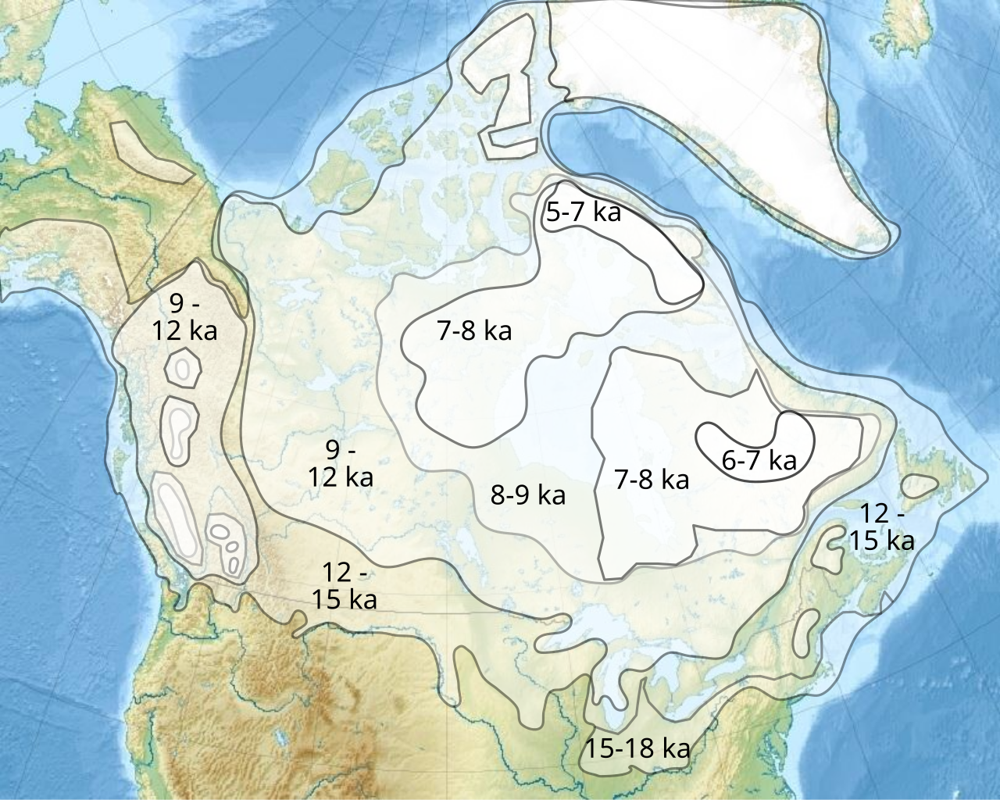

```{=html}
<style>
@import url('https://fonts.googleapis.com/css2?family=Space+Grotesk:wght@700&family=Inter:wght@400;600;800&display=swap');

.engage-box {
  background: linear-gradient(135deg, #667eea 0%, #764ba2 100%);
  color: white;
  padding: 25px;
  margin: 20px 0;
  border-radius: 15px;
  box-shadow: 0 10px 30px rgba(102, 126, 234, 0.3);
  border: none;
}

.explore-box {
  background: linear-gradient(135deg, #f093fb 0%, #f5576c 100%);
  color: white;
  padding: 25px;
  margin: 20px 0;
  border-radius: 15px;
  box-shadow: 0 10px 30px rgba(240, 147, 251, 0.3);
}

.explain-box {
  background: linear-gradient(135deg, #4facfe 0%, #00f2fe 100%);
  color: #1a1a1a;
  padding: 25px;
  margin: 20px 0;
  border-radius: 15px;
  box-shadow: 0 10px 30px rgba(79, 172, 254, 0.3);
}

.elaborate-box {
  background: linear-gradient(135deg, #43e97b 0%, #38f9d7 100%);
  color: #1a1a1a;
  padding: 25px;
  margin: 20px 0;
  border-radius: 15px;
  box-shadow: 0 10px 30px rgba(67, 233, 123, 0.3);
}

.evaluate-box {
  background: linear-gradient(135deg, #fa709a 0%, #fee140 100%);
  color: #1a1a1a;
  padding: 25px;
  margin: 20px 0;
  border-radius: 15px;
  box-shadow: 0 10px 30px rgba(250, 112, 154, 0.3);
}

.check-understanding {
  background: linear-gradient(to right, #667eea, #764ba2);
  color: white;
  padding: 20px;
  margin: 20px 0;
  border-radius: 12px;
  border-left: 6px solid #fff;
  animation: pulse 2s infinite;
}

@keyframes pulse {
  0%, 100% { box-shadow: 0 0 20px rgba(102, 126, 234, 0.5); }
  50% { box-shadow: 0 0 30px rgba(102, 126, 234, 0.8); }
}

.key-idea {
  background: linear-gradient(135deg, #ffecd2 0%, #fcb69f 100%);
  padding: 20px;
  margin: 20px 0;
  border-radius: 12px;
  border-left: 8px solid #ff6b6b;
  font-size: 1.1em;
}

.lab-activity {
  background: linear-gradient(to bottom, #ffeaa7, #fdcb6e);
  border: 4px solid #e17055;
  padding: 25px;
  margin: 25px 0;
  border-radius: 15px;
  box-shadow: 0 8px 20px rgba(0,0,0,0.1);
}

.quiz-section {
  background: linear-gradient(135deg, #a8edea 0%, #fed6e3 100%);
  padding: 25px;
  margin: 25px 0;
  border-radius: 15px;
  border: 4px dashed #ff6b6b;
}

/* Interactive Quiz Styles */
.pf-quiz { font-family: 'Inter', sans-serif; max-width: 720px; margin: 0 auto; }
.pf-quiz-header { text-align: center; margin-bottom: 28px; }
.pf-quiz-header h2 { font-family: 'Space Grotesk', sans-serif; font-weight: 800; font-size: 1.8em; background: linear-gradient(135deg, #fa709a 0%, #fee140 100%); -webkit-background-clip: text; -webkit-text-fill-color: transparent; margin-bottom: 6px; }
.pf-quiz-header p { color: #718096; font-size: 0.95em; }
.pf-question-card { background: white; border-radius: 14px; padding: 22px 26px; margin-bottom: 22px; border: 2px solid #e2e8f0; box-shadow: 0 3px 12px rgba(0,0,0,0.07); transition: box-shadow 0.2s; }
.pf-question-card:hover { box-shadow: 0 6px 20px rgba(0,0,0,0.11); }
.pf-q-meta { font-size: 11px; font-weight: 700; color: #a0aec0; text-transform: uppercase; letter-spacing: 1px; margin-bottom: 10px; }
.pf-q-text { font-size: 16.5px; font-weight: 700; color: #2d3748; margin-bottom: 14px; line-height: 1.5; }
.pf-option { display: block; padding: 12px 18px; margin: 7px 0; border-radius: 9px; border: 2px solid #e2e8f0; cursor: pointer; font-size: 14.5px; color: #4a5568; transition: border-color 0.18s, background 0.18s, transform 0.1s; background: #f7fafc; user-select: none; }
.pf-option:hover:not(.pf-locked) { border-color: #667eea; background: #eef2ff; transform: translateX(3px); }
.pf-option.pf-selected-correct { border-color: #38a169 !important; background: #f0fff4 !important; color: #22543d !important; font-weight: 700; }
.pf-option.pf-selected-wrong { border-color: #e53e3e !important; background: #fff5f5 !important; color: #9b2c2c !important; }
.pf-option.pf-reveal-correct { border-color: #38a169 !important; background: #f0fff4 !important; color: #22543d !important; font-weight: 700; }
.pf-option.pf-locked { cursor: not-allowed; opacity: 0.65; }
.pf-option.pf-locked:not(.pf-selected-correct):not(.pf-selected-wrong):not(.pf-reveal-correct) { opacity: 0.5; }
.pf-feedback-box { margin-top: 14px; padding: 13px 17px; border-radius: 9px; font-size: 14px; line-height: 1.65; display: none; }
.pf-feedback-box.pf-fb-correct { display: block; background: #f0fff4; border: 1.5px solid #38a169; color: #276749; }
.pf-feedback-box.pf-fb-wrong { display: block; background: #fff5f5; border: 1.5px solid #e53e3e; color: #742a2a; }
.pf-score-banner { text-align: center; background: linear-gradient(135deg, #fa709a 0%, #fee140 100%); border-radius: 14px; padding: 22px 30px; margin-top: 10px; margin-bottom: 10px; }
.pf-score-banner .pf-score-emoji { font-size: 2.5em; margin-bottom: 6px; }
.pf-score-banner .pf-score-text { font-size: 1.35em; font-weight: 800; color: #1a1a1a; }
.pf-score-banner .pf-score-sub { font-size: 0.9em; color: #333; margin-top: 4px; }
.pf-restart-btn { margin-top: 14px; padding: 10px 28px; background: #2d3748; color: white; border: none; border-radius: 25px; font-weight: 700; font-size: 0.95em; cursor: pointer; transition: background 0.2s; }
.pf-restart-btn:hover { background: #1a202c; }

.case-study {
  background: linear-gradient(135deg, #2c3e50 0%, #34495e 100%);
  color: white;
  padding: 25px;
  border-radius: 15px;
  margin: 20px 0;
  box-shadow: 0 10px 25px rgba(0,0,0,0.3);
}

.pe-badge {
  display: inline-block;
  background: linear-gradient(135deg, #667eea 0%, #764ba2 100%);
  color: white;
  padding: 8px 16px;
  border-radius: 20px;
  font-size: 13px;
  font-weight: 800;
  margin: 5px;
  box-shadow: 0 4px 15px rgba(102, 126, 234, 0.4);
  text-transform: uppercase;
  letter-spacing: 1px;
}

.warning-box {
  background: linear-gradient(to right, #ffeaa7, #fdcb6e);
  padding: 20px;
  margin: 15px 0;
  border-radius: 12px;
  border-left: 6px solid #e17055;
}

.impact-card {
  background: linear-gradient(to right, #667eea, #764ba2);
  border: 3px solid #667eea;
  border-radius: 10px;
  padding: 15px;
  margin: 10px;
  box-shadow: 0 4px 15px rgba(102, 126, 234, 0.2);
}

h1 {
  font-family: 'Space Grotesk', sans-serif !important;
  font-weight: 800 !important;
  font-size: 2.8em !important;
  margin-top: 40px !important;
}

h2 {
  font-family: 'Space Grotesk', sans-serif !important;
  font-weight: 700 !important;
  color: #667eea !important;
}

.big-question {
  font-family: 'Space Grotesk', sans-serif;
  font-size: 2.5em;
  font-weight: 800;
  background: linear-gradient(135deg, #667eea 0%, #764ba2 100%);
  -webkit-background-clip: text;
  -webkit-text-fill-color: transparent;
  margin: 30px 0 20px 0;
  text-align: center;
  animation: slideIn 0.8s ease-out;
}

@keyframes slideIn {
  from { opacity: 0; transform: translateY(-20px); }
  to { opacity: 1; transform: translateY(0); }
}

/* Fix Observable Plot tooltip visibility — prevent white-on-white */
svg [aria-label="tip"] text { fill: #1a1a1a !important; }
svg [aria-label="tip"] rect { fill: rgba(255, 255, 255, 0.97) !important; stroke: #d4d4d4 !important; }
</style>
```

<span class="pe-badge">HS-ESS2-4</span> <span class="pe-badge">HS-ESS3-1</span> <span class="pe-badge">HS-ESS3-5</span>

# Investigative Phenomenon

::: {.engage-box}
## 🕰️ Climate Change Through Human History

**When climate change has occurred in the past, human populations have been impacted. The current climate change event is predicted to affect populations in the future as well.**

### Driving Questions:
- How has climate change affected people in the past?
- Why is climate change a big deal?
- What happened in the warming event after the last glacial maximum?
- What is AMOC and why does it matter?
:::

# Engage: The Last Glacial Maximum

## Ice Age Earth: 20,000 Years Ago

```{ojs}
//| echo: false
Plot = require("@observablehq/plot")

// Temperature transition from LGM to Holocene
lgmData = [
  {kya: 25, temp: -8, event: "Last Glacial Maximum"},
  {kya: 22, temp: -9, event: "LGM Peak"},
  {kya: 20, temp: -8, event: "LGM"},
  {kya: 18, temp: -6, event: "Deglaciation begins"},
  {kya: 16, temp: -4, event: "Warming"},
  {kya: 14.7, temp: -1, event: "Bølling-Allerød warming"},
  {kya: 13, temp: 0, event: "Warm period"},
  {kya: 12.9, temp: -6, event: "YOUNGER DRYAS BEGINS"},
  {kya: 12, temp: -5, event: "Younger Dryas"},
  {kya: 11.7, temp: 0, event: "YOUNGER DRYAS ENDS"},
  {kya: 10, temp: 1, event: "Holocene begins"},
  {kya: 8, temp: 0.5, event: "Holocene"},
  {kya: 6, temp: 0.5, event: "Holocene Optimum"},
  {kya: 4, temp: 0, event: "Late Holocene"},
  {kya: 2, temp: -0.3, event: "Pre-industrial"},
  {kya: 0, temp: 1, event: "Today"}
]
```

```{ojs}
//| echo: false
viewof showYD = Inputs.toggle({label: "Highlight Younger Dryas Event", value: true})
```

```{ojs}
//| echo: false
Plot.plot({
  title: "Temperature Change: Last Glacial Maximum to Present",
  subtitle: "Greenland ice core data (GISP2)",
  width: 800,
  height: 450,
  x: {label: "Thousands of Years Ago", reverse: true, domain: [25, 0]},
  y: {label: "Temperature Anomaly (°C)", domain: [-10, 3]},
  marks: [
    Plot.ruleY([0], {stroke: "#999", strokeDasharray: "4,4"}),
    showYD ? Plot.rect([{x1: 12.9, x2: 11.7, y1: -10, y2: 3}], {
      x1: "x1", x2: "x2", y1: "y1", y2: "y2", 
      fill: "#ffcdd2", fillOpacity: 0.5
    }) : null,
    showYD ? Plot.text([{x: 12.3, y: 2}], {
      x: "x", y: "y", 
      text: d => "YOUNGER DRYAS\nRapid Cooling Event", 
      fill: "#c62828", 
      fontSize: 11, 
      fontWeight: "bold",
      lineAnchor: "top"
    }) : null,
    Plot.line(lgmData, {x: "kya", y: "temp", stroke: "#2196F3", strokeWidth: 2,
        tip: true}),
    Plot.dot(lgmData, {x: "kya", y: "temp", fill: d => d.event.includes("YOUNGER") ? "#c62828" : "#1565c0", r: 5,
        tip: true})
  ].filter(d => d !== null)
})
```

```{ojs}
//| echo: false
function buildQuiz(id, questions) {
  /* ── outer container ── */
  const outer = html`<div style="font-family:'Inter',sans-serif; max-width:720px; margin:18px auto;"></div>`;

  /* ── toggle button (always visible) ── */
  const toggle = html`<button style="
    display:inline-flex; align-items:center; gap:8px;
    padding:10px 22px; border:2px solid #c7d2fe; border-radius:30px;
    background:linear-gradient(135deg,#eef2ff 0%,#e8f4fd 100%);
    color:#4338ca; font-weight:700; font-size:0.95em;
    cursor:pointer; transition:all 0.25s ease;
    box-shadow:0 2px 8px rgba(67,56,202,0.12);
  ">
    <span style="font-size:1.15em;">✅</span>
    <span>Check Your Understanding</span>
    <span class="quiz-chevron" style="display:inline-block; transition:transform 0.3s ease; font-size:0.8em;">▶</span>
  </button>`;
  toggle.onmouseenter = () => { toggle.style.background='linear-gradient(135deg,#dbeafe 0%,#c7d2fe 100%)'; toggle.style.boxShadow='0 4px 14px rgba(67,56,202,0.22)'; };
  toggle.onmouseleave = () => { toggle.style.background='linear-gradient(135deg,#eef2ff 0%,#e8f4fd 100%)'; toggle.style.boxShadow='0 2px 8px rgba(67,56,202,0.12)'; };
  outer.appendChild(toggle);

  /* ── collapsible quiz body ── */
  const body = html`<div style="
    max-height:0; overflow:hidden; opacity:0;
    transition: max-height 0.5s cubic-bezier(0.4,0,0.2,1),
                opacity 0.4s ease,
                margin-top 0.4s ease,
                padding 0.4s ease;
    padding:0 20px; margin-top:0;
    background:linear-gradient(135deg,#eef2ff 0%,#e8f4fd 100%);
    border-radius:14px; border:2px solid #c7d2fe;
  "></div>`;

  /* ── close / collapse button inside the body ── */
  const closeBtn = html`<div style="text-align:right; padding-top:14px;">
    <button style="
      padding:6px 16px; border:1.5px solid #c7d2fe; border-radius:20px;
      background:white; color:#4338ca; font-weight:700; font-size:0.82em;
      cursor:pointer; transition:all 0.2s;
    ">▲ Hide Quiz</button>
  </div>`;
  closeBtn.querySelector('button').onmouseenter = function(){ this.style.background='#eef2ff'; };
  closeBtn.querySelector('button').onmouseleave = function(){ this.style.background='white'; };
  body.appendChild(closeBtn);

  /* ── header ── */
  body.appendChild(html`<div style="text-align:center; margin-bottom:14px;">
    <span style="font-size:1.3em; font-weight:800; color:#4338ca;">✅ Check Your Understanding</span>
  </div>`);

  /* ── state ── */
  let expanded = false;
  function collapseQuiz() {
    expanded = false;
    body.style.maxHeight = '0';
    body.style.opacity = '0';
    body.style.marginTop = '0';
    body.style.padding = '0 20px';
    toggle.querySelector('.quiz-chevron').style.transform = 'rotate(0deg)';
  }
  function expandQuiz() {
    expanded = true;
    body.style.padding = '0 20px 20px 20px';
    body.style.marginTop = '12px';
    body.style.opacity = '1';
    body.style.maxHeight = body.scrollHeight + 5000 + 'px';
    toggle.querySelector('.quiz-chevron').style.transform = 'rotate(90deg)';
  }
  toggle.onclick = () => { expanded ? collapseQuiz() : expandQuiz(); };
  closeBtn.querySelector('button').onclick = collapseQuiz;

  /* ── build question cards (same logic as before) ── */
  questions.forEach((q, qi) => {
    const emoji = q.emoji || '❓';
    const card = html`<div style="background:white; border-radius:10px; padding:16px 20px; margin-bottom:14px; border:2px solid #e2e8f0; box-shadow:0 2px 8px rgba(0,0,0,0.06); max-height:2000px; overflow:hidden;">
      <div style="font-size:11px; font-weight:700; color:#a0aec0; text-transform:uppercase; letter-spacing:1px; margin-bottom:6px;">${emoji} Question ${qi+1}</div>
      <div style="font-size:15px; font-weight:700; color:#2d3748; margin-bottom:12px; line-height:1.5;">${q.q}</div>
    </div>`;
    const fb = html`<div style="display:none; margin-top:10px; padding:12px 15px; border-radius:8px; font-size:13.5px; line-height:1.6;"></div>`;
    q.options.forEach((opt, oi) => {
      const btn = html`<div style="display:block; padding:10px 16px; margin:6px 0; border-radius:8px; border:2px solid #e2e8f0; cursor:pointer; font-size:14px; color:#4a5568; background:#f7fafc; transition: all 0.18s; user-select:none;">${opt}</div>`;
      btn.onmouseenter = () => { if (!card.dataset.done) { btn.style.borderColor='#667eea'; btn.style.background='#eef2ff'; btn.style.transform='translateX(3px)'; } };
      btn.onmouseleave = () => { if (!card.dataset.done) { btn.style.borderColor='#e2e8f0'; btn.style.background='#f7fafc'; btn.style.transform='none'; } };
      btn.onclick = () => {
        if (card.dataset.done) return;
        card.dataset.done = '1';
        const correct = oi === q.correct;
        btn.style.borderColor = correct ? '#38a169' : '#e53e3e';
        btn.style.background = correct ? '#f0fff4' : '#fff5f5';
        btn.style.fontWeight = '700';
        btn.style.color = correct ? '#22543d' : '#9b2c2c';
        if (!correct) {
          const corEl = card.querySelectorAll('div')[q.correct + 2];
          corEl.style.borderColor='#38a169'; corEl.style.background='#f0fff4'; corEl.style.fontWeight='700'; corEl.style.color='#22543d';
        }
        card.querySelectorAll('div').forEach((el,i) => { if(i>1) { el.style.cursor='not-allowed'; el.style.opacity = (i-2===oi || i-2===q.correct) ? '1' : '0.5'; } });
        fb.style.display='block';
        fb.style.background = correct ? '#f0fff4' : '#fff5f5';
        fb.style.border = correct ? '1.5px solid #38a169' : '1.5px solid #e53e3e';
        fb.innerHTML = `<strong style="color:${correct?'#276749':'#c53030'}">${correct ? '✅ Correct!' : '❌ Not quite.'}</strong><br>${q.explanation}`;
        /* after answering correctly, update maxHeight so collapse still works */
        body.style.maxHeight = body.scrollHeight + 2000 + 'px';
      };
      card.appendChild(btn);
    });
    card.appendChild(fb);
    body.appendChild(card);
  });

  outer.appendChild(body);
  return outer;
}
```

```{ojs}
//| echo: false
buildQuiz("lgm-temp", [
  {
    q: "Looking at the graph, what dramatic event occurred around 12,900 years ago?",
    options: [
      "Temperatures gradually continued warming",
      "A sudden cooling event (the Younger Dryas) dropped temperatures by about 6°C",
      "Temperatures reached the warmest point in the record",
      "An asteroid impact caused a brief temperature spike"
    ],
    correct: 1,
    explanation: "The graph clearly shows a sharp drop in temperature at ~12,900 years ago — from about 0°C anomaly to -6°C. This is the Younger Dryas, one of the most dramatic rapid climate change events in recent Earth history."
  },
  {
    q: "Based on the graph, approximately how long did the Younger Dryas cold period last before temperatures recovered?",
    options: [
      "About 100 years",
      "About 1,200 years",
      "About 5,000 years",
      "About 10,000 years"
    ],
    correct: 1,
    explanation: "The highlighted zone shows the Younger Dryas lasting from ~12,900 to ~11,700 years ago — roughly 1,200 years. Notice how the recovery was almost as abrupt as the onset, indicating how quickly the climate system can flip between states."
  }
])
```

### 📊 Post-LGM Sea Level Rise & Ice Sheet Retreat

#### 1. Post-LGM Sea Level Rise

```{ojs}
//| echo: false
seaLevelData = [
  { age: 22, level: -130, location: "Sunda", errX: 0.5, errY: 5 },
  { age: 19, level: -120, location: "Barbados", errX: 0.4, errY: 4 },
  { age: 14.5, level: -100, location: "Tahiti", errX: 0.2, errY: 6 },
  { age: 14, level: -80, location: "Tahiti", errX: 0.2, errY: 5 },
  { age: 10, level: -40, location: "Huon Peninsula", errX: 0.1, errY: 3 },
  { age: 6, level: -10, location: "Jamaica", errX: 0.1, errY: 2 },
  { age: 2, level: -2, location: "Australia", errX: 0.05, errY: 1 }
]

trendData = [
  { age: 24, level: -130 }, { age: 18, level: -120 },
  { age: 15, level: -105 }, { age: 14, level: -80 },
  { age: 10, level: -40 }, { age: 6, level: -5 }, { age: 0, level: 0 }
]
```

```{ojs}
//| echo: false
Plot.plot({
  width: 800,
  height: 500,
  grid: true,
  x: {
    domain: [24, 0],
    label: "Thousands of Years Ago →",
    ticks: 12
  },
  y: {
    domain: [-150, 0],
    label: "↑ Change in Sea Level (m)"
  },
  color: {
    legend: true,
    scheme: "spectral"
  },
  marks: [
    Plot.link(seaLevelData, {
      x1: d => d.age - d.errX, x2: d => d.age + d.errX, y: "level",
      stroke: "location", strokeWidth: 1
    }),
    Plot.link(seaLevelData, {
      x: "age", y1: d => d.level - d.errY, y2: d => d.level + d.errY,
      stroke: "location", strokeWidth: 1
    }),
    Plot.dot(seaLevelData, {
      x: "age", y: "level", fill: "location", r: 4
    }),
    Plot.line(trendData, {
      x: "age", y: "level", stroke: "black", strokeWidth: 2, curve: "catmull-rom"
    }),
    Plot.text([{age: 22, level: -100}], {
      x: "age", y: "level", text: () => "Last Glacial\nMaximum",
      textAnchor: "start", fontSize: 14
    }),
    Plot.text([{age: 15.5, level: -60}], {
      x: "age", y: "level", text: () => "Meltwater Pulse 1A ↓",
      textAnchor: "start", fontSize: 14
    })
  ]
})
```

```{ojs}
//| echo: false
buildQuiz("sea-level", [
  {
    q: "According to the graph, approximately how much lower were sea levels during the Last Glacial Maximum (~22,000 years ago) compared to today?",
    options: [
      "About 10 meters lower",
      "About 50 meters lower",
      "About 130 meters lower",
      "About 300 meters lower"
    ],
    correct: 2,
    explanation: "The data points from Sunda at ~22,000 years ago show sea levels at approximately -130 meters. This massive drop happened because enormous volumes of water were locked up in continental ice sheets during the Last Glacial Maximum."
  },
  {
    q: "The label 'Meltwater Pulse 1A' marks a period around 14,500 years ago. What does the graph show happening to sea levels during this event?",
    options: [
      "Sea levels dropped sharply",
      "Sea levels remained stable",
      "Sea levels rose very rapidly — from about -100m to -80m in a short time",
      "Sea levels oscillated up and down"
    ],
    correct: 2,
    explanation: "Meltwater Pulse 1A was a period of extremely rapid sea level rise (~20 meters in just a few hundred years) caused by massive ice sheet collapse. The steep jump in the trend line around 14,500–14,000 years ago shows this. This rate of rise would be catastrophic for modern coastal cities."
  }
])
```

---

#### 3. Laurentide Ice Sheet Retreat

The map below shows the maximum extent of the Laurentide Ice Sheet (~21,000 years ago) and its slow retreat over the following 15,000 years as the climate warmed out of the Last Glacial Maximum.

```{=html}
<div style="text-align:center;margin:24px 0;">
  
  <p style="font-size:.82em;color:#718096;margin-top:10px;line-height:1.6;">
    <strong>Figure:</strong> The Laurentide Ice Sheet at its Last Glacial Maximum (LGM) extent, with retreat isochrones showing the ice margin at successive time intervals. At its peak the ice was up to 3–4 km thick over Hudson Bay and covered roughly 13 million km². <em>Source: Wikimedia Commons</em>
  </p>
</div>
```

::: {.key-idea}
### 🧊 Key Patterns in Laurentide Ice Sheet Retreat (18,000 → 6,000 years ago)

- **Southern & western margins melted first** — these edges were thinnest and at lower latitudes
- **Hudson Bay was the last to go** — the thickest ice (3–4 km) persisted there until ~7,500 years ago
- **The ice split in two** around 12,000 years ago, separating the western *Cordilleran* and eastern *Laurentide* sheets — opening the **ice-free corridor** through Alberta that early humans likely used to migrate into the Americas
- **Meltwater carved the Great Lakes** and formed massive lakes like glacial Lake Agassiz (larger than all five Great Lakes combined)
- **The final collapse of Lake Agassiz** (~12,900 years ago) flooded the North Atlantic with freshwater and **triggered the Younger Dryas** cold snap
:::

# Explore Part 1: The AMOC (Atlantic Meridional Overturning Circulation)

## What is AMOC?

The **Atlantic Meridional Overturning Circulation (AMOC)** is a massive system of ocean currents that acts like a global conveyor belt, moving warm water from the tropics to the North Atlantic and cold water back southward at depth.

```{=html}
<div style="text-align: center; margin: 20px 0;">
  <h4>Ocean Conveyor Belt Diagram</h4>
  
  <p style="font-size: 12px; color: #666;">The global thermohaline circulation (ocean conveyor belt)</p>
</div>
```

## Interactive AMOC Simulation

```{ojs}
//| echo: false
{
  // === CONFIGURATION ===
  const scenarios = {
    "Present Day": { salinity: 35, temp: 1, freshwater: 10 },
    "Last Glacial Maximum": { salinity: 36, temp: -8, freshwater: 0 },
    "Younger Dryas Trigger": { salinity: 33, temp: 0, freshwater: 90 },
    "Future (High Emissions)": { salinity: 34, temp: 4, freshwater: 70 }
  };
  const initialScenario = "Present Day";

  // === STATE ===
  let state = {
    salinity: scenarios[initialScenario].salinity,
    temp: scenarios[initialScenario].temp,
    freshwater: scenarios[initialScenario].freshwater
  };

  // === UI & SVG SETUP ===
  const container = html`
<div style="font-family: 'Inter', sans-serif; margin: 20px 0;">
  
  <!-- CONTROLS -->
  <div style="background: #f7f9fc; border-radius: 12px; padding: 16px 22px; border: 1px solid #e2e8f0; margin-bottom: 12px; display: grid; grid-template-columns: repeat(auto-fit, minmax(250px, 1fr)); gap: 12px 24px;">
    
    <div>
      <label style="font-weight: 600; font-size: 0.9em; color: #4a5568;">Load a Scenario:</label>
      <div id="scenario-buttons" style="display: flex; gap: 8px; margin-top: 8px; flex-wrap: wrap;"></div>
    </div>

    <div id="sliders">
      <div class="slider-container" style="margin-bottom: 8px;">
        <label for="salinity-slider" style="font-size:0.9em; color:#333;">North Atlantic Salinity (ppt): <span id="salinity-value" style="font-weight:bold;"></span></label>
        <input type="range" id="salinity-slider" min="30" max="38" step="0.5" style="width:100%;">
      </div>
      <div class="slider-container" style="margin-bottom: 8px;">
        <label for="temp-slider" style="font-size:0.9em; color:#333;">Global Temp Anomaly (°C): <span id="temp-value" style="font-weight:bold;"></span></label>
        <input type="range" id="temp-slider" min="-10" max="5" step="0.5" style="width:100%;">
      </div>
      <div class="slider-container">
        <label for="freshwater-slider" style="font-size:0.9em; color:#333;">Freshwater Input (ice melt, %): <span id="freshwater-value" style="font-weight:bold;"></span></label>
        <input type="range" id="freshwater-slider" min="0" max="100" step="10" style="width:100%;">
      </div>
    </div>
  </div>

  <!-- SIMULATION & STATUS -->
  <div style="display: flex; gap: 20px; flex-wrap: wrap;">
    
    <!-- SVG VISUALIZATION -->
    <div style="flex: 2; min-width: 400px; position: relative;">
      <svg width="100%" height="350" viewBox="0 0 500 350" style="border-radius: 12px; box-shadow: 0 8px 16px rgba(0,0,0,0.15);">
        <defs>
            <linearGradient id="ocean-gradient" x1="0%" y1="0%" x2="0%" y2="100%">
                <stop offset="0%" stop-color="#87CEEB" />
                <stop offset="40%" stop-color="#4682B4" />
                <stop offset="100%" stop-color="#000080" />
            </linearGradient>
            <linearGradient id="temp-overlay-gradient" x1="0%" y1="0%" x2="0%" y2="100%">
                <stop id="temp-grad-start" offset="0%" stop-color="rgba(0,0,255,0)" />
                <stop id="temp-grad-end" offset="100%" stop-color="rgba(0,0,255,0)" />
            </linearGradient>
        </defs>
        
        <rect width="500" height="350" fill="url(#ocean-gradient)"/>
        <rect id="temp-overlay" width="500" height="350" fill="url(#temp-overlay-gradient)"/>
        
        <!-- Landmasses -->
        <path d="M 0 150 Q 30 140 50 150 L 50 350 L 0 350 Z" fill="#8B4513" opacity="0.8"/><text x="10" y="140" fill="white" font-size="12" font-weight="bold">Americas</text>
        <path d="M 420 120 Q 460 110 500 130 L 500 350 L 420 350 Z" fill="#8B4513" opacity="0.8"/><text x="430" y="110" fill="white" font-size="12" font-weight="bold">Europe</text>
        <path id="ice-sheet" d="M 350 20 Q 400 10 450 30 L 450 100 Q 400 90 350 80 Z" fill="white"/><text x="380" y="50" fill="#333" font-size="12" font-weight="bold">Greenland Ice</text>
        
        <!-- Current Paths -->
        <path id="warm-current-path" d="M 60 160 Q 250 140 400 140" fill="none" stroke="#FF4500" stroke-width="8" opacity="0.6"/>
        <path id="sinking-path" d="M 400 140 V 260" fill="none" stroke-width="8" stroke="white" opacity="0.3"/>
        <path id="cold-current-path" d="M 400 260 Q 250 280 60 260" fill="none" stroke="#00BFFF" stroke-width="8" opacity="0.6"/>
        <path id="upwelling-path" d="M 60 260 V 160" fill="none" stroke-width="8" stroke="#00BFFF" opacity="0.6"/>
        
        <!-- Flow Animation Particles -->
        <g id="flow-particles"></g>
        
        <!-- Meltwater -->
        <path id="meltwater-path" d="M 350 80 Q 380 120 420 120" fill="none" stroke="#E0F7FA" opacity="0.8" stroke-dasharray="5 5"/>

        <!-- Labels and Arrows -->
        <g id="current-labels">
            <polygon points="245,134 258,140 245,146" fill="#FF4500" opacity="0.95"/>
            <text x="155" y="130" fill="#FF4500" font-size="13" font-weight="bold">Warm Surface Current →</text>
            <ellipse id="sinking-ellipse" cx="400" cy="200" fill="#4169E1" opacity="0.6"/>
            <text x="400" y="205" fill="white" font-size="12" font-weight="bold" text-anchor="middle">Sinking</text>
            <polygon points="395,202 400,215 405,202" fill="white" opacity="0.85"/>
            <polygon points="255,273 242,279 255,285" fill="#00BFFF" opacity="0.95"/>
            <text x="155" y="300" fill="#00BFFF" font-size="13" font-weight="bold">← Cold Deep Current</text>
            <polygon points="54,178 60,165 66,178" fill="#00BFFF" opacity="0.95"/>
            <text x="65" y="215" fill="#00BFFF" font-size="11" font-weight="bold">Upwelling</text>
        </g>
        
        <!-- Collapse Overlay -->
        <g id="collapse-group" style="visibility: hidden;">
            <rect width="500" height="350" fill="rgba(0,20,80,0.7)"/>
            <text x="250" y="175" text-anchor="middle" fill="white" font-size="48" font-weight="bold">COLLAPSED</text>
        </g>
        
        <!-- Static Labels -->
        <text x="20" y="30" fill="white" font-size="14" font-weight="bold">Equator</text>
        <text x="400" y="30" fill="white" font-size="14" font-weight="bold">North Atlantic</text>
      </svg>
    </div>
    
    <!-- STATUS PANEL -->
    <div id="status-panel" style="flex: 1; min-width: 250px; padding: 25px; background: white; border-radius: 12px; box-shadow: 0 4px 12px rgba(0,0,0,0.1);">
       <h3 style="margin-top: 0; color: #2d3748; font-family: 'Space Grotesk', sans-serif;">AMOC Status</h3>
       <div style="margin-bottom: 15px;">
           <div style="display: flex; justify-content: space-between; margin-bottom: 5px;">
               <span style="color: #4a5568; font-weight: 600;">Flow Strength:</span>
               <span id="flow-strength-value" style="font-weight: bold;"></span>
           </div>
           <div style="width: 100%; background: #edf2f7; border-radius: 4px; height: 8px; overflow: hidden;">
               <div id="flow-strength-bar" style="height: 100%; transition: width 0.3s ease, background 0.3s ease;"></div>
           </div>
       </div>
       <p style="margin: 10px 0; color: #4a5568;"><strong>Sinking Rate:</strong> <span id="sinking-rate-value"></span></p>
       <p style="margin: 10px 0; color: #4a5568;"><strong>Effective Salinity:</strong> <span id="eff-salinity-value"></span> ppt</p>
       <div id="status-message" style="margin-top: 20px; padding: 15px; border-radius: 8px; border: 1px solid;">
           <strong id="status-title" style="display: block; margin-bottom: 5px;"></strong>
           <span id="status-text" style="font-size: 0.9em; color: #4a5568;"></span>
       </div>
    </div>
  </div>
</div>`;
  
  // === ELEMENT REFERENCES ===
  const sliders = {
    salinity: container.querySelector("#salinity-slider"),
    temp: container.querySelector("#temp-slider"),
    freshwater: container.querySelector("#freshwater-slider")
  };
  const values = {
    salinity: container.querySelector("#salinity-value"),
    temp: container.querySelector("#temp-value"),
    freshwater: container.querySelector("#freshwater-value")
  };
  const svg = {
    iceSheet: container.querySelector("#ice-sheet"),
    meltwater: container.querySelector("#meltwater-path"),
    tempOverlay: container.querySelector("#temp-overlay"),
    collapseGroup: container.querySelector("#collapse-group"),
    flowParticles: container.querySelector("#flow-particles"),
    currentLabels: container.querySelector("#current-labels"),
    sinkingEllipse: container.querySelector("#sinking-ellipse")
  };
  const status = {
    panel: container.querySelector("#status-panel"),
    strengthValue: container.querySelector("#flow-strength-value"),
    strengthBar: container.querySelector("#flow-strength-bar"),
    sinkingRate: container.querySelector("#sinking-rate-value"),
    effSalinity: container.querySelector("#eff-salinity-value"),
    message: container.querySelector("#status-message"),
    title: container.querySelector("#status-title"),
    text: container.querySelector("#status-text")
  };

  // === LOGIC ===
  const update = () => {
    for (const key in state) {
      sliders[key].value = state[key];
      values[key].textContent = state[key];
    }
    
    const effectiveSalinity = state.salinity - (state.freshwater * 0.05) - (state.temp * 0.8);
    const amocStrength = Math.max(0, Math.min(100, (effectiveSalinity - 30) * 12.5));
    const sinkingRate = amocStrength > 70 ? "Strong" : amocStrength > 40 ? "Moderate" : amocStrength > 15 ? "Weak" : "Collapsed";
    
    svg.iceSheet.style.opacity = Math.max(0, 1 - (state.temp / 5) - (state.freshwater / 200));
    svg.meltwater.style.strokeWidth = state.freshwater > 0 || state.temp > 0 ? (state.freshwater / 20) + Math.max(0, state.temp) : 0;
    
    const tempRatio = Math.min(1, Math.max(0, (state.temp + 10) / 15));
    const blue = [66, 133, 244]; const red = [219, 68, 55];
    const mix = blue.map((b, i) => b * (1 - tempRatio) + red[i] * tempRatio);
    container.querySelector("#temp-grad-start").setAttribute("stop-color", `rgba(${mix[0]}, ${mix[1]}, ${mix[2]}, 0)`);
    container.querySelector("#temp-grad-end").setAttribute("stop-color", `rgba(${mix[0]}, ${mix[1]}, ${mix[2]}, 0.25)`);
    
    const isCollapsed = amocStrength <= 1;
    svg.collapseGroup.style.visibility = isCollapsed ? "visible" : "hidden";
    svg.currentLabels.style.opacity = isCollapsed ? 0 : 1;
    svg.flowParticles.style.opacity = isCollapsed ? 0 : 1;

    const strengthColor = amocStrength < 30 ? '#e53e3e' : amocStrength < 60 ? '#d69e2e' : '#38a169';
    status.panel.style.borderTop = `5px solid ${strengthColor}`;
    status.strengthValue.textContent = `${amocStrength.toFixed(0)}%`;
    status.strengthValue.style.color = amocStrength < 30 ? strengthColor : '#2d3748';
    status.strengthBar.style.width = `${amocStrength}%`;
    status.strengthBar.style.background = strengthColor;
    status.sinkingRate.textContent = sinkingRate;
    status.effSalinity.textContent = effectiveSalinity.toFixed(1);

    if (amocStrength < 30) {
      status.message.style.background = '#fff5f5'; status.message.style.borderColor = '#feb2b2';
      status.title.textContent = '⚠️ Critical Warning'; status.title.style.color = '#c53030';
      status.text.textContent = 'AMOC is near collapse. Severe cooling expected in Northern Europe and disrupted global weather patterns.';
    } else if (amocStrength < 60) {
      status.message.style.background = '#fffff0'; status.message.style.borderColor = '#fef08a';
      status.title.textContent = '⚡ Weakening Detected'; status.title.style.color = '#b45309';
      status.text.textContent = 'Reduced heat transport to the North Atlantic. Regional climate impacts beginning.';
    } else {
      status.message.style.background = '#f0fff4'; status.message.style.borderColor = '#bbf7d0';
      status.title.textContent = '✅ Stable Circulation'; status.title.style.color = '#22543d';
      status.text.textContent = 'Normal heat transport maintaining mild European climate.';
    }

    svg.sinkingEllipse.setAttribute("rx", amocStrength / 4 + 10);
    svg.sinkingEllipse.setAttribute("ry", amocStrength / 2 + 20);
    
    svg.flowParticles.innerHTML = '';
    if (!isCollapsed) {
        const animDuration = 100 / (amocStrength + 5);
        const paths = ["warm-current-path", "sinking-path", "cold-current-path", "upwelling-path"];
        const colors = ["#FFC107", "#FFFFFF", "#81D4FA", "#81D4FA"];
        
        paths.forEach((pathId, i) => {
            const pathElement = container.querySelector('#' + pathId);
            if (!pathElement) return;
            const d = pathElement.getAttribute("d");

            for (let j = 0; j < 5; j++) {
                const particle = document.createElementNS("http://www.w3.org/2000/svg", "circle");
                particle.setAttribute("r", "3");
                particle.setAttribute("fill", colors[i]);
                const anim = document.createElementNS("http://www.w3.org/2000/svg", "animateMotion");
                anim.setAttribute("dur", `${animDuration}s`);
                anim.setAttribute("begin", `${j * animDuration / 5}s`);
                anim.setAttribute("repeatCount", "indefinite");
                anim.setAttribute("path", d);
                particle.appendChild(anim);
                svg.flowParticles.appendChild(particle);
            }
        });
    }
  };

  const scenarioContainer = container.querySelector("#scenario-buttons");
  for (const name in scenarios) {
    const button = document.createElement("button");
    button.textContent = name;
    button.style = "padding: 6px 12px; border: 1px solid #cbd5e0; border-radius: 18px; background: #fff; cursor: pointer; font-size: 0.85em; transition: all 0.2s;";
    button.onmouseover = () => { button.style.borderColor = '#667eea'; button.style.background = '#eef2ff'; };
    button.onmouseout = () => { button.style.borderColor = '#cbd5e0'; button.style.background = '#fff'; };
    button.onclick = () => {
      state = scenarios[name];
      update();
    };
    scenarioContainer.appendChild(button);
  }

  for (const key in sliders) {
    sliders[key].oninput = (e) => {
      state[key] = parseFloat(e.target.value);
      update();
    };
  }

  update();
  return container;
}
```


```{ojs}
//| echo: false
buildQuiz("amoc-sim", [
  {
    q: "In the AMOC simulation, what happens to the flow strength when you increase freshwater input to 80-100%?",
    options: [
      "Flow strength increases because more water is entering the system",
      "Flow strength stays the same — freshwater has no effect on ocean currents",
      "Flow strength drops dramatically, and the AMOC status shows 'Critical Warning' or 'Collapsed'",
      "The warm surface current reverses direction"
    ],
    correct: 2,
    explanation: "When you add a lot of freshwater (simulating ice sheet melt), the effective salinity drops, making the water less dense. Since AMOC is driven by dense water sinking in the North Atlantic, reducing density weakens or stops the sinking — and the entire circulation weakens. This is exactly what scientists believe happened during the Younger Dryas."
  },
  {
    q: "Try setting temperature increase to 3°C and freshwater input to 50%. What does the status panel tell you about the combined effect?",
    options: [
      "The system is stable and functioning normally",
      "The AMOC is strengthening due to warmer water",
      "Both factors together weaken AMOC more than either alone — the system shows 'Weakening' or 'Critical'",
      "Temperature and freshwater cancel each other out"
    ],
    correct: 2,
    explanation: "Temperature increase and freshwater input both reduce the density of North Atlantic surface water (warming makes water less dense, and freshwater dilutes the salt). Together they have a compounding effect that weakens AMOC more severely. This is why scientists are concerned about the combination of global warming and accelerating Greenland ice melt."
  }
])
```

::: {.explain-box}
## 🌊 How AMOC Works

**The key driver of AMOC is DENSITY:**

1. **Warm, salty water** flows north from the tropics
2. In the North Atlantic, water **cools** and becomes **denser**
3. **High salinity** makes the water even denser
4. Dense water **sinks** to the deep ocean
5. Deep water flows **southward** along the ocean floor
6. This creates a continuous **circulation pattern**

**What happens when ice melts:**
- Melting ice sheets add **freshwater** to the North Atlantic
- Freshwater is **less dense** than saltwater
- Less dense water **doesn't sink as well**
- AMOC **slows down or stops**
:::

# Explore Part 2: The Younger Dryas Event

## What Caused the Younger Dryas?

::: {.case-study}
## 📜 Case Study: The Younger Dryas (12,900 - 11,700 years ago)

**The Scenario:**
- Earth was warming after the Last Glacial Maximum
- Massive ice sheets over North America were melting
- Lake Agassiz (larger than all Great Lakes combined) formed from meltwater

**The Trigger:**
- Around 12,900 years ago, Lake Agassiz catastrophically drained
- Enormous amounts of freshwater flooded into the North Atlantic
- This freshwater was less dense than seawater

**The Result:**
- AMOC slowed dramatically or stopped
- Heat transfer to Northern Europe ceased
- Temperatures in Greenland dropped ~10°C in just decades
- The Northern Hemisphere plunged back into ice age conditions
- The cold period lasted ~1,200 years
:::

```{ojs}
//| echo: false
ydDetailData = [
  {year: 13500, temp: -32},
  {year: 13200, temp: -33},
  {year: 13000, temp: -35},
  {year: 12900, temp: -43},
  {year: 12700, temp: -44},
  {year: 12500, temp: -43},
  {year: 12200, temp: -44},
  {year: 12000, temp: -43},
  {year: 11800, temp: -42},
  {year: 11700, temp: -33},
  {year: 11500, temp: -32},
  {year: 11200, temp: -31}
]

Plot.plot({
  title: "Younger Dryas: Greenland Temperature Record",
  subtitle: "Years before present (ice core data)",
  width: 700,
  height: 400,
  x: {label: "Years Before Present", reverse: true},
  y: {label: "Temperature (°C)", domain: [-50, -25]},
  marks: [
    Plot.rect([{x1: 12900, x2: 11700}], {x1: "x1", x2: "x2", y1: -50, y2: -25, fill: "#e3f2fd", fillOpacity: 0.5}),
    Plot.line(ydDetailData, {x: "year", y: "temp", stroke: "#1565c0", strokeWidth: 3,
        tip: true}),
    Plot.dot(ydDetailData, {x: "year", y: "temp", fill: "#0d47a1", r: 5,
        tip: true}),
    Plot.text([{x: 12300, y: -28}], {x: "x", y: "y", text: d => "Younger Dryas Cold Period", fill: "#1565c0", fontSize: 12, fontWeight: "bold"})
  ]
})
```

```{ojs}
//| echo: false
buildQuiz("yd-detail", [
  {
    q: "Based on the Greenland ice core data, approximately how much did temperatures drop at the onset of the Younger Dryas (~12,900 years ago)?",
    options: [
      "About 1-2°C",
      "About 5°C",
      "About 10°C (from roughly -33°C to -43°C)",
      "About 25°C"
    ],
    correct: 2,
    explanation: "The graph shows temperatures plunging from about -33°C to -43°C — a drop of roughly 10°C in Greenland. Remarkably, much of this drop occurred within just a few decades. For context, the entire difference between today's climate and the peak of the last ice age is about 5-6°C globally — so this regional drop was enormous."
  },
  {
    q: "Notice how the temperature recovery at ~11,700 years ago looks on the graph. What does the steepness tell you?",
    options: [
      "The climate gradually warmed over thousands of years",
      "The warming was nearly as abrupt as the cooling — temperatures jumped ~10°C in just decades",
      "Temperatures fluctuated up and down before stabilizing",
      "The recovery took longer than the cooling"
    ],
    correct: 1,
    explanation: "The sharp upward jump at ~11,700 years ago shows that the end of the Younger Dryas was almost as abrupt as its beginning. Ice core data suggests temperatures rose ~10°C in as little as a few decades — possibly even a single decade. This tells us that AMOC can 'switch on' rapidly once conditions allow deep water formation to resume."
  }
])
```

::: {.warning-box}
### ⚠️ Human Consequences of the Younger Dryas

**Agricultural Revolution Delayed:**
- Warming had allowed early agriculture to begin in the Fertile Crescent
- The Younger Dryas ended this experiment
- Humans had to return to hunting and gathering

**Population Impacts:**
- Evidence of population decline in Europe
- Megafauna extinctions accelerated
- Human settlements abandoned in many regions

**After the Younger Dryas:**
- When warming resumed ~11,700 years ago, agriculture began again
- This time it succeeded → the Neolithic Revolution
- Human civilization as we know it developed
:::

# Explain: The AMOC-Climate Connection

::: {.explain-box}
## 🔄 The Feedback Mechanism

**Step 1:** Ice sheets melt → freshwater enters North Atlantic

**Step 2:** Freshwater reduces salinity → water less dense

**Step 3:** Water doesn't sink as efficiently → AMOC weakens

**Step 4:** Less heat transported northward → Northern Hemisphere cools

**Step 5:** BUT... Southern Hemisphere warms (heat accumulates at equator)

**Step 6:** Warmer Southern Ocean releases more CO₂ → amplifies global effects
:::

## Current AMOC Status

```{ojs}
//| echo: false
amocHistoryData = [
  {year: 1950, strength: 18},
  {year: 1960, strength: 17.5},
  {year: 1970, strength: 17.8},
  {year: 1980, strength: 17.2},
  {year: 1990, strength: 16.8},
  {year: 2000, strength: 16.5},
  {year: 2005, strength: 17.0},
  {year: 2010, strength: 15.5},
  {year: 2015, strength: 15.0},
  {year: 2020, strength: 14.5},
  {year: 2024, strength: 14.2}
]

Plot.plot({
  title: "Estimated AMOC Strength Over Time",
  subtitle: "Sverdrups (millions of cubic meters per second)",
  width: 700,
  height: 350,
  x: {label: "Year"},
  y: {label: "AMOC Strength (Sv)", domain: [10, 20]},
  marks: [
    Plot.line(amocHistoryData, {x: "year", y: "strength", stroke: "#e74c3c", strokeWidth: 3,
        tip: true}),
    Plot.dot(amocHistoryData, {x: "year", y: "strength", fill: "#c62828", r: 5,
        tip: true}),
    Plot.linearRegressionY(amocHistoryData, {x: "year", y: "strength", stroke: "#999", strokeDasharray: "5,5"}),
    Plot.text([{x: 1970, y: 12}], {x: "x", y: "y", text: d => "Declining trend", fill: "#999", fontSize: 11})
  ]
})
```

```{ojs}
//| echo: false
buildQuiz("amoc-trend", [
  {
    q: "What does the dashed trend line on the AMOC Strength graph tell you about the circulation since 1950?",
    options: [
      "AMOC has been steadily strengthening",
      "AMOC strength has remained constant",
      "AMOC has been weakening — declining from about 18 Sv to about 14 Sv",
      "AMOC has been fluctuating with no clear trend"
    ],
    correct: 2,
    explanation: "The linear regression line shows a clear declining trend, dropping from roughly 18 Sverdrups in 1950 to about 14 Sv by 2024 — a decline of about 22%. This weakening is consistent with increased freshwater input from Greenland ice melt and warming North Atlantic surface waters, both of which reduce the density-driven sinking that powers AMOC."
  },
  {
    q: "If this declining trend continues, what past event does it most closely resemble in mechanism?",
    options: [
      "The formation of the Sahara Desert",
      "The freshwater-driven AMOC shutdown that triggered the Younger Dryas",
      "The eruption of a supervolcano",
      "A gradual ice age onset from Milankovitch cycles"
    ],
    correct: 1,
    explanation: "The mechanism is the same: freshwater from melting ice reduces North Atlantic salinity, weakening the density-driven sinking that powers AMOC. During the Younger Dryas, catastrophic drainage of glacial Lake Agassiz shut down AMOC rapidly. Today, Greenland's accelerating ice loss is gradually producing a similar (though slower) freshwater input. Scientists are watching carefully to see if a tipping point could be reached."
  }
])
```

# Elaborate: Climate Change Impacts Today and Tomorrow

## Current Ice Sheet Status

```{ojs}
//| echo: false
iceLossData = [
  {year: 2002, greenland: 0, antarctica: 0},
  {year: 2004, greenland: -100, antarctica: -50},
  {year: 2006, greenland: -250, antarctica: -100},
  {year: 2008, greenland: -500, antarctica: -200},
  {year: 2010, greenland: -800, antarctica: -350},
  {year: 2012, greenland: -1200, antarctica: -500},
  {year: 2014, greenland: -1600, antarctica: -700},
  {year: 2016, greenland: -2000, antarctica: -1000},
  {year: 2018, greenland: -2500, antarctica: -1300},
  {year: 2020, greenland: -3000, antarctica: -1600},
  {year: 2022, greenland: -3500, antarctica: -2000},
  {year: 2024, greenland: -4000, antarctica: -2400}
]

Plot.plot({
  title: "Cumulative Ice Mass Loss from Ice Sheets",
  subtitle: "Gigatonnes (billions of metric tons)",
  width: 700,
  height: 400,
  x: {label: "Year"},
  y: {label: "Ice Mass Change (Gt)"},
  marks: [
    Plot.ruleY([0], {stroke: "#999"}),
    Plot.line(iceLossData, {x: "year", y: "greenland", stroke: "#2196F3", strokeWidth: 3,
        tip: true}),
    Plot.line(iceLossData, {x: "year", y: "antarctica", stroke: "#81d4fa", strokeWidth: 3,
        tip: true}),
    Plot.text([{x: 2008, y: -800}], {x: "x", y: "y", text: d => "Greenland", fill: "#2196F3", fontSize: 12}),
    Plot.text([{x: 2008, y: -200}], {x: "x", y: "y", text: d => "Antarctica", fill: "#81d4fa", fontSize: 12})
  ]
})
```

```{ojs}
//| echo: false
buildQuiz("ice-loss", [
  {
    q: "Based on the graph, which ice sheet has lost more total mass since 2002, and by approximately how much?",
    options: [
      "Antarctica has lost more — about twice as much as Greenland",
      "They have lost approximately equal amounts",
      "Greenland has lost more — approximately 4,000 Gt compared to Antarctica's ~2,400 Gt",
      "Neither has lost a significant amount of ice"
    ],
    correct: 2,
    explanation: "The darker blue line (Greenland) shows cumulative losses of about 4,000 Gigatonnes, while Antarctica (lighter blue) shows about 2,400 Gt. Greenland is losing ice faster because it is farther from the pole and more exposed to warming ocean currents and air temperatures. However, Antarctica holds about 10× more total ice, so even smaller percentage losses matter enormously for sea level."
  },
  {
    q: "Look at the curve shape for both ice sheets. Are the losses happening at a constant rate, or are they accelerating?",
    options: [
      "The losses are constant (straight lines)",
      "The losses are decelerating (curves are flattening)",
      "The losses are accelerating (the curves get steeper over time)",
      "There is no clear pattern"
    ],
    correct: 2,
    explanation: "Both curves get steeper over time — the gap between consecutive data points grows larger in recent years. This acceleration means ice is being lost faster each year. For Greenland, the rate has roughly tripled since 2002. Accelerating ice loss is one of the most concerning signals in climate science because it means sea level rise projections may need to be revised upward."
  }
])
```

## Sea Level Rise Projections

```{ojs}
//| echo: false
viewof scenario = Inputs.radio(["Low Emissions (SSP1-2.6)", "Moderate (SSP2-4.5)", "High Emissions (SSP5-8.5)"], {
  label: "Emissions Scenario:",
  value: "Moderate (SSP2-4.5)"
})
```

```{ojs}
//| echo: false
slrData = {
  const base = [
    {year: 2020, level: 0},
    {year: 2030, level: 0.08},
    {year: 2040, level: 0.16},
    {year: 2050, level: 0.25}
  ];
  
  if (scenario === "Low Emissions (SSP1-2.6)") {
    return [...base, 
      {year: 2060, level: 0.32},
      {year: 2070, level: 0.38},
      {year: 2080, level: 0.43},
      {year: 2090, level: 0.47},
      {year: 2100, level: 0.50}
    ];
  } else if (scenario === "Moderate (SSP2-4.5)") {
    return [...base,
      {year: 2060, level: 0.35},
      {year: 2070, level: 0.45},
      {year: 2080, level: 0.55},
      {year: 2090, level: 0.65},
      {year: 2100, level: 0.75}
    ];
  } else {
    return [...base,
      {year: 2060, level: 0.40},
      {year: 2070, level: 0.55},
      {year: 2080, level: 0.75},
      {year: 2090, level: 0.95},
      {year: 2100, level: 1.20}
    ];
  }
}

Plot.plot({
  title: `Sea Level Rise Projection: ${scenario}`,
  subtitle: "Meters above 2020 level",
  width: 700,
  height: 400,
  x: {label: "Year", domain: [2020, 2100]},
  y: {label: "Sea Level Rise (m)", domain: [0, 1.5]},
  marks: [
    Plot.areaY(slrData, {x: "year", y: "level", fill: "#0277bd", fillOpacity: 0.3,
        tip: true}),
    Plot.line(slrData, {x: "year", y: "level", stroke: "#01579b", strokeWidth: 3,
        tip: true}),
    Plot.dot(slrData, {x: "year", y: "level", fill: "#01579b", r: 5,
        tip: true}),
    Plot.ruleY([0.5], {stroke: "#e74c3c", strokeDasharray: "5,5"}),
    Plot.text([{x: 2040, y: 0.55}], {x: "x", y: "y", text: d => "0.5m: Major coastal flooding", fill: "#e74c3c", fontSize: 10})
  ]
})
```

```{ojs}
//| echo: false
buildQuiz("slr-proj", [
  {
    q: "Switch between the three emissions scenarios. By 2100, how much more sea level rise does the High Emissions scenario project compared to Low Emissions?",
    options: [
      "About the same — the scenario doesn't matter much",
      "High emissions projects about 0.70m more (1.20m vs 0.50m)",
      "Low emissions actually projects more sea level rise",
      "The difference is only a few centimeters"
    ],
    correct: 1,
    explanation: "Under Low Emissions (SSP1-2.6), sea levels rise about 0.50m by 2100. Under High Emissions (SSP5-8.5), they rise about 1.20m — more than double. The dashed red line at 0.5m marks 'major coastal flooding,' which ALL scenarios cross. This shows that while we cannot avoid some sea level rise, our emissions choices determine whether it's manageable or catastrophic."
  },
  {
    q: "The red dashed line marks 0.5m of sea level rise. In which scenario(s) does sea level cross this threshold, and approximately when?",
    options: [
      "Only the High Emissions scenario crosses 0.5m, around 2090",
      "All three scenarios cross 0.5m — Low around 2100, Moderate around 2080, High around 2070",
      "None of the scenarios reach 0.5m by 2100",
      "Only Low Emissions crosses 0.5m"
    ],
    correct: 1,
    explanation: "All three scenarios eventually reach or approach 0.5m, but the timing differs dramatically. High emissions crosses 0.5m around 2070, giving coastal communities only ~45 years to prepare. Low emissions doesn't reach it until near 2100. This extra time is critical for building sea walls, relocating infrastructure, and implementing adaptation plans."
  }
])
```

## Populations at Risk

```{ojs}
//| echo: false
riskData = [
  {region: "Bangladesh", population: 20, type: "Flooding"},
  {region: "Vietnam", population: 12, type: "Flooding"},
  {region: "China (coastal)", population: 50, type: "Flooding"},
  {region: "India (coastal)", population: 15, type: "Flooding"},
  {region: "Indonesia", population: 10, type: "Flooding"},
  {region: "Small Island Nations", population: 5, type: "Complete displacement"},
  {region: "US Gulf Coast", population: 8, type: "Flooding"},
  {region: "Netherlands", population: 4, type: "Flooding"}
]

Plot.plot({
  title: "Populations at Risk from Sea Level Rise",
  subtitle: "Millions of people potentially displaced by 1m rise",
  width: 700,
  height: 400,
  marginLeft: 160,
  marginRight: 55,
  x: {label: "People at Risk (millions)"},
  y: {label: null, domain: riskData.map(d => d.region)},
  marks: [
    Plot.barX(riskData, {x: "population", y: "region", fill: d => d.type === "Complete displacement" ? "#c62828" : "#1565c0", sort: {y: "-x"},
        tip: true}),
    Plot.text(riskData, {x: "population", y: "region", text: d => d.population + "M", dx: 6, fontSize: 11, textAnchor: "start"})
  ]
})
```

```{ojs}
//| echo: false
buildQuiz("pop-risk", [
  {
    q: "According to the bar chart, which single region has the most people at risk from 1 meter of sea level rise, and approximately how many?",
    options: [
      "Bangladesh — about 20 million",
      "Small Island Nations — about 50 million",
      "China (coastal) — about 50 million",
      "US Gulf Coast — about 30 million"
    ],
    correct: 2,
    explanation: "Coastal China has approximately 50 million people at risk — the highest of any region. This is because major population centers like Shanghai, Guangzhou, and Shenzhen sit in low-lying coastal deltas. However, note that Small Island Nations, while having fewer total people at risk (5M), face COMPLETE displacement — their entire countries could become uninhabitable."
  },
  {
    q: "What distinguishes Small Island Nations from all other regions on this chart?",
    options: [
      "They have the most people at risk",
      "They are the only region colored differently — indicating 'complete displacement' rather than just flooding",
      "They will not be affected by sea level rise",
      "They have the best infrastructure to handle flooding"
    ],
    correct: 1,
    explanation: "Small Island Nations are colored red (complete displacement) rather than blue (flooding). While other regions face serious flooding and damage, their populations could potentially retreat to higher ground. For low-lying island nations like Tuvalu, the Maldives, and the Marshall Islands, there IS no higher ground — their entire nations could become submerged, creating climate refugees with nowhere to go."
  }
])
```

## Climate Impacts Already Happening

::: {.elaborate-box}
### 🌍 Current Climate Change Impacts

```{=html}
<div style="display: grid; grid-template-columns: repeat(auto-fit, minmax(250px, 1fr)); gap: 15px; margin: 20px 0;">
  <div class="impact-card">
    <h4>🌊 Sea Level Rise</h4>
    <p><strong>Current:</strong> ~3.7 mm/year (accelerating)</p>
    <p><strong>Total since 1900:</strong> ~20 cm</p>
    <p><strong>Impact:</strong> Coastal erosion, flooding, saltwater intrusion</p>
  </div>
  <div class="impact-card">
    <h4>🔥 Extreme Heat</h4>
    <p><strong>Trend:</strong> Heat waves 5x more likely</p>
    <p><strong>Record:</strong> 2023 hottest year on record</p>
    <p><strong>Impact:</strong> Heat deaths, crop failures, wildfires</p>
  </div>
  <div class="impact-card">
    <h4>🌀 Extreme Weather</h4>
    <p><strong>Trend:</strong> More intense hurricanes</p>
    <p><strong>Rainfall:</strong> Heavier precipitation events</p>
    <p><strong>Impact:</strong> Flooding, infrastructure damage</p>
  </div>
  <div class="impact-card">
    <h4>🧊 Ice Loss</h4>
    <p><strong>Arctic:</strong> -13% per decade</p>
    <p><strong>Glaciers:</strong> Retreating worldwide</p>
    <p><strong>Impact:</strong> Sea level rise, ecosystem loss</p>
  </div>
  <div class="impact-card">
    <h4>🌾 Food Security</h4>
    <p><strong>Crops:</strong> Yields declining in some regions</p>
    <p><strong>Fisheries:</strong> Species shifting poleward</p>
    <p><strong>Impact:</strong> Food shortages, price increases</p>
  </div>
  <div class="impact-card">
    <h4>💧 Water Resources</h4>
    <p><strong>Drought:</strong> More frequent and severe</p>
    <p><strong>Snowpack:</strong> Declining in mountains</p>
    <p><strong>Impact:</strong> Water shortages, conflicts</p>
  </div>
</div>
```
:::

## 🗺️ Costliest & Deadliest Disasters: 2011–2025

**75 disasters** — 5 per year across 15 years. Filter by year or disaster type. Hover for a quick summary, click for full details.

```{=html}
<link rel="stylesheet" href="https://unpkg.com/leaflet@1.9.4/dist/leaflet.css" />
<script src="https://unpkg.com/leaflet@1.9.4/dist/leaflet.js"></script>

<style>
  #disaster-map { height:560px; border-radius:14px; border:3px solid #667eea; box-shadow:0 8px 30px rgba(102,126,234,0.25); margin:12px 0 8px; }
  #dm-controls { background:white; border:2px solid #e2e8f0; border-radius:12px; padding:12px 16px; margin-bottom:10px; font-family:'Inter',sans-serif; box-shadow:0 2px 10px rgba(0,0,0,0.06); }
  .dm-row { display:flex; align-items:center; gap:10px; margin-bottom:8px; }
  .dm-label { font-size:12px; font-weight:700; color:#667eea; white-space:nowrap; min-width:58px; }
  .dm-ybtns { display:flex; gap:5px; overflow-x:auto; padding-bottom:3px; flex-wrap:nowrap; scrollbar-width:thin; }
  .dm-cbtns { display:flex; gap:5px; flex-wrap:wrap; }
  .yr-btn,.cat-btn { padding:4px 11px; border:1.5px solid #cbd5e0; border-radius:18px; background:#f7fafc; color:#4a5568; cursor:pointer; font-size:12px; font-weight:600; transition:all 0.15s; white-space:nowrap; }
  .yr-btn:hover,.cat-btn:hover { border-color:#667eea; background:#eef2ff; color:#4338ca; }
  .yr-btn.active,.cat-btn.active { border-color:#667eea; background:linear-gradient(135deg,#667eea,#764ba2); color:white; }
  #dm-counter { font-size:12px; font-weight:700; color:#718096; text-align:right; margin-top:2px; }
  #dm-tip { font-size:11px; color:#a0aec0; margin-top:4px; }
  .dei { font-size:1.35rem; line-height:1; display:flex; align-items:center; justify-content:center; filter:drop-shadow(0 1px 5px rgba(0,0,0,0.6)); cursor:pointer; animation:mpulse 3s ease-in-out infinite; }
  .dei:hover { animation:none !important; transform:scale(1.55) !important; filter:drop-shadow(0 4px 14px rgba(255,200,0,0.85)) !important; }
  @keyframes mpulse { 0%,100%{transform:scale(1);filter:drop-shadow(0 1px 5px rgba(0,0,0,0.6))} 50%{transform:scale(1.2);filter:drop-shadow(0 3px 10px rgba(102,126,234,0.65))} }
  .dtip { background:rgba(12,12,28,0.93) !important; border:1.5px solid #667eea !important; border-radius:10px !important; color:#f0f4ff !important; font-family:'Inter',sans-serif !important; font-size:12.5px !important; padding:9px 13px !important; max-width:230px !important; pointer-events:none; box-shadow:0 4px 18px rgba(0,0,0,0.4) !important; line-height:1.55 !important; }
  .dtip::before { border-top-color:#667eea !important; }
  .leaflet-popup-content-wrapper { border-radius:14px !important; border:2.5px solid #667eea !important; box-shadow:0 10px 40px rgba(102,126,234,0.35) !important; padding:0 !important; overflow:hidden !important; font-family:'Inter',sans-serif !important; max-width:320px !important; }
  .leaflet-popup-content { margin:0 !important; width:320px !important; }
  .leaflet-popup-tip { background:#667eea !important; }
  .leaflet-popup-close-button { color:white !important; font-size:18px !important; right:10px !important; top:10px !important; }
  .dp-header { padding:14px 16px 10px; color:white; display:flex; align-items:flex-start; gap:11px; }
  .dp-emoji { font-size:2.4rem; line-height:1; flex-shrink:0; margin-top:2px; }
  .dp-name { font-size:14.5px; font-weight:800; line-height:1.3; }
  .dp-meta { font-size:11.5px; font-weight:600; opacity:0.85; margin-top:3px; }
  .dp-body { padding:12px 16px 14px; background:#fafbff; }
  .dp-stats { display:grid; grid-template-columns:1fr 1fr; gap:7px; margin-bottom:10px; }
  .dp-stat { background:white; border:1.5px solid #e2e8f0; border-radius:9px; padding:7px 9px; text-align:center; }
  .dp-sv { font-size:14px; font-weight:800; color:#2d3748; }
  .dp-sl { font-size:10px; font-weight:700; color:#a0aec0; text-transform:uppercase; letter-spacing:0.6px; margin-top:1px; }
  .dp-desc { font-size:12.5px; color:#4a5568; line-height:1.6; margin-bottom:9px; }
  .dp-cc { background:linear-gradient(135deg,#eef2ff,#e8f4fd); border:1.5px solid #c7d2fe; border-radius:9px; padding:8px 11px; font-size:11.5px; color:#3730a3; font-weight:600; line-height:1.5; }
  .dp-cc::before { content:'🌡️ Climate Connection: '; font-weight:800; }
  .dp-yr { display:inline-block; background:rgba(255,255,255,0.25); border-radius:10px; padding:2px 8px; font-size:11px; font-weight:800; margin-right:4px; }
</style>

<div id="dm-controls">
  <div class="dm-row">
    <span class="dm-label">📅 Year:</span>
    <div class="dm-ybtns">
      <button class="yr-btn active" data-y="all">All Years</button>
      <button class="yr-btn" data-y="2011">2011</button>
      <button class="yr-btn" data-y="2012">2012</button>
      <button class="yr-btn" data-y="2013">2013</button>
      <button class="yr-btn" data-y="2014">2014</button>
      <button class="yr-btn" data-y="2015">2015</button>
      <button class="yr-btn" data-y="2016">2016</button>
      <button class="yr-btn" data-y="2017">2017</button>
      <button class="yr-btn" data-y="2018">2018</button>
      <button class="yr-btn" data-y="2019">2019</button>
      <button class="yr-btn" data-y="2020">2020</button>
      <button class="yr-btn" data-y="2021">2021</button>
      <button class="yr-btn" data-y="2022">2022</button>
      <button class="yr-btn" data-y="2023">2023</button>
      <button class="yr-btn" data-y="2024">2024</button>
      <button class="yr-btn" data-y="2025">2025</button>
    </div>
  </div>
  <div class="dm-row">
    <span class="dm-label">📂 Type:</span>
    <div class="dm-cbtns">
      <button class="cat-btn active" data-c="all">🌍 All</button>
      <button class="cat-btn" data-c="storm">🌀 Storm</button>
      <button class="cat-btn" data-c="earthquake">🏚️ Earthquake</button>
      <button class="cat-btn" data-c="flood">💧 Flood</button>
      <button class="cat-btn" data-c="wildfire">🔥 Wildfire</button>
      <button class="cat-btn" data-c="heat">🌡️ Heatwave</button>
      <button class="cat-btn" data-c="other">⚠️ Other</button>
    </div>
  </div>
  <div id="dm-counter">Showing 75 of 75 disasters</div>
  <div id="dm-tip">💡 Tip: Select a year to see just that year's 5 events. Zoom in to separate overlapping markers.</div>
</div>

<div id="disaster-map"></div>

<script>
(function(){
  /* ── DATA: 75 disasters, 5 per year 2011-2025 ── */
  const D=[
    // 2011
    {y:2011,n:"Tōhoku Earthquake & Tsunami",c:"Japan",t:"Earthquake/Tsunami",cat:"earthquake",e:"🌊",g:"linear-gradient(135deg,#1565c0,#0288d1)",lat:38.30,lng:142.37,cost:"$235B",deaths:"~19,700",aff:"~500,000 displaced",desc:"A M9.1 megathrust earthquake generated tsunami waves over 40 m, triggering three nuclear meltdowns at Fukushima Daiichi. The costliest natural disaster in recorded history.",cc:"Rising sea levels expand tsunami inundation zones. Each cm of sea level rise adds significant additional flood area to future tsunami footprints."},
    {y:2011,n:"Thailand Floods",c:"Thailand",t:"Flood",cat:"flood",e:"💧",g:"linear-gradient(135deg,#0277bd,#29b6f6)",lat:14.0,lng:100.5,cost:"$45B",deaths:"~815",aff:"~13.6 million people",desc:"The worst flooding in 50 years inundated a third of Thailand, including Bangkok suburbs, halting global electronics supply chains for months.",cc:"Intensified monsoon rainfall linked to La Niña and warming-enhanced atmospheric moisture drove record water levels across the Chao Phraya basin."},
    {y:2011,n:"Christchurch Earthquake",c:"New Zealand",t:"Earthquake",cat:"earthquake",e:"🏚️",g:"linear-gradient(135deg,#c62828,#e53935)",lat:-43.53,lng:172.63,cost:"$15B",deaths:"185",aff:"~300,000 displaced",desc:"A M6.3 earthquake struck at lunchtime, collapsing buildings in the CBD and killing 185 in New Zealand's deadliest peacetime disaster. The historic Canterbury Cathedral was destroyed.",cc:"Earthquakes aren't directly climate-driven, but urban heat effects and aging infrastructure — worsened by economic strain — increase compound hazard vulnerability."},
    {y:2011,n:"Joplin Tornado (EF5)",c:"USA (Missouri)",t:"Tornado",cat:"other",e:"🌪️",g:"linear-gradient(135deg,#6a1b9a,#ab47bc)",lat:37.08,lng:-94.51,cost:"$2.8B",deaths:"158",aff:"~8,000 buildings destroyed",desc:"The deadliest U.S. tornado since modern records began. An EF5 cut a mile-wide path through Joplin, destroying a hospital and thousands of homes in minutes.",cc:"Warmer, moister air masses increase convective available potential energy (CAPE), fueling more intense tornado outbreaks across the central U.S."},
    {y:2011,n:"East Africa Famine",c:"Somalia/Kenya/Ethiopia",t:"Drought/Famine",cat:"other",e:"🌵",g:"linear-gradient(135deg,#e65100,#ff8f00)",lat:5.0,lng:44.0,cost:"$2.9B",deaths:"~260,000",aff:"~13 million food insecure",desc:"The worst drought in 60 years devastated the Horn of Africa. Over 260,000 died of famine — more than half were children under 5. A preventable catastrophe delayed by political barriers.",cc:"Climate models show East Africa's dry seasons are lengthening and becoming more variable, directly worsening food security on a continent least responsible for global emissions."},
    // 2012
    {y:2012,n:"Hurricane Sandy",c:"USA/Caribbean",t:"Hurricane",cat:"storm",e:"🌀",g:"linear-gradient(135deg,#6a0dad,#9c27b0)",lat:40.70,lng:-74.00,cost:"$65B",deaths:"~233",aff:"~8.5 million without power",desc:"'Superstorm Sandy' made unprecedented landfall near Atlantic City. Its storm surge flooded New York City's subway and devastated the New Jersey coast.",cc:"Sea level rise added ~0.3 m of storm surge. Warmer Atlantic waters boosted Sandy's size and moisture, expanding its anomalously large wind field."},
    {y:2012,n:"Typhoon Bopha (Pablo)",c:"Philippines",t:"Typhoon",cat:"storm",e:"🌀",g:"linear-gradient(135deg,#6a0dad,#9c27b0)",lat:6.8,lng:126.2,cost:"$1.1B",deaths:"~1,901",aff:"~6.2 million people",desc:"The strongest typhoon ever to strike Mindanao devastated communities outside the typical typhoon belt that were completely unprepared for Category 5 intensity.",cc:"Warming sea surfaces are enabling typhoons to intensify faster and track farther south, placing historically safe regions at severe and growing risk."},
    {y:2012,n:"China Summer Floods",c:"China",t:"Flood",cat:"flood",e:"💧",g:"linear-gradient(135deg,#0277bd,#29b6f6)",lat:30.0,lng:112.3,cost:"$15B",deaths:"~673",aff:"~15 million evacuated",desc:"Persistent heavy rains caused widespread flooding across central and southern China, damaging over 1 million homes and severely disrupting the Yangtze basin.",cc:"Intensifying monsoon rainfall tied to warmer Indian Ocean temperatures is increasing flood severity across East Asia with each passing decade."},
    {y:2012,n:"Emilia Earthquakes",c:"Italy",t:"Earthquake",cat:"earthquake",e:"🏚️",g:"linear-gradient(135deg,#c62828,#e53935)",lat:44.89,lng:11.23,cost:"$16B",deaths:"27",aff:"~15,000 displaced",desc:"Two major earthquakes (M6.1 and M6.0) struck northern Italy's Emilia-Romagna region, damaging ancient churches, historic buildings, and manufacturing facilities.",cc:"Extreme rainfall can destabilize soils and amplify earthquake damage. Post-disaster reconstruction faces increasing climate exposure in future compound events."},
    {y:2012,n:"Sahel Drought & Food Crisis",c:"West Africa (Sahel)",t:"Drought",cat:"other",e:"🌵",g:"linear-gradient(135deg,#e65100,#ff8f00)",lat:14.0,lng:2.0,cost:"$1.5B",deaths:"~1,500",aff:"~18 million food insecure",desc:"Drought swept across the Sahel from Mauritania to Chad, cutting harvests by 25–50% and pushing nearly 18 million people into food crisis.",cc:"The Sahara Desert is expanding southward due to climate change, permanently reducing agricultural viability across the Sahel belt."},
    // 2013
    {y:2013,n:"Typhoon Haiyan (Yolanda)",c:"Philippines",t:"Typhoon",cat:"storm",e:"🌀",g:"linear-gradient(135deg,#6a0dad,#9c27b0)",lat:11.2,lng:124.7,cost:"$13B",deaths:"~6,300",aff:"~14 million people",desc:"The strongest tropical cyclone ever recorded at landfall, with winds reaching 315 km/h. Storm surges up to 7 m wiped out entire coastal communities in the Visayas.",cc:"Record-warm western Pacific sea surface temperatures supercharged Haiyan. Climate change is increasing the probability of Category 4–5 typhoons globally."},
    {y:2013,n:"Uttarakhand Floods",c:"India",t:"Flood/Landslide",cat:"flood",e:"💧",g:"linear-gradient(135deg,#0277bd,#29b6f6)",lat:30.1,lng:79.3,cost:"$2B",deaths:"~5,700",aff:"~100,000 stranded",desc:"Catastrophic flash floods and landslides struck the Himalayan state during the Char Dham pilgrimage season, trapping hundreds of thousands in remote mountain valleys.",cc:"Accelerating Himalayan glacier melt combined with extreme monsoon rainfall — both driven by warming — created this catastrophic compound event."},
    {y:2013,n:"Moore Tornado (EF5)",c:"USA (Oklahoma)",t:"Tornado",cat:"other",e:"🌪️",g:"linear-gradient(135deg,#6a1b9a,#ab47bc)",lat:35.34,lng:-97.49,cost:"$2B",deaths:"24",aff:"~13,000 homes damaged",desc:"An EF5 tornado over 2 km wide destroyed two elementary schools during school hours and left a 27 km path of destruction through the Oklahoma City suburb of Moore.",cc:"Climate change is shifting the tornado-prone region northward and may be increasing the frequency of high-end EF4–EF5 tornadoes in the U.S."},
    {y:2013,n:"European Summer Heatwave",c:"UK/Germany/France",t:"Heatwave",cat:"heat",e:"🌡️",g:"linear-gradient(135deg,#bf360c,#ff5722)",lat:51.5,lng:10.0,cost:"$3B",deaths:"~1,700",aff:"Tens of millions across Europe",desc:"A prolonged July heatwave broke records across northern Europe, triggering heat-health alerts, straining power grids, and killing ~1,700 people.",cc:"European heatwaves have become 10x more likely due to climate change. Each 1°C of global warming raises heatwave frequency and peak temperatures significantly."},
    {y:2013,n:"Balochistan Earthquakes",c:"Pakistan",t:"Earthquake",cat:"earthquake",e:"🏚️",g:"linear-gradient(135deg,#c62828,#e53935)",lat:26.9,lng:65.5,cost:"$0.5B",deaths:"~825",aff:"~100,000 homeless",desc:"A magnitude 7.7 earthquake struck Balochistan in September, flattening entire villages in one of Pakistan's poorest and most remote regions.",cc:"Poor building quality — exacerbated by economic stresses from climate-driven crop failures — significantly increases earthquake mortality in vulnerable regions."},
    // 2014
    {y:2014,n:"Kashmir Floods",c:"India/Pakistan",t:"Flood",cat:"flood",e:"💧",g:"linear-gradient(135deg,#0277bd,#29b6f6)",lat:33.7,lng:74.9,cost:"$16B",deaths:"~700",aff:"~1.8 million displaced",desc:"The worst flooding in Kashmir in 60 years submerged Srinagar and over 2,600 villages on both sides of the Line of Control, with victims stranded for weeks.",cc:"Intensifying monsoon extremes linked to climate change are pushing flood magnitudes beyond all historical records throughout the Himalayan region."},
    {y:2014,n:"Oso Mudslide",c:"USA (Washington)",t:"Landslide",cat:"other",e:"🪨",g:"linear-gradient(135deg,#5d4037,#8d6e63)",lat:48.27,lng:-121.84,cost:"$0.8B",deaths:"43",aff:"~50 homes destroyed",desc:"A massive debris avalanche buried the community of Oso and SR-530 highway. The deadliest landslide in U.S. history covered 1.6 km² in under three minutes.",cc:"Extreme rainfall in preceding weeks saturated the hillside. Intensifying precipitation events linked to climate change are increasing U.S. landslide frequency."},
    {y:2014,n:"Serbia/Bosnia Floods",c:"Serbia/Bosnia-Herzegovina",t:"Flood",cat:"flood",e:"💧",g:"linear-gradient(135deg,#0277bd,#29b6f6)",lat:44.8,lng:17.5,cost:"$3.5B",deaths:"~57",aff:"~1 million people",desc:"Record rainfall — three months' worth in three days — caused the worst Balkan flooding in 120 years, triggering landslides that destabilized wartime land mine fields.",cc:"Extreme precipitation events are intensifying in Europe as warmer air holds more moisture. Balkan countries are highly vulnerable to this accelerating trend."},
    {y:2014,n:"Kelud Volcanic Eruption",c:"Indonesia (Java)",t:"Volcanic Eruption",cat:"earthquake",e:"🌋",g:"linear-gradient(135deg,#b71c1c,#e53935)",lat:-7.93,lng:112.31,cost:"$0.3B",deaths:"7",aff:"~200,000 evacuated",desc:"Mount Kelud erupted violently in February, throwing ash 17 km high and closing multiple airports across Java and Bali. Millions were covered in ash fallout.",cc:"Volcanic eruptions inject sulfur dioxide into the stratosphere, temporarily cooling climate — a reminder that natural processes still interact with human-caused warming."},
    {y:2014,n:"West Africa Ebola Outbreak",c:"Guinea/Sierra Leone/Liberia",t:"Epidemic",cat:"other",e:"🦠",g:"linear-gradient(135deg,#2e7d32,#66bb6a)",lat:9.5,lng:-13.7,cost:"$53B",deaths:"~11,300",aff:"~28,600 infected",desc:"The largest Ebola outbreak on record devastated West Africa. While viral, climate-linked deforestation dramatically increased human-wildlife contact that enabled the spillover.",cc:"Deforestation — partly driven by climate stress on agriculture — increases disease spillover events as wildlife habitats shrink and human-animal contact rises."},
    // 2015
    {y:2015,n:"Nepal Earthquake (Gorkha)",c:"Nepal",t:"Earthquake",cat:"earthquake",e:"🏚️",g:"linear-gradient(135deg,#c62828,#e53935)",lat:28.23,lng:84.73,cost:"$10B",deaths:"~8,964",aff:"~8 million people",desc:"A magnitude 7.8 earthquake devastated Nepal, destroying 600,000+ structures including ancient Kathmandu temples. The Langtang valley was nearly erased by avalanches.",cc:"Melting glaciers and degraded permafrost from climate change weaken mountain slopes, dramatically increasing earthquake-triggered avalanche and landslide casualties."},
    {y:2015,n:"India/Pakistan Heatwave",c:"India/Pakistan",t:"Heatwave",cat:"heat",e:"🌡️",g:"linear-gradient(135deg,#bf360c,#ff5722)",lat:25.0,lng:70.0,cost:"$5B",deaths:"~4,500",aff:"Tens of millions exposed",desc:"Temperatures exceeded 48°C (118°F) across Andhra Pradesh and Sindh. Hundreds died per day at the peak; outdoor workers and the elderly were most affected.",cc:"South Asian heatwaves are becoming more frequent and severe. The 2015 event was made approximately 5x more likely by human-caused atmospheric warming."},
    {y:2015,n:"Typhoon Koppu",c:"Philippines",t:"Typhoon",cat:"storm",e:"🌀",g:"linear-gradient(135deg,#6a0dad,#9c27b0)",lat:15.5,lng:120.9,cost:"$0.7B",deaths:"~58",aff:"~4.7 million people",desc:"Slow-moving Typhoon Koppu stalled over Luzon, dumping extreme rainfall and causing catastrophic river flooding well inland — far beyond coastal storm surge zones.",cc:"Slower-moving tropical cyclones — a trend linked to weakening jet streams from Arctic warming — cause far more rainfall damage per storm than faster-moving predecessors."},
    {y:2015,n:"California Wildfires",c:"USA (California)",t:"Wildfire",cat:"wildfire",e:"🔥",g:"linear-gradient(135deg,#e65100,#ff9800)",lat:38.5,lng:-122.0,cost:"$1.5B",deaths:"~13",aff:"~1,900 structures destroyed",desc:"Record drought fueled California's worst fire season in history at the time, with the Valley Fire alone destroying 1,958 structures in Lake County in a single afternoon.",cc:"California's exceptional 2012–2017 drought was intensified by human-caused warming. Hotter, drier conditions are now the 'new normal' driving western megafires."},
    {y:2015,n:"Illapel Earthquake & Tsunami",c:"Chile",t:"Earthquake/Tsunami",cat:"earthquake",e:"🌊",g:"linear-gradient(135deg,#1565c0,#0288d1)",lat:-30.96,lng:-71.74,cost:"$0.7B",deaths:"15",aff:"~1 million evacuated",desc:"A magnitude 8.3 megathrust earthquake struck the Chilean coast, triggering a local tsunami with waves up to 4.7 m. Chile's robust early warning system enabled mass evacuation.",cc:"Sea level rise means future tsunami inundation zones will be substantially larger. Chile's early warning infrastructure is a global model for climate-adapted disaster preparedness."},
    // 2016
    {y:2016,n:"Hurricane Matthew",c:"Haiti/USA",t:"Hurricane",cat:"storm",e:"🌀",g:"linear-gradient(135deg,#6a0dad,#9c27b0)",lat:18.5,lng:-72.3,cost:"$15B",deaths:"~546",aff:"~1.4 million people",desc:"Matthew became the strongest Atlantic hurricane since 2007, devastating Haiti's southern peninsula. Haiti sustained 546 deaths; the U.S. coast sustained $10B in damage.",cc:"Warmer Caribbean waters rapidly intensified Matthew. Haiti's near-total deforestation — driven by climate-related energy poverty — made catastrophic flooding inevitable."},
    {y:2016,n:"Ecuador Earthquake",c:"Ecuador",t:"Earthquake",cat:"earthquake",e:"🏚️",g:"linear-gradient(135deg,#c62828,#e53935)",lat:-0.35,lng:-79.94,cost:"$3B",deaths:"673",aff:"~720,000 people",desc:"A magnitude 7.8 earthquake struck Ecuador's Pacific coast on April 16, destroying buildings across Manabí Province and triggering landslides on unstable hillsides.",cc:"Coastal Ecuador faces compounding risks from climate change (El Niño extremes, sea level rise) AND geologic hazards — a dangerous intersection for its population."},
    {y:2016,n:"Fort McMurray Wildfire",c:"Canada (Alberta)",t:"Wildfire",cat:"wildfire",e:"🔥",g:"linear-gradient(135deg,#e65100,#ff9800)",lat:56.73,lng:-111.38,cost:"$4.5B",deaths:"0 direct",aff:"~88,000 evacuated",desc:"The most destructive wildfire in Canadian history burned through Fort McMurray, destroying 2,400+ homes in the largest urban wildfire evacuation in North American history.",cc:"Canada's boreal forests are warming 2x faster than the global average. The Fort McMurray fire was directly linked to above-normal April temperatures and severe drought."},
    {y:2016,n:"Amatrice Earthquake",c:"Italy",t:"Earthquake",cat:"earthquake",e:"🏚️",g:"linear-gradient(135deg,#c62828,#e53935)",lat:42.70,lng:13.17,cost:"$5B",deaths:"299",aff:"~4,000 displaced",desc:"A magnitude 6.2 earthquake struck at 3:36 AM on August 24, obliterating the historic medieval town of Amatrice. Aftershocks continued to damage the region for months.",cc:"Historic stone structures in seismically active zones face growing climate risks from freeze-thaw cycles and extreme rainfall that progressively weaken foundations over time."},
    {y:2016,n:"Yangtze River Floods",c:"China",t:"Flood",cat:"flood",e:"💧",g:"linear-gradient(135deg,#0277bd,#29b6f6)",lat:30.5,lng:116.3,cost:"$22B",deaths:"~400",aff:"~15 million people",desc:"Persistent summer rains pushed the Yangtze River to its highest levels since 1998, flooding major cities and destroying 400,000 homes across central China.",cc:"Climate models consistently project more intense monsoon rainfall and more frequent extreme flood events in the Yangtze basin as global temperatures rise."},
    // 2017
    {y:2017,n:"Hurricane Harvey",c:"USA (Texas)",t:"Hurricane",cat:"storm",e:"🌀",g:"linear-gradient(135deg,#6a0dad,#9c27b0)",lat:29.76,lng:-95.37,cost:"$125B",deaths:"~89",aff:"~30,000 displaced",desc:"Harvey stalled over Texas for days, dropping over 1.5 m of rain — a U.S. record — and causing catastrophic flooding across Houston's sprawling metropolitan area.",cc:"Climate attribution found Harvey's rainfall was 38% more intense due to warming. Warmer Gulf waters also boosted its rapid intensification before landfall."},
    {y:2017,n:"Hurricane Maria",c:"Puerto Rico/Caribbean",t:"Hurricane",cat:"storm",e:"🌀",g:"linear-gradient(135deg,#6a0dad,#9c27b0)",lat:18.22,lng:-65.90,cost:"$91B",deaths:"~3,057",aff:"~3.3 million people",desc:"Maria knocked out power to all of Puerto Rico for months. 94% of the death toll was indirect — from lack of medical care during the catastrophic prolonged power outage.",cc:"Maria rapidly intensified from Category 2 to 5 in under 24 hours, enhanced by record-warm Caribbean sea surface temperatures driven by climate change."},
    {y:2017,n:"Hurricane Irma",c:"Caribbean/USA (Florida)",t:"Hurricane",cat:"storm",e:"🌀",g:"linear-gradient(135deg,#6a0dad,#9c27b0)",lat:17.9,lng:-68.0,cost:"$77B",deaths:"~134",aff:"~6 million evacuated in FL",desc:"Irma was a Category 5 hurricane for a record 37 hours with 295 km/h winds, devastating Barbuda, St. Martin, and the British Virgin Islands before battering Florida.",cc:"2017 saw three Category 4+ U.S. landfalls in one season — a statistical extreme made significantly more likely by warming Atlantic and Gulf temperatures."},
    {y:2017,n:"Mexico City Earthquake",c:"Mexico",t:"Earthquake",cat:"earthquake",e:"🏚️",g:"linear-gradient(135deg,#c62828,#e53935)",lat:19.0,lng:-98.3,cost:"$8B",deaths:"~369",aff:"~200,000 homes damaged",desc:"A magnitude 7.1 earthquake struck on the 32nd anniversary of the deadly 1985 quake, collapsing dozens of buildings in Mexico City and leaving tens of thousands homeless.",cc:"Mexico City sits on a drained lakebed that amplifies seismic waves dramatically. Groundwater depletion from climate-driven drought is subsiding the city, worsening future exposure."},
    {y:2017,n:"South Asia Monsoon Floods",c:"India/Bangladesh/Nepal",t:"Flood",cat:"flood",e:"💧",g:"linear-gradient(135deg,#0277bd,#29b6f6)",lat:26.0,lng:88.0,cost:"$3B",deaths:"~1,200",aff:"~41 million people",desc:"The 2017 monsoon was devastating, flooding 40 million hectares across South Asia. Over a third of Bangladesh was underwater at the peak, destroying 700,000 homes.",cc:"Intensifying monsoons, driven by warmer Indian Ocean temperatures and increased atmospheric moisture, are making South Asian floods progressively more severe each decade."},
    // 2018
    {y:2018,n:"Sulawesi Earthquake & Tsunami",c:"Indonesia",t:"Earthquake/Tsunami",cat:"earthquake",e:"🌊",g:"linear-gradient(135deg,#1565c0,#0288d1)",lat:-0.83,lng:119.85,cost:"$1.5B",deaths:"~4,340",aff:"~1.5 million people",desc:"A M7.5 earthquake triggered a tsunami AND a rare liquefaction phenomenon in Palu, causing entire neighborhoods to sink into the ground. Over 68,000 homes were destroyed.",cc:"Increased groundwater saturation from intensifying rainfall worsens liquefaction risk. Sea level rise expands the tsunami inundation footprint for future events."},
    {y:2018,n:"Camp Fire (Paradise)",c:"USA (California)",t:"Wildfire",cat:"wildfire",e:"🔥",g:"linear-gradient(135deg,#e65100,#ff9800)",lat:39.75,lng:-121.62,cost:"$16B",deaths:"85",aff:"~52,000 displaced",desc:"The Camp Fire destroyed 95% of Paradise, California, in hours — California's deadliest and most destructive wildfire ever. Most victims had only minutes to flee.",cc:"A combination of extreme drought, record heat, low humidity, and strong Diablo winds — all amplified by climate change — made the Camp Fire catastrophically fast."},
    {y:2018,n:"Western Japan Floods",c:"Japan",t:"Flood",cat:"flood",e:"💧",g:"linear-gradient(135deg,#0277bd,#29b6f6)",lat:34.4,lng:133.4,cost:"$9B",deaths:"~220",aff:"~860,000 evacuation orders",desc:"Record rainfall across western Japan caused simultaneous flooding and hundreds of landslides across Hiroshima, Okayama, and Ehime — overwhelming emergency services.",cc:"Japan's extreme rainfall events have increased 30% in frequency since 1976. The 2018 storms brought 2–4x monthly normal rainfall in just 72 hours."},
    {y:2018,n:"Hurricane Florence",c:"USA (Carolinas)",t:"Hurricane",cat:"storm",e:"🌀",g:"linear-gradient(135deg,#6a0dad,#9c27b0)",lat:34.2,lng:-77.9,cost:"$24B",deaths:"~54",aff:"~10 million people affected",desc:"Florence stalled over the Carolinas, dumping 91 cm in 72 hours in New Bern, NC. Over a million pigs and 3.4 million chickens drowned on flooded industrial farms.",cc:"Climate change slowed Florence's forward speed by 11–17% and increased its total rainfall by 50–80%, according to peer-reviewed climate attribution research."},
    {y:2018,n:"Kerala Floods",c:"India",t:"Flood",cat:"flood",e:"💧",g:"linear-gradient(135deg,#0277bd,#29b6f6)",lat:10.85,lng:76.27,cost:"$3B",deaths:"~480",aff:"~1.5 million displaced",desc:"The worst flooding in Kerala in nearly a century struck in August 2018. Over 80 dams overflowed simultaneously after 42% above-normal rainfall, destroying roads and bridges.",cc:"Climate scientists found the 2018 Kerala floods were significantly intensified by human-caused climate change strengthening the southwest monsoon system."},
    // 2019
    {y:2019,n:"Black Summer Wildfires",c:"Australia",t:"Wildfire",cat:"wildfire",e:"🔥",g:"linear-gradient(135deg,#e65100,#ff9800)",lat:-33.87,lng:150.80,cost:"$103B",deaths:"~34 direct",aff:"~3 billion animals killed",desc:"Australia's catastrophic 2019–20 fire season burned 18.6 million hectares — larger than Syria. Smoke blanketed cities for months, causing mass respiratory illness.",cc:"Australia's 2019 was its hottest and driest year on record. Climate change directly increased fire-weather conditions by at least 30%, making these fires far more likely."},
    {y:2019,n:"Cyclone Idai",c:"Mozambique/Zimbabwe/Malawi",t:"Cyclone",cat:"storm",e:"🌀",g:"linear-gradient(135deg,#6a0dad,#9c27b0)",lat:-19.8,lng:35.0,cost:"$2B",deaths:"~1,302",aff:"~3 million people",desc:"Cyclone Idai made landfall near Beira with 195 km/h winds, destroying 90% of the city and causing catastrophic inland flooding across Zimbabwe and Malawi.",cc:"Warmer Indian Ocean temperatures allowed Idai to maintain strength over land longer than normal. Climate change is dramatically increasing cyclone risk for SE Africa."},
    {y:2019,n:"India Heat Wave",c:"India",t:"Heatwave",cat:"heat",e:"🌡️",g:"linear-gradient(135deg,#bf360c,#ff5722)",lat:23.0,lng:80.0,cost:"$2B",deaths:"~1,000",aff:"Hundreds of millions exposed",desc:"India's summer heat wave reached 50.8°C (123°F) — the fourth-highest temperature ever recorded in India — across Rajasthan, Madhya Pradesh, and Uttar Pradesh.",cc:"Indian heat waves are 30% more frequent and 0.5°C hotter per decade due to climate change. Urban heat islands compound rural agricultural stress across the subcontinent."},
    {y:2019,n:"Typhoon Hagibis",c:"Japan",t:"Typhoon",cat:"storm",e:"🌀",g:"linear-gradient(135deg,#6a0dad,#9c27b0)",lat:35.7,lng:139.7,cost:"$15B",deaths:"~86",aff:"~8 million evacuation orders",desc:"One of the most powerful typhoons to strike Japan in decades, Hagibis dumped over 1,000 mm of rain in 24 hours in parts of Honshu, overflowing rivers at 71 locations.",cc:"Warmer western Pacific waters and higher atmospheric moisture significantly intensified Hagibis's rainfall totals beyond what pre-climate-change conditions would have produced."},
    {y:2019,n:"Cyclone Kenneth",c:"Mozambique",t:"Cyclone",cat:"storm",e:"🌀",g:"linear-gradient(135deg,#6a0dad,#9c27b0)",lat:-12.3,lng:40.5,cost:"$0.6B",deaths:"~45",aff:"~900,000 people",desc:"Kenneth struck Mozambique just six weeks after Idai — while still recovering — becoming the strongest cyclone ever recorded to hit mainland Africa at 220 km/h.",cc:"Two Category 4+ cyclones hitting the same nation within 6 weeks is virtually unprecedented. Warming of the Indian Ocean is the primary driver of this dangerous new pattern."},
    // 2020
    {y:2020,n:"China Yangtze Floods",c:"China",t:"Flood",cat:"flood",e:"💧",g:"linear-gradient(135deg,#0277bd,#29b6f6)",lat:30.58,lng:114.27,cost:"$26B",deaths:"~219",aff:"~63 million people",desc:"Relentless monsoon rains pushed the Yangtze River to its highest levels since 1998. Authorities issued 3,822 flood alerts in one year — the most ever recorded.",cc:"2020 was China's worst flood season in 20 years. Intensifying monsoon rainfall is strongly linked to warming global temperatures and increased atmospheric moisture content."},
    {y:2020,n:"Hurricane Laura",c:"USA (Louisiana)",t:"Hurricane",cat:"storm",e:"🌀",g:"linear-gradient(135deg,#6a0dad,#9c27b0)",lat:30.23,lng:-93.21,cost:"$19B",deaths:"~77",aff:"~700,000 without power",desc:"Laura made landfall near Lake Charles as a Category 4 hurricane with a record-setting 4.6 m storm surge — the worst ever recorded along Louisiana's western coast.",cc:"Laura rapidly intensified from Category 1 to 4 in 36 hours over warm Gulf waters — a pattern becoming increasingly common as ocean heat content rises."},
    {y:2020,n:"Western U.S. Wildfires",c:"USA (CA/OR/WA)",t:"Wildfire",cat:"wildfire",e:"🔥",g:"linear-gradient(135deg,#e65100,#ff9800)",lat:42.5,lng:-122.0,cost:"$16B",deaths:"~37",aff:"~10 million acres burned",desc:"A record-shattering fire season turned California, Oregon, and Washington skies an apocalyptic orange. California alone burned 4.2 million acres — smashing all previous state records.",cc:"Scientists determined 2020's extreme fire weather was made at least 40% more likely by human-caused climate change through elevated temperatures and prolonged drought."},
    {y:2020,n:"Cyclone Amphan",c:"India/Bangladesh",t:"Cyclone",cat:"storm",e:"🌀",g:"linear-gradient(135deg,#6a0dad,#9c27b0)",lat:21.7,lng:88.3,cost:"$13B",deaths:"~128",aff:"~4.9 million evacuated",desc:"The most powerful Bay of Bengal cyclone in 20 years, Amphan made landfall with winds over 185 km/h, destroying the Sundarbans mangrove ecosystem and lashing Kolkata.",cc:"Amphan was fueled by sea surface temperatures 1–2°C above normal in the Bay of Bengal. Warming oceans are supercharging cyclones in this densely populated region."},
    {y:2020,n:"East Africa Locust Crisis",c:"Kenya/Ethiopia/Somalia",t:"Ecological Disaster",cat:"other",e:"🦗",g:"linear-gradient(135deg,#827717,#cddc39)",lat:2.0,lng:38.0,cost:"$8.5B",deaths:"N/A",aff:"~25 million food insecure",desc:"Unprecedented desert locust swarms — worst in 70 years for Kenya — decimated crops across 10 countries. A single swarm covered 2,400 km². Food security collapsed for millions.",cc:"Unusual Indian Ocean rainfall patterns from climate change created ideal locust breeding conditions. Climate change is predicted to expand locusts' geographic and seasonal range."},
    // 2021
    {y:2021,n:"European Floods (Ahr Valley)",c:"Germany/Belgium",t:"Flood",cat:"flood",e:"💧",g:"linear-gradient(135deg,#0277bd,#29b6f6)",lat:50.55,lng:6.68,cost:"$46B",deaths:"~240",aff:"~800,000 people",desc:"200 mm of rain fell in 24 hours — a month's worth — raising the Ahr River 8 m and destroying 700+ bridges and entire villages across Germany and Belgium.",cc:"Climate change made these extreme rainfall events 1.2–9x more likely and 3–19% more intense. Germany had never experienced inland flooding of this scale in its recorded history."},
    {y:2021,n:"Pacific Northwest Heat Dome",c:"USA/Canada",t:"Heatwave",cat:"heat",e:"🌡️",g:"linear-gradient(135deg,#bf360c,#ff5722)",lat:49.25,lng:-123.1,cost:"$8B",deaths:"~1,400",aff:"Tens of millions across PNW",desc:"An unprecedented heat dome pushed Lytton, BC to 49.6°C — Canada's all-time record. The village burned to the ground the next day. Portland reached 46°C for three straight days.",cc:"Climate scientists determined this heat dome was 'virtually impossible' without climate change and was made 150 times more likely by human-caused global warming."},
    {y:2021,n:"Haiti Earthquake (M7.2)",c:"Haiti",t:"Earthquake",cat:"earthquake",e:"🏚️",g:"linear-gradient(135deg,#c62828,#e53935)",lat:18.43,lng:-73.48,cost:"$1.6B",deaths:"~2,248",aff:"~650,000 people",desc:"A magnitude 7.2 earthquake struck Haiti's southern peninsula. The country was still rebuilding from the catastrophic 2010 quake, active political crisis, and COVID-19 impacts.",cc:"Haiti's extreme deforestation — driven partly by energy poverty worsened by climate stress — means bare slopes collapse in earthquakes rather than absorbing seismic energy."},
    {y:2021,n:"Henan Province Floods",c:"China (Henan)",t:"Flood",cat:"flood",e:"💧",g:"linear-gradient(135deg,#0277bd,#29b6f6)",lat:34.76,lng:113.67,cost:"$17B",deaths:"~302",aff:"~14.8 million people",desc:"Zhengzhou received a year's worth of rain in three days. The city's subway flooded with passengers trapped inside. Over 1.24 million people were evacuated from 16 cities.",cc:"An atmospheric river fueled by warmer Pacific temperatures dropped 617 mm on Zhengzhou in 24 hours — breaking all Chinese rainfall records."},
    {y:2021,n:"Caldor Wildfire",c:"USA (California)",t:"Wildfire",cat:"wildfire",e:"🔥",g:"linear-gradient(135deg,#e65100,#ff9800)",lat:38.68,lng:-120.22,cost:"$4B",deaths:"1",aff:"~220,000 acres burned",desc:"The Caldor Fire threatened South Lake Tahoe and forced the largest evacuation in the region's history, destroying 1,003 structures in one of California's most extreme fire runs.",cc:"Megadrought conditions across the American West — the driest period in 1,200 years — are directly tied to climate change and are fueling a new era of catastrophic megafires."},
    // 2022
    {y:2022,n:"Pakistan Mega-Floods",c:"Pakistan",t:"Flood",cat:"flood",e:"💧",g:"linear-gradient(135deg,#0277bd,#29b6f6)",lat:30.38,lng:69.35,cost:"$30B",deaths:"~1,739",aff:"33 million people",desc:"Record monsoon rains combined with accelerated glacial melt submerged one-third of Pakistan. Over 1.7 million homes damaged; Pakistan contributes <1% of global emissions.",cc:"Climate attribution studies found the 2022 Pakistan floods were made 50% more intense by climate change. Himalayan glacier loss added devastating meltwater on top of extreme rainfall."},
    {y:2022,n:"Hurricane Ian",c:"USA (Florida)",t:"Hurricane",cat:"storm",e:"🌀",g:"linear-gradient(135deg,#6a0dad,#9c27b0)",lat:26.64,lng:-82.03,cost:"$113B",deaths:"~161",aff:"~2.5 million without power",desc:"Ian made landfall near Fort Myers as a near-Category 5 hurricane with a catastrophic 4.6 m storm surge, destroying entire barrier island communities and Fort Myers Beach.",cc:"Ian rapidly intensified to near-Category 5 in the Gulf driven by record-warm sea surface temperatures. Sea level rise amplified its devastating storm surge by approximately 10 cm."},
    {y:2022,n:"European Heatwaves",c:"France/UK/Spain/Portugal",t:"Heatwave",cat:"heat",e:"🌡️",g:"linear-gradient(135deg,#bf360c,#ff5722)",lat:47.0,lng:2.3,cost:"$6B",deaths:"~20,000",aff:"Hundreds of millions across EU",desc:"Britain reached 40°C for the first time in recorded history. France, Spain, and Portugal experienced unprecedented heat triggering massive wildfires across southern Europe.",cc:"The UK's first 40°C event was made 10x more likely by climate change. European heatwaves are warming 4x faster than the global average due to changing atmospheric circulation."},
    {y:2022,n:"KwaZulu-Natal Floods",c:"South Africa",t:"Flood",cat:"flood",e:"💧",g:"linear-gradient(135deg,#0277bd,#29b6f6)",lat:-29.86,lng:31.02,cost:"$1.7B",deaths:"~459",aff:"~40,000 displaced",desc:"Durban was hit by 300 mm of rain in 24 hours — the most intense rainfall in recorded South African history. Entire hillside communities slid into the sea.",cc:"Climate models project a dramatic increase in extreme rainfall along South Africa's east coast. Informal housing on unstable slopes makes communities catastrophically vulnerable."},
    {y:2022,n:"Afghanistan Khost Earthquake",c:"Afghanistan",t:"Earthquake",cat:"earthquake",e:"🏚️",g:"linear-gradient(135deg,#c62828,#e53935)",lat:33.0,lng:70.0,cost:"$0.5B",deaths:"~1,000",aff:"~10,000 homes destroyed",desc:"A magnitude 5.9 earthquake struck at night near Khost, killing over 1,000 in mudbrick homes — Afghanistan's deadliest earthquake in two decades.",cc:"Economic collapse exacerbated by climate-driven droughts means Afghan communities cannot afford earthquake-resistant construction, maximizing casualties even in moderate quakes."},
    // 2023
    {y:2023,n:"Turkey-Syria Earthquake",c:"Turkey/Syria",t:"Earthquake",cat:"earthquake",e:"🏚️",g:"linear-gradient(135deg,#c62828,#e53935)",lat:37.17,lng:37.08,cost:"$104B",deaths:"~50,000",aff:"~13 million people",desc:"A M7.8 earthquake, followed hours later by a M7.7, struck SE Turkey and NW Syria. Over 164,000 buildings collapsed. Already-vulnerable Syrian war communities suffered disproportionate casualties.",cc:"Extreme cold and snow immediately after the quake hampered rescue operations. Climate change increasingly compounds disaster impacts through cascading simultaneous extremes."},
    {y:2023,n:"Libya Floods (Storm Daniel)",c:"Libya (Derna)",t:"Flood",cat:"flood",e:"💧",g:"linear-gradient(135deg,#0277bd,#29b6f6)",lat:32.75,lng:22.64,cost:"$1.5B",deaths:"~11,300",aff:"~43,000 displaced",desc:"Storm Daniel caused two aging dams above Derna to collapse simultaneously, sending a 7 m wall of water through the city at 3 AM. A quarter of Derna was swept into the sea.",cc:"Storm Daniel produced 50x more rainfall than normal due to a warming Mediterranean. The Mediterranean Sea is warming faster than any other sea — driving explosive storm intensification."},
    {y:2023,n:"Morocco High Atlas Earthquake",c:"Morocco",t:"Earthquake",cat:"earthquake",e:"🏚️",g:"linear-gradient(135deg,#c62828,#e53935)",lat:31.07,lng:-8.44,cost:"$1.5B",deaths:"~2,900",aff:"~300,000 people",desc:"A magnitude 6.8 earthquake struck the High Atlas mountains at night, collapsing stone villages that had stood for centuries. Remote terrain slowed rescue operations for days.",cc:"Morocco faces severe water stress from climate change. Depleted groundwater and drought-weakened soils compound building collapse risk and impede post-disaster recovery."},
    {y:2023,n:"Maui Wildfires (Lahaina)",c:"USA (Hawaii)",t:"Wildfire",cat:"wildfire",e:"🔥",g:"linear-gradient(135deg,#e65100,#ff9800)",lat:20.87,lng:-156.68,cost:"$5.5B",deaths:"~102",aff:"~4,500 structures destroyed",desc:"Wind-driven fires destroyed the historic town of Lahaina in under two hours — the deadliest U.S. wildfire in over 100 years. Most victims had no time to escape.",cc:"Drought conditions from changing Pacific circulation dried Maui's vegetation. Hurricane winds from a nearby storm turned the fire into an unstoppable firestorm within minutes."},
    {y:2023,n:"Cyclone Freddy (Record-Breaking)",c:"Mozambique/Malawi",t:"Cyclone",cat:"storm",e:"🌀",g:"linear-gradient(135deg,#6a0dad,#9c27b0)",lat:-15.5,lng:35.3,cost:"$0.6B",deaths:"~1,400",aff:"~2 million people",desc:"Cyclone Freddy became the longest-lasting tropical cyclone ever recorded at 36 days, crossing the Indian Ocean TWICE before striking Mozambique and Malawi.",cc:"Freddy was sustained by persistently warm Indian Ocean temperatures. Its unprecedented longevity is a direct indicator of how climate change is fundamentally altering cyclone behavior."},
    // 2024
    {y:2024,n:"Hurricane Helene",c:"USA (Southeast)",t:"Hurricane",cat:"storm",e:"🌀",g:"linear-gradient(135deg,#6a0dad,#9c27b0)",lat:35.5,lng:-82.5,cost:"$78B",deaths:"~230",aff:"~2 million without power",desc:"Helene made landfall as Category 4 in Florida but caused its greatest death toll in the Appalachian mountains. Historic flooding submerged Asheville, NC and devastated inland communities.",cc:"Record-warm Gulf of Mexico temperatures fueled Helene's rapid intensification. Climate change enabled it to carry unprecedented moisture hundreds of miles inland."},
    {y:2024,n:"Hurricane Milton",c:"USA (Florida)",t:"Hurricane",cat:"storm",e:"🌀",g:"linear-gradient(135deg,#6a0dad,#9c27b0)",lat:27.9,lng:-82.8,cost:"$34B",deaths:"~25",aff:"~6 million evacuation orders",desc:"Milton rapidly intensified to Category 5 over the Gulf — 285 km/h winds — before hitting the Tampa Bay area. It spawned 33 tornadoes as it crossed central Florida.",cc:"Milton's record-rapid intensification from tropical storm to Category 5 in 24 hours was directly linked to record-warm Gulf of Mexico temperatures driven by climate change."},
    {y:2024,n:"Valencia Floods (DANA)",c:"Spain (Valencia)",t:"Flood",cat:"flood",e:"💧",g:"linear-gradient(135deg,#0277bd,#29b6f6)",lat:39.47,lng:-0.38,cost:"$11B",deaths:"~220",aff:"~120,000 displaced",desc:"A DANA cold drop system delivered 491 mm of rain in 8 hours — a year's worth — triggering flash floods through Valencia's ramblas (dry riverbeds) on October 29.",cc:"Mediterranean sea temperatures were 2–3°C above normal, supercharging the DANA system's moisture. Climate change made this extreme rainfall event significantly more intense."},
    {y:2024,n:"Noto Peninsula Earthquake",c:"Japan",t:"Earthquake",cat:"earthquake",e:"🏚️",g:"linear-gradient(135deg,#c62828,#e53935)",lat:37.20,lng:137.30,cost:"$17B",deaths:"~241",aff:"~90,000 buildings damaged",desc:"A magnitude 7.5 earthquake struck the Noto Peninsula on New Year's Day, triggering a tsunami warning and destroying remote coastal communities in Ishikawa Prefecture.",cc:"Japan is investing heavily in earthquake-resilient infrastructure as climate change adds flooding and landslide risks on top of persistent geologic seismic hazards."},
    {y:2024,n:"Rio Grande do Sul Floods",c:"Brazil",t:"Flood",cat:"flood",e:"💧",g:"linear-gradient(135deg,#0277bd,#29b6f6)",lat:-30.0,lng:-51.0,cost:"$25B",deaths:"~181",aff:"~2.4 million people",desc:"Catastrophic flooding struck Brazil's southernmost state in April–May 2024, submerging Porto Alegre's airport and displacing 2.4 million in Brazil's worst climate disaster on record.",cc:"Climate attribution found the flooding was made 3–4x more likely by climate change. El Niño-enhanced atmospheric moisture turned a major rainfall event into a historic catastrophe."},
    // 2025
    {y:2025,n:"Los Angeles Wildfires",c:"USA (California)",t:"Wildfire",cat:"wildfire",e:"🔥",g:"linear-gradient(135deg,#e65100,#ff9800)",lat:34.09,lng:-118.40,cost:"$135B+",deaths:"~29",aff:"~180,000 evacuated",desc:"The Palisades and Eaton fires tore through Los Angeles in January 2025 driven by extreme Santa Ana winds. Entire neighborhoods burned in Pacific Palisades, Altadena, and Pasadena.",cc:"California's driest January on record combined with extreme Santa Ana winds — patterns intensified by climate change — created the most destructive fire event in California history."},
    {y:2025,n:"Myanmar-Thailand Earthquake",c:"Myanmar/Thailand",t:"Earthquake",cat:"earthquake",e:"🏚️",g:"linear-gradient(135deg,#c62828,#e53935)",lat:21.9,lng:96.1,cost:"$15B",deaths:"~3,500+",aff:"~5 million people",desc:"A magnitude 7.7 earthquake struck central Myanmar near Mandalay in March 2025, toppling thousands of buildings and collapsing an under-construction skyscraper in Bangkok.",cc:"Post-disaster recovery in Myanmar is severely hampered by active conflict and climate stress on already-depleted resources, extending suffering far beyond the immediate event."},
    {y:2025,n:"South American Floods",c:"Brazil/Bolivia",t:"Flood",cat:"flood",e:"💧",g:"linear-gradient(135deg,#0277bd,#29b6f6)",lat:-15.0,lng:-60.0,cost:"$8B",deaths:"~200+",aff:"~3 million displaced",desc:"Catastrophic flooding struck the Amazon basin and Bolivia's lowlands in early 2025, inundating vast areas still recovering from Brazil's record 2024 floods.",cc:"La Niña conditions supercharged South American monsoon rainfall in 2025 — a pattern that climate models predict will become more volatile as global warming continues."},
    {y:2025,n:"Cyclone Garance",c:"Réunion/Mayotte",t:"Cyclone",cat:"storm",e:"🌀",g:"linear-gradient(135deg,#6a0dad,#9c27b0)",lat:-21.1,lng:55.5,cost:"$3B",deaths:"~1,000+",aff:"~500,000 people",desc:"Cyclone Garance reached Category 5 intensity and struck Réunion in February 2025 with extreme winds, then impacted Mayotte while still recovering from Cyclone Chido in late 2024.",cc:"The western Indian Ocean is experiencing a dramatic rise in intense cyclones due to warming sea surface temperatures, threatening some of the world's most vulnerable island communities."},
    {y:2025,n:"South Asia Spring Heatwave",c:"India/Pakistan/Bangladesh",t:"Heatwave",cat:"heat",e:"🌡️",g:"linear-gradient(135deg,#bf360c,#ff5722)",lat:24.0,lng:85.0,cost:"$12B",deaths:"~2,000+",aff:"~500 million exposed",desc:"South Asia experienced another devastating spring heatwave in 2025, with heat index values exceeding 55°C in Bangladesh and Pakistan. Wet-bulb temperatures in some areas approached human survivability limits.",cc:"South Asian heatwaves now occur 5x more frequently than pre-industrial times. A 4°C warmer world would make outdoor survival in parts of South Asia physically impossible."}
  ];

  /* ── STATE ── */
  let fYear='all', fCat='all';

  /* ── MAP ── */
  const map=L.map('disaster-map',{center:[20,15],zoom:2,scrollWheelZoom:false,zoomControl:true});
  L.tileLayer('https://{s}.basemaps.cartocdn.com/dark_all/{z}/{x}/{y}{r}.png',{
    attribution:'&copy; <a href="https://carto.com/">CARTO</a> &copy; <a href="https://openstreetmap.org/">OpenStreetMap</a>',
    maxZoom:18
  }).addTo(map);

  /* ── BUILD MARKERS ── */
  const markers=D.map(d=>{
    const icon=L.divIcon({
      className:'',
      html:`<div class="dei">${d.e}</div>`,
      iconSize:[36,36],iconAnchor:[18,18],popupAnchor:[0,-20],tooltipAnchor:[0,-20]
    });
    const m=L.marker([d.lat,d.lng],{icon});
    m._d=d;
    m.bindTooltip(
      `<b>${d.e} ${d.n}</b> <span style="opacity:.7">(${d.y})</span><br>`+
      `📍 ${d.c}<br>`+
      `💀 ${d.deaths} &nbsp;&nbsp; 💰 ${d.cost}<br>`+
      `<span style="font-size:11px;opacity:.65">Click for full details →</span>`,
      {className:'dtip',direction:'top',offset:[0,-8]}
    );
    m.bindPopup(
      `<div>
        <div class="dp-header" style="background:${d.g}">
          <span class="dp-emoji">${d.e}</span>
          <div>
            <div class="dp-name"><span class="dp-yr">${d.y}</span>${d.n}</div>
            <div class="dp-meta">📍 ${d.c} &nbsp;|&nbsp; ${d.t}</div>
          </div>
        </div>
        <div class="dp-body">
          <div class="dp-stats">
            <div class="dp-stat"><div class="dp-sv">💀 ${d.deaths}</div><div class="dp-sl">Fatalities</div></div>
            <div class="dp-stat"><div class="dp-sv">💰 ${d.cost}</div><div class="dp-sl">Damage</div></div>
          </div>
          <p class="dp-desc">${d.desc}</p>
          <div class="dp-cc">${d.cc}</div>
        </div>
      </div>`,
      {maxWidth:320}
    );
    return m;
  });

  /* ── RENDER (filter show/hide) ── */
  function render(){
    let n=0;
    markers.forEach(m=>{
      const d=m._d;
      const show=(fYear==='all'||d.y===fYear)&&(fCat==='all'||d.cat===fCat);
      if(show){m.addTo(map);n++;}else{m.remove();}
    });
    document.getElementById('dm-counter').textContent='Showing '+n+' of 75 disasters';
  }
  render();

  /* ── YEAR FILTER ── */
  document.querySelectorAll('.yr-btn').forEach(b=>{
    b.addEventListener('click',()=>{
      fYear=b.dataset.y==='all'?'all':+b.dataset.y;
      document.querySelectorAll('.yr-btn').forEach(x=>x.classList.remove('active'));
      b.classList.add('active');
      render();
    });
  });

  /* ── CATEGORY FILTER ── */
  document.querySelectorAll('.cat-btn').forEach(b=>{
    b.addEventListener('click',()=>{
      fCat=b.dataset.c;
      document.querySelectorAll('.cat-btn').forEach(x=>x.classList.remove('active'));
      b.classList.add('active');
      render();
    });
  });

})();
</script>
```

```{ojs}
//| echo: false
buildQuiz("global-disasters", [
  {
    emoji: "🌊",
    q: "Which event in this global dataset is identified as the costliest natural disaster in recorded history?",
    options: [
      "Hurricane Harvey (2017)",
      "Tōhoku Earthquake & Tsunami (2011)",
      "Pakistan Mega-Floods (2022)",
      "Black Summer Wildfires (2019)"
    ],
    correct: 1,
    explanation: "The 2011 Tōhoku Earthquake & Tsunami is listed at about $235B, making it the costliest natural disaster in recorded history."
  },
  {
    emoji: "💧",
    q: "What made the 2022 Pakistan mega-floods especially severe?",
    options: [
      "Only a coastal storm surge event",
      "Only dam failures",
      "Record monsoon rain plus accelerated glacial melt",
      "A tsunami combined with El Niño drought"
    ],
    correct: 2,
    explanation: "The event combined extreme monsoon rainfall and accelerated glacial melt, a compound climate hazard that dramatically increased flooding scale."
  },
  {
    emoji: "🌡️",
    q: "Based on the examples shown, what broad climate trend is most evident from 2011–2025?",
    options: [
      "Disasters are becoming less frequent and less intense",
      "Multiple hazard types are intensifying, including heatwaves, floods, wildfires, and rapid-intensification storms",
      "Only earthquakes are increasing",
      "Weather hazards are no longer linked to ocean temperatures"
    ],
    correct: 1,
    explanation: "Across regions, the dataset highlights intensifying compound risks: stronger storms, wetter rainfall extremes, hotter heatwaves, and more severe wildfire conditions."
  }
]);
```

## 🇺🇸 U.S. Disasters: 2011–2025

**75 U.S. disasters** — 5 per year. Filter by year or type to explore how climate-driven disasters have evolved across American communities.

```{=html}
<style>
  #us-disaster-map { height:560px; border-radius:14px; border:3px solid #e53935; box-shadow:0 8px 30px rgba(229,57,53,0.22); margin:12px 0 8px; }
  #us-dm-controls { background:white; border:2px solid #e2e8f0; border-radius:12px; padding:12px 16px; margin-bottom:10px; font-family:'Inter',sans-serif; box-shadow:0 2px 10px rgba(0,0,0,0.06); }
  .us-dm-row { display:flex; align-items:center; gap:10px; margin-bottom:8px; }
  .us-dm-label { font-size:12px; font-weight:700; color:#e53935; white-space:nowrap; min-width:58px; }
  .us-ybtns { display:flex; gap:5px; overflow-x:auto; padding-bottom:3px; flex-wrap:nowrap; scrollbar-width:thin; }
  .us-cbtns { display:flex; gap:5px; flex-wrap:wrap; }
  .us-yr-btn,.us-cat-btn { padding:4px 11px; border:1.5px solid #cbd5e0; border-radius:18px; background:#f7fafc; color:#4a5568; cursor:pointer; font-size:12px; font-weight:600; transition:all 0.15s; white-space:nowrap; }
  .us-yr-btn:hover,.us-cat-btn:hover { border-color:#e53935; background:#fff5f5; color:#b71c1c; }
  .us-yr-btn.usactive,.us-cat-btn.usactive { border-color:#e53935; background:linear-gradient(135deg,#e53935,#b71c1c); color:white; }
  #us-dm-counter { font-size:12px; font-weight:700; color:#718096; text-align:right; margin-top:2px; }
  #us-dm-tip { font-size:11px; color:#a0aec0; margin-top:4px; }
</style>

<div id="us-dm-controls">
  <div class="us-dm-row">
    <span class="us-dm-label">📅 Year:</span>
    <div class="us-ybtns">
      <button class="us-yr-btn usactive" data-uy="all">All Years</button>
      <button class="us-yr-btn" data-uy="2011">2011</button>
      <button class="us-yr-btn" data-uy="2012">2012</button>
      <button class="us-yr-btn" data-uy="2013">2013</button>
      <button class="us-yr-btn" data-uy="2014">2014</button>
      <button class="us-yr-btn" data-uy="2015">2015</button>
      <button class="us-yr-btn" data-uy="2016">2016</button>
      <button class="us-yr-btn" data-uy="2017">2017</button>
      <button class="us-yr-btn" data-uy="2018">2018</button>
      <button class="us-yr-btn" data-uy="2019">2019</button>
      <button class="us-yr-btn" data-uy="2020">2020</button>
      <button class="us-yr-btn" data-uy="2021">2021</button>
      <button class="us-yr-btn" data-uy="2022">2022</button>
      <button class="us-yr-btn" data-uy="2023">2023</button>
      <button class="us-yr-btn" data-uy="2024">2024</button>
      <button class="us-yr-btn" data-uy="2025">2025</button>
    </div>
  </div>
  <div class="us-dm-row">
    <span class="us-dm-label">📂 Type:</span>
    <div class="us-cbtns">
      <button class="us-cat-btn usactive" data-uc="all">🌍 All</button>
      <button class="us-cat-btn" data-uc="storm">🌀 Storm</button>
      <button class="us-cat-btn" data-uc="earthquake">🏚️ Earthquake</button>
      <button class="us-cat-btn" data-uc="flood">💧 Flood</button>
      <button class="us-cat-btn" data-uc="wildfire">🔥 Wildfire</button>
      <button class="us-cat-btn" data-uc="heat">🌡️ Heatwave/Drought</button>
      <button class="us-cat-btn" data-uc="tornado">🌪️ Tornado</button>
      <button class="us-cat-btn" data-uc="winter">❄️ Winter Storm</button>
    </div>
  </div>
  <div id="us-dm-counter">Showing 75 of 75 disasters</div>
  <div id="us-dm-tip">💡 Tip: Select a year to focus on that year's 5 events. Zoom in to separate nearby markers.</div>
</div>

<div id="us-disaster-map"></div>

<script>
(function(){
  const UD=[
    // 2011
    {y:2011,n:"Joplin Tornado (EF5)",s:"Missouri",t:"Tornado",cat:"tornado",e:"🌪️",g:"linear-gradient(135deg,#6a1b9a,#ab47bc)",lat:37.08,lng:-94.51,cost:"$2.8B",deaths:"158",aff:"~8,000 structures destroyed",desc:"The deadliest U.S. tornado since 1947. An EF5 cut a mile-wide, 35 km path through Joplin on May 22, destroying a hospital and thousands of homes in under 20 minutes.",cc:"Warmer, moister Gulf air masses increase convective available potential energy (CAPE), fueling more intense tornado outbreaks across the central U.S. Tornado Alley is shifting northeast."},
    {y:2011,n:"Texas Drought & Wildfires",s:"Texas",t:"Drought/Wildfire",cat:"wildfire",e:"🔥",g:"linear-gradient(135deg,#e65100,#ff9800)",lat:30.0,lng:-98.5,cost:"$12B",deaths:"~4",aff:"~4 million acres burned",desc:"Texas's worst single-year drought on record, with temperatures exceeding 38°C for 90+ consecutive days, drove catastrophic wildfires across the state including Bastrop (most destructive ever in TX at the time).",cc:"The 2011 Texas drought was made significantly more likely by climate change. La Niña combined with human-caused warming intensified what would have been a moderate drought into a record-breaker."},
    {y:2011,n:"Mississippi River Flooding",s:"Mississippi/Louisiana",t:"Flood",cat:"flood",e:"💧",g:"linear-gradient(135deg,#0277bd,#29b6f6)",lat:31.0,lng:-91.0,cost:"$4B",deaths:"~20",aff:"~21,000 homes flooded",desc:"Spring snowmelt and heavy rains pushed the Mississippi to its highest crest since 1927 along many gauges. Authorities deliberately blew up levees to flood farmland and save towns.",cc:"Amplified precipitation events driven by warmer atmospheric moisture have made Mississippi basin flooding significantly more severe since the 1990s."},
    {y:2011,n:"Groundhog Day Blizzard (aftermath)",s:"Midwest/Northeast",t:"Winter Storm",cat:"winter",e:"❄️",g:"linear-gradient(135deg,#0288d1,#b3e5fc)",lat:41.9,lng:-87.6,cost:"$1.8B",deaths:"~36",aff:"~30 million people impacted",desc:"One of the largest blizzards in U.S. history struck February 1–2, dumping 50+ cm on Chicago (3rd most ever) and burying 30 states. Lake Shore Drive in Chicago was stranded for 12+ hours.",cc:"Paradoxically, Arctic warming weakens the polar vortex, allowing frigid air to spill south more frequently and intensifying winter storm moisture from warmer Great Lakes and oceans."},
    {y:2011,n:"Tuscaloosa–Birmingham Tornadoes",s:"Alabama",t:"Tornado Outbreak",cat:"tornado",e:"🌪️",g:"linear-gradient(135deg,#6a1b9a,#ab47bc)",lat:33.2,lng:-87.5,cost:"$11B",deaths:"252",aff:"~5,500 homes destroyed",desc:"The April 27 Super Outbreak produced 218 tornadoes in a single day across the South. Tuscaloosa and Birmingham were struck by multiple EF4–EF5 tornadoes in the deadliest outbreak since 1974.",cc:"The 2011 tornado season was the most active on record. Warmer Gulf moisture is increasing the energy available for supercell formation across the Southeast U.S."},
    // 2012
    {y:2012,n:"Hurricane Sandy",s:"New York/New Jersey",t:"Hurricane",cat:"storm",e:"🌀",g:"linear-gradient(135deg,#6a0dad,#9c27b0)",lat:40.70,lng:-74.00,cost:"$65B",deaths:"~147 (U.S.)",aff:"~8.5 million without power",desc:"'Superstorm Sandy' made unprecedented landfall near Brigantine, NJ with a record low pressure for an Atlantic landfall north of Cape Hatteras. Its storm surge flooded NYC's subway and shut the city for days.",cc:"Sea level rise added ~0.3 m of surge. Climate change boosted Sandy's size and moisture. NYC's subway system lost more in Sandy than in its entire prior history combined."},
    {y:2012,n:"Midwest/Great Plains Drought",s:"Midwest/Plains",t:"Drought",cat:"heat",e:"🌵",g:"linear-gradient(135deg,#e65100,#ff8f00)",lat:41.0,lng:-97.0,cost:"$30B",deaths:"~123",aff:"~80% of U.S. in drought",desc:"The most severe and extensive drought since the Dustbowl of the 1930s. Corn and soybean crops failed across the Midwest, driving global food commodity prices up 25%.",cc:"The 2012 drought was made 4x more likely by climate change. Soil moisture deficits are deepening as higher temperatures evaporate water faster from agricultural land."},
    {y:2012,n:"Derecho (June 2012)",s:"Midwest to Mid-Atlantic",t:"Severe Storm",cat:"storm",e:"⛈️",g:"linear-gradient(135deg,#6a0dad,#9c27b0)",lat:39.0,lng:-80.0,cost:"$2.9B",deaths:"22",aff:"~4.2 million without power",desc:"A historic derecho swept 1,000 km from Indiana to the Atlantic coast in 10 hours on June 29, producing winds over 130 km/h. Over 4 million lost power in dangerous summer heat.",cc:"Derechos are fueled by intense heat and atmospheric instability — both conditions amplified by climate change. The June 2012 event was one of the most powerful in recorded U.S. history."},
    {y:2012,n:"Colorado Wildfires (Waldo Canyon)",s:"Colorado",t:"Wildfire",cat:"wildfire",e:"🔥",g:"linear-gradient(135deg,#e65100,#ff9800)",lat:38.89,lng:-104.90,cost:"$0.5B",deaths:"2",aff:"~32,000 evacuated",desc:"The Waldo Canyon Fire became Colorado's most destructive wildfire at the time, destroying 347 homes in Colorado Springs and threatening NORAD's Peterson Air Force Base.",cc:"Colorado's early and unprecedented heat in 2012 set up catastrophic fire conditions. Mountain snowpack — the region's primary water source — has declined 20% since the 1950s due to warming."},
    {y:2012,n:"Isaac Flooding (Louisiana)",s:"Louisiana",t:"Flood",cat:"flood",e:"💧",g:"linear-gradient(135deg,#0277bd,#29b6f6)",lat:29.95,lng:-90.07,cost:"$2.4B",deaths:"~41",aff:"~62,000 structures flooded",desc:"Hurricane Isaac moved slowly across Louisiana, dumping 500+ mm of rain in Plaquemines Parish and overwhelming levees that had been rebuilt post-Katrina. Flooding persisted for days.",cc:"Gulf water temperatures were near record highs during Isaac's approach, fueling its extreme rainfall. The same pattern — slow-moving, rainfall-heavy storms — is becoming more common with climate change."},
    // 2013
    {y:2013,n:"Moore Tornado (EF5)",s:"Oklahoma",t:"Tornado",cat:"tornado",e:"🌪️",g:"linear-gradient(135deg,#6a1b9a,#ab47bc)",lat:35.34,lng:-97.49,cost:"$2B",deaths:"24",aff:"~13,000 homes damaged",desc:"An EF5 tornado over 2 km wide struck Moore on May 20, destroying Plaza Towers and Briarwood elementary schools during class. The 27 km damage path leveled entire neighborhoods.",cc:"Back-to-back major tornadoes in Moore (2013 followed 1999 EF5) point to persistent atmospheric patterns. Climate change is shifting tornado peak season earlier and moving the highest-risk zone northeastward."},
    {y:2013,n:"Colorado Floods (September)",s:"Colorado",t:"Flood",cat:"flood",e:"💧",g:"linear-gradient(135deg,#0277bd,#29b6f6)",lat:40.18,lng:-105.10,cost:"$2B",deaths:"9",aff:"~1,500 homes destroyed",desc:"A slow-moving low pressure system stalled over the Colorado Front Range, dropping 450 mm of rain in 48 hours — flooding Boulder, Estes Park, and destroying 485 bridges and 200 miles of roads.",cc:"The Colorado floods were tied to a stalled atmospheric ridge — a pattern increasingly linked to Arctic warming, which weakens the jet stream and causes weather systems to get 'stuck' in place."},
    {y:2013,n:"South Dakota Blizzard (Atlas)",s:"South Dakota",t:"Winter Storm",cat:"winter",e:"❄️",g:"linear-gradient(135deg,#0288d1,#b3e5fc)",lat:44.0,lng:-100.0,cost:"$1.3B",deaths:"~5",aff:"~100,000 livestock killed",desc:"An early-season blizzard in October dropped 1.2 m of wet snow on western South Dakota, killing an estimated 100,000 cattle before they'd grown winter coats — ranchers' worst nightmare.",cc:"Extreme precipitation events are intensifying, producing heavier snowfall when cold air masses collide with increasingly warm, moist air masses in autumn transitional periods."},
    {y:2013,n:"Oklahoma Ice Storm",s:"Oklahoma/Kansas",t:"Winter Storm",cat:"winter",e:"❄️",g:"linear-gradient(135deg,#0288d1,#b3e5fc)",lat:35.5,lng:-97.5,cost:"$0.7B",deaths:"7",aff:"~200,000 without power",desc:"A powerful December ice storm coated Oklahoma City and central Kansas in 30+ mm of ice, snapping power lines, collapsing roofs, and stranding motorists on icy highways.",cc:"Warmer winters create more frequent freeze-thaw cycles and rain-on-ice events. Paradoxically, the polar vortex disruption from Arctic warming intensifies mid-latitude cold-air intrusions."},
    {y:2013,n:"Rim Fire (Yosemite)",s:"California",t:"Wildfire",cat:"wildfire",e:"🔥",g:"linear-gradient(135deg,#e65100,#ff9800)",lat:37.83,lng:-119.90,cost:"$1.5B",deaths:"0",aff:"~257,000 acres burned",desc:"The third-largest wildfire in California history burned into the edge of Yosemite National Park, threatening San Francisco's Hetch Hetchy reservoir water supply and forcing evacuation of park areas.",cc:"Multi-year drought conditions driven by persistent atmospheric ridging — intensified by climate change — left Sierra Nevada forests dangerously dry in 2013."},
    // 2014
    {y:2014,n:"Polar Vortex Freeze",s:"Midwest/Northeast",t:"Extreme Cold",cat:"winter",e:"❄️",g:"linear-gradient(135deg,#0288d1,#b3e5fc)",lat:42.0,lng:-84.0,cost:"$5B",deaths:"~21",aff:"~220 million people",desc:"An unprecedented polar vortex collapse in January 2014 plunged temperatures to -37°C in some Midwest locations, closing schools across 10 states and freezing the Great Lakes to 88% coverage.",cc:"Arctic warming is destabilizing the polar vortex, causing it to split and send blasts of Arctic air deep into the mid-latitudes more frequently — making bitter cold events paradoxically more common."},
    {y:2014,n:"Oso Mudslide",s:"Washington",t:"Landslide",cat:"flood",e:"🪨",g:"linear-gradient(135deg,#5d4037,#8d6e63)",lat:48.27,lng:-121.84,cost:"$0.8B",deaths:"43",aff:"~50 homes destroyed",desc:"A massive debris avalanche buried the community of Oso and SR-530 in Snohomish County, Washington. The deadliest landslide in U.S. history covered 1.6 km² in under three minutes.",cc:"Weeks of extreme rainfall preceding the slide fully saturated the hillside. Intensifying Pacific winter precipitation events linked to climate change are increasing Pacific Northwest landslide risk."},
    {y:2014,n:"California Drought (Peak Year)",s:"California",t:"Drought",cat:"heat",e:"🌵",g:"linear-gradient(135deg,#e65100,#ff8f00)",lat:37.0,lng:-119.5,cost:"$2.7B",deaths:"~0 direct",aff:"~38 million people",desc:"2014 was California's driest year in 1,200 years of record-keeping (confirmed by tree rings). Governor Brown declared a drought emergency; mandatory water restrictions affected entire state.",cc:"Climate attribution studies show California's 2012–2017 drought was made 15–20% drier and 1.6°C hotter by climate change — transforming an ordinary drought into a multi-year megadrought."},
    {y:2014,n:"Buffalo Lake Effect Snowstorm",s:"New York (Buffalo)",t:"Winter Storm",cat:"winter",e:"❄️",g:"linear-gradient(135deg,#0288d1,#b3e5fc)",lat:42.88,lng:-78.88,cost:"$0.6B",deaths:"13",aff:"~5 million people",desc:"Lake effect snow buried south Buffalo under nearly 2 m of snow in 24 hours — one of the heaviest snowfall events in any U.S. city ever recorded. Cars were abandoned on the Thruway for days.",cc:"Warmer Lake Erie water temperatures (lake ice is declining) provide more moisture for lake effect snowstorms. Buffalo faces a paradox: less snow overall but more extreme lake effect events."},
    {y:2014,n:"King Fire (California)",s:"California",t:"Wildfire",cat:"wildfire",e:"🔥",g:"linear-gradient(135deg,#e65100,#ff9800)",lat:38.73,lng:-120.32,cost:"$1.2B",deaths:"0",aff:"~97,000 acres burned",desc:"The King Fire burned explosively through Eldorado National Forest near Sacramento, driven by extreme drought conditions and hot dry winds. Over 2,000 personnel fought the fire for weeks.",cc:"During peak California drought, all fuel moisture indicators were at record lows across the Sierra Nevada — a direct consequence of multi-year climate-change-intensified drought."},
    // 2015
    {y:2015,n:"South Texas Floods (Memorial Day)",s:"Texas/Oklahoma",t:"Flood",cat:"flood",e:"💧",g:"linear-gradient(135deg,#0277bd,#29b6f6)",lat:30.27,lng:-97.74,cost:"$3B",deaths:"~31",aff:"~2,500 homes flooded",desc:"A series of storms in May 2015 dropped 300+ mm across Texas in Memorial Day weekend, flooding Austin, Houston, and the Blanco River Valley. Wimberley lost dozens of homes in a single night.",cc:"Texas's 'weather whiplash' — swinging between record drought (2011) and record flooding (2015) — is a clear climate change signal as the atmospheric moisture cycle intensifies."},
    {y:2015,n:"California Wildfires (Valley/Butte)",s:"California",t:"Wildfire",cat:"wildfire",e:"🔥",g:"linear-gradient(135deg,#e65100,#ff9800)",lat:38.8,lng:-122.7,cost:"$1.5B",deaths:"~13",aff:"~1,900 structures destroyed",desc:"Record drought fueled California's worst fire season to that date. The Valley Fire destroyed 1,958 structures in Lake County in a single afternoon — the 3rd most destructive CA fire ever at the time.",cc:"The valley's exceptional drought eliminated all soil moisture buffers. Scientists directly attributed the extraordinary fire weather to California's climate-change-intensified multi-year drought."},
    {y:2015,n:"Chicago Heat Wave",s:"Illinois",t:"Heatwave",cat:"heat",e:"🌡️",g:"linear-gradient(135deg,#bf360c,#ff5722)",lat:41.85,lng:-87.65,cost:"$0.4B",deaths:"~38",aff:"~2.7 million people",desc:"Chicago recorded 14 consecutive days above 32°C in July 2015, straining the power grid and hospitalizing hundreds. Neighborhoods with poor tree cover saw temperatures 10°C hotter than wealthier areas.",cc:"Heat waves are the #1 weather-related killer in the U.S. Climate change is making them more frequent, longer, and more intense. Urban heat islands compound mortality risk in dense city neighborhoods."},
    {y:2015,n:"Blizzard of 2015 (Juno)",s:"Northeast",t:"Winter Storm",cat:"winter",e:"❄️",g:"linear-gradient(135deg,#0288d1,#b3e5fc)",lat:42.36,lng:-71.06,cost:"$2.5B",deaths:"~30",aff:"~30 million people",desc:"Winter Storm Juno dropped record snow on New England — Boston's worst month ever at 165 cm. NYC banned outdoor activity under threat of jail; the entire Metro-North commuter railroad shut down.",cc:"Paradoxically, warmer Atlantic waters supplied extra moisture that amplified Juno's snowfall totals. Climate change is shifting Northeast snowfall patterns toward fewer events but heavier individual storms."},
    {y:2015,n:"Oklahoma/Texas Tornadoes & Hail",s:"Oklahoma/Texas",t:"Tornado Outbreak",cat:"tornado",e:"🌪️",g:"linear-gradient(135deg,#6a1b9a,#ab47bc)",lat:35.0,lng:-97.5,cost:"$1.5B",deaths:"~5",aff:"~2,500 homes damaged",desc:"A prolonged May tornado and severe hail outbreak struck Oklahoma City and surrounding communities with multiple large hail events (baseball-sized) and several significant tornadoes.",cc:"The spring 2015 tornado season was notably active. Enhanced Gulf moisture from warmer sea surface temperatures fueled the intense convective outbreaks across the Southern Plains."},
    // 2016
    {y:2016,n:"Hurricane Matthew (US Impacts)",s:"Florida/Carolinas",t:"Hurricane",cat:"storm",e:"🌀",g:"linear-gradient(135deg,#6a0dad,#9c27b0)",lat:33.8,lng:-78.7,cost:"$10B",deaths:"~49 (U.S.)",aff:"~1.5 million evacuated",desc:"Matthew scraped Florida's Atlantic coast and made landfall in South Carolina, triggering catastrophic flooding in eastern North Carolina — 1.5 m of rain in Matthew Creek watershed in just 3 days.",cc:"Sea level rise of ~0.15 m since 1990 expanded Matthew's storm surge inundation zone significantly. Warmer Caribbean waters allowed Matthew to maintain Category 5 strength unusually close to land."},
    {y:2016,n:"Fort McMurray Wildfire (U.S. Air Quality Impact)",s:"Pacific Northwest",t:"Wildfire Smoke",cat:"wildfire",e:"🔥",g:"linear-gradient(135deg,#e65100,#ff9800)",lat:48.5,lng:-120.5,cost:"$1.1B",deaths:"0 direct",aff:"~3 million with dangerous air quality",desc:"While centered in Canada, the 2016 western U.S. fire season was its worst in decades — including the Soberanes Fire ($1.1B, costliest California suppression ever) and 6.5 million acres burned nationally.",cc:"The western U.S. fire season now starts 78 days earlier and burns 2x more area annually compared to the 1970s — a trend directly linked to climate-driven drought and warming temperatures."},
    {y:2016,n:"Louisiana August Floods",s:"Louisiana",t:"Flood",cat:"flood",e:"💧",g:"linear-gradient(135deg,#0277bd,#29b6f6)",lat:30.45,lng:-91.13,cost:"$10B",deaths:"13",aff:"~146,000 homes flooded",desc:"A slow-moving low stalled over southern Louisiana, dropping 600 mm in 24 hours — a 'no-name' storm that became a historic flood event. 146,000 homes flooded; it was the worst U.S. disaster since Sandy.",cc:"Climate attribution found the August 2016 Louisiana floods were made 40% more likely by climate change. 'Rainfall bombs' from stalled systems are a key climate change signature."},
    {y:2016,n:"West Virginia Flooding",s:"West Virginia",t:"Flood",cat:"flood",e:"💧",g:"linear-gradient(135deg,#0277bd,#29b6f6)",lat:38.35,lng:-81.63,cost:"$0.8B",deaths:"23",aff:"~1,200 homes destroyed",desc:"Extreme flash flooding struck rural West Virginia on June 23, killing 23 and destroying entire communities. Rainey Creek crested 7 m above flood stage in under 3 hours.",cc:"West Virginia's steep, denuded hillsides from historic coal mining have severely reduced infiltration capacity. Climate-intensified rainfall events generate instant, lethal flash floods across the region."},
    {y:2016,n:"Gatlinburg Wildfire",s:"Tennessee",t:"Wildfire",cat:"wildfire",e:"🔥",g:"linear-gradient(135deg,#e65100,#ff9800)",lat:35.71,lng:-83.51,cost:"$0.5B",deaths:"14",aff:"~17,000 acres burned",desc:"Driven by 95 km/h winds on November 28, the Chimney Tops 2 fire raced from the Great Smoky Mountains into downtown Gatlinburg, destroying 2,460 structures in hours.",cc:"The Southeast U.S. is experiencing increasing autumn wildfires as climate change extends droughts and pushes fire weather conditions into historically fire-free regions and seasons."},
    // 2017
    {y:2017,n:"Hurricane Harvey",s:"Texas/Louisiana",t:"Hurricane",cat:"storm",e:"🌀",g:"linear-gradient(135deg,#6a0dad,#9c27b0)",lat:29.76,lng:-95.37,cost:"$125B",deaths:"~89",aff:"~30,000 displaced",desc:"Harvey stalled over Texas for days, dropping 1.54 m (60.6\") of rain in Cedar Bayou — a U.S. record for any tropical system. Catastrophic flooding across greater Houston area drowned 33,000 sq km.",cc:"Climate attribution found Harvey's rainfall was 15% heavier and 3x more likely due to climate change. Record Gulf temperatures and warmer air moisture carried unprecedented water content."},
    {y:2017,n:"California Wine Country Fires",s:"California (Napa/Sonoma)",t:"Wildfire",cat:"wildfire",e:"🔥",g:"linear-gradient(135deg,#e65100,#ff9800)",lat:38.44,lng:-122.72,cost:"$14B",deaths:"44",aff:"~8,900 structures burned",desc:"The Tubbs Fire was the most destructive California wildfire in history at the time, sweeping through Napa, Sonoma, and Lake counties on October 8–9 driven by extreme Diablo wind conditions.",cc:"Autumn fire seasons are lengthening dramatically in California. The Diablo winds in 2017 combined with record heat and drought to create conditions for which no infrastructure existed."},
    {y:2017,n:"Hurricane Irma (Florida/Keys)",s:"Florida",t:"Hurricane",cat:"storm",e:"🌀",g:"linear-gradient(135deg,#6a0dad,#9c27b0)",lat:24.56,lng:-81.78,cost:"$50B",deaths:"~97 (U.S.)",aff:"~6.5 million evacuated",desc:"Irma tracked directly over the Florida Keys as a Category 4, then up Florida's west coast, producing a dramatic negative storm surge in Tampa Bay before inundating coastal areas.",cc:"Irma's record-long Category 5 duration (37 hours) was directly linked to anomalously warm Atlantic and Caribbean waters. Sea level rise added significantly to its storm surge heights."},
    {y:2017,n:"Oroville Dam Crisis",s:"California",t:"Flood",cat:"flood",e:"💧",g:"linear-gradient(135deg,#0277bd,#29b6f6)",lat:39.54,lng:-121.49,cost:"$1.1B",deaths:"0",aff:"~188,000 evacuated",desc:"Record precipitation following a multi-year drought overwhelmed the Oroville Dam spillway, requiring emergency use of a damaged secondary spillway and forcing the largest evacuation in California history.",cc:"California's 'weather whiplash' — dramatic swings between record drought and record wet years — is a direct climate change signature that increasingly overwhelms infrastructure designed for a stable climate."},
    {y:2017,n:"Missouri/Arkansas River Flooding",s:"Missouri/Arkansas",t:"Flood",cat:"flood",e:"💧",g:"linear-gradient(135deg,#0277bd,#29b6f6)",lat:36.5,lng:-91.8,cost:"$2.4B",deaths:"~20",aff:"~900,000 acres inundated",desc:"Record spring flooding along the Missouri, James, and White rivers in May 2017 set all-time stage records at dozens of gauges, submerging farmland for weeks across multiple states.",cc:"Spring 2017 saw above-normal snowpack and anomalous warmth accelerating melt simultaneously with heavy rains — a compound event pattern becoming more frequent with climate change."},
    // 2018
    {y:2018,n:"Camp Fire (Paradise)",s:"California",t:"Wildfire",cat:"wildfire",e:"🔥",g:"linear-gradient(135deg,#e65100,#ff9800)",lat:39.75,lng:-121.62,cost:"$16.5B",deaths:"85",aff:"~52,000 displaced",desc:"The Camp Fire destroyed 95% of Paradise, CA in under 4 hours — California's deadliest and most destructive wildfire. Driven by 90 km/h Jarbo Gap winds and record-low November humidity.",cc:"A combination of extreme drought, record heat, catastrophically low fuel moisture, and strong Diablo winds — all amplified by climate change — drove the Camp Fire at 80 football fields per minute."},
    {y:2018,n:"Hurricane Florence",s:"Carolinas",t:"Hurricane",cat:"storm",e:"🌀",g:"linear-gradient(135deg,#6a0dad,#9c27b0)",lat:34.23,lng:-77.94,cost:"$24B",deaths:"~54",aff:"~2 million evacuated",desc:"Florence stalled over the Carolinas for 2 days, dropping 91 cm of rain in New Bern. Over 1 million pigs and 3.4 million chickens drowned on flooded Coastal Plain industrial farms.",cc:"Climate change slowed Florence's forward speed 11–17% and increased its total rainfall 50–80%. Warmer Atlantic increased intensity; sea level rise amplified coastal flooding significantly."},
    {y:2018,n:"Hurricane Michael",s:"Florida Panhandle",t:"Hurricane",cat:"storm",e:"🌀",g:"linear-gradient(135deg,#6a0dad,#9c27b0)",lat:30.37,lng:-85.68,cost:"$25B",deaths:"~59",aff:"~375,000 evacuated",desc:"Michael made landfall near Mexico Beach as a Category 5 with 260 km/h winds — the strongest Florida Panhandle hurricane in recorded history. Mexico Beach was virtually wiped off the map.",cc:"Michael rapidly intensified from Category 2 to 5 in 36 hours over record-warm Gulf of Mexico waters. The central Gulf is warming at twice the global average ocean rate."},
    {y:2018,n:"Woolsey Fire (Malibu)",s:"California",t:"Wildfire",cat:"wildfire",e:"🔥",g:"linear-gradient(135deg,#e65100,#ff9800)",lat:34.03,lng:-118.82,cost:"$6B",deaths:"3",aff:"~1,600 structures burned",desc:"The Woolsey Fire tore through Malibu and Thousand Oaks from November 8–22, driven by powerful Santa Ana winds. Combined with Camp Fire, November 2018 was California's worst wildfire disaster ever.",cc:"California now has a year-round fire season. The combination of record heat, record drought, and increasingly extreme offshore wind events has fundamentally transformed the state's fire ecology."},
    {y:2018,n:"Upper Midwest Spring Floods",s:"Wisconsin/Minnesota/Michigan",t:"Flood",cat:"flood",e:"💧",g:"linear-gradient(135deg,#0277bd,#29b6f6)",lat:46.5,lng:-90.5,cost:"$2.5B",deaths:"~6",aff:"~3,700 homes damaged",desc:"Extreme rainfall events across the Upper Midwest in summer 2018 set all-time records across multiple gauges. Barron County, Wisconsin recorded 300 mm in 12 hours in August.",cc:"The Great Lakes region is one of the fastest-warming areas in North America. Warming lake temperatures add moisture to precipitation systems, dramatically intensifying extreme rainfall events."},
    // 2019
    {y:2019,n:"Midwest Bomb Cyclone Flooding",s:"Nebraska/Iowa/Missouri",t:"Flood",cat:"flood",e:"💧",g:"linear-gradient(135deg,#0277bd,#29b6f6)",lat:41.5,lng:-96.5,cost:"$10.9B",deaths:"~4",aff:"~2 million acres farmland",desc:"A historic bomb cyclone brought record rainfall to frozen, oversaturated Midwest soils in March, causing catastrophic Missouri and Platte River flooding. Spencer Dam failed, flooding 76,000 acres.",cc:"Winter 2019 featured record snowpack followed by rapid warming and heavy rain — a classic compound event amplified by climate change's increased moisture and temperature variability."},
    {y:2019,n:"California Kincade Fire",s:"California (Sonoma)",t:"Wildfire",cat:"wildfire",e:"🔥",g:"linear-gradient(135deg,#e65100,#ff9800)",lat:38.79,lng:-122.79,cost:"$1B",deaths:"0",aff:"~180,000 evacuated",desc:"PG&E shut off power to 800,000 homes as the Kincade Fire burned 31,000 acres in Sonoma County. Governor Newsom declared a statewide emergency; all of Sonoma County was evacuated.",cc:"Extreme Diablo wind events during fire season are increasing in frequency and intensity with climate change. The 2019 California fire season included 7 major utility-linked events."},
    {y:2019,n:"Hurricane Dorian (Carolinas)",s:"North Carolina",t:"Hurricane",cat:"storm",e:"🌀",g:"linear-gradient(135deg,#6a0dad,#9c27b0)",lat:34.2,lng:-77.8,cost:"$3.5B",deaths:"~3 (U.S.)",aff:"~900,000 warned to evacuate",desc:"After devastating the Bahamas as a Category 5, Dorian paralleled the U.S. East Coast with 175 km/h winds. Ocracoke Island in the Outer Banks was severely flooded with 2.5 m of storm surge.",cc:"Dorian's catastrophic stall over the Bahamas — dumping 900 mm — was consistent with the emerging climate signal of slowing tropical cyclone forward speeds."},
    {y:2019,n:"Tennessee/Alabama Tornado Outbreak",s:"Tennessee/Alabama",t:"Tornado Outbreak",cat:"tornado",e:"🌪️",g:"linear-gradient(135deg,#6a1b9a,#ab47bc)",lat:35.5,lng:-86.8,cost:"$1.6B",deaths:"~28",aff:"~3,000 homes destroyed",desc:"A rare early-season outbreak produced tornadoes across Tennessee including an EF3 through downtown Nashville on March 3, and Alabama EF4s killing 23 in Lee County.",cc:"Climate change is expanding the geographic range of tornado activity eastward into the Mid-South and Southeast — areas with less warning infrastructure and more mobile homes than traditional Tornado Alley."},
    {y:2019,n:"Alaska Wildfires (Record Season)",s:"Alaska",t:"Wildfire",cat:"wildfire",e:"🔥",g:"linear-gradient(135deg,#e65100,#ff9800)",lat:64.2,lng:-153.0,cost:"$0.7B",deaths:"0",aff:"~2.5 million acres burned",desc:"Alaska's 2019 fire season burned 2.5 million acres — 3x the annual average — including 100,000 acres in the Arctic north of the Brooks Range, where fires had been extremely rare historically.",cc:"Alaska is warming 3x faster than the global average. Permafrost thaw creates drier surface conditions; lightning ignitions are increasing in the Arctic — a dramatic climate change signal."},
    // 2020
    {y:2020,n:"Western U.S. Megafires",s:"California/Oregon/Washington",t:"Wildfire",cat:"wildfire",e:"🔥",g:"linear-gradient(135deg,#e65100,#ff9800)",lat:43.0,lng:-122.5,cost:"$16.5B",deaths:"~37",aff:"~10.3 million acres burned",desc:"California, Oregon, and Washington shattered all previous records. California's SCU, LNU, and August Complex fires (1 million acres each) turned West Coast skies orange for weeks.",cc:"Scientists determined 2020's extreme fire weather was made 40% more likely by climate change. The West is in megadrought — the worst in 1,200 years — directly driven by warming temperatures."},
    {y:2020,n:"Hurricane Laura",s:"Louisiana",t:"Hurricane",cat:"storm",e:"🌀",g:"linear-gradient(135deg,#6a0dad,#9c27b0)",lat:30.23,lng:-93.21,cost:"$19B",deaths:"~42 (U.S.)",aff:"~700,000 without power",desc:"Laura made landfall near Lake Charles as a Category 4 with a record 4.6 m storm surge — the worst ever recorded along Louisiana's western coast. Devastated Lake Charles took years to rebuild.",cc:"Laura rapidly intensified from Category 1 to 4 in 36 hours over anomalously warm Gulf water. Rapid intensification events (doubling in 24 hrs) are increasing as ocean heat content rises."},
    {y:2020,n:"Iowa Derecho",s:"Iowa/Illinois",t:"Severe Storm",cat:"storm",e:"⛈️",g:"linear-gradient(135deg,#6a0dad,#9c27b0)",lat:42.0,lng:-93.0,cost:"$11B",deaths:"4",aff:"~43% of Iowa corn crop damaged",desc:"The most costly derecho in U.S. history swept across Iowa on August 10 with gusts to 175 km/h, flattening 850,000 acres of corn. More crop damage than all previous Iowa tornadoes combined.",cc:"The August 2020 derecho was fueled by record heat and a powerful upper-level jet pattern. Increased heat and atmospheric moisture are intensifying the wind field in mesoscale convective systems."},
    {y:2020,n:"2020 Atlantic Hurricane Season (Record)",s:"Southeast/Gulf States",t:"Hurricane Season",cat:"storm",e:"🌀",g:"linear-gradient(135deg,#6a0dad,#9c27b0)",lat:29.0,lng:-89.0,cost:"$37B",deaths:"~400",aff:"~4 million people across Gulf",desc:"The 2020 season produced 30 named storms — exhausting the alphabet for only the 2nd time ever. Six major hurricanes struck the Gulf Coast including Zeta, Delta, and Sally in rapid succession.",cc:"Record-warm Gulf of Mexico and Atlantic temperatures directly fueled the historic 2020 season. Climate models consistently project more intense and more rapidly intensifying hurricanes."},
    {y:2020,n:"Texas Valentine's Freeze (Early Precursor)",s:"Texas",t:"Extreme Cold",cat:"winter",e:"❄️",g:"linear-gradient(135deg,#0288d1,#b3e5fc)",lat:30.5,lng:-97.7,cost:"$2B",deaths:"~10",aff:"~400,000 without power",desc:"An early December 2020 ice storm knocked out power to over 400,000 Texas homes, exposing ERCOT's grid vulnerabilities months before the catastrophic February 2021 failure.",cc:"Disruption of the polar vortex — made more frequent by rapid Arctic warming — is sending surges of frigid air into Texas during traditionally mild winter periods."},
    // 2021
    {y:2021,n:"Texas Winter Storm Uri",s:"Texas",t:"Extreme Cold",cat:"winter",e:"❄️",g:"linear-gradient(135deg,#0288d1,#b3e5fc)",lat:30.27,lng:-97.74,cost:"$195B",deaths:"~246",aff:"~4.5 million homes without power",desc:"The most expensive natural disaster in Texas history. Uri knocked out ERCOT's power grid for days in -18°C weather. Water pipes burst in 1+ million homes; hundreds died of hypothermia.",cc:"Arctic warming weakened the polar vortex causing it to collapse — directing -50°C Arctic air to Texas. The ERCOT grid was never winterized because historical climate data said it wasn't needed."},
    {y:2021,n:"Pacific Northwest Heat Dome",s:"Oregon/Washington",t:"Heatwave",cat:"heat",e:"🌡️",g:"linear-gradient(135deg,#bf360c,#ff5722)",lat:45.52,lng:-122.68,cost:"$8.9B",deaths:"~800 (U.S.)",aff:"~25 million people",desc:"An unprecedented heat dome pushed Portland to 46°C (3 straight days) and Seattle to 42°C. Both cities broke records by 5°C+ — the equivalent of Chicago suddenly reaching Phoenix temperatures.",cc:"Scientists found this event was 'virtually impossible' without climate change and was made 150x more likely by warming. A 2°C warmer world could make such events occur every 5–10 years."},
    {y:2021,n:"Caldor Fire",s:"California",t:"Wildfire",cat:"wildfire",e:"🔥",g:"linear-gradient(135deg,#e65100,#ff9800)",lat:38.68,lng:-120.22,cost:"$4B",deaths:"1",aff:"~220,000 acres; 50,000 evacuated",desc:"The Caldor Fire made history by crossing the Sierra Nevada crest — something fire managers said was nearly impossible — threatening South Lake Tahoe and forcing the region's largest-ever evacuation.",cc:"2021 was California's second-worst fire year, driven by megadrought — the most severe in 1,200 years. Western U.S. snowpack, which sustains summer moisture, was critically deficient."},
    {y:2021,n:"Kentucky/Tennessee Tornadoes (December)",s:"Kentucky",t:"Tornado",cat:"tornado",e:"🌪️",g:"linear-gradient(135deg,#6a1b9a,#ab47bc)",lat:36.8,lng:-88.1,cost:"$3.9B",deaths:"~90",aff:"~1,000 homes destroyed",desc:"A December tornado outbreak produced the longest continuous tornado track in U.S. history — an estimated 320 km through western Kentucky. The Mayfield tornado killed 76 alone.",cc:"December tornadoes were historically rare in Kentucky. Climate change is extending severe weather seasons deeper into autumn and winter as warm, moist Gulf air persists later into the year."},
    {y:2021,n:"Northern California Drought & Oroville",s:"California",t:"Drought",cat:"heat",e:"🌵",g:"linear-gradient(135deg,#e65100,#ff8f00)",lat:40.0,lng:-122.0,cost:"$1.8B",deaths:"0",aff:"~39 million water users",desc:"Lake Oroville fell to its lowest level in 50 years, forcing the closure of the Edward Hyatt Powerplant — the largest hydroelectric facility in California. Mandatory water restrictions statewide.",cc:"California's snowpack was only 5% of normal in 2021 — the critical water storage buffer that sustains the state through summer. Climate change is converting snowpack to rain and accelerating spring melt."},
    // 2022
    {y:2022,n:"Hurricane Ian",s:"Florida",t:"Hurricane",cat:"storm",e:"🌀",g:"linear-gradient(135deg,#6a0dad,#9c27b0)",lat:26.64,lng:-82.03,cost:"$113B",deaths:"~161",aff:"~2.5 million without power",desc:"Ian made landfall near Fort Myers as a near-Category 5 with a catastrophic 4.6 m storm surge that obliterated Fort Myers Beach and Pine Island — the costliest Florida hurricane in history.",cc:"Ian rapidly intensified from Category 2 to 4 in 24 hours over record-warm Gulf water. Sea level rise added ~10 cm of additional storm surge, flooding thousands of additional structures."},
    {y:2022,n:"Kentucky Flooding",s:"Kentucky/Virginia",t:"Flood",cat:"flood",e:"💧",g:"linear-gradient(135deg,#0277bd,#29b6f6)",lat:37.35,lng:-82.74,cost:"$1B",deaths:"~43",aff:"~33,000 homes damaged",desc:"A slow-moving low dropped 300 mm in 12 hours across eastern Kentucky's steep coalfield hollows, destroying entire communities in Breathitt, Knott, and Perry counties.",cc:"Eastern Kentucky's mountains funnel heavy rain into narrow valleys. Climate change is intensifying rainfall rates; stripped hillsides from coal mining provide no absorption buffer."},
    {y:2022,n:"California/Oregon Wildfires",s:"California/Oregon",t:"Wildfire",cat:"wildfire",e:"🔥",g:"linear-gradient(135deg,#e65100,#ff9800)",lat:40.5,lng:-122.0,cost:"$3.4B",deaths:"~3",aff:"~900,000 acres burned (CA)",desc:"California's 2022 fire season included the Mosquito Fire (75,000 acres, El Dorado County's largest ever) and the McKinney Fire (60,000 acres, CA's largest 2022 fire) amid continued megadrought.",cc:"California's fire seasons now overlap nearly year-round. 2022's early-season heat dome in September broke records across the state — the background warming that makes every drought worse."},
    {y:2022,n:"Western Drought (Colorado River Crisis)",s:"Southwest",t:"Drought",cat:"heat",e:"🌵",g:"linear-gradient(135deg,#e65100,#ff8f00)",lat:36.5,lng:-113.4,cost:"$20B+",deaths:"~0 direct",aff:"~40 million water users",desc:"Lake Mead fell to its lowest level since it was filled in 1936 — threatening water supplies for 40 million people in 7 states and 2 nations. Tier 1 water cuts were implemented across the Southwest.",cc:"The Colorado River's water supply has declined 20% since 2000 due to rising temperatures that increase evaporation. Climate models show a 'megadrought' state as the new baseline for the Southwest."},
    {y:2022,n:"Eastern U.S. Winter Storm Elliott",s:"Northeast/Southeast",t:"Winter Storm",cat:"winter",e:"❄️",g:"linear-gradient(135deg,#0288d1,#b3e5fc)",lat:42.0,lng:-80.0,cost:"$5.4B",deaths:"~65",aff:"~1.7 million without power",desc:"Winter Storm Elliott brought an extreme bomb cyclone at Christmas 2022, with -37°C wind chills in Buffalo — Buffalo's deadliest storm since the 1977 blizzard — stranding thousands in their cars.",cc:"Rapid Arctic air intrusions linked to polar vortex disruptions are producing extreme cold events even as average winter temperatures rise. Elliott's extraordinary cold was juxtaposed with record December heat elsewhere."},
    // 2023
    {y:2023,n:"Maui Wildfires (Lahaina)",s:"Hawaii",t:"Wildfire",cat:"wildfire",e:"🔥",g:"linear-gradient(135deg,#e65100,#ff9800)",lat:20.87,lng:-156.68,cost:"$5.5B",deaths:"~102",aff:"~4,500 structures destroyed",desc:"Wind-driven fires destroyed the historic town of Lahaina in under two hours on August 8 — the deadliest U.S. wildfire in over 100 years. Most had only minutes to escape; many died in their cars.",cc:"Drought-dried vegetation from anomalous Hawaiian dry conditions combined with extreme winds from nearby Hurricane Dora created the ignition-to-catastrophe chain. Climate change set the stage."},
    {y:2023,n:"California Atmospheric Rivers",s:"California",t:"Flood",cat:"flood",e:"💧",g:"linear-gradient(135deg,#0277bd,#29b6f6)",lat:37.0,lng:-122.0,cost:"$5.9B",deaths:"~22",aff:"~1 million evacuation warnings",desc:"January–March 2023 brought 12 consecutive atmospheric river storms to California, ending the drought — but flooding Monterey, Capitola, Santa Barbara, and triggering hundreds of landslides.",cc:"California's climate whiplash — from extreme drought to extreme deluge — is intensifying. Atmospheric rivers carry 15% more moisture than 40 years ago due to warmer atmospheric conditions."},
    {y:2023,n:"Mississippi Tornado Outbreak (Rolling Fork)",s:"Mississippi/Alabama",t:"Tornado Outbreak",cat:"tornado",e:"🌪️",g:"linear-gradient(135deg,#6a1b9a,#ab47bc)",lat:32.9,lng:-90.9,cost:"$1.1B",deaths:"~25",aff:"~4,000 homes destroyed",desc:"An EF4 tornado obliterated Rolling Fork, MS (population 2,000) on March 24 in one of the most destructive tornado outbreaks in Mississippi history, with overnight timing limiting evacuation.",cc:"Night-time and winter/spring tornadoes in the Deep South are increasing as climate change shifts favorable conditions eastward. Nighttime events are far deadlier due to reduced warning time."},
    {y:2023,n:"Vermont Flooding (July)",s:"Vermont",t:"Flood",cat:"flood",e:"💧",g:"linear-gradient(135deg,#0277bd,#29b6f6)",lat:44.26,lng:-72.58,cost:"$0.8B",deaths:"~1",aff:"~1,500 roads damaged",desc:"Three months of rain fell in 24 hours across Vermont on July 10–11, flooding downtown Montpelier for the first time in 90 years and stranding thousands across the state.",cc:"Vermont's flooding was driven by a stalled atmospheric pattern linked to weakening jet stream dynamics — a climate change signal that causes extreme rainfall to linger in one location."},
    {y:2023,n:"Southeast U.S. Drought & Heat",s:"Southeast",t:"Heatwave/Drought",cat:"heat",e:"🌡️",g:"linear-gradient(135deg,#bf360c,#ff5722)",lat:33.0,lng:-86.8,cost:"$3.5B",deaths:"~50",aff:"~50 million people",desc:"Summer 2023 brought extreme heat to the Southeast with Phoenix recording 31 consecutive days above 43°C. Texas's ERCOT grid was pushed to emergency demand levels multiple times in July.",cc:"2023 was the hottest year in recorded history. The U.S. South experienced heat index values above 55°C in multiple locations — conditions that exceed safe human outdoor exposure thresholds."},
    // 2024
    {y:2024,n:"Hurricane Helene",s:"Florida/Georgia/Carolinas",t:"Hurricane",cat:"storm",e:"🌀",g:"linear-gradient(135deg,#6a0dad,#9c27b0)",lat:35.55,lng:-82.55,cost:"$78B",deaths:"~230",aff:"~2 million without power",desc:"Helene made landfall as Category 4 in Florida's Big Bend, but its greatest toll was in the Appalachian mountains. Historic flooding submerged Asheville NC and devastated Helene's inland path.",cc:"Record-warm Gulf temperatures fueled Helene's rapid intensification to Category 4 in 24 hours. Climate change enabled it to carry unprecedented moisture hundreds of miles inland."},
    {y:2024,n:"Hurricane Milton",s:"Florida",t:"Hurricane",cat:"storm",e:"🌀",g:"linear-gradient(135deg,#6a0dad,#9c27b0)",lat:27.97,lng:-82.45,cost:"$34B",deaths:"~25",aff:"~6 million evacuation orders",desc:"Milton exploded from tropical storm to Category 5 in under 24 hours over the Gulf, then struck the Tampa-Sarasota coast. It spawned 33 tornadoes ahead of it across Florida.",cc:"Milton's intensification rate — gaining 90 mph in 24 hours — was a direct result of the hottest Gulf of Mexico temperatures on record. Ocean heat content is the primary driver of rapid intensification."},
    {y:2024,n:"Southern California Floods (January)",s:"California",t:"Flood",cat:"flood",e:"💧",g:"linear-gradient(135deg,#0277bd,#29b6f6)",lat:34.05,lng:-118.24,cost:"$3B",deaths:"~2",aff:"~500,000 evacuation orders",desc:"Powerful atmospheric rivers struck Southern California in January 2024, causing the most significant flooding in Los Angeles in decades and triggering deadly landslides in Malibu and Ventura counties.",cc:"Southern California atmospheric rivers carry increasingly heavy moisture from a warmer Pacific Ocean. Areas previously too dry for major flooding are now experiencing unprecedented events."},
    {y:2024,n:"Texas/Oklahoma Wildfires (Smokehouse Creek)",s:"Texas Panhandle",t:"Wildfire",cat:"wildfire",e:"🔥",g:"linear-gradient(135deg,#e65100,#ff9800)",lat:35.6,lng:-100.3,cost:"$1.3B",deaths:"2",aff:"~1.1 million acres burned",desc:"The Smokehouse Creek Fire became the largest wildfire in Texas history at 1.1 million acres, sweeping across the Panhandle in February 2024 when warm, dry, windy conditions combined catastrophically.",cc:"Texas's Panhandle receives ~50 cm of rain annually — a marginal zone vulnerable to any warming-driven shift. February wildfires were historically rare but are increasingly common with climate change."},
    {y:2024,n:"Appalachian Flooding (Helene Inland)",s:"Tennessee/Virginia",t:"Flood",cat:"flood",e:"💧",g:"linear-gradient(135deg,#0277bd,#29b6f6)",lat:36.3,lng:-82.4,cost:"$12B",deaths:"~100",aff:"~500,000 without water",desc:"Hurricane Helene's inland remnants devastated mountain communities in eastern Tennessee and Virginia, cutting off entire towns for weeks. The Nolichucky River surged 15 m above flood stage.",cc:"Moisture-laden air from record-warm Gulf and Atlantic waters allowed Helene to maintain tropical moisture 1,000 km inland — a pattern climate change will make increasingly common for future storms."},
    // 2025
    {y:2025,n:"Los Angeles Wildfires (Palisades/Eaton)",s:"California",t:"Wildfire",cat:"wildfire",e:"🔥",g:"linear-gradient(135deg,#e65100,#ff9800)",lat:34.05,lng:-118.40,cost:"$135B+",deaths:"~29",aff:"~180,000 evacuated",desc:"The Palisades and Eaton fires tore through L.A. neighborhoods in January 2025 driven by extreme Santa Ana winds up to 160 km/h. Entire neighborhoods burned in Pacific Palisades, Altadena, and Pasadena.",cc:"California's driest January on record combined with extreme Santa Ana winds — intensified by climate change — created the most destructive fire disaster in California history."},
    {y:2025,n:"Kentucky/Tennessee Tornadoes (March)",s:"Kentucky/Tennessee",t:"Tornado Outbreak",cat:"tornado",e:"🌪️",g:"linear-gradient(135deg,#6a1b9a,#ab47bc)",lat:36.5,lng:-87.5,cost:"$2.1B",deaths:"~18",aff:"~3,500 homes damaged",desc:"A major spring tornado outbreak produced EF3 and EF4 tornadoes across western Kentucky and middle Tennessee in March 2025, repeating a pattern of devastating early-season outbreaks in the Mid-South.",cc:"Climate change is strengthening the southern tornado corridor and extending favorable tornado conditions deeper into winter and earlier in spring as Gulf sea surface temperatures remain elevated."},
    {y:2025,n:"Colorado River & Southwest Drought Crisis",s:"Southwest",t:"Drought",cat:"heat",e:"🌵",g:"linear-gradient(135deg,#e65100,#ff8f00)",lat:36.0,lng:-113.5,cost:"$18B+",deaths:"~0 direct",aff:"~40 million people",desc:"Despite partial recovery in 2023–24, the Colorado River basin entered another severe drought in 2025, with Lake Powell and Lake Mead remaining critically low as demand continues to outpace supply.",cc:"The Colorado River's long-term average flow has declined 20% since 1950, entirely explained by warming temperatures increasing evapotranspiration. Continued warming makes this loss permanent."},
    {y:2025,n:"Southeast Atmospheric River Flooding",s:"Georgia/Carolinas",t:"Flood",cat:"flood",e:"💧",g:"linear-gradient(135deg,#0277bd,#29b6f6)",lat:33.7,lng:-84.4,cost:"$4.5B",deaths:"~12",aff:"~200,000 affected",desc:"Back-to-back atmospheric river events struck the Southeast in February–March 2025, causing major flooding across Georgia, the Carolinas, and Virginia still reeling from Helene six months earlier.",cc:"Atmospheric rivers are intensifying and expanding their reach into the Southeast as warmer Pacific and Gulf waters load moisture into these weather systems at unprecedented levels."},
    {y:2025,n:"Midwest Spring Flooding",s:"Midwest",t:"Flood",cat:"flood",e:"💧",g:"linear-gradient(135deg,#0277bd,#29b6f6)",lat:41.0,lng:-95.0,cost:"$5.2B",deaths:"~8",aff:"~2.5 million acres farmland",desc:"Record snowmelt combined with heavy spring rains across the Upper Midwest in 2025 caused severe flooding along the Missouri, Iowa, and Minnesota River systems, with major agricultural impacts.",cc:"Warmer winters produce above-normal snowpack followed by rapid warm-season melt and heavy rain — a compound event pattern increasingly driven by climate change's destabilization of seasonal norms."}
  ];

  let ufYear='all', ufCat='all';

  const umap=L.map('us-disaster-map',{center:[39,-98],zoom:4,scrollWheelZoom:false,zoomControl:true});
  L.tileLayer('https://{s}.basemaps.cartocdn.com/dark_all/{z}/{x}/{y}{r}.png',{
    attribution:'&copy; <a href="https://carto.com/">CARTO</a> &copy; <a href="https://openstreetmap.org/">OpenStreetMap</a>',
    maxZoom:18
  }).addTo(umap);

  const umarkers=UD.map(d=>{
    const icon=L.divIcon({
      className:'',
      html:`<div class="dei">${d.e}</div>`,
      iconSize:[36,36],iconAnchor:[18,18],popupAnchor:[0,-20],tooltipAnchor:[0,-20]
    });
    const m=L.marker([d.lat,d.lng],{icon});
    m._d=d;
    m.bindTooltip(
      `<b>${d.e} ${d.n}</b> <span style="opacity:.7">(${d.y})</span><br>`+
      `📍 ${d.s}<br>`+
      `💀 ${d.deaths} &nbsp;&nbsp; 💰 ${d.cost}<br>`+
      `<span style="font-size:11px;opacity:.65">Click for full details →</span>`,
      {className:'dtip',direction:'top',offset:[0,-8]}
    );
    m.bindPopup(
      `<div>
        <div class="dp-header" style="background:${d.g}">
          <span class="dp-emoji">${d.e}</span>
          <div>
            <div class="dp-name"><span class="dp-yr">${d.y}</span>${d.n}</div>
            <div class="dp-meta">📍 ${d.s} &nbsp;|&nbsp; ${d.t}</div>
          </div>
        </div>
        <div class="dp-body">
          <div class="dp-stats">
            <div class="dp-stat"><div class="dp-sv">💀 ${d.deaths}</div><div class="dp-sl">Fatalities</div></div>
            <div class="dp-stat"><div class="dp-sv">💰 ${d.cost}</div><div class="dp-sl">Damage</div></div>
          </div>
          <p class="dp-desc">${d.desc}</p>
          <div class="dp-cc">${d.cc}</div>
        </div>
      </div>`,
      {maxWidth:320}
    );
    return m;
  });

  function urender(){
    let n=0;
    umarkers.forEach(m=>{
      const d=m._d;
      const show=(ufYear==='all'||d.y===ufYear)&&(ufCat==='all'||d.cat===ufCat);
      if(show){m.addTo(umap);n++;}else{m.remove();}
    });
    document.getElementById('us-dm-counter').textContent='Showing '+n+' of 75 U.S. disasters';
  }
  urender();

  document.querySelectorAll('.us-yr-btn').forEach(b=>{
    b.addEventListener('click',()=>{
      ufYear=b.dataset.uy==='all'?'all':+b.dataset.uy;
      document.querySelectorAll('.us-yr-btn').forEach(x=>x.classList.remove('usactive'));
      b.classList.add('usactive');
      urender();
    });
  });

  document.querySelectorAll('.us-cat-btn').forEach(b=>{
    b.addEventListener('click',()=>{
      ufCat=b.dataset.uc;
      document.querySelectorAll('.us-cat-btn').forEach(x=>x.classList.remove('usactive'));
      b.classList.add('usactive');
      urender();
    });
  });

})();
</script>
```

```{ojs}
//| echo: false
buildQuiz("us-disasters", [
  {
    emoji: "🌀",
    q: "Why did Hurricanes Helene (2024) and Ian (2022) produce such severe impacts?",
    options: [
      "They formed over unusually cold Gulf waters",
      "They weakened before landfall and caused only wind damage",
      "They were fueled by very warm Gulf waters, with rapid intensification and major flooding/surge impacts",
      "They were winter storms misclassified as hurricanes"
    ],
    correct: 2,
    explanation: "Both storms were linked to record-warm Gulf conditions that supported rapid intensification and high-impact flooding/storm surge outcomes."
  },
  {
    emoji: "🔥",
    q: "What common climate-related driver appears in Camp Fire (2018), Western Megafires (2020), and Los Angeles Wildfires (2025)?",
    options: [
      "Cooler summers and wetter fuels",
      "Longer drought/heat stress that dries fuels and increases extreme fire behavior",
      "Reduced wind events in fire season",
      "More tropical moisture in all cases"
    ],
    correct: 1,
    explanation: "These events repeatedly show hotter, drier fuel conditions (plus wind in many cases), which strongly increases wildfire spread and destructiveness."
  },
  {
    emoji: "❄️",
    q: "The module notes severe cold events like Texas Uri (2021) alongside global warming. What systems idea does this support?",
    options: [
      "Warming eliminates all cold extremes",
      "A warming climate can disrupt circulation patterns, increasing weather volatility and some extreme cold outbreaks",
      "Cold events prove climate change is not occurring",
      "Only summer climate matters for risk planning"
    ],
    correct: 1,
    explanation: "The lesson emphasizes climate instability and circulation shifts: long-term warming can still coexist with damaging cold extremes in certain regions."
  }
]);
```

## 📈 U.S. Billion-Dollar Disaster Annual Cost: 1980–2024

Total CPI-adjusted (2024 dollars) cost of all qualifying billion-dollar weather and climate events per year — based on NOAA NCEI data. 403 confirmed events totaling **$2.92 trillion** between 1980–2024.

```{=html}
<style>
  .bdchart-wrap {
    background: #fff;
    border: 2px solid #e2e8f0;
    border-radius: 16px;
    padding: 20px 24px 14px;
    margin: 20px 0 28px;
    box-shadow: 0 6px 24px rgba(229,57,53,0.10);
    font-family: 'Inter', sans-serif;
  }
  .bdchart-title {
    font-family: 'Space Grotesk', sans-serif;
    font-size: 1.05em;
    font-weight: 800;
    color: #b71c1c;
    margin: 0 0 2px;
  }
  .bdchart-sub {
    font-size: 0.82em;
    color: #718096;
    margin: 0 0 14px;
  }
  .bdchart-canvas-wrap {
    position: relative;
    height: 380px;
  }
  .bdchart-legend {
    display: flex;
    gap: 20px;
    flex-wrap: wrap;
    margin-top: 10px;
    font-size: 0.80em;
    color: #4a5568;
  }
  .bdchart-legend span { display: flex; align-items: center; gap: 6px; }
  .bdchart-legend .leg-line {
    display: inline-block; width: 28px; height: 3px; border-radius: 2px;
  }
  .bdchart-legend .leg-dash {
    display: inline-block; width: 28px; height: 0;
    border-top: 3px dashed #fb8c00;
  }
  .bdchart-source {
    font-size: 0.73em;
    color: #a0aec0;
    margin: 10px 0 0;
    border-top: 1px solid #e2e8f0;
    padding-top: 8px;
  }
  .bdchart-callouts {
    display: flex;
    flex-wrap: wrap;
    gap: 8px;
    margin-top: 12px;
  }
  .bdchart-pill {
    font-size: 0.73em;
    font-weight: 700;
    padding: 3px 10px;
    border-radius: 12px;
    cursor: default;
  }
  .bdchart-pill.tc   { background: #fce4ec; color: #c62828; }
  .bdchart-pill.fire { background: #fff3e0; color: #e65100; }
  .bdchart-pill.dry  { background: #fff9c4; color: #f57f17; }
  .bdchart-pill.mix  { background: #ede7f6; color: #4527a0; }
</style>

<div class="bdchart-wrap">
  <div class="bdchart-title">U.S. Billion-Dollar Disaster Annual Cost (CPI-Adjusted, 2024 $)</div>
  <div class="bdchart-sub">Source: NOAA NCEI Billion-Dollar Weather &amp; Climate Disasters — 1980–2024</div>
  <div class="bdchart-canvas-wrap">
    <canvas id="bdDisasterChart"></canvas>
  </div>
  <div class="bdchart-legend">
    <span><span class="leg-line" style="background:#e53935;"></span> Annual Total Cost</span>
    <span><span class="leg-dash"></span> 5-Year Running Average</span>
    <span style="color:#e53935;">● Notable Peak Year</span>
  </div>
  <div class="bdchart-callouts">
    <span class="bdchart-pill dry">🌵 1988: Drought $54.6B</span>
    <span class="bdchart-pill tc">🌀 1992: Hurricane Andrew $80.1B</span>
    <span class="bdchart-pill tc">🌀 2004: Active Hurricanes $92.3B</span>
    <span class="bdchart-pill tc">🌀 2005: Katrina + Rita + Wilma $268.5B</span>
    <span class="bdchart-pill tc">🌀 2008: Hurricane Ike $94.1B</span>
    <span class="bdchart-pill mix">⚡ 2011: Joplin + Drought $97.1B</span>
    <span class="bdchart-pill mix">🌊 2012: Sandy + Drought $158.9B</span>
    <span class="bdchart-pill tc">🌀 2017: Harvey+Irma+Maria $400B</span>
    <span class="bdchart-pill tc">🌀 2022: Hurricane Ian $185.6B</span>
    <span class="bdchart-pill tc">🌀 2024: Helene + Milton $182.7B</span>
  </div>
  <div class="bdchart-source">
    NOAA NCEI U.S. Billion-Dollar Weather and Climate Disasters (2025) · <a href="https://www.ncei.noaa.gov/access/billions/" target="_blank" style="color:#0277bd;">https://www.ncei.noaa.gov/access/billions/</a> · DOI: 10.25921/stkw-7w73 · All values CPI-adjusted to 2024 dollars · 403 total events, $2.92 trillion total.
  </div>
</div>

<script src="https://cdn.jsdelivr.net/npm/chart.js@4.4.2/dist/chart.umd.min.js"></script>
<script src="https://cdn.jsdelivr.net/npm/chartjs-plugin-annotation@3.0.1/dist/chartjs-plugin-annotation.min.js"></script>
<script>
(function(){
  // Annual totals CPI-adjusted to 2024 dollars (NOAA NCEI, Jan 2025 release)
  const years = [1980,1981,1982,1983,1984,1985,1986,1987,1988,1989,
                 1990,1991,1992,1993,1994,1995,1996,1997,1998,1999,
                 2000,2001,2002,2003,2004,2005,2006,2007,2008,2009,
                 2010,2011,2012,2013,2014,2015,2016,2017,2018,2019,
                 2020,2021,2022,2023,2024];
  const costs  = [45.7, 3.5,15.1,26.9, 3.3,22.6, 7.8, 0.0,54.6,40.3,
                  14.6,19.6,80.1,65.7,16.4,35.6,23.3,15.2,40.3,24.5,
                  15.5,21.8,27.2,38.4,92.3,268.5,25.2,18.8,94.1,19.8,
                  20.2,97.1,158.9,32.3,25.4,31.0,58.2,400.0,116.1,55.5,
                 121.2,165.0,185.6,93.3,182.7];
  const avg5   = [null,null,null,null,18.9,14.3,15.1,12.1,17.7,25.1,
                  23.5,25.8,41.8,44.1,39.3,43.5,44.2,31.2,26.2,27.8,
                  23.8,23.5,25.9,25.5,39.0,89.6,90.3,88.6,99.8,85.3,
                  35.6,50.0,78.0,65.7,66.8,68.9,61.2,109.4,126.1,132.2,
                 150.2,171.6,128.7,124.1,149.6];
  const numEvents=[3,2,5,4,2,7,3,0,1,6,4,4,7,5,6,7,6,3,11,5,
                   5,3,6,7,6,6,8,5,12,9,7,18,11,10,10,11,14,19,16,14,
                  22,20,18,28,27];
  const notes={
    1988:'Drought & Heat Wave',
    1992:'Hurricane Andrew',
    2004:'Active Hurricane Season',
    2005:'Katrina · Rita · Wilma',
    2008:'Hurricane Ike',
    2011:'Joplin Tornado + Drought',
    2012:'Superstorm Sandy + Drought',
    2017:'Harvey · Irma · Maria',
    2022:'Hurricane Ian',
    2024:'Helene · Milton'
  };

  const pointBg  = years.map(y => y in notes ? '#b71c1c' : 'rgba(229,57,53,0.6)');
  const pointR   = years.map(y => y in notes ? 7 : 3);
  const pointHov = years.map(y => y in notes ? 10 : 6);

  const canvas = document.getElementById('bdDisasterChart');
  const ctx    = canvas.getContext('2d');

  // Gradient fill
  const grad = ctx.createLinearGradient(0, 0, 0, 380);
  grad.addColorStop(0,   'rgba(229,57,53,0.25)');
  grad.addColorStop(0.6, 'rgba(229,57,53,0.06)');
  grad.addColorStop(1,   'rgba(229,57,53,0.00)');

  // Annotation objects for peak labels
  const annotations = {};
  const labelYears = [2005, 2017, 2012, 2022, 2024];
  const labelOffsets = { 2005:-28, 2017:-28, 2012:18, 2022:18, 2024:-28 };
  labelYears.forEach(yr => {
    const idx = years.indexOf(yr);
    annotations['lbl_'+yr] = {
      type: 'label',
      xValue: yr,
      yValue: costs[idx],
      content: ['$'+costs[idx].toFixed(0)+'B'],
      backgroundColor: 'rgba(183,28,28,0.85)',
      color: '#fff',
      font: { size: 10, weight: 'bold' },
      padding: { x: 5, y: 3 },
      borderRadius: 4,
      yAdjust: labelOffsets[yr],
    };
  });

  // Decade shading bands
  const decadeBands = [
    {x0:1980,x1:1989,color:'rgba(200,200,200,0.07)',label:'1980s'},
    {x0:1990,x1:1999,color:'rgba(100,149,237,0.06)',label:'1990s'},
    {x0:2000,x1:2009,color:'rgba(255,165,0,0.06)',label:'2000s'},
    {x0:2010,x1:2019,color:'rgba(255,69,0,0.07)',label:'2010s'},
    {x0:2020,x1:2024,color:'rgba(180,0,0,0.09)',label:'2020s'},
  ];
  decadeBands.forEach((b,i) => {
    annotations['band_'+i]={
      type:'box', xMin:b.x0-0.5, xMax:b.x1+0.5,
      yMin:0, yMax:'max',
      backgroundColor:b.color,
      borderWidth:0
    };
    annotations['blbl_'+i]={
      type:'label', xValue:(b.x0+b.x1)/2, yValue:0,
      content:[b.label],
      yAdjust:-10,
      color:'rgba(100,100,100,0.55)',
      font:{size:9,weight:'600'},
      backgroundColor:'transparent'
    };
  });

  Chart.register(window['chartjs-plugin-annotation']);
  new Chart(ctx, {
    type: 'line',
    data: {
      labels: years,
      datasets: [
        {
          label: 'Annual Total Cost (Billions)',
          data: costs,
          borderColor: '#e53935',
          backgroundColor: grad,
          borderWidth: 2,
          fill: true,
          tension: 0.25,
          pointBackgroundColor: pointBg,
          pointBorderColor: pointBg,
          pointRadius: pointR,
          pointHoverRadius: pointHov,
          pointHoverBackgroundColor: '#b71c1c',
          order: 2
        },
        {
          label: '5-Year Running Average',
          data: avg5,
          borderColor: '#fb8c00',
          backgroundColor: 'transparent',
          borderWidth: 2.5,
          borderDash: [6,3],
          fill: false,
          tension: 0.4,
          pointRadius: 0,
          pointHoverRadius: 5,
          pointHoverBackgroundColor: '#fb8c00',
          order: 1
        }
      ]
    },
    options: {
      responsive: true,
      maintainAspectRatio: false,
      interaction: { mode:'index', intersect:false },
      plugins: {
        tooltip: {
          backgroundColor: 'rgba(30,30,30,0.92)',
          titleFont: { size:13, weight:'700' },
          bodyFont:  { size:12 },
          padding: 12,
          callbacks: {
            title: items => 'Year: ' + items[0].label,
            label: item => {
              const yr  = parseInt(item.label);
              const idx = years.indexOf(yr);
              if (item.datasetIndex === 0) {
                const n = numEvents[idx];
                const v = item.parsed.y;
                const noteTxt = notes[yr] ? '  📌 ' + notes[yr] : '';
                return [`  💰 Total: $${v.toFixed(1)}B`, `  📊 Events: ${n}${noteTxt}`];
              }
              const v = item.parsed.y;
              return v != null ? `  📈 5-Yr Avg: $${v.toFixed(1)}B` : '  📈 5-Yr Avg: —';
            }
          }
        },
        legend: {
          display: false
        },
        annotation: { annotations }
      },
      scales: {
        x: {
          title: {
            display: true,
            text: 'Year',
            font: { family:'Inter', size:12, weight:'600' },
            color: '#4a5568'
          },
          grid: { color:'rgba(0,0,0,0.05)' },
          ticks: { maxTicksLimit:16, font:{ size:10 }, color:'#718096' }
        },
        y: {
          title: {
            display: true,
            text: 'Total Cost (Billions, 2024 $)',
            font: { family:'Inter', size:12, weight:'600' },
            color: '#4a5568'
          },
          beginAtZero: true,
          grid: { color:'rgba(0,0,0,0.05)' },
          ticks: {
            callback: v => '$' + v + 'B',
            font: { size:10 },
            color: '#718096'
          }
        }
      }
    }
  });
})();
</script>
```

## 🌍 Human Displacement by Disasters (IDMC GRID 2025)

When disasters strike, millions of people are forced to flee their homes — often multiple times. The data below draws from the [**IDMC Global Report on Internal Displacement 2025**](https://www.internal-displacement.org/global-report/grid2025/), the authoritative source on internal displacement worldwide.

```{=html}
<style>
/* ─── shared layout ─── */
.idmc-section {
  font-family: 'Inter', sans-serif;
  margin: 0 0 36px;
}
.idmc-title {
  font-family: 'Space Grotesk', sans-serif;
  font-size: 1.08em;
  font-weight: 800;
  color: #1a365d;
  margin: 0 0 2px;
}
.idmc-sub {
  font-size: 0.80em;
  color: #718096;
  margin: 0 0 14px;
}
.idmc-source {
  font-size: 0.72em;
  color: #a0aec0;
  margin-top: 9px;
  border-top: 1px solid #e2e8f0;
  padding-top: 7px;
}
.idmc-card {
  background: #fff;
  border: 2px solid #e2e8f0;
  border-radius: 16px;
  padding: 20px 24px 14px;
  box-shadow: 0 4px 18px rgba(26,54,93,0.08);
}
/* ─── stat pills ─── */
.idmc-stats-row {
  display: flex;
  flex-wrap: wrap;
  gap: 14px;
  margin: 20px 0 28px;
}
.idmc-stat {
  flex: 1 1 180px;
  background: linear-gradient(135deg, #1a365d 0%, #2b6cb0 100%);
  color: white;
  border-radius: 14px;
  padding: 18px 20px 14px;
  box-shadow: 0 4px 16px rgba(26,54,93,0.18);
}
.idmc-stat.orange { background: linear-gradient(135deg, #c05621 0%, #dd6b20 100%); box-shadow: 0 4px 16px rgba(192,86,33,0.20); }
.idmc-stat.teal   { background: linear-gradient(135deg, #234e52 0%, #2c7a7b 100%); box-shadow: 0 4px 16px rgba(44,122,123,0.20); }
.idmc-stat.red    { background: linear-gradient(135deg, #742a2a 0%, #c53030 100%); box-shadow: 0 4px 16px rgba(197,48,48,0.20); }
.idmc-stat .sv    { font-family: 'Space Grotesk', sans-serif; font-size: 2em; font-weight: 800; line-height: 1; }
.idmc-stat .sl    { font-size: 0.78em; opacity: 0.88; margin-top: 4px; line-height: 1.35; }
/* ─── chart containers ─── */
.idmc-chart-h { position: relative; height: 340px; }
.idmc-chart-h-sm { position: relative; height: 280px; }
/* ─── two-col grid ─── */
.idmc-grid2 {
  display: grid;
  grid-template-columns: 1fr 1fr;
  gap: 20px;
  margin: 0 0 28px;
}
@media (max-width: 700px) { .idmc-grid2 { grid-template-columns: 1fr; } }
/* ─── regional map ─── */
#idmc-region-map {
  height: 420px;
  border-radius: 14px;
  border: 2px solid #bee3f8;
  box-shadow: 0 4px 18px rgba(26,54,93,0.10);
  margin: 14px 0;
}
.idmc-region-legend {
  display: flex;
  flex-wrap: wrap;
  gap: 10px;
  margin: 8px 0 0;
  font-size: 0.78em;
  color: #4a5568;
}
.idmc-region-legend span {
  display: flex;
  align-items: center;
  gap: 5px;
}
.idmc-region-legend .dot {
  width: 13px; height: 13px; border-radius: 50%;
  display: inline-block; flex-shrink: 0;
}
/* ─── callout quote ─── */
.idmc-quote {
  background: linear-gradient(135deg, #ebf8ff 0%, #bee3f8 100%);
  border-left: 5px solid #2b6cb0;
  padding: 16px 20px;
  border-radius: 0 12px 12px 0;
  margin: 20px 0;
  font-style: italic;
  font-size: 0.95em;
  color: #1a365d;
}
.idmc-quote cite { display: block; margin-top: 8px; font-style: normal; font-size: 0.82em; color: #4a5568; }
</style>

<!-- ══════════════════════════════════════════════════
     HEADLINE STATS
═══════════════════════════════════════════════════ -->
<div class="idmc-stats-row">
  <div class="idmc-stat">
    <div class="sv">45.8M</div>
    <div class="sl">Disaster displacements globally in 2024 — the highest since monitoring began (2008)</div>
  </div>
  <div class="idmc-stat orange">
    <div class="sv">8.4M</div>
    <div class="sl">US displacements from Hurricanes Helene & Milton alone (2024 record high for the US)</div>
  </div>
  <div class="idmc-stat teal">
    <div class="sv">83.4M</div>
    <div class="sl">People living in internal displacement worldwide at end of 2024 — more than double 2018</div>
  </div>
  <div class="idmc-stat red">
    <div class="sv">163</div>
    <div class="sl">Countries and territories that recorded disaster displacements in 2024</div>
  </div>
</div>

<div class="idmc-quote">
  "The nearly 45.8 million disaster displacements recorded across 163 countries and territories last year was the highest figure since we began monitoring displacement in 2008."
  <cite>— IDMC Global Report on Internal Displacement (GRID) 2025</cite>
</div>

<!-- ══════════════════════════════════════════════════
     CHART 1 — Global disaster displacements trend
═══════════════════════════════════════════════════ -->
<div class="idmc-section">
  <div class="idmc-card">
    <div class="idmc-title">📈 Global Disaster Displacements: 2008–2024</div>
    <div class="idmc-sub">Number of forced movements recorded per year worldwide (millions). Same person displaced multiple times = counted multiple times.</div>
    <div class="idmc-chart-h">
      <canvas id="idmcTrendChart"></canvas>
    </div>
    <div class="idmc-source">
      Source: IDMC Global Internal Displacement Database (GIDD) · GRID 2025 · <a href="https://www.internal-displacement.org/global-report/grid2025/" target="_blank" style="color:#2b6cb0;">internal-displacement.org/global-report/grid2025</a>
    </div>
  </div>
</div>

<!-- ══════════════════════════════════════════════════
     CHARTS 2+3 — Side-by-side: disaster type breakdown &
     US annual displacement
═══════════════════════════════════════════════════ -->
<div class="idmc-grid2">
  <!-- Disaster type donut -->
  <div class="idmc-section" style="margin:0;">
    <div class="idmc-card" style="height:100%; box-sizing:border-box;">
      <div class="idmc-title">🌐 2024 Global Displacements by Type</div>
      <div class="idmc-sub">Share of 45.8 million disaster displacements by hazard type</div>
      <div class="idmc-chart-h-sm">
        <canvas id="idmcTypeChart"></canvas>
      </div>
      <div class="idmc-source">Source: IDMC GRID 2025</div>
    </div>
  </div>
  <!-- US displacement bar -->
  <div class="idmc-section" style="margin:0;">
    <div class="idmc-card" style="height:100%; box-sizing:border-box;">
      <div class="idmc-title">🇺🇸 U.S. Disaster Displacements: 2008–2024</div>
      <div class="idmc-sub">Annual displacements (millions of movements) — US is consistently among the world's highest</div>
      <div class="idmc-chart-h-sm">
        <canvas id="idmcUSChart"></canvas>
      </div>
      <div class="idmc-source">Source: IDMC GRID 2025 / GIDD · United States</div>
    </div>
  </div>
</div>

<!-- ══════════════════════════════════════════════════
     CHART 4 — Regional breakdown map (Leaflet bubbles)
═══════════════════════════════════════════════════ -->
<div class="idmc-section">
  <div class="idmc-card">
    <div class="idmc-title">🗺️ Disaster Displacements by World Region — 2024</div>
    <div class="idmc-sub">Bubble size = millions of disaster displacements. Click any bubble for regional details.</div>
    <div id="idmc-region-map"></div>
    <div class="idmc-region-legend">
      <span><span class="dot" style="background:#e53e3e;"></span> The Americas (9.5M)</span>
      <span><span class="dot" style="background:#dd6b20;"></span> Sub-Saharan Africa (7.8M)</span>
      <span><span class="dot" style="background:#d69e2e;"></span> East Asia &amp; Pacific (20.1M)</span>
      <span><span class="dot" style="background:#38a169;"></span> South Asia (3.5M)</span>
      <span><span class="dot" style="background:#3182ce;"></span> Middle East &amp; N. Africa (1.2M)</span>
      <span><span class="dot" style="background:#805ad5;"></span> Europe &amp; Central Asia (3.7M)</span>
    </div>
    <div class="idmc-source">Source: IDMC GRID 2025 regional overviews · Values are disaster-triggered displacements (movements)</div>
  </div>
</div>

<!-- ══════════════════════════════════════════════════
     CHART 5 — Conflict vs Disaster IDPs stacked bar
═══════════════════════════════════════════════════ -->
<div class="idmc-section">
  <div class="idmc-card">
    <div class="idmc-title">📊 People Living in Displacement: Conflict vs. Disasters (2018–2024)</div>
    <div class="idmc-sub">Total IDPs (stock) at year-end — those who have not yet achieved a durable solution. Disaster IDPs are often undercounted relative to movements because most return home.</div>
    <div class="idmc-chart-h">
      <canvas id="idmcIDPChart"></canvas>
    </div>
    <div class="idmc-source">
      Source: IDMC GIDD · GRID 2025 · <a href="https://www.internal-displacement.org/database/displacement-data/" target="_blank" style="color:#2b6cb0;">internal-displacement.org/database</a> · IDP stock = snapshot at year-end, not movements.
    </div>
  </div>
</div>

<script>
(function(){
  // ── Chart 1: Global disaster displacement trend 2008–2024 ──
  // Source: IDMC GIDD / GRID reports (millions of movements)
  const trendYears = [2008,2009,2010,2011,2012,2013,2014,2015,2016,2017,2018,2019,2020,2021,2022,2023,2024];
  const trendDis   = [21.0,16.5,42.0,14.9,32.4,21.0,19.3,27.5,24.4,30.6,28.0,25.8,30.7,23.7,32.6,26.4,45.8];
  // 5-yr running avg
  const trendAvg = trendDis.map((_,i) => {
    if(i < 4) return null;
    const sl = trendDis.slice(i-4,i+1);
    return sl.reduce((a,b)=>a+b,0)/5;
  });

  const tCtx = document.getElementById('idmcTrendChart').getContext('2d');
  const tGrad = tCtx.createLinearGradient(0,0,0,340);
  tGrad.addColorStop(0,'rgba(43,108,176,0.25)');
  tGrad.addColorStop(1,'rgba(43,108,176,0.01)');

  new Chart(tCtx, {
    type: 'line',
    data: {
      labels: trendYears,
      datasets: [
        {
          label: 'Disaster Displacements (Millions)',
          data: trendDis,
          borderColor: '#2b6cb0',
          backgroundColor: tGrad,
          borderWidth: 2.5,
          fill: true,
          tension: 0.3,
          pointBackgroundColor: trendYears.map(y => (y===2024||y===2010||y===2012) ? '#c53030' : 'rgba(43,108,176,0.7)'),
          pointRadius: trendYears.map(y => (y===2024||y===2010||y===2012) ? 7 : 4),
          pointHoverRadius: 8,
          order: 2
        },
        {
          label: '5-Year Average',
          data: trendAvg,
          borderColor: '#f6ad55',
          backgroundColor: 'transparent',
          borderWidth: 2,
          borderDash: [6,3],
          fill: false,
          tension: 0.4,
          pointRadius: 0,
          pointHoverRadius: 6,
          order: 1
        }
      ]
    },
    options: {
      responsive: true,
      maintainAspectRatio: false,
      interaction: { mode:'index', intersect:false },
      plugins: {
        legend: { position:'top', labels:{ font:{size:11}, boxWidth:22 } },
        tooltip: {
          backgroundColor:'rgba(20,20,40,0.90)',
          callbacks: {
            label: item => item.raw != null
              ? `  ${item.dataset.label}: ${item.raw.toFixed(1)}M`
              : null
          }
        },
        annotation: {
          annotations: {
            lbl2024: { type:'label', xValue:2024, yValue:45.8,
              content:['Record 45.8M'], yAdjust:-20,
              backgroundColor:'rgba(197,48,48,0.85)', color:'#fff',
              font:{size:10,weight:'bold'}, padding:{x:5,y:3}, borderRadius:4 },
            lbl2010: { type:'label', xValue:2010, yValue:42.0,
              content:['Haiti EQ'], yAdjust:-20,
              backgroundColor:'rgba(100,100,100,0.75)', color:'#fff',
              font:{size:10}, padding:{x:5,y:3}, borderRadius:4 },
          }
        }
      },
      scales: {
        x: { grid:{color:'rgba(0,0,0,0.04)'}, ticks:{font:{size:10},color:'#718096'} },
        y: {
          beginAtZero: true,
          title:{ display:true, text:'Displacements (Millions)', font:{size:11,weight:'600'}, color:'#4a5568' },
          grid:{ color:'rgba(0,0,0,0.04)' },
          ticks:{ callback:v=>v+'M', font:{size:10}, color:'#718096' }
        }
      }
    }
  });

  // ── Chart 2: 2024 global disaster displacements by type ──
  // Source: IDMC GRID 2025 (estimated breakdown from report)
  const typeCtx = document.getElementById('idmcTypeChart').getContext('2d');
  new Chart(typeCtx, {
    type: 'doughnut',
    data: {
      labels: ['Storms & Cyclones','Floods','Wildfires','Other / Geophysical'],
      datasets: [{
        data: [26.1, 16.4, 1.8, 1.5],
        backgroundColor: ['#2b6cb0','#3182ce','#e53e3e','#805ad5'],
        hoverOffset: 10,
        borderWidth: 2,
        borderColor: '#fff'
      }]
    },
    options: {
      responsive: true,
      maintainAspectRatio: false,
      plugins: {
        legend: { position:'bottom', labels:{ font:{size:10}, boxWidth:14, padding:10 } },
        tooltip: {
          callbacks: {
            label: item => `  ${item.label}: ${item.raw}M (${(item.raw/45.8*100).toFixed(0)}%)`
          }
        }
      }
    }
  });

  // ── Chart 3: US disaster displacements 2008–2024 ──
  // Source: IDMC GIDD — United States (millions)
  const usYears = [2008,2009,2010,2011,2012,2013,2014,2015,2016,2017,2018,2019,2020,2021,2022,2023,2024];
  const usDis   = [2.5, 0.4, 0.4, 4.0, 3.5, 1.1, 1.0, 1.5, 1.3, 4.4, 1.7, 0.9, 1.3, 1.2, 0.9, 0.9, 11.0];
  const usBg    = usDis.map((v,i) => usYears[i]===2024 ? '#c53030' : usYears[i]===2017||usYears[i]===2011 ? '#dd6b20' : '#3182ce');
  const usCtx   = document.getElementById('idmcUSChart').getContext('2d');
  new Chart(usCtx, {
    type: 'bar',
    data: {
      labels: usYears,
      datasets: [{
        label: 'US Disaster Displacements (M)',
        data: usDis,
        backgroundColor: usBg,
        borderRadius: 5,
        borderSkipped: false
      }]
    },
    options: {
      responsive: true,
      maintainAspectRatio: false,
      plugins: {
        legend: { display:false },
        tooltip: {
          callbacks: {
            title: items => 'Year: ' + items[0].label,
            label: item => {
              const yr = usYears[item.dataIndex];
              const notes = {
                2024:'Helene (3.2M) + Milton (5.2M) + others',
                2017:'Harvey (2.2M) + Irma (1.4M)',
                2011:'Joplin + Gulf tornadoes',
                2012:'Hurricane Sandy'
              };
              return [`  Displacements: ${item.raw.toFixed(1)}M`, notes[yr] ? '  📌 ' + notes[yr] : ''].filter(Boolean);
            }
          }
        }
      },
      scales: {
        x: { grid:{display:false}, ticks:{font:{size:9},color:'#718096', maxRotation:45} },
        y: {
          beginAtZero:true,
          title:{ display:true, text:'Displacements (Millions)', font:{size:10,weight:'600'}, color:'#4a5568' },
          grid:{ color:'rgba(0,0,0,0.04)' },
          ticks:{ callback:v=>v+'M', font:{size:10}, color:'#718096' }
        }
      }
    }
  });

  // ── Chart 5: IDP stock stacked bar 2018–2024 ──
  // Source: IDMC GIDD (millions of people living in displacement at year-end)
  const idpYears    = [2018,2019,2020,2021,2022,2023,2024];
  const idpConflict = [34.5,36.5,42.5,51.0,57.5,68.3,73.5];
  const idpDisaster = [5.0, 5.4, 5.9, 5.7, 7.3, 7.7,  9.8];
  const idpCtx = document.getElementById('idmcIDPChart').getContext('2d');
  new Chart(idpCtx, {
    type: 'bar',
    data: {
      labels: idpYears,
      datasets: [
        {
          label: 'Conflict & Violence IDPs',
          data: idpConflict,
          backgroundColor: '#fc8181',
          borderRadius: 4,
          borderSkipped: false,
          stack: 'a'
        },
        {
          label: 'Disaster IDPs',
          data: idpDisaster,
          backgroundColor: '#4299e1',
          borderRadius: 4,
          borderSkipped: false,
          stack: 'a'
        }
      ]
    },
    options: {
      responsive: true,
      maintainAspectRatio: false,
      plugins: {
        legend: { position:'top', labels:{ font:{size:11}, boxWidth:18 } },
        tooltip: {
          mode: 'index',
          callbacks: {
            title: items => 'Year-end ' + items[0].label,
            label: item => `  ${item.dataset.label}: ${item.raw.toFixed(1)}M`,
            footer: items => {
              const total = items.reduce((a,b) => a + b.raw, 0);
              return `  Total IDPs: ${total.toFixed(1)}M`;
            }
          }
        }
      },
      scales: {
        x: { stacked:true, grid:{display:false}, ticks:{font:{size:11}, color:'#4a5568'} },
        y: {
          stacked: true,
          title:{ display:true, text:'People (Millions)', font:{size:11,weight:'600'}, color:'#4a5568' },
          grid:{ color:'rgba(0,0,0,0.05)' },
          ticks:{ callback:v=>v+'M', font:{size:10}, color:'#718096' }
        }
      }
    }
  });

  // ── Regional bubble map (Leaflet) ──
  const regionData = [
    {
      name: 'The Americas',
      dis: 9.5, idp: 7.8,
      lat: 10, lng: -80,
      color: '#e53e3e',
      detail: '9.5M displacements · US record year (11M): Helene + Milton. Brazil flooding, Caribbean storms.'
    },
    {
      name: 'Sub-Saharan Africa',
      dis: 7.8, idp: 5650000/1e6,
      lat: 5, lng: 20,
      color: '#dd6b20',
      detail: '7.8M disaster displacements · East Africa flooding, West Africa storms. All 23 countries that had conflict also had disasters.'
    },
    {
      name: 'East Asia & Pacific',
      dis: 20.1, idp: 1.2,
      lat: 20, lng: 120,
      color: '#d69e2e',
      detail: '20.1M displacements — largest regional total. Philippines alone: 9M (record). China, Bangladesh tropical storms.'
    },
    {
      name: 'South Asia',
      dis: 3.5, idp: 0.9,
      lat: 25, lng: 80,
      color: '#38a169',
      detail: '3.5M displacements · Flooding in India, Bangladesh, Pakistan, Nepal.'
    },
    {
      name: 'Middle East & N. Africa',
      dis: 1.2, idp: 0.3,
      lat: 26, lng: 42,
      color: '#3182ce',
      detail: '1.2M disaster displacements · Mostly floods in Morocco, Libya aftermath, Gulf heat events.'
    },
    {
      name: 'Europe & Central Asia',
      dis: 3.7, idp: 0.5,
      lat: 50, lng: 20,
      color: '#805ad5',
      detail: '3.7M displacements · Valencia Spain floods (November 2024, deadliest in European history). Central Asian floods.'
    }
  ];

  const rmap = L.map('idmc-region-map', {
    center: [15, 15], zoom: 2, scrollWheelZoom: false, zoomControl: true
  });
  L.tileLayer('https://{s}.basemaps.cartocdn.com/light_all/{z}/{x}/{y}{r}.png', {
    attribution: '&copy; <a href="https://carto.com/">CARTO</a>',
    maxZoom: 8
  }).addTo(rmap);

  regionData.forEach(r => {
    const radius = Math.sqrt(r.dis) * 22;
    const circle = L.circleMarker([r.lat, r.lng], {
      radius: Math.max(radius, 10),
      fillColor: r.color,
      color: '#fff',
      weight: 2,
      fillOpacity: 0.75
    }).addTo(rmap);
    circle.bindTooltip(
      `<b>${r.name}</b><br>🌪️ ${r.dis}M displacements`,
      { className:'dtip', direction:'top' }
    );
    circle.bindPopup(
      `<div style="font-family:Inter,sans-serif;max-width:260px;">
        <b style="color:${r.color};font-size:1.05em;">${r.name}</b><br>
        <span style="font-size:1.3em;font-weight:800;">${r.dis}M</span>
        <span style="font-size:0.8em;color:#718096;"> disaster displacements (2024)</span>
        <p style="font-size:0.83em;margin:8px 0 0;color:#2d3748;">${r.detail}</p>
      </div>`,
      { maxWidth: 280 }
    );
  });
})();
</script>
```

## NOAA Sea Level Rise Viewer

Explore how sea level rise will affect coastal communities:

```{=html}
<div style="text-align: center; margin: 20px 0;">
  <p><strong>NOAA Sea Level Rise Viewer</strong></p>
  <p>Explore interactive maps showing flooding scenarios at different sea levels:</p>
  <a href="https://coast.noaa.gov/slr/" target="_blank" style="display: inline-block; padding: 15px 30px; background: #0277bd; color: white; text-decoration: none; border-radius: 8px; font-weight: bold;">
    🗺️ Open NOAA Sea Level Rise Viewer
  </a>
  <p style="font-size: 12px; color: #666; margin-top: 10px;">Opens in new tab - explore your community's flood risk</p>
</div>
```

::: {.lab-activity}
## 🔬 Lab Activity: Community Impact Assessment

### Task: Investigate Climate Impacts in Your Region

**Part 1: Sea Level Rise (if coastal)**
1. Go to the NOAA Sea Level Rise Viewer (link above)
2. Find your community or nearest coastal city
3. Toggle between 1ft, 3ft, and 6ft sea level rise scenarios
4. Document: What areas flood? What infrastructure is at risk?

**Part 2: Temperature and Precipitation Changes**
1. Visit the [NOAA Climate Explorer](https://crt-climate-explorer.nemac.org/)
2. Enter your zip code or city
3. Examine projected changes in:
   - Number of days above 95°F
   - Annual precipitation patterns
   - Number of dry days

**Part 3: Analysis Questions**
1. What climate impacts are most relevant to your community?
2. Who in your community would be most affected?
3. What adaptations might be needed?
4. How does this compare to what populations experienced during the Younger Dryas?

### Data Recording Table:

| Climate Variable | Current | 2050 Projection | 2100 Projection | Potential Impact |
|-----------------|---------|-----------------|-----------------|------------------|
| Hot days (>95°F) | | | | |
| Sea level (if coastal) | | | | |
| Annual precipitation | | | | |
| Drought frequency | | | | |
:::

# 🌍 Climate Crisis City Challenge: 12 Cities, 2 Futures

::: {.elaborate-box}
## 🎮 Mission Briefing

Your team has been assigned cities facing climate change. **Explore each city card below** — click to flip and reveal detailed climate projections for **SSP2-4.5 (2050)** and **SSP5-8.5 (2100)**. Use these data to build your city's **Climate Action Plan**.

**How to play:** Each group receives 1 city. Flip the card to see threats. Then develop adaptation and mitigation strategies for your city in both 2050 and 2100 scenarios.
:::

```{=html}
<style>
/* ═══════════════════════════════════════════════════════════════ */
/*  CITY CARD SYSTEM                                              */
/* ═══════════════════════════════════════════════════════════════ */
.cc-grid{display:grid;grid-template-columns:repeat(auto-fill,minmax(340px,1fr));gap:26px;margin:30px 0 40px}
.cc-card{perspective:1200px;height:520px;cursor:pointer}
.cc-inner{position:relative;width:100%;height:100%;transition:transform .65s cubic-bezier(.4,.2,.2,1);transform-style:preserve-3d}
.cc-card.cc-flipped .cc-inner{transform:rotateY(180deg)}
.cc-face{position:absolute;inset:0;border-radius:18px;backface-visibility:hidden;overflow:hidden;box-shadow:0 8px 30px rgba(0,0,0,.18)}
.cc-front{position:relative;display:flex;flex-direction:column;padding:20px 24px 20px;color:#fff}
.cc-back{transform:rotateY(180deg);background:#fff;display:flex;flex-direction:column}

/* Front face gradients per threat type */
.cc-front.cc-sea{background:linear-gradient(160deg,#0d47a1 0%,#1565c0 40%,#42a5f5 100%)}
.cc-front.cc-heat{background:linear-gradient(160deg,#bf360c 0%,#e65100 40%,#ff9800 100%)}
.cc-front.cc-river{background:linear-gradient(160deg,#004d40 0%,#00695c 40%,#26a69a 100%)}
.cc-front.cc-multi{background:linear-gradient(160deg,#4a148c 0%,#7b1fa2 40%,#ce93d8 100%)}
.cc-front.cc-fire{background:linear-gradient(160deg,#3e2723 0%,#6d4c41 40%,#ff7043 100%)}
.cc-front.cc-water{background:linear-gradient(160deg,#1a237e 0%,#283593 40%,#7986cb 100%)}

/* City number badge (top-left) */
.cc-city-num{position:absolute;top:14px;left:18px;font-size:.68em;font-weight:800;background:rgba(255,255,255,.22);padding:3px 11px;border-radius:14px;letter-spacing:.6px;backdrop-filter:blur(4px);text-transform:uppercase}
/* Flag badge (top-right) */
.cc-flag-badge{position:absolute;top:10px;right:16px;font-size:2em;line-height:1;filter:drop-shadow(0 2px 6px rgba(0,0,0,.35))}
/* Landmark icon — hero element in the center */
.cc-landmark-wrap{flex:1;display:flex;align-items:center;justify-content:center;padding:6px 0}
.cc-landmark-icon{font-size:5.2em;line-height:1;filter:drop-shadow(0 6px 18px rgba(0,0,0,.4));animation:cc-float 4s ease-in-out infinite}
@keyframes cc-float{0%,100%{transform:translateY(0) scale(1)}50%{transform:translateY(-10px) scale(1.06)}}
/* Bottom info */
.cc-city-name{font-family:'Space Grotesk',sans-serif;font-size:1.7em;font-weight:800;line-height:1.15;text-shadow:0 2px 10px rgba(0,0,0,.4)}
.cc-country{font-size:.92em;opacity:.85;margin-top:2px;font-weight:600}
.cc-pop{margin-top:8px;font-size:.82em;background:rgba(255,255,255,.18);display:inline-block;padding:4px 14px;border-radius:20px;backdrop-filter:blur(4px)}
.cc-threat-badge{margin-top:10px;display:flex;flex-wrap:wrap;gap:5px}
.cc-threat-badge span{font-size:.7em;font-weight:700;text-transform:uppercase;letter-spacing:.8px;background:rgba(255,255,255,.22);padding:3px 9px;border-radius:12px;backdrop-filter:blur(4px)}
.cc-flip-hint{margin-top:8px;font-size:.75em;opacity:.7;text-align:center;animation:cc-pulse 2s infinite}
@keyframes cc-pulse{0%,100%{opacity:.5}50%{opacity:1}}

/* Back face */
.cc-back-header{padding:14px 20px;color:#fff;font-family:'Space Grotesk',sans-serif;font-weight:700;font-size:1.05em;display:flex;align-items:center;gap:8px;flex-shrink:0}
.cc-back-body{flex:1;overflow-y:auto;padding:10px 18px 16px;font-size:.82em;line-height:1.55;color:#2d3748}
.cc-back-body::-webkit-scrollbar{width:5px}
.cc-back-body::-webkit-scrollbar-thumb{background:#cbd5e0;border-radius:4px}

/* Tabs inside back */
.cc-tabs{display:flex;gap:0;border-bottom:2px solid #e2e8f0;margin-bottom:10px;flex-shrink:0;padding:0 18px}
.cc-tab{padding:8px 14px;font-size:.78em;font-weight:700;color:#a0aec0;cursor:pointer;border-bottom:3px solid transparent;transition:all .2s;text-transform:uppercase;letter-spacing:.5px;white-space:nowrap}
.cc-tab:hover{color:#4a5568}
.cc-tab.cc-active{color:#2d3748;border-bottom-color:#667eea}

/* Data rows */
.cc-data-row{display:flex;justify-content:space-between;padding:6px 0;border-bottom:1px solid #f0f0f0}
.cc-data-row:last-child{border-bottom:none}
.cc-data-label{color:#718096;font-weight:600;flex:1}
.cc-data-value{color:#2d3748;font-weight:700;text-align:right;flex:1}
.cc-data-value.cc-danger{color:#e53e3e}
.cc-data-value.cc-warn{color:#dd6b20}
.cc-section-title{font-weight:800;color:#2d3748;font-size:.88em;margin:12px 0 6px;padding-bottom:4px;border-bottom:2px solid #edf2f7;text-transform:uppercase;letter-spacing:.5px}
.cc-section-title:first-child{margin-top:0}
.cc-infra-item{display:flex;align-items:flex-start;gap:6px;padding:3px 0}
.cc-infra-item::before{content:"⚠️";font-size:.85em;flex-shrink:0}

/* Filter bar */
.cc-filter-bar{display:flex;flex-wrap:wrap;gap:8px;justify-content:center;margin:20px 0}
.cc-filter-btn{padding:8px 18px;border:2px solid #e2e8f0;border-radius:25px;background:#fff;font-size:.82em;font-weight:700;color:#4a5568;cursor:pointer;transition:all .2s}
.cc-filter-btn:hover,.cc-filter-btn.cc-factive{background:linear-gradient(135deg,#667eea 0%,#764ba2 100%);color:#fff;border-color:transparent;box-shadow:0 4px 12px rgba(102,126,234,.35)}

/* Search */
.cc-search{display:flex;justify-content:center;margin-bottom:16px}
.cc-search input{width:100%;max-width:480px;padding:10px 20px;border:2px solid #e2e8f0;border-radius:30px;font-size:.95em;outline:none;transition:border-color .2s}
.cc-search input:focus{border-color:#667eea;box-shadow:0 0 0 3px rgba(102,126,234,.15)}
</style>

<div class="cc-search">
  <input type="text" id="ccSearch" placeholder="🔍 Search cities by name, country, or threat..." oninput="ccFilterCards()">
</div>

<div class="cc-filter-bar">
  <button class="cc-filter-btn cc-factive" onclick="ccSetFilter('all',this)">🌍 All Cities</button>
  <button class="cc-filter-btn" onclick="ccSetFilter('sea',this)">🌊 Sea Level Rise</button>
  <button class="cc-filter-btn" onclick="ccSetFilter('heat',this)">🔥 Extreme Heat</button>
  <button class="cc-filter-btn" onclick="ccSetFilter('river',this)">🏞️ River / Delta Flooding</button>
  <button class="cc-filter-btn" onclick="ccSetFilter('water',this)">💧 Water Scarcity</button>
</div>

<div class="cc-grid" id="ccGrid">
</div>

<script>
/* ═══════════════════════════════════════════════════════════════ */
/*  CITY DATA (12 cities)                                         */
/* ═══════════════════════════════════════════════════════════════ */
const CC_CITIES = [
{
  id:1,name:"Miami",country:"USA",flag:"🇺🇸",pop:"6.2 M (metro)",
  theme:"cc-sea",tags:["sea","heat"],
  threats:["Sea Level Rise","Hurricanes","Saltwater Intrusion"],
  headerBg:"linear-gradient(135deg,#0d47a1,#42a5f5)",
  vuln:"Low elevation (avg 6 ft ASL), hurricane exposure, porous limestone geology, saltwater intrusion into aquifers",
  projections:{
    slr:"+0.5 m (1.6 ft) since 2020",
    temp:"+2.1 °C warmer avg; +35 days/yr above 35 °C (95 °F)",
    precip:"+8% annual rainfall; +25% intensity of extreme rain events",
    extra1_label:"Hurricane Risk",extra1:"Cat 4–5 storms 40% more frequent",
    extra2_label:"King Tides",extra2:"Flood downtown 12 days/yr (vs 2 in 2020)"
  },
  economy:[
    {l:"Major Industries",v:"Tourism ($24B/yr), finance, real estate, shipping"},
    {l:"At-Risk Population",v:"60% live within 10 ft of sea level"},
    {l:"Property at Risk",v:"$1.2 trillion"}
  ],
  infra:["Miami International Airport (9 ft elevation)","Port of Miami (cargo + cruise)","Downtown financial district","Water treatment plants along coast"]
},
{
  id:2,name:"Lagos",country:"Nigeria",flag:"🇳🇬",pop:"24 M (metro)",
  theme:"cc-sea",tags:["sea","river"],
  threats:["Sea Level Rise","Coastal Erosion","Storm Surge"],
  headerBg:"linear-gradient(135deg,#004d40,#26a69a)",
  vuln:"Rapid urbanization, 70% on coastal lowlands, inadequate drainage, informal settlements",
  projections:{
    slr:"+0.45 m (1.5 ft) since 2020",
    temp:"+1.8 °C warmer; +50 additional days above 32 °C (90 °F)",
    precip:"+12% in wet season (Apr–Oct); longer dry season (Nov–Mar)",
    extra1_label:"Coastal Erosion",extra1:"Losing 30 m/yr of coastline (Bar Beach)",
    extra2_label:"Storm Surge",extra2:"1-in-10-yr events reach 2.5 m (8.2 ft)"
  },
  economy:[
    {l:"City GDP",v:"~$90B — Africa's largest city economy"},
    {l:"Informal Settlements",v:"40% of population in slums"},
    {l:"Port Traffic",v:"Handles 60% of Nigeria's imports"}
  ],
  infra:["Victoria Island & Lekki business districts","Apapa Port (300,000 containers/mo)","Eko Atlantic land reclamation project","Freshwater lagoons (now brackish)"]
},
{
  id:3,name:"Shanghai",country:"China",flag:"🇨🇳",pop:"28 M (metro)",
  theme:"cc-sea",tags:["sea","river"],
  threats:["Sea Level Rise","Land Subsidence","Typhoons","River Flooding"],
  headerBg:"linear-gradient(135deg,#1a237e,#7986cb)",
  vuln:"Yangtze Delta subsidence (1–2 cm/yr), typhoon exposure, dense urban infrastructure",
  projections:{
    slr:"+0.5 m + subsidence = effective +0.7 m (2.3 ft)",
    temp:"+2.0 °C warmer; heat waves 10+ days (vs 2–3 days in 2020)",
    precip:"+5% annual, but −15% dry season (water stress)",
    extra1_label:"Typhoons",extra1:"Cat 3+ storms 30% more frequent",
    extra2_label:"Yangtze Flooding",extra2:"1-in-20-yr floods → 1-in-10-yr events"
  },
  economy:[
    {l:"Port",v:"World's busiest container port (47M TEUs/yr)"},
    {l:"GDP",v:"$700B financial hub"},
    {l:"Defenses",v:"Already has 520 km of sea walls/levees"}
  ],
  infra:["Pudong financial district (3–4 m elevation)","Port facilities","Subway system (14 lines partially below sea level)","Industrial zones along Yangtze"]
},
{
  id:4,name:"Dhaka",country:"Bangladesh",flag:"🇧🇩",pop:"22 M (metro)",
  theme:"cc-river",tags:["river","sea","heat"],
  threats:["River Flooding","Cyclones","Extreme Heat","Subsidence"],
  headerBg:"linear-gradient(135deg,#004d40,#00695c)",
  vuln:"River delta 2–10 m elevation, monsoon flooding, groundwater depletion causing subsidence, extreme density",
  projections:{
    slr:"+0.45 m in Bay of Bengal",
    temp:"+1.9 °C warmer; wet-bulb temps exceed survivability 5–8 days/yr",
    precip:"+18% rain Jul–Sep; monsoon onset shifts 2 weeks later",
    extra1_label:"River Flooding",extra1:"Brahmaputra/Ganges peak flows +20%",
    extra2_label:"Cyclones",extra2:"Storm surges reach 8+ m (26 ft) in Cat 4+"
  },
  economy:[
    {l:"Density",v:"44,000 people/km² — one of world's densest"},
    {l:"Garment Exports",v:"$35B (80% of national exports)"},
    {l:"GDP per Capita",v:"$2,500 (limited adaptation resources)"}
  ],
  infra:["Entire city built on active delta","90% of buildings informal/non-engineered","Water supply from overextracted groundwater","Export processing zones near coast"]
},
{
  id:5,name:"London",country:"United Kingdom",flag:"🇬🇧",pop:"9.6 M (metro)",
  theme:"cc-multi",tags:["sea","heat"],
  threats:["Thames Flooding","Extreme Heat","Infrastructure Aging"],
  headerBg:"linear-gradient(135deg,#4a148c,#ce93d8)",
  vuln:"Thames tidal flooding, aging Victorian infrastructure, historic buildings",
  projections:{
    slr:"+0.4 m (1.3 ft) in Thames Estuary",
    temp:"+2.2 °C warmer; days above 30 °C → 10/yr to 35/yr",
    precip:"−8% in summer (drought); +12% in winter (flooding)",
    extra1_label:"Thames Barrier",extra1:"Closes 25×/yr (vs 4× in 2020)",
    extra2_label:"Heat Waves",extra2:"2003-style event now 1-in-3-year"
  },
  economy:[
    {l:"GDP",v:"$650B — global financial capital"},
    {l:"Tourism",v:"30 million visitors/yr"},
    {l:"Tube",v:"1.35 billion trips/yr"}
  ],
  infra:["Parliament & Buckingham Palace (Thames-adjacent)","Canary Wharf financial district (8 m elev.)","Tube lines running under Thames","Victorian sewer system (capacity exceeded)"]
},
{
  id:6,name:"Jakarta",country:"Indonesia",flag:"🇮🇩",pop:"34 M (metro)",
  theme:"cc-sea",tags:["sea","river"],
  threats:["Extreme Subsidence","Sea Level Rise","River Flooding"],
  headerBg:"linear-gradient(135deg,#0d47a1,#1565c0)",
  vuln:"Land subsiding 5–25 cm/yr, 40% below sea level, 13 flood-prone rivers",
  projections:{
    slr:"+0.5 m + subsidence = effective +1.5 to +3.0 m in worst areas",
    temp:"+1.7 °C warmer; heat index >40 °C for 90+ days/yr",
    precip:"+10% annual; monsoon rains +20% more intense",
    extra1_label:"Flooding",extra1:"30% of city floods annually",
    extra2_label:"Coastal Retreat",extra2:"Northern districts (10M people) becoming uninhabitable"
  },
  economy:[
    {l:"GDP",v:"$200B — capital of Indonesia (until ~2045)"},
    {l:"Traffic Costs",v:"Congestion costs $7B/yr"},
    {l:"Sea Wall",v:"43-km Giant Sea Wall Project underway"}
  ],
  infra:["Presidential palace & government buildings","Tanjung Priok Port (busiest in Indonesia)","Industrial estates","Informal settlements along rivers"]
},
{
  id:7,name:"Phoenix",country:"USA",flag:"🇺🇸",pop:"4.9 M (metro)",
  theme:"cc-heat",tags:["heat","water"],
  threats:["Extreme Heat","Water Scarcity","Grid Failure"],
  headerBg:"linear-gradient(135deg,#bf360c,#ff9800)",
  vuln:"Desert city, limited water (Colorado River + groundwater), extreme heat, sprawling car-dependent development",
  projections:{
    slr:"N/A (inland desert city)",
    temp:"+3.0 °C warmer; summer avg 42 °C (108 °F); 60+ days above 46 °C (115 °F)",
    precip:"−5% annual; droughts last 8+ years",
    extra1_label:"Heat Deaths",extra1:"Currently 400/yr → projected 1,200/yr by 2050",
    extra2_label:"Water Supply",extra2:"Colorado River flows down 20%; groundwater overdraft"
  },
  economy:[
    {l:"GDP",v:"$270B (tech, healthcare, tourism)"},
    {l:"Growth",v:"Still growing 1.5%/yr — 5th-largest U.S. city"},
    {l:"Water Use",v:"1,100 L/person/day (U.S. avg: 575)"}
  ],
  infra:["Electrical grid (extreme demand in heat waves)","Water canals (losing water to evaporation)","Outdoor infrastructure (pavement buckling)","Public health system (ERs overwhelmed)"]
},
{
  id:8,name:"Ho Chi Minh City",country:"Vietnam",flag:"🇻🇳",pop:"13 M (metro)",
  theme:"cc-river",tags:["river","sea"],
  threats:["Delta Subsidence","Saltwater Intrusion","Typhoons"],
  headerBg:"linear-gradient(135deg,#004d40,#26a69a)",
  vuln:"Mekong Delta subsidence, 40% of city <1.5 m elevation, seasonal flooding",
  projections:{
    slr:"+0.5 m + subsidence = effective +1.0 m (3.3 ft)",
    temp:"+1.9 °C warmer; wet-bulb temps approach dangerous levels",
    precip:"+15% rain Jun–Nov; flash flooding in 20% of city annually",
    extra1_label:"Mekong River",extra1:"Dry-season flows −30%; saltwater intrudes 60 km inland",
    extra2_label:"Typhoons",extra2:"Cat 3+ reach city every 3–5 years"
  },
  economy:[
    {l:"GDP",v:"$100B — 25% of Vietnam's national GDP"},
    {l:"Growth",v:"5–7% GDP growth/yr"},
    {l:"Flood Exposure",v:"2.5 million in flood-prone zones"}
  ],
  infra:["Tan Son Nhat Airport (access roads flood)","Saigon Port","District 1 CBD (along Saigon River)","Rice paddies (saltwater intrusion destroys crops)"]
},
{
  id:9,name:"Amsterdam",country:"Netherlands",flag:"🇳🇱",pop:"2.4 M (metro)",
  theme:"cc-sea",tags:["sea"],
  threats:["Sea Level Rise","Storm Surges","River Flooding"],
  headerBg:"linear-gradient(135deg,#1a237e,#7986cb)",
  vuln:"26% of country below sea level; relies on dikes, dams, and pumping stations",
  projections:{
    slr:"+0.45 m (1.5 ft) in North Sea",
    temp:"+2.1 °C warmer; heat waves 12+ days (vs 3 in 2020)",
    precip:"+10% in winter; −5% in summer",
    extra1_label:"Storm Surges",extra1:"North Sea surges 1 m higher than 2020",
    extra2_label:"River Flooding",extra2:"Rhine discharges +15% in spring"
  },
  economy:[
    {l:"GDP per Capita",v:"$58,000 — high-income, tech-advanced"},
    {l:"Port",v:"Port of Rotterdam (largest in Europe) nearby"},
    {l:"Tourism",v:"20M visitors/yr (canals, museums)"}
  ],
  infra:["Canal houses & historic center (UNESCO)","Schiphol Airport (4 m below sea level!)","Port facilities","Polder farmland (saltwater intrusion)"]
},
{
  id:10,name:"Sydney",country:"Australia",flag:"🇦🇺",pop:"5.3 M (metro)",
  theme:"cc-fire",tags:["heat","sea"],
  threats:["Bushfires","Coastal Erosion","Drought","Heat Waves"],
  headerBg:"linear-gradient(135deg,#3e2723,#ff7043)",
  vuln:"Coastal with harbor, bushfire risk in hinterlands, water from distant reservoirs",
  projections:{
    slr:"+0.5 m (1.6 ft)",
    temp:"+2.0 °C warmer; days above 35 °C → 5/yr to 20/yr",
    precip:"−10% annual; droughts intensify",
    extra1_label:"Bushfires",extra1:"Fire season 3 months longer; extreme fire days double",
    extra2_label:"Coastal Erosion",extra2:"Beaches lose 30–50 m width; storm surges damage harbourside"
  },
  economy:[
    {l:"GDP",v:"$400B — Australia's largest economy"},
    {l:"Tourism",v:"$12B/yr (Opera House, beaches)"},
    {l:"Coastal Real Estate",v:"$500B+ in value at risk"}
  ],
  infra:["Sydney Opera House & Circular Quay (harbor flooding)","Bondi, Manly beaches (erosion + storms)","Kurnell Desalination Plant (flood risk)","Blue Mountains interface (bushfire zone)"]
},
{
  id:11,name:"Cairo",country:"Egypt",flag:"🇪🇬",pop:"21 M (metro)",
  theme:"cc-heat",tags:["heat","water"],
  threats:["Extreme Heat","Water Scarcity","Nile Delta Loss"],
  headerBg:"linear-gradient(135deg,#bf360c,#e65100)",
  vuln:"Nile Delta subsidence, Aswan Dam controls Nile flows, extreme heat, water scarcity",
  projections:{
    slr:"+0.5 m threatens Nile Delta (50% of Egypt's agriculture)",
    temp:"+2.5 °C warmer; summer avg 39 °C; 40+ days above 45 °C (113 °F)",
    precip:"Already <25 mm/yr — expected to decrease further",
    extra1_label:"Nile River",extra1:"Flows −8% (upstream use + evaporation)",
    extra2_label:"Wet-Bulb Heat",extra2:"Approaches dangerous thresholds 3–5 days/yr"
  },
  economy:[
    {l:"GDP",v:"$150B — Egypt's capital"},
    {l:"Agriculture",v:"Nile Delta grows 50% of Egypt's food"},
    {l:"Youth Unemployment",v:"25% — linked to food/water stress"}
  ],
  infra:["Nile Delta farmland (saltwater intrusion + subsidence)","Water supply (90% Nile-dependent; Ethiopia conflicts)","Urban heat (inadequate cooling in low-income areas)","Alexandria (5M people at severe flood risk)"]
},
{
  id:12,name:"New York City",country:"USA",flag:"🇺🇸",pop:"19.6 M (metro)",
  theme:"cc-sea",tags:["sea","heat"],
  threats:["Sea Level Rise","Storm Surge","Subway Flooding","Extreme Rain"],
  headerBg:"linear-gradient(135deg,#0d47a1,#42a5f5)",
  vuln:"Coastal, Hurricane Sandy (2012) = $65B damage, aging subway below sea level",
  projections:{
    slr:"+0.6 m (2 ft) since 2020",
    temp:"+2.3 °C warmer; days above 32 °C → 20/yr to 50/yr",
    precip:"+8% annual; +20% intensity extreme rain events",
    extra1_label:"Storm Surge",extra1:"Sandy-level (4 m) now 1-in-25-yr (was 1-in-100)",
    extra2_label:"Tidal Flooding",extra2:"'Sunny day' floods hit Lower Manhattan 15 days/yr"
  },
  economy:[
    {l:"GDP",v:"$1.7 trillion — largest U.S. metro economy"},
    {l:"Subway",v:"5.5 million trips/day"},
    {l:"Coastal Real Estate",v:"$3 trillion in flood zones"}
  ],
  infra:["Lower Manhattan financial district","Subway tunnels (7 lines under rivers/harbor)","JFK & LaGuardia airports (coastal, low elev.)","14 wastewater treatment plants along coast"]
}
];

/* ═══════════════════════════════════════════════════════════════ */
/*  RENDER CARDS                                                  */
/* ═══════════════════════════════════════════════════════════════ */
/* ═══════════════════════════════════════════════════════════════ */
/*  LANDMARK ICONS (one per city)                                 */
/* ═══════════════════════════════════════════════════════════════ */
const CC_LANDMARKS={
  1:"🌴",  // Miami — palm tree
  2:"🌊",  // Lagos — ocean waves
  3:"🏯",  // Shanghai — pagoda tower
  4:"🕌",  // Dhaka — mosque/temple
  5:"🎡",  // London — London Eye
  6:"🛕",  // Jakarta — temple (Borobudur)
  7:"🌵",  // Phoenix — cactus
  8:"🛵",  // Ho Chi Minh City — motorbike
  9:"🚲",  // Amsterdam — bicycle
  10:"🎭", // Sydney — Opera House
  11:"🏺", // Cairo — ancient vessel / pyramids
  12:"🗽"  // New York City — Statue of Liberty
};

function ccRenderCards(cities){
  const grid=document.getElementById("ccGrid");
  grid.innerHTML="";
  cities.forEach(c=>{
    const card=document.createElement("div");
    card.className="cc-card";
    card.dataset.tags=c.tags.join(",");
    card.dataset.search=(c.name+" "+c.country+" "+c.threats.join(" ")+" "+c.vuln).toLowerCase();
    card.onclick=function(e){
      if(!e.target.classList.contains("cc-tab")) this.classList.toggle("cc-flipped");
    };

    /* ── FRONT ── */
    const lm=CC_LANDMARKS[c.id]||c.flag;
    const threatBadges=c.threats.map(t=>`<span>${t}</span>`).join("");
    const front=`
      <div class="cc-face cc-front ${c.theme}">
        <div class="cc-city-num">City ${c.id}</div>
        <div class="cc-flag-badge">${c.flag}</div>
        <div class="cc-landmark-wrap">
          <div class="cc-landmark-icon">${lm}</div>
        </div>
        <div class="cc-city-name">${c.name}</div>
        <div class="cc-country">${c.country}</div>
        <div class="cc-pop">👥 ${c.pop}</div>
        <div class="cc-threat-badge">${threatBadges}</div>
        <div class="cc-flip-hint">👆 Click to flip — view climate data</div>
      </div>`;

    /* ── BACK ── */
    // Tab: Projections
    const projRows=`
      <div class="cc-section-title">SSP2-4.5 — 2050 Projections</div>
      ${c.projections.slr!=="N/A (inland desert city)"?`<div class="cc-data-row"><span class="cc-data-label">🌊 Sea Level Rise</span><span class="cc-data-value cc-danger">${c.projections.slr}</span></div>`:""}
      <div class="cc-data-row"><span class="cc-data-label">🌡️ Temperature</span><span class="cc-data-value cc-danger">${c.projections.temp}</span></div>
      <div class="cc-data-row"><span class="cc-data-label">🌧️ Precipitation</span><span class="cc-data-value cc-warn">${c.projections.precip}</span></div>
      <div class="cc-data-row"><span class="cc-data-label">${c.projections.extra1_label}</span><span class="cc-data-value cc-danger">${c.projections.extra1}</span></div>
      <div class="cc-data-row"><span class="cc-data-label">${c.projections.extra2_label}</span><span class="cc-data-value cc-warn">${c.projections.extra2}</span></div>
      <div class="cc-section-title" style="margin-top:14px;">Current Vulnerabilities</div>
      <div style="color:#4a5568;line-height:1.6">${c.vuln}</div>
    `;

    // Tab: Economy
    const econRows=c.economy.map(e=>`<div class="cc-data-row"><span class="cc-data-label">${e.l}</span><span class="cc-data-value">${e.v}</span></div>`).join("");

    // Tab: Infrastructure
    const infraRows=c.infra.map(i=>`<div class="cc-infra-item">${i}</div>`).join("");

    const back=`
      <div class="cc-face cc-back">
        <div class="cc-back-header" style="background:${c.headerBg}">${c.flag} ${c.name}, ${c.country}</div>
        <div class="cc-tabs">
          <div class="cc-tab cc-active" onclick="ccSwitchTab(event,'proj',${c.id})">📊 Projections</div>
          <div class="cc-tab" onclick="ccSwitchTab(event,'econ',${c.id})">💰 Economy</div>
          <div class="cc-tab" onclick="ccSwitchTab(event,'infra',${c.id})">🏗️ Infrastructure</div>
        </div>
        <div class="cc-back-body">
          <div class="cc-tab-content" data-city="${c.id}" data-tab="proj" style="display:block">${projRows}</div>
          <div class="cc-tab-content" data-city="${c.id}" data-tab="econ" style="display:none">${econRows}</div>
          <div class="cc-tab-content" data-city="${c.id}" data-tab="infra" style="display:none">${infraRows}</div>
        </div>
      </div>`;

    card.innerHTML=`<div class="cc-inner">${front}${back}</div>`;
    grid.appendChild(card);
  });
}

/* ═══════════════════════════════════════════════════════════════ */
/*  TAB SWITCHING                                                 */
/* ═══════════════════════════════════════════════════════════════ */
function ccSwitchTab(e,tab,cityId){
  e.stopPropagation();
  // activate tab button
  const tabBar=e.target.parentElement;
  tabBar.querySelectorAll(".cc-tab").forEach(t=>t.classList.remove("cc-active"));
  e.target.classList.add("cc-active");
  // show content
  const body=tabBar.nextElementSibling;
  body.querySelectorAll(".cc-tab-content").forEach(p=>{
    p.style.display=(p.dataset.tab===tab && +p.dataset.city===cityId)?"block":"none";
  });
}

/* ═══════════════════════════════════════════════════════════════ */
/*  FILTERING                                                     */
/* ═══════════════════════════════════════════════════════════════ */
let ccCurrentFilter="all";
function ccSetFilter(tag,btn){
  ccCurrentFilter=tag;
  document.querySelectorAll(".cc-filter-btn").forEach(b=>b.classList.remove("cc-factive"));
  btn.classList.add("cc-factive");
  ccFilterCards();
}
function ccFilterCards(){
  const q=document.getElementById("ccSearch").value.toLowerCase();
  document.querySelectorAll(".cc-card").forEach(card=>{
    const matchFilter=ccCurrentFilter==="all"||card.dataset.tags.includes(ccCurrentFilter);
    const matchSearch=!q||card.dataset.search.includes(q);
    card.style.display=(matchFilter&&matchSearch)?"block":"none";
  });
}

/* ═══════════════════════════════════════════════════════════════ */
/*  INIT                                                          */
/* ═══════════════════════════════════════════════════════════════ */
ccRenderCards(CC_CITIES);
</script>
```

::: {.elaborate-box}
## 📋 Group Challenge Instructions

**Round 1 — Year 2050 (SSP2-4.5 "Middle Road"):**
Use the data on your city card. You have **$500 million** and 10 years to prepare. Choose your adaptations wisely!

**Round 2 — Year 2100 (SSP5-8.5 "Fossil Fuel Development"):**
Conditions have worsened dramatically. Multiply all projections by roughly **2×**. Sea levels are +1 m or more. Extreme events are the new normal. Can your city survive?

### Discussion Questions for Each City:
1. 🏗️ **Infrastructure** — What do you build, reinforce, or relocate?
2. 👥 **Population** — Who is most vulnerable? How do you protect them?
3. 💰 **Economy** — How do you fund adaptations? What industries must transform?
4. 🌍 **Equity** — How do wealthier vs. poorer cities compare in their ability to adapt?
5. 🔗 **Connections** — How does your city's crisis affect other cities globally?

### 🧰 ADAPTATION OPTIONS MENU

```{=html}
<style>
  .ao-wrap { margin: 10px 0 0; font-family: 'Inter', sans-serif; color: #1f2937 !important; }
  .ao-top { background: #ffffff; border: 2px solid #e2e8f0; border-radius: 12px; padding: 12px; color: #1f2937 !important; }
  .ao-row { display: flex; flex-wrap: wrap; gap: 8px; align-items: center; margin-bottom: 8px; }
  .ao-btn {
    border: 1.5px solid #cbd5e0; background: #f8fafc; color: #334155 !important;
    border-radius: 999px; padding: 6px 10px; font-size: 12px; font-weight: 700; cursor: pointer;
  }
  .ao-btn.active { background: linear-gradient(135deg,#667eea,#764ba2); color: #fff !important; border-color: #667eea; }
  .ao-select, .ao-search {
    border: 1.5px solid #cbd5e0; border-radius: 8px; padding: 6px 10px; font-size: 12px;
    background: white; color: #1f2937 !important;
  }
  .ao-select option { color: #1f2937 !important; background: #fff; }
  .ao-meta { font-size: 12px; color: #475569 !important; font-weight: 700; }
  .ao-badge {
    display: inline-block; background: #eef2ff; color: #4338ca !important; border: 1px solid #c7d2fe;
    border-radius: 999px; padding: 3px 10px; font-size: 11px; font-weight: 700;
  }
  .ao-grid {
    margin-top: 10px; display: grid; gap: 10px;
    grid-template-columns: repeat(auto-fit, minmax(270px, 1fr));
  }
  .ao-card {
    background: #fff; border: 2px solid #e2e8f0; border-radius: 12px; padding: 12px; color: #1f2937 !important;
    box-shadow: 0 2px 8px rgba(0,0,0,.04);
  }
  .ao-card.sel { border-color: #16a34a; box-shadow: 0 4px 14px rgba(22,163,74,.18); }
  .ao-h { display:flex; justify-content:space-between; gap: 8px; align-items:flex-start; margin-bottom:8px; }
  .ao-title { font-size: 13px; font-weight: 800; color:#1f2937 !important; line-height:1.35; }
  .ao-cost { font-size: 12px; font-weight: 800; color:#0f766e !important; background:#ecfeff; border:1px solid #99f6e4; border-radius:999px; padding:2px 9px; white-space:nowrap; }
  .ao-k { font-size: 10px; text-transform: uppercase; letter-spacing: .6px; color: #64748b !important; font-weight: 800; margin-top: 6px; }
  .ao-v { font-size: 12px; color:#334155 !important; line-height:1.45; }
  .ao-act { margin-top: 10px; }
  .ao-add {
    width: 100%; border: 1.5px solid #cbd5e0; background: #f8fafc; color:#1e293b !important;
    border-radius: 8px; padding: 6px 8px; font-weight: 700; font-size: 12px; cursor: pointer;
  }
  .ao-add.sel { border-color: #16a34a; background: #f0fdf4; color:#166534 !important; }
  .ao-note { margin-top: 8px; font-size: 11px; color:#64748b !important; }
  .ao-alert { margin-top: 8px; font-size: 12px; font-weight: 800; }
</style>

<div class="ao-wrap" id="ao-wrap">
  <div class="ao-top">
    <div class="ao-row" id="ao-filters"></div>
    <div class="ao-row">
      <label class="ao-meta">Budget:</label>
      <select class="ao-select" id="ao-budget">
        <option value="5">$5B</option>
        <option value="10" selected>$10B</option>
        <option value="15">$15B</option>
        <option value="20">$20B</option>
      </select>
      <input id="ao-search" class="ao-search" placeholder="Search option or keyword" />
      <button class="ao-btn" id="ao-reset">Reset Picks</button>
    </div>
    <div class="ao-row">
      <span class="ao-badge" id="ao-selected">Selected: 0</span>
      <span class="ao-badge" id="ao-cost">Total Cost: $0B</span>
      <span class="ao-badge" id="ao-remaining">Remaining: $10B</span>
    </div>
    <div class="ao-alert" id="ao-alert"></div>
    <div class="ao-note">Instruction: Pick a portfolio that stays within budget and addresses your city's biggest risks.</div>
  </div>
  <div class="ao-grid" id="ao-grid"></div>
</div>

<script>
(function(){
  const OPTIONS = [
    {cat:'coastal', catLabel:'🌊 Coastal/Flood Protection', name:'Basic Sea Wall', cost:3, does:'Protects 10 km of coastline from 1-meter sea level rise + moderate storm surge', lim:'Doesn\'t protect against >1.5m rise; only covers part of waterfront'},
    {cat:'coastal', catLabel:'🌊 Coastal/Flood Protection', name:'Advanced Sea Wall System', cost:7, does:'Protects 25 km of coastline from 2-meter rise + major storm surge; includes gates & pumps', lim:'Extremely expensive; still vulnerable to 2.5m+ events'},
    {cat:'coastal', catLabel:'🌊 Coastal/Flood Protection', name:'Elevate Critical Infrastructure', cost:4, does:'Raise airports, power plants, hospitals 2 meters above current ground level', lim:'Doesn\'t protect surrounding neighborhoods; disrupts operations during construction'},
    {cat:'coastal', catLabel:'🌊 Coastal/Flood Protection', name:'Upgraded Drainage/Pumps', cost:2, does:'Prevent urban flooding from heavy rain; remove water 50% faster', lim:'Doesn\'t help with storm surge or sea level rise; requires continuous energy'},
    {cat:'coastal', catLabel:'🌊 Coastal/Flood Protection', name:'Relocate 500,000 People', cost:5, does:'Move people from highest-risk coastal zones to safer inland areas', lim:'Traumatic; destroys communities; people resist; only partial solution'},
    {cat:'coastal', catLabel:'🌊 Coastal/Flood Protection', name:'Living Shorelines', cost:1, does:'Restore mangroves/wetlands/oyster reefs to buffer waves and filter water', lim:'Takes 10–20 years to mature; doesn\'t work against extreme surge events'},

    {cat:'heat', catLabel:'🔥 Heat Management', name:'Cooling Centers + Heat Plans', cost:0.5, does:'Open 200 air-conditioned public shelters; early warning system; public health campaigns', lim:'People must travel to centers; doesn\'t cool homes; grid still stressed'},
    {cat:'heat', catLabel:'🔥 Heat Management', name:'Urban Greening (Trees/Parks)', cost:2, does:'Plant 1 million trees; expand parks; cool city 2–3°C through shade + evaporation', lim:'Takes 15–20 years for trees to mature; needs water for irrigation'},
    {cat:'heat', catLabel:'🔥 Heat Management', name:'Cool Roofs/Pavements', cost:3, does:'Paint roofs white; use reflective pavement on 30% of city; reduce heat island effect', lim:'Expensive citywide; maintenance required; doesn\'t eliminate heat risk'},
    {cat:'heat', catLabel:'🔥 Heat Management', name:'Upgrade Electrical Grid', cost:5, does:'Add capacity to handle 40% more summer cooling demand; prevent blackouts', lim:'Very expensive; doesn\'t reduce heat itself; fossil fuel use increases emissions'},

    {cat:'water', catLabel:'💧 Water Security', name:'Desalination Plant', cost:4, does:'Converts seawater to freshwater; supplies 20% of city\'s water needs', lim:'Energy-intensive; expensive to operate; brine disposal harms marine ecosystems'},
    {cat:'water', catLabel:'💧 Water Security', name:'Water Recycling System', cost:2, does:'Treat wastewater for non-drinking uses (irrigation, industry); saves 15% of water', lim:'Public resistance to "toilet to tap"; requires behavior change'},
    {cat:'water', catLabel:'💧 Water Security', name:'Rainwater Harvesting', cost:1, does:'Citywide cisterns capture rain from roofs; reduces stormwater runoff + supplies water', lim:'Only works where there IS rain; limited capacity'},
    {cat:'water', catLabel:'💧 Water Security', name:'Restore Watersheds', cost:2, does:'Protect forests/wetlands upstream; improve water quality + recharge groundwater', lim:'Slow results; requires regional cooperation; doesn\'t produce "new" water'},
    {cat:'water', catLabel:'💧 Water Security', name:'Water Rationing Program', cost:0.5, does:'Restrict outdoor watering, car washing; fines for overuse; public education', lim:'Unpopular; hurts landscaping/agriculture; doesn\'t solve supply problem'},

    {cat:'emergency', catLabel:'🚨 Emergency & Multi-Risk', name:'Early Warning Systems', cost:0.5, does:'Real-time monitoring + alerts for floods, heat waves, storms; saves lives', lim:'Doesn\'t prevent damage; people must be able to evacuate/respond'},
    {cat:'emergency', catLabel:'🚨 Emergency & Multi-Risk', name:'Resilient Housing Retrofit', cost:6, does:'Strengthen 100,000 homes against storms; add AC; elevate first floors', lim:'Extremely expensive for scale needed; only covers fraction of buildings'},
    {cat:'emergency', catLabel:'🚨 Emergency & Multi-Risk', name:'Emergency Food Reserves', cost:1, does:'Stockpile 90 days food + water for 2 million people; distribution network', lim:'Expensive to maintain; doesn\'t prevent supply chain disruptions long-term'},
    {cat:'emergency', catLabel:'🚨 Emergency & Multi-Risk', name:'Climate Migration Fund', cost:3, does:'Financial assistance for voluntary relocation to less-risky regions/cities', lim:'Doesn\'t prevent climate impacts; people resist leaving; receiving areas may resist influx'},

    {cat:'economic', catLabel:'🏛️ Insurance & Economic Tools', name:'Disaster Insurance Pool', cost:2, does:'Government-backed insurance to rebuild after climate disasters; reduce economic shock', lim:'Doesn\'t prevent damage; can encourage risky development; payouts may not cover all losses'},
    {cat:'economic', catLabel:'🏛️ Insurance & Economic Tools', name:'Building Codes Upgrade', cost:1, does:'Require all new construction to be climate-resilient; phase out risky development', lim:'Takes decades to turn over building stock; doesn\'t protect existing structures'}
  ];

  const state = { category: 'all', search: '', selected: new Set(), budget: 10 };
  const cats = [
    {id:'all', label:'All'},
    {id:'coastal', label:'🌊 Coastal/Flood'},
    {id:'heat', label:'🔥 Heat'},
    {id:'water', label:'💧 Water'},
    {id:'emergency', label:'🚨 Emergency'},
    {id:'economic', label:'🏛️ Economic'}
  ];

  const filtersEl = document.getElementById('ao-filters');
  const gridEl = document.getElementById('ao-grid');
  const searchEl = document.getElementById('ao-search');
  const budgetEl = document.getElementById('ao-budget');
  const selectedEl = document.getElementById('ao-selected');
  const costEl = document.getElementById('ao-cost');
  const remainEl = document.getElementById('ao-remaining');
  const alertEl = document.getElementById('ao-alert');

  function costFmt(n){ return '$'+(Number.isInteger(n)?n:n.toFixed(1))+'B'; }
  function totalCost(){
    return OPTIONS.reduce((sum,o,idx)=> state.selected.has(idx) ? sum + o.cost : sum, 0);
  }

  function renderFilters(){
    filtersEl.innerHTML='';
    cats.forEach(c=>{
      const b=document.createElement('button');
      b.className='ao-btn'+(state.category===c.id?' active':'');
      b.textContent=c.label;
      b.onclick=()=>{ state.category=c.id; render(); };
      filtersEl.appendChild(b);
    });
  }

  function renderCards(){
    const q=state.search.trim().toLowerCase();
    gridEl.innerHTML='';
    OPTIONS.forEach((o,idx)=>{
      const matchCat = state.category==='all' || o.cat===state.category;
      const matchSearch = !q || (o.name+' '+o.does+' '+o.lim+' '+o.catLabel).toLowerCase().includes(q);
      if(!matchCat || !matchSearch) return;

      const selected = state.selected.has(idx);
      const card=document.createElement('div');
      card.className='ao-card'+(selected?' sel':'');
      card.innerHTML=`
        <div class="ao-h">
          <div class="ao-title">${o.name}<br><span class="ao-badge" style="margin-top:4px;">${o.catLabel}</span></div>
          <div class="ao-cost">${costFmt(o.cost)}</div>
        </div>
        <div class="ao-k">What it does</div>
        <div class="ao-v">${o.does}</div>
        <div class="ao-k">Limitations</div>
        <div class="ao-v">${o.lim}</div>
        <div class="ao-act"><button class="ao-add ${selected?'sel':''}">${selected?'✓ Selected (Click to Remove)':'+ Add to Plan'}</button></div>
      `;
      card.querySelector('.ao-add').onclick=()=>{
        if(state.selected.has(idx)) state.selected.delete(idx); else state.selected.add(idx);
        render();
      };
      gridEl.appendChild(card);
    });
  }

  function renderSummary(){
    const t=totalCost();
    const rem=state.budget - t;
    selectedEl.textContent='Selected: '+state.selected.size;
    costEl.textContent='Total Cost: '+costFmt(t);
    remainEl.textContent='Remaining: '+costFmt(rem);

    if(rem < 0){
      alertEl.textContent='⚠️ Over budget! Remove options or increase budget.';
      alertEl.style.color='#b91c1c';
    } else if(rem <= 1){
      alertEl.textContent='✅ Plan is on budget, but you have little remaining funding.';
      alertEl.style.color='#92400e';
    } else {
      alertEl.textContent='✅ Plan is on budget.';
      alertEl.style.color='#166534';
    }
  }

  function render(){ renderFilters(); renderCards(); renderSummary(); }

  searchEl.addEventListener('input', e=>{ state.search=e.target.value; renderCards(); });
  budgetEl.addEventListener('change', e=>{ state.budget=+e.target.value; renderSummary(); });
  document.getElementById('ao-reset').onclick=()=>{ state.selected.clear(); render(); };

  render();
})();
</script>
```
:::

# Evaluate: Connecting Past to Future

::: {.evaluate-box}
## 📊 Synthesizing Your Learning

You now have the knowledge to explain:

### 1. How Climate Has Changed in the Past
- Milankovitch cycles drove glacial-interglacial cycles
- Rapid changes like the Younger Dryas show climate can shift quickly
- AMOC played a crucial role in past climate events

### 2. How Humans Were Impacted
- The Younger Dryas delayed the agricultural revolution
- Climate shifts caused population movements and extinctions
- Societies that couldn't adapt faced collapse

### 3. What's Happening Now
- Ice sheets are melting at alarming rates
- AMOC shows signs of weakening
- Populations are already being displaced

### 4. What May Happen in the Future
- Sea levels will continue to rise
- Extreme weather will intensify
- Millions may be displaced
:::

::: {.key-idea}
### 💡 Key Ideas: The Past and the Future

1. **AMOC is slowing** as ice sheets melt, similar to what triggered the Younger Dryas
2. **Freshwater reduces salinity** at the poles, preventing deep water formation
3. **Historical AMOC shutdowns** caused rapid cooling in the Northern Hemisphere
4. **The Younger Dryas** had major implications for human populations, delaying civilization
5. **Ice sheets are melting at alarming rates** today
6. **People globally are already being impacted** by climate change
7. **Learning from the past** helps us prepare for and potentially prevent future disasters
:::

```{=html}
<div id="clovis-sort-wrapper" style="font-family: 'Inter', sans-serif; max-width: 720px; margin: 30px auto;">
  <div style="background: linear-gradient(135deg, #1a1a2e 0%, #16213e 50%, #0f3460 100%); border-radius: 20px; box-shadow: 0 15px 50px rgba(0,0,0,0.4); padding: 28px 30px 24px; color: white;">

    <div style="text-align: center; margin-bottom: 20px;">
      <div style="font-size: 2em; margin-bottom: 6px;">🧩</div>
      <h3 style="margin: 0 0 6px; font-size: 1.25em; color: #f6e05e; letter-spacing: 0.5px;">Card Sort: The Clovis &amp; the Younger Dryas</h3>
      <p style="color: #a0aec0; font-size: 0.88em; margin: 0; line-height: 1.5;">Drag and drop the cards into the correct chronological order to show what caused the collapse of the Clovis people during the Younger Dryas.</p>
    </div>

    <ul id="clovis-sort-list" style="list-style: none; padding: 0; margin: 0 0 20px;"></ul>

    <div style="display: flex; gap: 12px; justify-content: center; flex-wrap: wrap;">
      <button onclick="checkClovisOrder()" style="background: linear-gradient(135deg, #f6e05e, #ed8936); color: #1a202c; border: none; padding: 11px 28px; border-radius: 10px; font-weight: 700; font-size: 0.95em; cursor: pointer; box-shadow: 0 4px 15px rgba(246,224,94,0.3);">✅ Check My Order</button>
      <button onclick="resetClovisSort()" style="background: rgba(255,255,255,0.12); color: #e2e8f0; border: 2px solid rgba(255,255,255,0.25); padding: 11px 28px; border-radius: 10px; font-weight: 600; font-size: 0.95em; cursor: pointer;">🔀 Shuffle Again</button>
    </div>

    <div id="clovis-feedback" style="margin-top: 18px; display: none;"></div>
  </div>
</div>

<script>
(function () {
  const correctOrder = [
    "Orbital factors shifted",
    "Increased solar radiation reaching the northern hemisphere in the summer",
    "Temperatures increased",
    "Positive feedback loops in the form of greenhouse gases and decreasing albedo amplified temperature increase",
    "Ice caps melted",
    "The AMOC slowed down or even stopped",
    "Energy circulation of the ocean stopped",
    "The northern hemisphere received less heat from the equator",
    "The northern hemisphere cooled quickly",
    "Warm air built up in the southern hemisphere",
    "Warm air eventually moved from the southern hemisphere to the northern hemisphere",
    "Temperatures increased dramatically",
    "Flooding increased on coastal regions as sea level rose from melted glaciers",
    "Food supply was impacted by dramatic climatic warming and cooling in quick succession",
    "The Clovis people as a population were not able to survive"
  ];

  // Phase label and accent color for each card
  const phaseInfo = [
    { label: "🌍 Orbital", color: "#6b46c1" },
    { label: "🌍 Orbital", color: "#6b46c1" },
    { label: "🌡️ Initial Warming", color: "#c05621" },
    { label: "🌡️ Initial Warming", color: "#c05621" },
    { label: "🌡️ Initial Warming", color: "#c05621" },
    { label: "🌊 AMOC Collapse", color: "#2b6cb0" },
    { label: "🌊 AMOC Collapse", color: "#2b6cb0" },
    { label: "🌊 AMOC Collapse", color: "#2b6cb0" },
    { label: "🌊 AMOC Collapse", color: "#2b6cb0" },
    { label: "💨 Hemispheric Shift", color: "#276749" },
    { label: "💨 Hemispheric Shift", color: "#276749" },
    { label: "💥 Consequences", color: "#9b2c2c" },
    { label: "💥 Consequences", color: "#9b2c2c" },
    { label: "💥 Consequences", color: "#9b2c2c" },
    { label: "💀 Collapse", color: "#553c9a" }
  ];

  function shuffle(arr) {
    const a = arr.map((text, i) => ({ text, idx: i }));
    for (let i = a.length - 1; i > 0; i--) {
      const j = Math.floor(Math.random() * (i + 1));
      [a[i], a[j]] = [a[j], a[i]];
    }
    return a;
  }

  function buildList() {
    const list = document.getElementById('clovis-sort-list');
    list.innerHTML = '';
    const shuffled = shuffle(correctOrder);
    shuffled.forEach(({ text }) => {
      const li = document.createElement('li');
      li.draggable = true;
      li.dataset.text = text;
      li.style.cssText = [
        'display:flex', 'align-items:center', 'gap:10px',
        'background:rgba(255,255,255,0.07)', 'border:2px solid rgba(255,255,255,0.15)',
        'border-radius:10px', 'padding:10px 14px', 'margin-bottom:7px',
        'cursor:grab', 'transition:background 0.2s,border-color 0.2s,opacity 0.2s',
        'user-select:none', 'font-size:0.88em', 'line-height:1.45', 'color:#e2e8f0'
      ].join(';');

      // Drag handle
      const handle = document.createElement('span');
      handle.textContent = '⠿';
      handle.style.cssText = 'font-size:1.2em;color:rgba(255,255,255,0.35);flex-shrink:0;cursor:grab;';

      // Position badge
      const badge = document.createElement('span');
      badge.className = 'cs-badge';
      badge.style.cssText = 'background:rgba(255,255,255,0.14);border-radius:6px;padding:2px 8px;font-size:0.78em;font-weight:700;flex-shrink:0;color:#f6e05e;min-width:24px;text-align:center;';

      // Text
      const txt = document.createElement('span');
      txt.textContent = text;
      txt.style.flex = '1';

      li.appendChild(handle);
      li.appendChild(badge);
      li.appendChild(txt);
      list.appendChild(li);
    });

    refreshBadges();
    initDrag();
    document.getElementById('clovis-feedback').style.display = 'none';
    // Reset all card styles
    list.querySelectorAll('li').forEach(li => {
      li.style.background = 'rgba(255,255,255,0.07)';
      li.style.borderColor = 'rgba(255,255,255,0.15)';
    });
  }

  function refreshBadges() {
    document.querySelectorAll('#clovis-sort-list li').forEach((li, i) => {
      const b = li.querySelector('.cs-badge');
      if (b) b.textContent = i + 1;
    });
  }

  let dragSrc = null;

  function initDrag() {
    const list = document.getElementById('clovis-sort-list');

    list.querySelectorAll('li').forEach(li => {

      li.addEventListener('dragstart', function (e) {
        dragSrc = this;
        e.dataTransfer.effectAllowed = 'move';
        e.dataTransfer.setData('text/plain', this.dataset.text);
        setTimeout(() => { this.style.opacity = '0.35'; }, 0);
      });

      li.addEventListener('dragend', function () {
        this.style.opacity = '1';
        list.querySelectorAll('li').forEach(el => {
          el.style.borderColor = 'rgba(255,255,255,0.15)';
          el.style.borderStyle = 'solid';
        });
        refreshBadges();
      });

      li.addEventListener('dragover', function (e) {
        e.preventDefault();
        e.dataTransfer.dropEffect = 'move';
        if (this !== dragSrc) {
          list.querySelectorAll('li').forEach(el => {
            el.style.borderColor = 'rgba(255,255,255,0.15)';
            el.style.borderStyle = 'solid';
          });
          this.style.borderColor = '#f6e05e';
          this.style.borderStyle = 'dashed';
        }
        return false;
      });

      li.addEventListener('dragleave', function () {
        this.style.borderColor = 'rgba(255,255,255,0.15)';
        this.style.borderStyle = 'solid';
      });

      li.addEventListener('drop', function (e) {
        e.stopPropagation();
        e.preventDefault();
        if (dragSrc && this !== dragSrc) {
          const all = [...list.querySelectorAll('li')];
          const si = all.indexOf(dragSrc);
          const ti = all.indexOf(this);
          if (si < ti) list.insertBefore(dragSrc, this.nextSibling);
          else list.insertBefore(dragSrc, this);
        }
        this.style.borderColor = 'rgba(255,255,255,0.15)';
        this.style.borderStyle = 'solid';
        refreshBadges();
        return false;
      });

      // Touch support
      li.addEventListener('touchstart', function (e) {
        dragSrc = this;
        this.style.opacity = '0.5';
      }, { passive: true });

      li.addEventListener('touchend', function (e) {
        this.style.opacity = '1';
        refreshBadges();
      }, { passive: true });

      li.addEventListener('touchmove', function (e) {
        e.preventDefault();
        const touch = e.touches[0];
        const target = document.elementFromPoint(touch.clientX, touch.clientY);
        const targetLi = target && target.closest('#clovis-sort-list li');
        if (targetLi && targetLi !== dragSrc) {
          const all = [...list.querySelectorAll('li')];
          const si = all.indexOf(dragSrc);
          const ti = all.indexOf(targetLi);
          if (si < ti) list.insertBefore(dragSrc, targetLi.nextSibling);
          else list.insertBefore(dragSrc, targetLi);
          refreshBadges();
        }
      }, { passive: false });
    });
  }

  window.checkClovisOrder = function () {
    const list = document.getElementById('clovis-sort-list');
    const items = [...list.querySelectorAll('li')];
    let correct = 0;

    items.forEach((li, i) => {
      const isCorrect = li.dataset.text === correctOrder[i];
      if (isCorrect) {
        correct++;
        li.style.background = 'rgba(72,187,120,0.2)';
        li.style.borderColor = '#48bb78';
        li.style.borderStyle = 'solid';
      } else {
        li.style.background = 'rgba(252,129,129,0.18)';
        li.style.borderColor = '#fc8181';
        li.style.borderStyle = 'solid';
      }
    });

    const pct = Math.round((correct / correctOrder.length) * 100);
    const emoji = pct === 100 ? '🎉' : pct >= 80 ? '💪' : pct >= 50 ? '🤔' : '📚';
    const msg = pct === 100
      ? 'Outstanding! You correctly sequenced all 15 events leading to the collapse of the Clovis people.'
      : `You got <strong style="color:#48bb78">${correct} of ${correctOrder.length}</strong> cards in the right position. Cards in <span style="color:#48bb78">green</span> are correct; move the <span style="color:#fc8181">red</span> ones and try again!`;

    const fb = document.getElementById('clovis-feedback');
    fb.style.display = 'block';
    fb.innerHTML = `
      <div style="background:rgba(255,255,255,0.1);border-radius:12px;padding:16px 20px;text-align:center;">
        <div style="font-size:2em;margin-bottom:6px;">${emoji}</div>
        <div style="font-size:1.15em;font-weight:700;color:#f6e05e;margin-bottom:6px;">${pct}% in Correct Position</div>
        <div style="color:#e2e8f0;font-size:0.88em;line-height:1.5;">${msg}</div>
      </div>`;
  };

  window.resetClovisSort = function () {
    buildList();
  };

  buildList();
})();
</script>
```

## Past and Future: Test Your Knowledge

```{ojs}
//| echo: false
{
  // 1. CONTENT: Define your Myths and Facts here
  const cards = [
    {
    "text": "The Younger Dryas was a sudden WARMING event that occurred about 12,900 years ago.",
    "type": "Myth",
    "explanation": "False. The Younger Dryas was a sudden COOLING event. As the last ice age ended and ice melted, freshwater flooded into the North Atlantic, slowing the AMOC and plunging the Northern Hemisphere back into near-glacial conditions."
  },
  {
    "text": "When glaciers melt, the freshwater they release into the ocean makes ocean currents flow FASTER.",
    "type": "Myth",
    "explanation": "False. Glacier meltwater is fresh and less dense than salty seawater. This dilutes the saltwater at the poles, making it less dense, so it sinks more slowly — slowing ocean currents like the AMOC."
  },
  {
    "text": "The AMOC (Atlantic Meridional Overturning Circulation) acts like a giant conveyor belt, moving warm water from the equator toward the poles.",
    "type": "Fact",
    "explanation": "Correct! AMOC transports warm water northward and sinks cold, salty water near Greenland. This redistribution of heat keeps climates in Europe and North America much warmer than they would otherwise be."
  },
  {
    "text": "If AMOC slowed significantly today, Europe and North America would experience warmer temperatures.",
    "type": "Myth",
    "explanation": "False. A slowdown of AMOC would actually cause COOLING in the Northern Hemisphere, since less warm water from the tropics would be transported north — similar to what triggered the Younger Dryas cooling event."
  },
  {
    "text": "The Clovis people disappeared from the fossil record at the exact same time as a major, rapid climate change event.",
    "type": "Fact",
    "explanation": "True! Clovis stone tools appear in the fossil record starting ~13,500 years ago and vanish around 12,750 years ago — coinciding with the sudden cooling of the Younger Dryas, which disrupted food supplies and flooded coastlines."
  },
  {
    "text": "Sea levels were roughly the same 20,000 years ago (during the last glacial maximum) as they are today.",
    "type": "Myth",
    "explanation": "False. During the last glacial maximum, so much water was locked up in massive ice sheets that sea levels were approximately 120 meters (nearly 400 feet) LOWER than today, exposing land bridges like the Bering Land Bridge."
  },
  {
    "text": "Rising sea levels from melting glaciers only affect people who live right on the coastline.",
    "type": "Myth",
    "explanation": "False. Sea level rise also causes saltwater intrusion into freshwater supplies, increases flooding inland along rivers and estuaries, erodes coastlines at rates of over 3 feet per year in some Alaskan communities, and can force entire villages to relocate."
  },
  {
    "text": "Climate change is already affecting global food supplies today, not just in the distant future.",
    "type": "Fact",
    "explanation": "True! Warming oceans, melting sea ice, and shifting precipitation patterns are already impacting fisheries, farming, and food security. For example, the snow crab fishery in the Bering Sea — worth $227 million — collapsed in 2018-2019 and has not recovered."
  },
  {
    "text": "All the ice on Earth melting would raise sea levels by only a few feet, mostly affecting low-lying islands.",
    "type": "Myth",
    "explanation": "False. If all land-based ice on Earth melted, sea levels would rise by approximately 70 meters (230 feet), flooding major coastal cities like New York, Miami, London, and Shanghai — affecting hundreds of millions of people worldwide."
  },
  {
    "text": "Humans have survived dramatic climate change in the past, which proves we don't need to worry about the climate change happening today.",
    "type": "Myth",
    "explanation": "False. While our species survived past climate events, many populations did not — like the Clovis culture. Today's climate is changing far faster than past natural events, and with 8+ billion people and complex global food and infrastructure systems, our vulnerability is much greater."
  }
  ];

  // 2. STATE MANAGEMENT (Vanilla JS - No external libraries needed)
  let currentIndex = 0;
  let score = 0;
  
  // Container for the game
  const container = html`<div style="
    font-family: sans-serif; 
    max-width: 500px; 
    margin: 20px auto; 
    text-align: center;
    border: 1px solid #e2e8f0;
    border-radius: 12px;
    padding: 20px;
    background: #f7fafc;
    box-shadow: 0 4px 6px rgba(0,0,0,0.1);
  "></div>`;

  // Function to render the current card
  function renderCard() {
    container.innerHTML = ""; // Clear previous content

    // A. End Screen
    if (currentIndex >= cards.length) {
      container.innerHTML = `
        <h2 style="color: #2d3748; margin-bottom: 10px;">Activity Complete!</h2>
        <div style="font-size: 40px; margin-bottom: 10px;">🎉</div>
        <p style="font-size: 18px; color: #2d3748;">You got <b>${score} / ${cards.length}</b> correct.</p>
        <p style="color: #718096; font-size: 14px; margin-bottom: 20px;">Review the "Past and Future" section for any you missed.</p>
        <button id="restart-btn" style="
          padding: 10px 20px; 
          background: #3182ce; 
          color: white; 
          border: none; 
          border-radius: 6px; 
          cursor: pointer;
          font-weight: bold;
        ">Play Again</button>
      `;
      // Re-attach listener for the restart button
      container.querySelector("#restart-btn").addEventListener("click", () => {
        currentIndex = 0;
        score = 0;
        renderCard();
      });
      return;
    }

    // B. The Card
    const cardData = cards[currentIndex];
    
    // Create Card Elements
    const progress = html`<div style="font-size: 12px; color: #a0aec0; margin-bottom: 10px; text-transform: uppercase; letter-spacing: 1px;">Card ${currentIndex + 1} of ${cards.length}</div>`;
    
    const card = html`
      <div style="
        background: white;
        min-height: 200px;
        display: flex;
        align-items: center;
        justify-content: center;
        padding: 30px;
        border-radius: 8px;
        border: 1px solid #cbd5e0;
        box-shadow: 0 2px 4px rgba(0,0,0,0.05);
        margin-bottom: 25px;
      ">
        <h3 style="color: #2d3748; font-size: 18px; line-height: 1.5; margin: 0;">${cardData.text}</h3>
      </div>
    `;

    // C. The Buttons
    const controls = html`
      <div style="display: flex; justify-content: center; gap: 15px;">
        <button id="myth-btn" style="
          background: white; color: #e53e3e; border: 2px solid #e53e3e; padding: 10px 24px; 
          border-radius: 50px; font-weight: bold; cursor: pointer; font-size: 16px; transition: all 0.2s;
        ">MYTH (False)</button>
        
        <button id="fact-btn" style="
          background: white; color: #38a169; border: 2px solid #38a169; padding: 10px 24px; 
          border-radius: 50px; font-weight: bold; cursor: pointer; font-size: 16px; transition: all 0.2s;
        ">FACT (True)</button>
      </div>
    `;

    // Feedback overlay (hidden by default)
    const feedback = html`<div style="
      display: none; 
      margin-top: 20px; 
      padding: 15px; 
      border-radius: 6px; 
      text-align: left;
      animation: fadeIn 0.3s;
    "></div>`;

    // Attach elements to container
    container.appendChild(progress);
    container.appendChild(card);
    container.appendChild(controls);
    container.appendChild(feedback);

    // D. Handle Logic
    const handleChoice = (choice) => {
      const isCorrect = choice === cardData.type;
      if (isCorrect) score++;

      // Disable buttons
      const btnMyth = container.querySelector("#myth-btn");
      const btnFact = container.querySelector("#fact-btn");
      btnMyth.disabled = true;
      btnFact.disabled = true;
      
      // Style buttons to show result
      if (choice === "Myth") {
         btnMyth.style.background = isCorrect ? "#e53e3e" : "#e53e3e";
         btnMyth.style.color = "white";
      } else {
         btnFact.style.background = isCorrect ? "#38a169" : "#38a169";
         btnFact.style.color = "white";
      }

      // Show Feedback Text
      feedback.style.display = "block";
      feedback.style.background = isCorrect ? "#f0fff4" : "#fff5f5";
      feedback.style.border = isCorrect ? "1px solid #38a169" : "1px solid #e53e3e";
      
      feedback.innerHTML = `
        <div style="font-size: 18px; margin-bottom: 5px; font-weight: bold; color: ${isCorrect ? "#2f855a" : "#c53030"}">
          ${isCorrect ? "✅ Correct!" : "❌ Incorrect."}
        </div>
        <div style="color: #4a5568; margin-bottom: 10px;">It is a <b>${cardData.type}</b>. ${cardData.explanation}</div>
        <div style="text-align: right;">
          <button id="next-btn" style="
            background: #4a5568; color: white; border: none; padding: 8px 16px; 
            border-radius: 4px; cursor: pointer; font-weight: bold;
          ">Next Card →</button>
        </div>
      `;

      feedback.querySelector("#next-btn").addEventListener("click", () => {
        currentIndex++;
        renderCard();
      });
    };

    // Attach Event Listeners
    container.querySelector("#myth-btn").addEventListener("click", () => handleChoice("Myth"));
    container.querySelector("#fact-btn").addEventListener("click", () => handleChoice("Fact"));
  }

  // Initial Render
  renderCard();
  
  return container;
}

```

---

::: {.quiz-section}

```{ojs}
//| echo: false
{
  const d3 = await require("d3@7");

  const questions = [
    {
      q: "What is AMOC?",
      options: [
        "A type of greenhouse gas",
        "The Atlantic Meridional Overturning Circulation — a major ocean current system",
        "A glacier in Antarctica",
        "A climate modeling computer"
      ],
      correct: 1,
      explanation: "AMOC (Atlantic Meridional Overturning Circulation) is a system of ocean currents that acts like a conveyor belt — it carries warm surface water northward from the tropics toward Europe and Greenland, then sinks as cold, dense water and returns south at depth. It plays a critical role in regulating climate across the Northern Hemisphere."
    },
    {
      q: "What drives the sinking of water in the North Atlantic that powers AMOC?",
      options: [
        "Wind patterns",
        "The Moon's gravity",
        "Cold, salty water being denser than warm, fresh water",
        "Volcanic activity"
      ],
      correct: 2,
      explanation: "Thermohaline circulation is driven by density. As warm, salty water moves north, it cools and becomes very dense. This cold, salty water sinks near Greenland and Iceland, pulling more warm surface water northward to replace it — creating a continuous loop."
    },
    {
      q: "What triggered the Younger Dryas cooling event ~12,900 years ago?",
      options: [
        "A large volcanic eruption",
        "A meteor impact",
        "Massive freshwater release from melting ice sheets into the North Atlantic",
        "Changes in the Sun's energy output"
      ],
      correct: 2,
      explanation: "As the last ice age ended, enormous ice sheets began melting, releasing massive amounts of freshwater into the North Atlantic. This freshwater diluted the salty ocean water, making it less dense. It could no longer sink, shutting down AMOC and plunging the Northern Hemisphere back into near-glacial conditions — the Younger Dryas."
    },
    {
      q: "Approximately how long did the Younger Dryas cooling event last?",
      options: [
        "About 100 years",
        "About 1,200 years",
        "About 10,000 years",
        "About 1 million years"
      ],
      correct: 1,
      explanation: "The Younger Dryas lasted roughly 1,200 years (from ~12,900 to ~11,700 years ago). It ended almost as abruptly as it began — temperatures in Greenland rose by about 10°C in just a few decades, showing how rapidly AMOC can switch states."
    },
    {
      q: "How did the Younger Dryas affect human populations?",
      options: [
        "It had no measurable effect on humans",
        "It helped humans develop agriculture faster by forcing innovation",
        "It delayed the agricultural revolution and caused population decline",
        "It caused humans to migrate to Antarctica"
      ],
      correct: 2,
      explanation: "The Younger Dryas disrupted food supplies and cooled climates in areas where humans were starting to farm. Archaeological evidence shows a decline in human populations and the disappearance of cultures like the Clovis people. The agricultural revolution, which was just getting started, was set back by over a thousand years."
    },
    {
      q: "Current scientific observations show that AMOC is:",
      options: [
        "Strengthening rapidly due to warming oceans",
        "Staying constant with no measurable change",
        "Showing signs of weakening — at its weakest in over 1,000 years",
        "Completely stopped"
      ],
      correct: 2,
      explanation: "Multiple studies using ocean temperature and salinity data show that AMOC has been weakening, and some estimates suggest it is now at its weakest point in over 1,000 years. Freshwater from accelerating Greenland ice sheet melt is reducing the salinity and density of North Atlantic water — the same mechanism that triggered the Younger Dryas."
    },
    {
      q: "Based on GRACE satellite data, which ice sheet is currently losing mass fastest?",
      options: [
        "Greenland",
        "Antarctica",
        "They are losing mass at equal rates",
        "Neither is currently losing mass"
      ],
      correct: 0,
      explanation: "GRACE satellite measurements show that Greenland is currently losing ice mass at a faster rate than Antarctica, contributing about twice as much to sea level rise. Greenland has lost over 4,000 gigatonnes of ice since 2002. However, Antarctica's contribution is accelerating and represents the larger long-term risk."
    },
    {
      q: "Approximately how many people could be displaced by 1 meter of sea level rise?",
      options: [
        "About 1 million people",
        "About 10 million people",
        "About 100 million or more",
        "Only a few thousand people in low-lying islands"
      ],
      correct: 2,
      explanation: "The data shows that over 100 million people live in coastal areas that would be affected by 1 meter of sea level rise — including densely populated regions like Bangladesh (~20M), coastal China (~50M), Vietnam (~12M), and many others. This doesn't count indirect effects like saltwater intrusion into freshwater supplies and agricultural land."
    },
    {
      q: "Why is understanding past climate change events important for preparing for future climate change?",
      options: [
        "It isn't important — past climate was too different to be relevant",
        "Past events show how quickly climate can shift and how severely human populations can be affected",
        "Past climates were always stable, so studying them provides a baseline of stability",
        "We cannot extract reliable data from ice cores or other proxy records"
      ],
      correct: 1,
      explanation: "Events like the Younger Dryas demonstrate that climate can shift dramatically within decades — not just centuries — and that these shifts have caused mass population disruptions, species extinctions, and delayed civilization. Understanding past tipping points (like AMOC shutdown) helps scientists identify warning signs and thresholds we should avoid today."
    },
    {
      q: "If AMOC were to significantly weaken or collapse today, what would most likely happen to Europe?",
      options: [
        "Europe would get much warmer due to greenhouse gas heating",
        "Europe would experience significant cooling even as global average temperatures rise",
        "Nothing significant would change for Europe's climate",
        "Europe would experience more volcanic eruptions and earthquakes"
      ],
      correct: 1,
      explanation: "AMOC currently keeps Europe roughly 5–10°C warmer than it would otherwise be at its latitude. If AMOC weakened significantly, less warm tropical water would reach the North Atlantic, causing cooling in Europe and the northeastern US — even as greenhouse gas warming continues globally. The Younger Dryas is the best historical example of exactly this pattern."
    },
    {
      q: "Historically, massive volcanic eruptions have injected large amounts of ash and sulfur dioxide into the upper atmosphere. How do these emissions primarily affect Earth's global temperature in the years immediately following the eruption?",
      hint: "Think about what happens when a thick cloud blocks the sun on a hot summer day.",
      options: [
        "A) They increase the greenhouse effect, leading to rapid global warming.",
        "B) They reflect incoming solar radiation back into space, causing a temporary decrease in global temperatures.",
        "C) They destroy the ozone layer, allowing more ultraviolet radiation to reach the surface and warm the planet.",
        "D) They increase the absorption of heat by the oceans, leading to warmer coastal climates."
      ],
      correct: 1,
      feedback: [
        "While volcanoes do release carbon dioxide, the immediate and dominant effect of a massive eruption is caused by aerosols that block sunlight.",
        "Ash and sulfur dioxide act as reflective aerosols in the atmosphere, increasing Earth's albedo and causing short-term global cooling.",
        "Although some volcanic gases can interact with ozone, this is not the primary mechanism that alters global temperatures post-eruption.",
        "Volcanic aerosols block solar energy from reaching the Earth's surface, which would actually cool the oceans slightly rather than heat them."
      ]
    },
    {
      q: "If astronomical data indicated a prolonged period of unusually low solar activity (fewer sunspots and lower solar irradiance) lasting for several decades, what would be the most likely impact on Earth's climate system?",
      hint: "Consider the relationship between the energy output of the sun and the amount of heat Earth receives.",
      options: [
        "A) A prolonged decrease in global average temperatures due to less energy entering Earth's system.",
        "B) A significant increase in greenhouse gas concentrations.",
        "C) A rapid melting of polar ice caps due to shifts in ocean currents.",
        "D) No noticeable change, as solar activity does not affect Earth's climate."
      ],
      correct: 0,
      feedback: [
        "Lower solar irradiance means less solar energy reaches the Earth, which naturally leads to a cooling trend in the climate.",
        "Changes in solar activity do not directly produce or increase the concentration of greenhouse gases in the atmosphere.",
        "A decrease in solar energy would generally promote the expansion of ice caps, not their melting.",
        "Solar activity is one of the foundational drivers of Earth's climate system; changes in the sun's output directly impact our temperatures."
      ]
    },
    {
      q: "During periods of global cooling, ice sheets and glaciers begin to expand toward the equator. How does this expansion affect the global climate?",
      hint: "Remember the concept of 'albedo' and how light-colored surfaces interact with incoming sunlight.",
      options: [
        "A) The growing ice absorbs more heat from the atmosphere, causing the cooling trend to reverse.",
        "B) The expanded ice cover increases Earth's overall albedo, reflecting more sunlight and accelerating the cooling trend.",
        "C) The ice releases trapped greenhouse gases, which eventually warms the planet.",
        "D) The ice decreases the amount of cloud cover, leading to increased solar radiation reaching the surface."
      ],
      correct: 1,
      feedback: [
        "Ice is highly reflective, not absorbent, so it does not pull heat from the atmosphere to warm the planet.",
        "This is a classic positive feedback loop: cooling creates more ice, which reflects more sunlight, which causes even more cooling.",
        "While melting permafrost can release greenhouse gases, the expansion of ice typically traps gases rather than releasing them.",
        "Ice cover does not directly decrease global cloud cover in a way that would offset its massive reflective properties."
      ]
    },
    {
      q: "During the early Industrial Revolution, the burning of coal released large amounts of black soot into the atmosphere, much of which settled on nearby glaciers. What effect did this soot have on the glaciers and the local climate?",
      hint: "Think about why wearing a black shirt on a sunny day makes you feel hotter than wearing a white shirt.",
      options: [
        "A) The soot increased the glaciers' albedo, causing them to reflect more sunlight and grow larger.",
        "B) The soot insulated the glaciers, protecting them from warm air and slowing their melting.",
        "C) The soot decreased the glaciers' albedo, causing them to absorb more sunlight and melt more rapidly.",
        "D) The soot chemically reacted with the ice to produce carbon dioxide, cooling the immediate atmosphere."
      ],
      correct: 2,
      feedback: [
        "Black soot is dark, so it lowers albedo rather than increasing it.",
        "While a very thick layer of debris can insulate ice, soot particles absorb sunlight and transfer that heat directly to the ice.",
        "Dark soot lowers the reflectivity (albedo) of the white ice, causing it to absorb solar energy and melt faster.",
        "Soot does not chemically react with frozen water to produce carbon dioxide."
      ]
    },
    {
      q: "Historical records show that during sudden, extended periods of regional cooling, some ancient agricultural societies experienced severe population declines. Which of the following is the most direct cause of these declines?",
      hint: "Consider how temperature changes directly affect a society's ability to produce its own food.",
      options: [
        "A) An increase in sea levels flooding coastal farming communities.",
        "B) Shortened growing seasons and frequent summer frosts leading to widespread crop failures.",
        "C) Increased competition for tropical lands as people migrated toward the equator.",
        "D) Warmer ocean waters disrupting traditional fishing grounds."
      ],
      correct: 1,
      feedback: [
        "Global cooling typically causes water to be locked up in glaciers, lowering sea levels, not raising them.",
        "Cooler overall temperatures dramatically reduce the time available for crops to mature, leading to starvation and societal collapse.",
        "While migration might happen eventually, the direct, immediate cause of the population decline is the failure of their local food sources.",
        "During a period of regional or global cooling, ocean waters would generally cool down, not warm up."
      ]
    },
    {
      q: "In historical instances where regional temperatures dropped significantly over a century, indigenous populations often had to adapt to survive. If an agrarian (farming) society experienced such a cooling shift, what would be their most likely adaptation?",
      hint: "If you can no longer grow your food reliably, how else must you acquire it to survive?",
      options: [
        "A) Developing heat-resistant crops.",
        "B) Shifting their economy entirely to the export of timber.",
        "C) Transitioning from farming to a heavier reliance on hunting and foraging as crops repeatedly fail.",
        "D) Building larger coastal settlements to take advantage of rising sea levels."
      ],
      correct: 2,
      feedback: [
        "Since the climate is cooling, heat-resistant crops would not help them survive.",
        "While possible, exporting timber doesn't solve the immediate crisis of feeding their population when crops fail.",
        "When agriculture becomes unreliable due to a changing climate, societies historically revert to hunting, fishing, and foraging to prevent starvation.",
        "Cooling periods typically result in dropping sea levels as water is trapped in expanding glaciers."
      ]
    },
    {
      q: "The natural carbon cycle constantly moves carbon between the atmosphere, biosphere, and hydrosphere. Why do human emissions from burning fossil fuels have such a profound impact on global temperatures, despite being smaller than some natural carbon fluxes?",
      hint: "Think about the difference between moving money between your checking and savings accounts versus winning the lottery and adding entirely new money to your bank.",
      options: [
        "A) Fossil fuels release a heavier type of carbon dioxide that traps more heat than natural carbon dioxide.",
        "B) Human emissions add 'new' carbon into the active carbon cycle that had been locked away underground, overwhelming natural carbon sinks.",
        "C) The carbon from fossil fuels destroys ozone, allowing more solar energy to reach the Earth's surface.",
        "D) Burning fossil fuels directly heats the atmosphere through combustion, rather than through the greenhouse effect."
      ],
      correct: 1,
      feedback: [
        "Carbon dioxide molecules trap heat exactly the same way regardless of whether they come from a natural or human source.",
        "Natural cycles are generally in balance. Burning fossil fuels takes carbon that was safely stored in the lithosphere and introduces it to the atmosphere, breaking that balance.",
        "Carbon dioxide is a greenhouse gas that traps outgoing heat; it does not destroy the ozone layer.",
        "The direct heat from combustion is microscopic compared to the long-term heat trapped by the resulting greenhouse gases."
      ]
    },
    {
      q: "Paleoclimatology data shows that Earth's climate has changed many times in the past due to natural factors. Which piece of evidence best supports the scientific consensus that the current warming trend is primarily caused by human activity?",
      hint: "Look for the factor that aligns perfectly with human industrial history and diverges from natural, long-term cycles.",
      options: [
        "A) The current warming is accompanied by an increase in volcanic activity worldwide.",
        "B) The amount of incoming solar radiation has steadily increased over the last 150 years.",
        "C) The rate of warming closely correlates with the exponential increase in greenhouse gas concentrations since the Industrial Revolution.",
        "D) Earth's orbit is currently in a phase that brings it closer to the sun during the Northern Hemisphere's summer."
      ],
      correct: 2,
      feedback: [
        "Global volcanic activity has not significantly increased, and volcanoes generally cause short-term cooling, not long-term warming.",
        "Solar irradiance has fluctuated but has actually shown a slight cooling trend in recent decades, contradicting the rapid global temperature increase.",
        "The unprecedented spike in both temperatures and atmospheric CO₂ starting in the 1800s provides the clearest evidence of anthropogenic climate change.",
        "Orbital cycles (Milankovitch cycles) operate on scales of tens of thousands of years and do not explain the rapid warming seen in the last century."
      ]
    }
  ];

  // Build the interactive quiz (same format as unit4-climate-feedbacks)
  const wrap = d3.create("div").attr("class", "pf-quiz");

  // Header
  const header = wrap.append("div").attr("class", "pf-quiz-header");
  header.append("h2").text("📝 The Past and the Future Quiz");
  header.append("p").text("Click an answer to see instant feedback and guidance on each question.");

  let score = 0;
  let answered = 0;
  const scoreBanner = wrap.append("div").attr("class", "pf-score-banner").style("display", "none");

  questions.forEach((q, qi) => {
    const card = wrap.append("div").attr("class", "pf-question-card");
    card.append("div").attr("class", "pf-q-meta").text(`Question ${qi + 1} of ${questions.length}`);
    card.append("div").attr("class", "pf-q-text").text(q.q);

    if (q.hint) {
      const hintDetails = card.append("details").style("margin", "6px 0 10px 0");
      hintDetails.append("summary")
        .style("cursor", "pointer").style("color", "#ed8936")
        .style("font-weight", "600").style("font-size", "0.9em")
        .text("💡 Show Hint");
      hintDetails.append("div")
        .style("margin-top", "6px").style("padding", "8px 12px")
        .style("background", "#fffbeb").style("border-radius", "6px")
        .style("font-style", "italic").style("font-size", "0.9em")
        .text(q.hint);
    }

    const feedbackDiv = card.append("div").attr("class", "pf-feedback-box");

    const optionEls = q.options.map((opt, oi) => {
      const btn = card.append("div")
        .attr("class", "pf-option")
        .text(opt);

      btn.on("click", function() {
        // Ignore if already answered
        if (card.classed("pf-done")) return;
        card.classed("pf-done", true);

        const isCorrect = oi === q.correct;
        if (isCorrect) score++;
        answered++;

        // Lock and style all options
        optionEls.forEach((el, idx) => {
          el.classed("pf-locked", true);
          if (idx === oi && isCorrect) el.classed("pf-selected-correct", true);
          else if (idx === oi && !isCorrect) el.classed("pf-selected-wrong", true);
          else if (idx === q.correct && !isCorrect) el.classed("pf-reveal-correct", true);
        });

        // Show feedback
        const feedbackText = q.feedback ? q.feedback[oi] : q.explanation;
        feedbackDiv
          .classed("pf-fb-correct", isCorrect)
          .classed("pf-fb-wrong", !isCorrect)
          .html(
            `<strong>${isCorrect ? "✅ Correct!" : `❌ Not quite — the correct answer is: <em>${q.options[q.correct]}</em>`}</strong><br><br>` +
            feedbackText
          );

        // Update score banner
        if (answered === questions.length) {
          const pct = Math.round(score / questions.length * 100);
          const emoji = pct === 100 ? "🌟" : pct >= 80 ? "👏" : pct >= 60 ? "👍" : "📚";
          scoreBanner.style("display", "block")
            .html(
              `<div class="pf-score-emoji">${emoji}</div>` +
              `<div class="pf-score-text">Score: ${score} / ${questions.length} &nbsp;(${pct}%)</div>` +
              `<div class="pf-score-sub">${
                pct === 100 ? "Perfect score! Outstanding mastery of past and future climate." :
                pct >= 80 ? "Great work! Review any questions you missed for full understanding." :
                pct >= 60 ? "Good effort! Revisit the AMOC and Younger Dryas sections to strengthen your knowledge." :
                "Keep studying! Focus on the Engage and Explain sections to build your understanding."
              }</div>` +
              `<button class="pf-restart-btn" onclick="
                this.closest('.pf-quiz').querySelectorAll('.pf-question-card').forEach(c => {
                  c.classList.remove('pf-done');
                  c.querySelectorAll('.pf-option').forEach(o => {
                    o.classList.remove('pf-locked','pf-selected-correct','pf-selected-wrong','pf-reveal-correct');
                  });
                  c.querySelector('.pf-feedback-box').className = 'pf-feedback-box';
                  c.querySelector('.pf-feedback-box').innerHTML = '';
                });
                this.closest('.pf-score-banner').style.display = 'none';
              ">🔄 Try Again</button>`
            );
          // Reset counters on restart click
          scoreBanner.select(".pf-restart-btn").on("click.reset", () => {
            score = 0;
            answered = 0;
          });
        }
      });

      return btn;
    });
  });

  // Move score banner to end
  wrap.node().appendChild(scoreBanner.node());

  return wrap.node();
}
```

:::