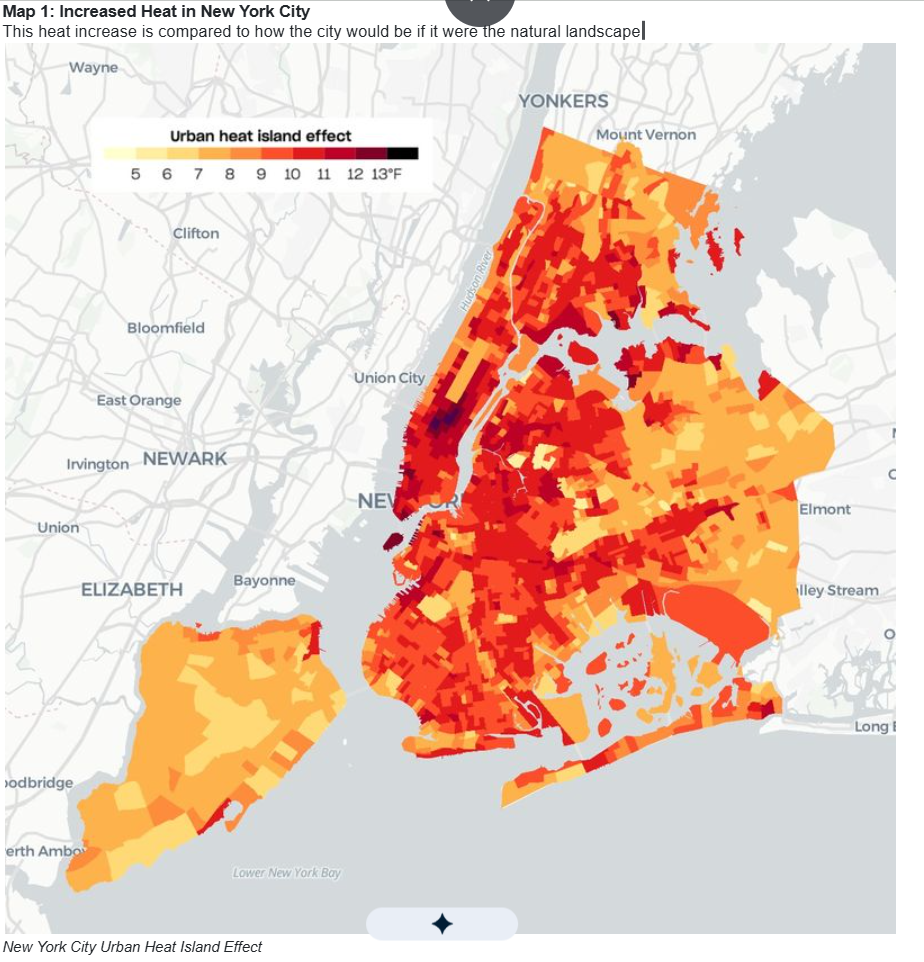

```{=html}
<style>
@import url('https://fonts.googleapis.com/css2?family=Space+Grotesk:wght@700&family=Inter:wght@400;600;800&display=swap');

.engage-box {
  background: linear-gradient(135deg, #00b894 0%, #1e6f5c 100%);
  color: white;
  padding: 25px;
  margin: 20px 0;
  border-radius: 15px;
  box-shadow: 0 10px 30px rgba(0, 184, 148, 0.3);
  border: none;
}
.engage-box h2 { font-family: 'Space Grotesk', sans-serif; font-size: 2em; margin-top: 0; }

.explore-box {
  background: linear-gradient(135deg, #f093fb 0%, #f5576c 100%);
  color: white;
  padding: 25px;
  margin: 20px 0;
  border-radius: 15px;
  box-shadow: 0 10px 30px rgba(240, 147, 251, 0.3);
}

.explain-box {
  background: linear-gradient(135deg, #4facfe 0%, #00f2fe 100%);
  color: #1a1a1a;
  padding: 25px;
  margin: 20px 0;
  border-radius: 15px;
  box-shadow: 0 10px 30px rgba(79, 172, 254, 0.3);
}

.elaborate-box {
  background: linear-gradient(135deg, #43e97b 0%, #38f9d7 100%);
  color: #1a1a1a;
  padding: 25px;
  margin: 20px 0;
  border-radius: 15px;
  box-shadow: 0 10px 30px rgba(67, 233, 123, 0.3);
}

.evaluate-box {
  background: linear-gradient(135deg, #fa709a 0%, #fee140 100%);
  color: #1a1a1a;
  padding: 25px;
  margin: 20px 0;
  border-radius: 15px;
  box-shadow: 0 10px 30px rgba(250, 112, 154, 0.3);
}

.check-understanding {
  background: linear-gradient(to right, #00b894, #1e6f5c);
  color: white;
  padding: 20px;
  margin: 20px 0;
  border-radius: 12px;
  border-left: 6px solid #fff;
}

.key-idea {
  background: linear-gradient(135deg, #ffecd2 0%, #fcb69f 100%);
  padding: 20px;
  margin: 20px 0;
  border-radius: 12px;
  border-left: 8px solid #ff6b6b;
  font-size: 1.1em;
}

.student-task {
  background: #fff3e0;
  border-left: 5px solid #ff9800;
  padding: 20px;
  margin: 15px 0;
  border-radius: 0 10px 10px 0;
}

.pe-badge {
  display: inline-block;
  background: linear-gradient(135deg, #00b894 0%, #1e6f5c 100%);
  color: white;
  padding: 8px 16px;
  border-radius: 20px;
  font-size: 13px;
  font-weight: 800;
  margin: 5px;
  box-shadow: 0 4px 15px rgba(0, 184, 148, 0.4);
  text-transform: uppercase;
  letter-spacing: 1px;
}

.big-question {
  font-family: 'Space Grotesk', sans-serif;
  font-size: 2.5em;
  font-weight: 800;
  background: linear-gradient(135deg, #00b894 0%, #1e6f5c 100%);
  -webkit-background-clip: text;
  -webkit-text-fill-color: transparent;
  margin: 30px 0 20px 0;
  text-align: center;
  animation: slideIn 0.8s ease-out;
}

.mind-blown {
  background: linear-gradient(135deg, #00b894 0%, #1e6f5c 100%);
  color: white;
  padding: 20px;
  margin: 20px 0;
  border-radius: 15px;
  font-size: 1.3em;
  font-weight: 700;
  text-align: center;
  box-shadow: 0 10px 25px rgba(0, 184, 148, 0.4);
}

@keyframes slideIn {
  from { opacity: 0; transform: translateY(-20px); }
  to { opacity: 1; transform: translateY(0); }
}

h1 {
  font-family: 'Space Grotesk', sans-serif !important;
  font-weight: 800 !important;
  font-size: 2.8em !important;
  margin-top: 40px !important;
}

h2 {
  font-family: 'Space Grotesk', sans-serif !important;
  font-weight: 700 !important;
  color: #00b894 !important;
}
</style>
```

<span class="pe-badge">HS-ESS3-3</span> <span class="pe-badge">HS-ETS1-4</span> <span class="pe-badge">Time: 6–8 Days</span> <a class="quiz-jump-btn" href="#evaluate">🧠 Quiz &amp; Evaluate ↓</a>

<div class="big-question">🌳 Land Use & Biodiversity: The Heat Is On 🌳</div>

# Engage: The Investigative Phenomenon

::: {.engage-box}
## 🌡️ 350 New Yorkers Die Every Year From Heat — and It's Not Random

<div style="font-size: 1.3em; font-weight: 700; text-align: center; margin: 20px 0; text-shadow: 2px 2px 4px rgba(0,0,0,0.3);">
350 New Yorkers die every year from the urban heat island effect. But the risk depends heavily on which neighborhood you live in.
</div>

**The Numbers:**

- 🌡️ NYC is **7°F (4°C) hotter** than surrounding rural areas in summer
- 🏥 **~2,000** heat-related ER visits per year
- ☀️ Currently **17 days** above 90°F per year — projected to be **39** by 2050
- 💰 Over **$100 million** in annual healthcare costs from heat

### 🤔 Driving Questions
- Why are cities so much hotter than surrounding areas?
- Why does heat kill more people in some neighborhoods than others?
- What can we do to cool cities down and save lives?
:::

```{ojs}
//| echo: false
Plot = require("@observablehq/plot")
d3 = require("d3@7")
```

```{ojs}
//| echo: false
neighborhoodData = [
  {name: "East Harlem", hvi: 5, income: 36000, greenSpace: 8, deaths: 18},
  {name: "South Bronx", hvi: 5, income: 28000, greenSpace: 6, deaths: 21},
  {name: "Brownsville", hvi: 5, income: 31000, greenSpace: 5, deaths: 19},
  {name: "Upper East Side", hvi: 1, income: 138000, greenSpace: 22, deaths: 3},
  {name: "Brooklyn Heights", hvi: 2, income: 125000, greenSpace: 18, deaths: 5},
  {name: "Park Slope", hvi: 1, income: 145000, greenSpace: 25, deaths: 2}
]

Plot.plot({
  title: "NYC Heat Vulnerability: Income vs. Heat Deaths by Neighborhood",
  subtitle: "Color = Heat Vulnerability Index (1=low, 5=high). Size = % Green Space",
  width: 750,
  height: 450,
  x: {label: "Median Household Income ($)", domain: [20000, 160000]},
  y: {label: "Heat-Related Deaths per 100,000", domain: [0, 25]},
  r: {domain: [3, 30], range: [6, 35]},
  color: {
    domain: [1, 2, 3, 4, 5],
    scheme: "YlOrRd",
    legend: true,
    label: "Heat Vulnerability Index"
  },
  marks: [
    Plot.dot(neighborhoodData, {
      x: "income",
      y: "deaths",
      r: "greenSpace",
      fill: "hvi",
      stroke: "#2d3436",
      strokeWidth: 1.5
    ,
        tip: true}),
    Plot.text(neighborhoodData, {
      x: "income",
      y: "deaths",
      text: "name",
      dy: -20,
      fontSize: 11,
      fontWeight: "bold"
    })
  ]
})
```

<div class="mind-blown">
🤯 Low-income neighborhoods with less green space have up to 10× more heat-related deaths than wealthy neighborhoods just a few miles away. The heat isn't equal — and neither are the consequences.
</div>

::: {.student-task}
### 📝 Analyze the Pattern

1. What's the relationship between **income** and heat-related deaths?
2. What's the relationship between **green space** (bubble size) and heat deaths?
3. Why do you think the South Bronx (6% green space, $28K income) has so many more heat deaths than Park Slope (25% green space, $145K income)?
4. Is this a **coincidence** or a **pattern**? What additional data would you want to see?
:::

## 🌳 NYC Tree Canopy Cover — Interactive Map

Tree **canopy cover** — the percentage of land shaded by tree leaves — is one of the most direct measures of urban green space. Across NYC's 59 community districts it ranges from under 6% in dense Lower Manhattan to nearly 50% in parts of Staten Island.

- **Hover** over any district to see its name and exact canopy percentage
- Notice how canopy cover strongly mirrors the income and heat vulnerability patterns above
- Compare the **South Bronx** (~12%) vs. **Riverdale** (~40%) — same borough, very different outcomes

> *Data: NYC Parks Department 2017 Tree Canopy Assessment. Values shown by community district.*

```{ojs}
//| echo: false
canopyCD = [
  // Manhattan
  {cd: "101", name: "Financial District/Battery Park City", borough: "Manhattan", pct: 6.1},
  {cd: "102", name: "Greenwich Village/SoHo", borough: "Manhattan", pct: 8.3},
  {cd: "103", name: "Lower East Side/Chinatown", borough: "Manhattan", pct: 5.4},
  {cd: "104", name: "Chelsea/Hell's Kitchen", borough: "Manhattan", pct: 9.2},
  {cd: "105", name: "Murray Hill/Midtown East", borough: "Manhattan", pct: 7.1},
  {cd: "106", name: "Clinton/Midtown West", borough: "Manhattan", pct: 8.4},
  {cd: "107", name: "Upper West Side", borough: "Manhattan", pct: 22.3},
  {cd: "108", name: "Upper East Side", borough: "Manhattan", pct: 18.7},
  {cd: "109", name: "Hamilton Heights/Morningside Heights", borough: "Manhattan", pct: 24.1},
  {cd: "110", name: "Central Harlem", borough: "Manhattan", pct: 15.2},
  {cd: "111", name: "East Harlem", borough: "Manhattan", pct: 11.8},
  {cd: "112", name: "Washington Heights/Inwood", borough: "Manhattan", pct: 32.4},
  // Bronx
  {cd: "201", name: "Mott Haven/Port Morris", borough: "Bronx", pct: 12.1},
  {cd: "202", name: "Hunts Point/Longwood", borough: "Bronx", pct: 14.3},
  {cd: "203", name: "Morrisania/Crotona", borough: "Bronx", pct: 17.6},
  {cd: "204", name: "Concourse/Highbridge", borough: "Bronx", pct: 19.2},
  {cd: "205", name: "Morris Heights/Fordham SW", borough: "Bronx", pct: 22.4},
  {cd: "206", name: "East Tremont/Belmont", borough: "Bronx", pct: 24.8},
  {cd: "207", name: "Bedford Park/Kingsbridge Heights", borough: "Bronx", pct: 27.3},
  {cd: "208", name: "Riverdale/Kingsbridge", borough: "Bronx", pct: 40.2},
  {cd: "209", name: "Soundview/Parkchester", borough: "Bronx", pct: 22.7},
  {cd: "210", name: "Throgs Neck/Co-op City", borough: "Bronx", pct: 35.1},
  {cd: "211", name: "Pelham Pkwy/Morris Park", borough: "Bronx", pct: 32.6},
  {cd: "212", name: "Williamsbridge/Baychester", borough: "Bronx", pct: 38.4},
  // Brooklyn
  {cd: "301", name: "Williamsburg/Greenpoint", borough: "Brooklyn", pct: 10.2},
  {cd: "302", name: "Brooklyn Heights/Fort Greene", borough: "Brooklyn", pct: 14.7},
  {cd: "303", name: "Bedford-Stuyvesant", borough: "Brooklyn", pct: 18.3},
  {cd: "304", name: "Bushwick", borough: "Brooklyn", pct: 12.4},
  {cd: "305", name: "East New York/Starrett City", borough: "Brooklyn", pct: 16.1},
  {cd: "306", name: "Park Slope/Carroll Gardens", borough: "Brooklyn", pct: 25.4},
  {cd: "307", name: "Sunset Park", borough: "Brooklyn", pct: 18.9},
  {cd: "308", name: "Crown Heights North", borough: "Brooklyn", pct: 20.3},
  {cd: "309", name: "Crown Heights South", borough: "Brooklyn", pct: 24.1},
  {cd: "310", name: "Bay Ridge/Dyker Heights", borough: "Brooklyn", pct: 26.8},
  {cd: "311", name: "Bensonhurst/Bath Beach", borough: "Brooklyn", pct: 20.1},
  {cd: "312", name: "Borough Park", borough: "Brooklyn", pct: 18.4},
  {cd: "313", name: "Coney Island/Brighton Beach", borough: "Brooklyn", pct: 10.7},
  {cd: "314", name: "Flatbush/Midwood", borough: "Brooklyn", pct: 22.6},
  {cd: "315", name: "Sheepshead Bay/Gravesend", borough: "Brooklyn", pct: 26.3},
  {cd: "316", name: "Brownsville", borough: "Brooklyn", pct: 14.2},
  {cd: "317", name: "East Flatbush/Rugby", borough: "Brooklyn", pct: 22.1},
  {cd: "318", name: "Canarsie/Flatlands", borough: "Brooklyn", pct: 28.7},
  // Queens
  {cd: "401", name: "Astoria/Long Island City", borough: "Queens", pct: 16.3},
  {cd: "402", name: "Sunnyside/Woodside", borough: "Queens", pct: 20.1},
  {cd: "403", name: "Jackson Heights/North Corona", borough: "Queens", pct: 18.4},
  {cd: "404", name: "Elmhurst/South Corona", borough: "Queens", pct: 22.7},
  {cd: "405", name: "Ridgewood/Maspeth", borough: "Queens", pct: 24.3},
  {cd: "406", name: "Rego Park/Forest Hills", borough: "Queens", pct: 28.6},
  {cd: "407", name: "Flushing/Clearview", borough: "Queens", pct: 26.4},
  {cd: "408", name: "Fresh Meadows/Hillcrest", borough: "Queens", pct: 30.2},
  {cd: "409", name: "Woodhaven/Richmond Hill", borough: "Queens", pct: 28.1},
  {cd: "410", name: "Howard Beach/Ozone Park", borough: "Queens", pct: 24.8},
  {cd: "411", name: "Bayside/Douglaston/Little Neck", borough: "Queens", pct: 36.4},
  {cd: "412", name: "Jamaica/Hollis/St. Albans", borough: "Queens", pct: 28.3},
  {cd: "413", name: "Queens Village/Rosedale", borough: "Queens", pct: 34.7},
  {cd: "414", name: "The Rockaways", borough: "Queens", pct: 18.2},
  // Staten Island
  {cd: "501", name: "St. George/Stapleton", borough: "Staten Island", pct: 36.2},
  {cd: "502", name: "South Beach/Mid-Island", borough: "Staten Island", pct: 42.8},
  {cd: "503", name: "Tottenville/Great Kills", borough: "Staten Island", pct: 47.6}
]
```

```{ojs}
//| echo: false
cdGeo = fetch(
  "https://data.cityofnewyork.us/api/geospatial/jp9i-3b7y?method=export&type=GeoJSON"
).then(r => r.json())
```

```{ojs}
//| echo: false
{
  const width = 680;
  const height = 520;
  const cdLookup = Object.fromEntries(canopyCD.map(d => [d.cd, d]));

  // 5-bin threshold scale matching the reference image
  const colorScale = d3.scaleThreshold()
    .domain([10, 20, 30, 40])
    .range(["#d4edda", "#82c58b", "#3a9347", "#1e6f2d", "#0d3d17"]);

  const projection = d3.geoMercator().fitSize([width, height], cdGeo);
  const pathGen = d3.geoPath().projection(projection);

  // Outer container for relative tooltip positioning
  const container = document.createElement("div");
  container.style.cssText = "position:relative;max-width:100%;";

  const svg = d3.create("svg")
    .attr("viewBox", `0 0 ${width} ${height}`)
    .attr("width", "100%")
    .style("font-family", "Inter, sans-serif")
    .style("background", "#c9dff0")
    .style("border-radius", "12px");

  // Draw each community district
  const districts = svg.selectAll("path.cd")
    .data(cdGeo.features)
    .join("path")
    .attr("class", "cd")
    .attr("d", pathGen)
    .attr("fill", d => {
      const key = String(parseInt(d.properties.boro_cd ?? "0"));
      return colorScale(cdLookup[key]?.pct ?? 0);
    })
    .attr("stroke", "white")
    .attr("stroke-width", 0.6)
    .attr("cursor", "pointer");

  // Hover tooltip
  const tip = document.createElement("div");
  tip.style.cssText = [
    "position:absolute",
    "background:rgba(10,10,10,0.88)",
    "color:#fff",
    "padding:9px 13px",
    "border-radius:8px",
    "font-size:13px",
    "pointer-events:none",
    "display:none",
    "max-width:210px",
    "line-height:1.55",
    "box-shadow:0 4px 14px rgba(0,0,0,0.45)",
    "z-index:10"
  ].join(";");
  container.appendChild(tip);

  districts
    .on("mousemove", function(event, d) {
      const key = String(parseInt(d.properties.boro_cd ?? "0"));
      const info = cdLookup[key];
      if (!info) return;
      d3.select(this).attr("stroke", "#222").attr("stroke-width", 1.8);
      const rect = container.getBoundingClientRect();
      tip.style.display = "block";
      tip.style.left = (event.clientX - rect.left + 14) + "px";
      tip.style.top  = (event.clientY - rect.top  - 48) + "px";
      tip.innerHTML =
        `<strong style="font-size:14px">${info.name}</strong><br>` +
        `<span style="color:#82c58b">🌳 ${info.pct}% canopy cover</span><br>` +
        `<span style="color:#aaa;font-size:11px">${info.borough}</span>`;
    })
    .on("mouseleave", function() {
      d3.select(this).attr("stroke", "white").attr("stroke-width", 0.6);
      tip.style.display = "none";
    });

  // Legend box
  const legendItems = [
    {label: "0 – 10 %",  color: "#d4edda"},
    {label: "10 – 20 %", color: "#82c58b"},
    {label: "20 – 30 %", color: "#3a9347"},
    {label: "30 – 40 %", color: "#1e6f2d"},
    {label: "40 – 51 %", color: "#0d3d17"}
  ];

  const lg = svg.append("g").attr("transform", "translate(14,14)");
  lg.append("rect")
    .attr("width", 152).attr("height", 148)
    .attr("rx", 8).attr("fill", "white").attr("opacity", 0.91);
  lg.append("text")
    .attr("x", 10).attr("y", 22)
    .attr("font-size", "12.5px").attr("font-weight", "700").attr("fill", "#111")
    .text("Canopy Cover, 2017");

  legendItems.forEach((item, i) => {
    const row = lg.append("g").attr("transform", `translate(10,${36 + i * 22})`);
    row.append("rect")
      .attr("width", 16).attr("height", 14).attr("rx", 2)
      .attr("fill", item.color).attr("stroke", "#999").attr("stroke-width", 0.5);
    row.append("text")
      .attr("x", 24).attr("y", 11)
      .attr("font-size", "12px").attr("fill", "#333")
      .text(item.label);
  });

  container.appendChild(svg.node());
  return container;
}
```

::: {.check-understanding}
### ✅ Check for Understanding

```{ojs}
//| echo: false
{
  const questions = [
    {
      q: "Which borough has the LOWEST average tree canopy cover?",
      choices: ["Staten Island", "The Bronx", "Manhattan", "Queens"],
      correct: 2,
      explain: "Manhattan's dense urban core means most community districts have less than 10% canopy — the lowest of any borough."
    },
    {
      q: "A neighborhood has 5% canopy cover. Based on earlier data, what would you predict about its heat-related death rate?",
      choices: [
        "Lower than average — less shade means less moisture retention",
        "Higher than average — low canopy means more heat absorption and less cooling",
        "About the same — canopy cover doesn't affect temperature",
        "It depends only on building density"
      ],
      correct: 1,
      explain: "Low canopy = more impervious surfaces, more heat absorption, less evapotranspiration cooling → higher surface temps and more heat stress."
    }
  ];

  const div = document.createElement("div");
  div.style.cssText = "display:flex;flex-direction:column;gap:18px;";

  questions.forEach((item, qi) => {
    const block = document.createElement("div");
    block.innerHTML = `<p style="font-weight:700;margin:0 0 8px">${qi + 1}. ${item.q}</p>`;
    const fb = document.createElement("p");
    fb.style.cssText = "margin:8px 0 0;padding:10px;border-radius:6px;display:none;font-size:13px;";

    item.choices.forEach((c, ci) => {
      const btn = document.createElement("button");
      btn.textContent = c;
      btn.style.cssText = "display:block;width:100%;text-align:left;margin:4px 0;padding:8px 12px;border-radius:6px;border:1.5px solid rgba(255,255,255,0.4);background:rgba(255,255,255,0.15);color:white;cursor:pointer;font-size:13px;min-height:44px;";
      btn.onclick = () => {
        block.querySelectorAll("button").forEach(b => b.disabled = true);
        if (ci === item.correct) {
          btn.style.background = "rgba(0,200,100,0.35)";
          btn.style.border = "1.5px solid #00c864";
          fb.style.background = "rgba(0,200,100,0.2)";
          fb.innerHTML = "✅ Correct! " + item.explain;
        } else {
          btn.style.background = "rgba(255,80,80,0.3)";
          btn.style.border = "1.5px solid #ff5050";
          fb.style.background = "rgba(255,80,80,0.15)";
          fb.innerHTML = "❌ Not quite. " + item.explain;
        }
        fb.style.display = "block";
      };
      block.appendChild(btn);
    });

    block.appendChild(fb);
    div.appendChild(block);
  });

  return div;
}
```
:::

# Explore: How Did NYC Get So Hot?

::: {.explore-box}
## 🔬 400 Years of Land Use Change: From Forests to Concrete

Manhattan was once covered in forests, wetlands, and streams. Over 400 years, nearly all of it was replaced with buildings, asphalt, and concrete. That transformation created the heat island effect you see today.
:::

## Manhattan's Transformation

```{ojs}
//| echo: false
landCover = [
  {year: "1609\n(Pre-colonial)", forest: 70, wetland: 15, water: 10, agriculture: 0, urban: 0},
  {year: "1800", forest: 30, wetland: 10, water: 8, agriculture: 35, urban: 15},
  {year: "1900", forest: 5, wetland: 3, water: 6, agriculture: 5, urban: 80},
  {year: "2020", forest: 3, wetland: 0.5, water: 5, agriculture: 0, urban: 91}
]

landLong = landCover.flatMap(d => [
  {year: d.year, type: "Forest", pct: d.forest},
  {year: d.year, type: "Wetland", pct: d.wetland},
  {year: d.year, type: "Urban/Built", pct: d.urban},
  {year: d.year, type: "Agriculture", pct: d.agriculture},
  {year: d.year, type: "Water", pct: d.water}
])

Plot.plot({
  title: "Manhattan Land Cover Change (1609–2020)",
  subtitle: "From 70% forest to 91% concrete and buildings",
  width: 750,
  height: 420,
  x: {label: null},
  y: {label: "% of Land Area", domain: [0, 100]},
  color: {
    domain: ["Forest", "Wetland", "Water", "Agriculture", "Urban/Built"],
    range: ["#00b894", "#74b9ff", "#0984e3", "#fdcb6e", "#636e72"],
    legend: true
  },
  marks: [
    Plot.barY(landLong, Plot.stackY({
      x: "year",
      y: "pct",
      fill: "type",
      order: "appearance"
    ,
        tip: true})),
    Plot.ruleY([0])
  ]
})
```

## Why Does This Make Cities Hotter?

Different surfaces absorb and reflect very different amounts of sunlight. Use the slider to see how surface type affects temperature:

```{ojs}
//| echo: false
viewof surfaceMix = Inputs.range([0, 100], {label: "% of area covered by vegetation (vs. asphalt/buildings)", step: 5, value: 10})
```

```{ojs}
//| echo: false
{
  const asphaltPct = 100 - surfaceMix;
  // Surface temperature model
  const avgAlbedo = (surfaceMix / 100) * 0.22 + (asphaltPct / 100) * 0.08;
  const evaporativeCooling = (surfaceMix / 100) * 15; // degrees F cooling from transpiration
  const baseTemp = 95; // baseline ambient temp
  const surfaceTemp = baseTemp + (1 - avgAlbedo) * 80 - evaporativeCooling;
  const airTemp = baseTemp + (surfaceTemp - baseTemp) * 0.3 - evaporativeCooling * 0.5;
  const heatDeaths = Math.max(0, (airTemp - 85) * 2.5); // per 100K

  const surfaces = [
    {type: "Fresh Asphalt", albedo: 0.05, peakTemp: 160, color: "#2d3436"},
    {type: "Dark Roof", albedo: 0.08, peakTemp: 170, color: "#636e72"},
    {type: "Concrete", albedo: 0.20, peakTemp: 130, color: "#b2bec3"},
    {type: "Grass", albedo: 0.25, peakTemp: 95, color: "#00b894"},
    {type: "Tree Canopy", albedo: 0.18, peakTemp: 85, color: "#1e6f5c"},
    {type: "Cool Roof", albedo: 0.70, peakTemp: 107, color: "#dfe6e9"}
  ];

  const width = 750;
  const height = 380;
  const svg = d3.create("svg").attr("width", width).attr("height", height);

  svg.append("rect").attr("width", width).attr("height", height).attr("fill", "#f8f9fa").attr("rx", 12);

  // Title
  svg.append("text").attr("x", width/2).attr("y", 25).attr("text-anchor", "middle")
    .attr("font-size", 16).attr("font-weight", "bold")
    .text(`Your Mix: ${surfaceMix}% Vegetation / ${asphaltPct}% Built Surface`);

  // Temperature display
  const tempColor = airTemp > 95 ? "#d63031" : airTemp > 90 ? "#e17055" : airTemp > 85 ? "#fdcb6e" : "#00b894";
  svg.append("rect").attr("x", 50).attr("y", 45).attr("width", 300).attr("height", 70)
    .attr("fill", tempColor).attr("rx", 12).attr("opacity", 0.9);
  svg.append("text").attr("x", 200).attr("y", 72).attr("text-anchor", "middle")
    .attr("font-size", 14).attr("fill", "white").attr("font-weight", "bold").text("Estimated Air Temperature");
  svg.append("text").attr("x", 200).attr("y", 100).attr("text-anchor", "middle")
    .attr("font-size", 24).attr("fill", "white").attr("font-weight", "bold").text(`${airTemp.toFixed(1)}°F`);

  // Health impact
  svg.append("rect").attr("x", 400).attr("y", 45).attr("width", 300).attr("height", 70)
    .attr("fill", heatDeaths > 15 ? "#d63031" : heatDeaths > 5 ? "#e17055" : "#00b894").attr("rx", 12).attr("opacity", 0.9);
  svg.append("text").attr("x", 550).attr("y", 72).attr("text-anchor", "middle")
    .attr("font-size", 14).attr("fill", "white").attr("font-weight", "bold").text("Est. Heat Deaths per 100K");
  svg.append("text").attr("x", 550).attr("y", 100).attr("text-anchor", "middle")
    .attr("font-size", 24).attr("fill", "white").attr("font-weight", "bold").text(`${heatDeaths.toFixed(1)}`);

  // Surface comparison bars
  svg.append("text").attr("x", 15).attr("y", 145).attr("font-size", 13).attr("font-weight", "bold").text("Peak Surface Temperatures by Material:");

  surfaces.forEach((s, i) => {
    const y = 160 + i * 32;
    const barWidth = (s.peakTemp / 180) * 400;
    svg.append("text").attr("x", 15).attr("y", y + 15).attr("font-size", 11).attr("font-weight", "bold").text(s.type);
    svg.append("rect").attr("x", 130).attr("y", y + 2).attr("width", barWidth).attr("height", 20)
      .attr("fill", s.color).attr("rx", 4).attr("opacity", 0.8);
    svg.append("text").attr("x", 135 + barWidth).attr("y", y + 16).attr("font-size", 11)
      .attr("font-weight", "bold").text(`${s.peakTemp}°F (albedo: ${s.albedo})`);
  });

  return svg.node();
}
```

::: {.student-task}
### 📝 Investigate the Heat Island

Use the slider above:

1. Set vegetation to **85%** (like pre-colonial Manhattan). What's the estimated air temperature and death rate?
2. Set vegetation to **10%** (like modern Manhattan). How much hotter is it? How many more deaths?
3. At what vegetation percentage does the death rate drop to near zero?
4. Why does dark asphalt reach **160°F** while tree canopy stays at **85°F**? (Hint: think about albedo AND evapotranspiration)
5. In your own words, explain the two mechanisms that make cities hotter than forests.
:::

::: {.key-idea}
### 💡 Key Concept: Two Mechanisms of Urban Heat

Cities are hotter than natural areas for two main reasons:

1. **Low albedo (high absorption):** Dark surfaces like asphalt and rooftops absorb 80–95% of incoming solar radiation, converting it to heat. Natural surfaces reflect more sunlight.

2. **No evaporative cooling:** Trees and plants release water through transpiration, which cools the air (like sweating). Concrete and asphalt can't do this, so all that absorbed energy stays as heat.

Together, these create an **urban heat island** that can be 5–10°F hotter during the day and up to 22°F hotter at night.
:::

## 🗺️ NYC Urban Heat Island Map — Explore the Data

Hover over the **colored markers** on the map to see heat vulnerability data for each neighborhood. Darker red areas = hotter temperatures compared to surrounding rural land.

```{ojs}
//| echo: false
{
  const neighborhoods = [
    {name: "South Bronx",     x: 0.635, y: 0.195, hvi: 5, income: 28000, greenSpace: 6,  deaths: 21, color: "#8B0000"},
    {name: "East Harlem",     x: 0.570, y: 0.295, hvi: 5, income: 36000, greenSpace: 8,  deaths: 18, color: "#CC2200"},
    {name: "Upper East Side", x: 0.610, y: 0.360, hvi: 1, income: 138000, greenSpace: 22, deaths: 3, color: "#00AA44"},
    {name: "Brooklyn Heights",x: 0.510, y: 0.625, hvi: 2, income: 125000, greenSpace: 18, deaths: 5, color: "#22BB66"},
    {name: "Park Slope",      x: 0.480, y: 0.675, hvi: 1, income: 145000, greenSpace: 25, deaths: 2, color: "#00CC55"},
    {name: "Brownsville",     x: 0.660, y: 0.680, hvi: 5, income: 31000,  greenSpace: 5,  deaths: 19, color: "#990000"}
  ];

  const wrapper = html`<div style="position:relative; display:inline-block; width:100%; max-width:780px; font-family: Inter, sans-serif;">
    
    <svg id="hvi-overlay" viewBox="0 0 100 100" preserveAspectRatio="none"
         style="position:absolute;top:0;left:0;width:100%;height:100%;overflow:visible;"></svg>
    <div id="hvi-tooltip" style="
      position:absolute; display:none; pointer-events:none; z-index:20;
      background:rgba(10,10,10,0.88); color:#fff; padding:14px 18px;
      border-radius:10px; font-size:13px; min-width:210px;
      border-left:4px solid #00b894; backdrop-filter:blur(6px);
      line-height:1.6; box-shadow:0 4px 20px rgba(0,0,0,0.4);
    "></div>
  </div>`;

  const svg   = wrapper.querySelector("#hvi-overlay");
  const tip   = wrapper.querySelector("#hvi-tooltip");
  const img   = wrapper.querySelector("img");

  const NS = "http://www.w3.org/2000/svg";

  neighborhoods.forEach(n => {
    const g = document.createElementNS(NS, "g");
    g.style.cursor = "pointer";

    // Outer pulse ring
    const ring = document.createElementNS(NS, "circle");
    ring.setAttribute("cx", n.x * 100);
    ring.setAttribute("cy", n.y * 100);
    ring.setAttribute("r",  "3.2");
    ring.setAttribute("fill", "none");
    ring.setAttribute("stroke", n.color);
    ring.setAttribute("stroke-width", "1");
    ring.setAttribute("opacity", "0.55");

    // Solid marker
    const dot = document.createElementNS(NS, "circle");
    dot.setAttribute("cx", n.x * 100);
    dot.setAttribute("cy", n.y * 100);
    dot.setAttribute("r",  "2.2");
    dot.setAttribute("fill", n.color);
    dot.setAttribute("stroke", "#fff");
    dot.setAttribute("stroke-width", "0.6");

    g.appendChild(ring);
    g.appendChild(dot);
    svg.appendChild(g);

    const hviBar = Array.from({length: 5}, (_, i) =>
      `<span style="color:${i < n.hvi ? '#ff6b6b' : '#555'}; font-size:14px;">■</span>`
    ).join("");

    g.addEventListener("mouseenter", () => {
      dot.setAttribute("r", "3.0");
      ring.setAttribute("r", "4.5");
      tip.style.display = "block";
      tip.innerHTML = `
        <strong style="font-size:15px; display:block; margin-bottom:6px;">${n.name}</strong>
        🌡️ Heat Vulnerability: ${hviBar} ${n.hvi}/5<br/>
        💀 Heat Deaths: <strong>${n.deaths}</strong> per 100K residents<br/>
        💵 Median Income: <strong>$${n.income.toLocaleString()}</strong><br/>
        🌳 Green Space: <strong>${n.greenSpace}%</strong>
      `;
    });

    g.addEventListener("mouseleave", () => {
      dot.setAttribute("r", "2.2");
      ring.setAttribute("r", "3.2");
      tip.style.display = "none";
    });

    g.addEventListener("mousemove", e => {
      const rect = wrapper.getBoundingClientRect();
      const x = e.clientX - rect.left;
      const y = e.clientY - rect.top;
      tip.style.left = (x + 14 + 210 > rect.width ? x - 224 : x + 14) + "px";
      tip.style.top  = Math.max(0, y - 20) + "px";
    });
  });

  // Legend
  const legend = html`<div style="
    display:flex; flex-wrap:wrap; gap:10px; margin-top:10px;
    font-size:12px; color:#ccc; align-items:center;
  ">
    <span style="font-weight:700; color:#eee; margin-right:4px;">Neighborhoods:</span>
    ${neighborhoods.map(n => `
      <span style="display:inline-flex; align-items:center; gap:5px; background:#1a1a2e;
        padding:4px 10px; border-radius:20px; color:#eee;">
        <span style="width:10px;height:10px;border-radius:50%;background:${n.color};display:inline-block;"></span>
        ${n.name}
      </span>
    `).join("")}
  </div>`;

  const outer = html`<div style="max-width:780px; margin: 0 auto 24px auto;">${wrapper}${legend}</div>`;
  return outer;
}
```

## 🏙️ Explore NYC Zoning & Land Use — Interactive Map

Use the live **ZoLa** map (NYC Planning Labs) to explore how land is officially zoned across New York City. Toggle layers to see residential, commercial, and manufacturing zones — and compare them to the heat vulnerability patterns above.

```{=html}
<div style="
  max-width: 780px;
  margin: 0 auto 28px auto;
  border-radius: 14px;
  overflow: hidden;
  box-shadow: 0 8px 32px rgba(0,0,0,0.22);
  border: 2px solid #00b894;
">
  <div style="
    background: linear-gradient(135deg, #00b894 0%, #1e6f5c 100%);
    color: white;
    padding: 12px 20px;
    font-family: 'Space Grotesk', sans-serif;
    font-weight: 700;
    font-size: 1.05em;
    display: flex;
    align-items: center;
    gap: 10px;
  ">
    <span>🗺️ ZoLa — NYC Zoning &amp; Land Use Map</span>
    <a href="https://zola.planninglabs.nyc/#9.72/40.7125/-73.733"
       target="_blank"
       rel="noopener"
       style="margin-left:auto; font-size:12px; color:rgba(255,255,255,0.85);
              text-decoration:none; border:1px solid rgba(255,255,255,0.5);
              padding:3px 10px; border-radius:20px;">
      Open full screen ↗
    </a>
  </div>
  <iframe
    src="https://zola.planninglabs.nyc/#9.72/40.7125/-73.733"
    width="100%"
    height="540"
    style="display:block; border:none;"
    title="ZoLa — NYC Zoning and Land Use Interactive Map"
    loading="lazy"
    allowfullscreen>
  </iframe>
  <div style="
    background:#0d1117; color:#8b949e;
    padding: 8px 16px; font-size: 12px;
    font-family: Inter, sans-serif;
  ">
    Source: <a href="https://zola.planninglabs.nyc/" target="_blank" rel="noopener"
      style="color:#00b894;">NYC Planning Labs — ZoLa</a>.
    Use the layer panel (☰) to toggle zoning districts, land use colors, and building footprints.
  </div>
</div>
```

# Explain 1: Building a Computational Model

::: {.explain-box}
## 🧠 Modeling the Relationship Between Land Use and Heat Deaths

Now that you understand WHY cities are hotter, let's build a model that connects land use → temperature → health outcomes. This will help you test which solutions work best.
:::

```{ojs}
//| echo: false
viewof modelImperv = Inputs.range([0, 95], {label: "% Impervious surface (asphalt, concrete, buildings)", step: 5, value: 85})
```

```{ojs}
//| echo: false
viewof modelVeg = Inputs.range([0, 60], {label: "% Vegetation cover", step: 5, value: 10})
```

```{ojs}
//| echo: false
viewof modelPop = Inputs.range([1000, 80000], {label: "Population density (people per sq mi)", step: 1000, value: 27000})
```

```{ojs}
//| echo: false
{
  const remaining = 100 - modelImperv - modelVeg;
  const tempIncrease = (modelImperv / 100) * 12 - (modelVeg / 100) * 8;
  const baseTemp = 82;
  const localTemp = baseTemp + tempIncrease;
  const heatIndex = localTemp + (localTemp > 90 ? (localTemp - 90) * 0.5 : 0);
  const deathRate = Math.max(0, (heatIndex - 85) * 2);
  const totalDeaths = (deathRate / 100000) * modelPop * 10; // approximate for an area

  const scenarios = [
    {label: "Pre-colonial (1609)", imperv: 0, veg: 85, temp: 82},
    {label: "Early urban (1800)", imperv: 40, veg: 35, temp: 82 + 40*0.12 - 35*0.08},
    {label: "Industrial (1950)", imperv: 70, veg: 15, temp: 82 + 70*0.12 - 15*0.08},
    {label: "YOUR SCENARIO", imperv: modelImperv, veg: modelVeg, temp: localTemp}
  ];

  const width = 750;
  const height = 400;
  const svg = d3.create("svg").attr("width", width).attr("height", height);

  svg.append("rect").attr("width", width).attr("height", height).attr("fill", "#f0f4ff").attr("rx", 12);
  svg.append("text").attr("x", width/2).attr("y", 25).attr("text-anchor", "middle")
    .attr("font-size", 16).attr("font-weight", "bold").text("Your Land Use → Temperature → Health Model");

  // Three gauges
  const gauges = [
    {label: "Temperature", value: `${localTemp.toFixed(1)}°F`, sub: `(+${tempIncrease.toFixed(1)}°F from baseline)`,
     color: localTemp > 95 ? "#d63031" : localTemp > 90 ? "#e17055" : localTemp > 85 ? "#fdcb6e" : "#00b894"},
    {label: "Heat Index", value: `${heatIndex.toFixed(1)}°F`, sub: heatIndex > 100 ? "⚠️ DANGEROUS" : heatIndex > 90 ? "⚠️ Caution" : "✅ OK",
     color: heatIndex > 100 ? "#d63031" : heatIndex > 90 ? "#e17055" : "#00b894"},
    {label: "Est. Heat Deaths/100K", value: `${deathRate.toFixed(1)}`, sub: `≈ ${totalDeaths.toFixed(0)} deaths in this area`,
     color: deathRate > 15 ? "#d63031" : deathRate > 5 ? "#e17055" : "#00b894"}
  ];

  gauges.forEach((g, i) => {
    const x = 50 + i * 240;
    svg.append("rect").attr("x", x).attr("y", 45).attr("width", 210).attr("height", 90)
      .attr("fill", g.color).attr("rx", 12).attr("opacity", 0.9);
    svg.append("text").attr("x", x + 105).attr("y", 70).attr("text-anchor", "middle")
      .attr("font-size", 13).attr("fill", "white").attr("font-weight", "bold").text(g.label);
    svg.append("text").attr("x", x + 105).attr("y", 100).attr("text-anchor", "middle")
      .attr("font-size", 22).attr("fill", "white").attr("font-weight", "bold").text(g.value);
    svg.append("text").attr("x", x + 105).attr("y", 125).attr("text-anchor", "middle")
      .attr("font-size", 11).attr("fill", "white").text(g.sub);
  });

  // Historical comparison chart
  svg.append("text").attr("x", 15).attr("y", 170).attr("font-size", 13).attr("font-weight", "bold")
    .text("Historical Comparison:");

  scenarios.forEach((s, i) => {
    const y = 185 + i * 48;
    const barWidth = Math.max(0, (s.temp - 75) / 25 * 500);
    const isYou = s.label === "YOUR SCENARIO";

    svg.append("text").attr("x", 15).attr("y", y + 16).attr("font-size", 11)
      .attr("font-weight", isYou ? "bold" : "normal").text(s.label);

    svg.append("rect").attr("x", 180).attr("y", y + 2).attr("width", 500).attr("height", 25)
      .attr("fill", "#dfe6e9").attr("rx", 4);
    svg.append("rect").attr("x", 180).attr("y", y + 2).attr("width", Math.min(barWidth, 500)).attr("height", 25)
      .attr("fill", s.temp > 92 ? "#d63031" : s.temp > 87 ? "#e17055" : "#00b894")
      .attr("rx", 4).attr("opacity", 0.8);
    svg.append("text").attr("x", 185 + Math.min(barWidth, 500)).attr("y", y + 19)
      .attr("font-size", 12).attr("font-weight", "bold").text(`${s.temp.toFixed(1)}°F`);
  });

  return svg.node();
}
```

::: {.student-task}
### 📝 Run Your Model

Test these scenarios and record the results:

| Scenario | Impervious % | Vegetation % | Temperature | Heat Deaths/100K |
|---|---|---|---|---|
| Pre-colonial (0% imperv, 85% veg) | 0 | 85 | | |
| Early urban (40% imperv, 35% veg) | 40 | 35 | | |
| Current NYC (85% imperv, 10% veg) | 85 | 10 | | |
| Future: no intervention (90%, 8%) | 90 | 8 | | |
| Future: WITH green intervention | ? | ? | | |

For the last row, find a combination that keeps the area urban but reduces heat deaths by at least half.
:::

# Explain 2: Can Urban Greening Fix This?

::: {.explain-box}
## 🧠 Testing Solutions in Your Model

NYC has already tried urban greening. The MillionTreesNYC program planted 1 million trees by 2017. But was it enough? Let's test it — and see what more could be done.
:::

```{ojs}
//| echo: false
viewof treesPlanted = Inputs.range([0, 3000000], {label: "🌳 Trees planted city-wide", step: 100000, value: 1000000})
```

```{ojs}
//| echo: false
viewof coolRoofPct = Inputs.range([0, 100], {label: "🏠 % of rooftops converted to cool/green roofs", step: 5, value: 10})
```

```{ojs}
//| echo: false
viewof parkExpansion = Inputs.range([0, 30], {label: "🌿 New park space added (%)", step: 2, value: 2})
```

```{ojs}
//| echo: false
{
  // Model: each million trees ≈ 5% vegetation increase, each reduces ~1°F
  const treeVegIncrease = (treesPlanted / 1000000) * 5;
  const roofCooling = (coolRoofPct / 100) * 3; // up to 3°F
  const parkCooling = parkExpansion * 0.2; // each 1% park ≈ 0.2°F

  const totalCooling = (treesPlanted / 1000000) * 1.2 + roofCooling + parkCooling;
  const baseHeatDeaths = 350; // current NYC heat deaths
  const reducedDeaths = Math.max(0, baseHeatDeaths - totalCooling * 40);
  const livesSaved = baseHeatDeaths - reducedDeaths;

  const costs = (treesPlanted / 1000000) * 400 + (coolRoofPct / 100) * 2000 + parkExpansion * 150; // millions

  const width = 750;
  const height = 350;
  const svg = d3.create("svg").attr("width", width).attr("height", height);

  svg.append("rect").attr("width", width).attr("height", height).attr("fill", "#f8f9fa").attr("rx", 12);
  svg.append("text").attr("x", width/2).attr("y", 25).attr("text-anchor", "middle")
    .attr("font-size", 16).attr("font-weight", "bold").text("NYC Urban Cooling Solution Simulator");

  // Key metrics
  const metrics = [
    {label: "Temperature Reduction", value: `${totalCooling.toFixed(1)}°F`, color: totalCooling > 3 ? "#00b894" : "#fdcb6e"},
    {label: "Current Heat Deaths/yr", value: `${baseHeatDeaths}`, color: "#d63031"},
    {label: "Projected Deaths/yr", value: `${reducedDeaths.toFixed(0)}`, color: reducedDeaths < 100 ? "#00b894" : "#e17055"},
    {label: "Lives Saved/yr", value: `${livesSaved.toFixed(0)}`, color: "#00b894"},
    {label: "Est. Cost", value: `$${costs.toFixed(0)}M`, color: "#6c5ce7"}
  ];

  metrics.forEach((m, i) => {
    const x = 15 + i * 148;
    svg.append("rect").attr("x", x).attr("y", 45).attr("width", 138).attr("height", 75)
      .attr("fill", m.color).attr("rx", 10).attr("opacity", 0.85);
    svg.append("text").attr("x", x + 69).attr("y", 70).attr("text-anchor", "middle")
      .attr("font-size", 10).attr("fill", "white").attr("font-weight", "bold").text(m.label);
    svg.append("text").attr("x", x + 69).attr("y", 100).attr("text-anchor", "middle")
      .attr("font-size", 18).attr("fill", "white").attr("font-weight", "bold").text(m.value);
  });

  // Cooling contribution breakdown
  svg.append("text").attr("x", 15).attr("y", 155).attr("font-size", 13).attr("font-weight", "bold").text("Cooling Breakdown:");

  const contributions = [
    {label: "Tree planting", value: (treesPlanted / 1000000) * 1.2, color: "#00b894"},
    {label: "Cool/green roofs", value: roofCooling, color: "#0984e3"},
    {label: "Park expansion", value: parkCooling, color: "#6c5ce7"}
  ];

  contributions.forEach((c, i) => {
    const y = 170 + i * 35;
    svg.append("text").attr("x", 15).attr("y", y + 15).attr("font-size", 11).text(c.label);
    svg.append("rect").attr("x", 150).attr("y", y + 2).attr("width", 400).attr("height", 22)
      .attr("fill", "#dfe6e9").attr("rx", 4);
    svg.append("rect").attr("x", 150).attr("y", y + 2).attr("width", Math.min((c.value / 8) * 400, 400)).attr("height", 22)
      .attr("fill", c.color).attr("rx", 4);
    svg.append("text").attr("x", 560).attr("y", y + 18).attr("font-size", 12).attr("font-weight", "bold")
      .attr("fill", c.color).text(`${c.value.toFixed(1)}°F`);
  });

  // Cost per life saved
  const costPerLife = livesSaved > 0 ? (costs * 1000000) / livesSaved : 0;
  svg.append("text").attr("x", width / 2).attr("y", 310).attr("text-anchor", "middle")
    .attr("font-size", 14).attr("font-weight", "bold")
    .text(livesSaved > 0 ? `Cost per life saved: $${(costPerLife/1000).toFixed(0)}K` : "No lives saved yet — increase interventions");

  svg.append("text").attr("x", width / 2).attr("y", 340).attr("text-anchor", "middle")
    .attr("font-size", 12).attr("fill", "#636e72")
    .text(`Biodiversity benefit: +${(treeVegIncrease + parkExpansion).toFixed(0)}% habitat area | Stormwater: ${(coolRoofPct * 0.5 + parkExpansion * 2).toFixed(0)}% improved`);

  return svg.node();
}
```

::: {.student-task}
### 📝 Design Your Cooling Solution

1. Start with just the MillionTreesNYC result (1M trees, 10% cool roofs, 2% parks). How many lives are saved?
2. Now **maximize** lives saved while keeping cost under $3,000M. What combination works best?
3. Which single intervention has the biggest impact per dollar?
4. Can you get heat deaths below 50 per year? What does it take?
5. Why might **combining** solutions work better than relying on just one?
:::

# Elaborate: The Amazon Rainforest — A Global Warning

::: {.elaborate-box}
## 🌎 Same Problem, Bigger Scale: Deforestation in the Amazon

The same principles that create urban heat islands are playing out on a massive scale in the Amazon rainforest. But here, the stakes are even higher — the Amazon is approaching a **tipping point** that could transform it from a lush forest into a dry savanna.
:::

```{ojs}
//| echo: false
amazonData = [
  {decade: "1970", remaining: 99, annualLoss: 3000},
  {decade: "1980", remaining: 95, annualLoss: 21000},
  {decade: "1990", remaining: 90, annualLoss: 18000},
  {decade: "2000", remaining: 85, annualLoss: 19000},
  {decade: "2010", remaining: 82, annualLoss: 7000},
  {decade: "2020", remaining: 80, annualLoss: 10000}
]

Plot.plot({
  title: "Amazon Rainforest: % Remaining Over Time",
  subtitle: "Scientists estimate the tipping point is at 75-80% remaining (20-25% deforested)",
  width: 750,
  height: 400,
  x: {label: "Decade"},
  y: {label: "% of Original Forest Remaining", domain: [60, 100]},
  marks: [
    Plot.areaY(amazonData, {x: "decade", y: "remaining", fill: "#00b894", fillOpacity: 0.3,
        tip: true}),
    Plot.lineY(amazonData, {x: "decade", y: "remaining", stroke: "#00b894", strokeWidth: 3}),
    Plot.dot(amazonData, {x: "decade", y: "remaining", fill: "#1e6f5c", r: 6,
        tip: true}),
    Plot.ruleY([80], {stroke: "#d63031", strokeDasharray: "8,4", strokeWidth: 2}),
    Plot.ruleY([75], {stroke: "#d63031", strokeDasharray: "4,4", strokeWidth: 2}),
    Plot.text([{decade: "2020", remaining: 78}], {x: "decade", y: "remaining", text: d => "⚠️ TIPPING POINT ZONE", fill: "#d63031", fontWeight: "bold", fontSize: 12, dx: -60}),
    Plot.text(amazonData, {x: "decade", y: "remaining", text: d => `${d.remaining}%`, dy: -15, fontSize: 12, fontWeight: "bold"})
  ]
})
```

## The Deforestation Feedback Loop

```{ojs}
//| echo: false
viewof deforestRate = Inputs.range([0, 30000], {label: "Annual deforestation rate (km²/year)", step: 1000, value: 10000})
```

```{ojs}
//| echo: false
{
  // Project forward: when does tipping point hit?
  const currentPct = 80;
  const totalArea = 5500000; // km²
  const tippingPoint = 75; // %

  let year = 2025;
  let forestPct = currentPct;
  const projections = [{year: year, pct: forestPct}];
  const annualLossPct = (deforestRate / totalArea) * 100;

  // Feedback: as forest decreases, loss accelerates (less rain, more fire)
  while (year < 2080 && forestPct > 50) {
    year++;
    const feedbackMultiplier = forestPct < 78 ? 1 + (78 - forestPct) * 0.05 : 1;
    forestPct -= annualLossPct * feedbackMultiplier;
    forestPct = Math.max(50, forestPct);
    projections.push({year: year, pct: forestPct});
  }

  const tippingYear = projections.find(d => d.pct <= 75);

  const width = 750;
  const height = 350;
  const svg = d3.create("svg").attr("width", width).attr("height", height);

  svg.append("rect").attr("width", width).attr("height", height).attr("fill", "#f8f9fa").attr("rx", 12);
  svg.append("text").attr("x", width/2).attr("y", 25).attr("text-anchor", "middle")
    .attr("font-size", 16).attr("font-weight", "bold")
    .text(`Amazon Forest Projection at ${deforestRate.toLocaleString()} km²/year Deforestation`);

  // Chart area
  const chartLeft = 80;
  const chartRight = 700;
  const chartTop = 50;
  const chartBottom = 290;
  const chartWidth = chartRight - chartLeft;
  const chartHeight = chartBottom - chartTop;

  // Scales
  const xScale = (yr) => chartLeft + ((yr - 2025) / 55) * chartWidth;
  const yScale = (pct) => chartBottom - ((pct - 50) / 50) * chartHeight;

  // Tipping point zone
  svg.append("rect").attr("x", chartLeft).attr("y", yScale(80)).attr("width", chartWidth)
    .attr("height", yScale(75) - yScale(80)).attr("fill", "#ff767533");
  svg.append("text").attr("x", chartRight - 5).attr("y", yScale(77)).attr("text-anchor", "end")
    .attr("font-size", 10).attr("fill", "#d63031").text("TIPPING POINT ZONE (75-80%)");

  // Axes
  svg.append("line").attr("x1", chartLeft).attr("y1", chartBottom).attr("x2", chartRight).attr("y2", chartBottom)
    .attr("stroke", "#2d3436");
  svg.append("line").attr("x1", chartLeft).attr("y1", chartTop).attr("x2", chartLeft).attr("y2", chartBottom)
    .attr("stroke", "#2d3436");

  // X labels
  for (let yr = 2025; yr <= 2080; yr += 10) {
    svg.append("text").attr("x", xScale(yr)).attr("y", chartBottom + 18).attr("text-anchor", "middle")
      .attr("font-size", 11).text(yr);
  }
  // Y labels
  for (let pct = 50; pct <= 100; pct += 10) {
    svg.append("text").attr("x", chartLeft - 8).attr("y", yScale(pct) + 4).attr("text-anchor", "end")
      .attr("font-size", 11).text(`${pct}%`);
    svg.append("line").attr("x1", chartLeft).attr("y1", yScale(pct)).attr("x2", chartRight).attr("y2", yScale(pct))
      .attr("stroke", "#dfe6e9");
  }

  // Plot line
  const line = d3.line().x(d => xScale(d.year)).y(d => yScale(d.pct));
  svg.append("path").attr("d", line(projections)).attr("fill", "none")
    .attr("stroke", "#00b894").attr("stroke-width", 3);

  // Tipping point marker
  if (tippingYear) {
    svg.append("circle").attr("cx", xScale(tippingYear.year)).attr("cy", yScale(tippingYear.pct))
      .attr("r", 8).attr("fill", "#d63031");
    svg.append("text").attr("x", xScale(tippingYear.year)).attr("y", yScale(tippingYear.pct) - 15)
      .attr("text-anchor", "middle").attr("font-size", 12).attr("font-weight", "bold").attr("fill", "#d63031")
      .text(`Tipping point: ~${tippingYear.year}`);
  }

  // Summary
  svg.append("text").attr("x", width/2).attr("y", 325).attr("text-anchor", "middle")
    .attr("font-size", 13).attr("font-weight", "bold")
    .text(tippingYear
      ? `⚠️ At this rate, the Amazon hits the tipping point around ${tippingYear.year}. After that, feedback loops may make collapse unstoppable.`
      : `At this rate, the Amazon avoids the tipping point through 2080.`);

  return svg.node();
}
```

::: {.student-task}
### 📝 Investigate the Tipping Point

1. At the current rate (10,000 km²/year), approximately when does the Amazon hit the tipping point?
2. What deforestation rate keeps the Amazon above 75% through 2080?
3. Why does the decline **accelerate** after entering the tipping point zone? (Think about the feedback loop: less forest → less rain → more drought → more fire → less forest)
4. Compare the urban heat island effect to Amazon deforestation. What do they have in common?
5. How are the stakes different? (Hint: the Amazon stores 150–200 billion tons of carbon and contains 10% of all species on Earth)
:::

# Evaluate: Green Roofs and Combined Solutions

::: {.evaluate-box}
## ⚖️ Putting It All Together: Which Land Use Solutions Save the Most Lives?

You've investigated urban heat islands, modeled green solutions, and explored the Amazon tipping point. Now evaluate: which combination of land use solutions would have the greatest combined impact?
:::

```{ojs}
//| echo: false
landSolutions = [
  {solution: "Urban tree planting (1M)", local: 50, biodiversity: 3, climate: 0.5, cost: 400},
  {solution: "Green roofs (50% coverage)", local: 80, biodiversity: 2, climate: 0.3, cost: 2000},
  {solution: "New urban parks (+10%)", local: 60, biodiversity: 4, climate: 0.2, cost: 3000},
  {solution: "Halt Amazon deforestation", local: 0, biodiversity: 10, climate: 8, cost: 5000},
  {solution: "Amazon reforestation (5%)", local: 0, biodiversity: 6, climate: 4, cost: 8000}
]

landSolutionsLong = landSolutions.flatMap(d => [
  {solution: d.solution, metric: "Local Health (lives saved)", value: d.local},
  {solution: d.solution, metric: "Biodiversity (1-10 scale)", value: d.biodiversity},
  {solution: d.solution, metric: "Climate Impact (Gt CO₂)", value: d.climate}
])

Plot.plot({
  title: "Land Use Solutions: Multi-Criteria Comparison",
  subtitle: "Which solutions have the broadest positive impact?",
  width: 750,
  height: 400,
  marginLeft: 200,
  color: {
    domain: ["Local Health (lives saved)", "Biodiversity (1-10 scale)", "Climate Impact (Gt CO₂)"],
    range: ["#e17055", "#00b894", "#0984e3"],
    legend: true
  },
  x: {label: "Impact Score"},
  y: {label: null},
  marks: [
    Plot.barX(landSolutionsLong, Plot.stackX({
      y: "solution",
      x: "value",
      fill: "metric"
    ,
        tip: true})),
    Plot.ruleX([0])
  ]
})
```

::: {.student-task}
### 📝 Combined Impact Analysis

Fill in this table with your best estimates from the investigations in this chapter:

| Solution | Health Impact | Biodiversity Impact | Cost | Feasibility |
|---|---|---|---|---|
| Tree planting (1M trees) | | | | |
| Green roofs (50% coverage) | | | | |
| Halt Amazon deforestation | | | | |
| **COMBINED** | | | | |

Write a 1-paragraph argument: Which land use solutions should be prioritized, and why? Consider:

- Which solutions have the biggest **local** impact?
- Which have the biggest **global** impact?
- Which are most **cost-effective**?
- How does **environmental justice** factor into your decision?
:::

::: {.check-understanding}
### 📋 Keep Track for Your Performance Task!

Record the estimated impact of each solution from this chapter:

- ✅ Urban greening (trees, parks) — health and biodiversity benefits
- ✅ Green roof technology — temperature reduction and co-benefits
- ✅ Deforestation reduction — global climate and biodiversity benefits
:::
